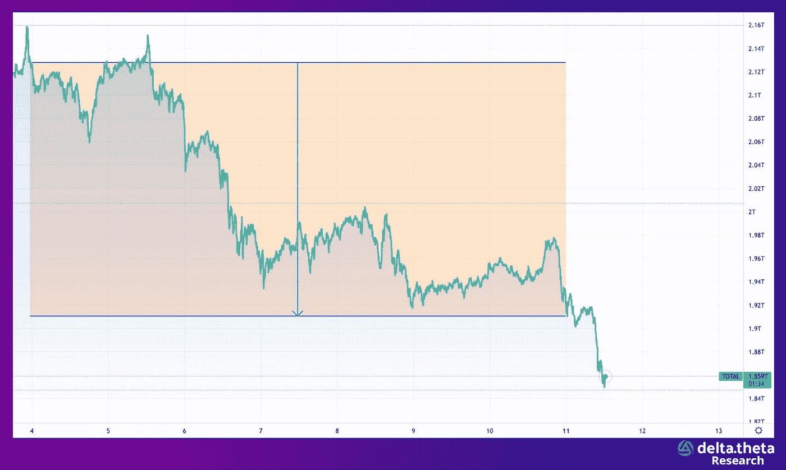
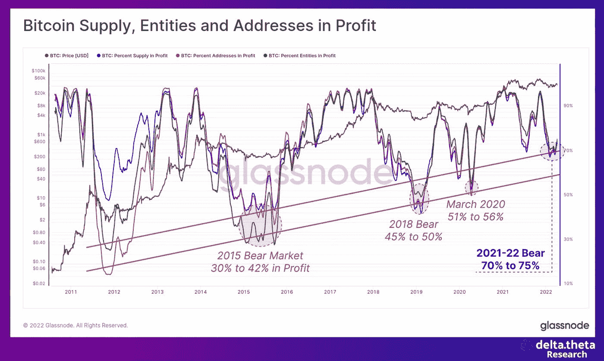
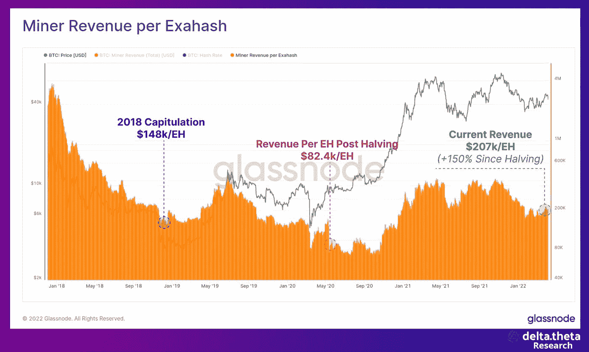
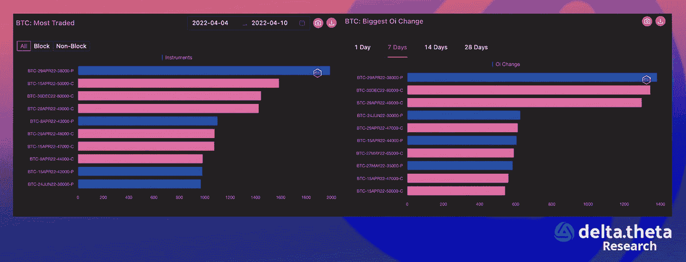
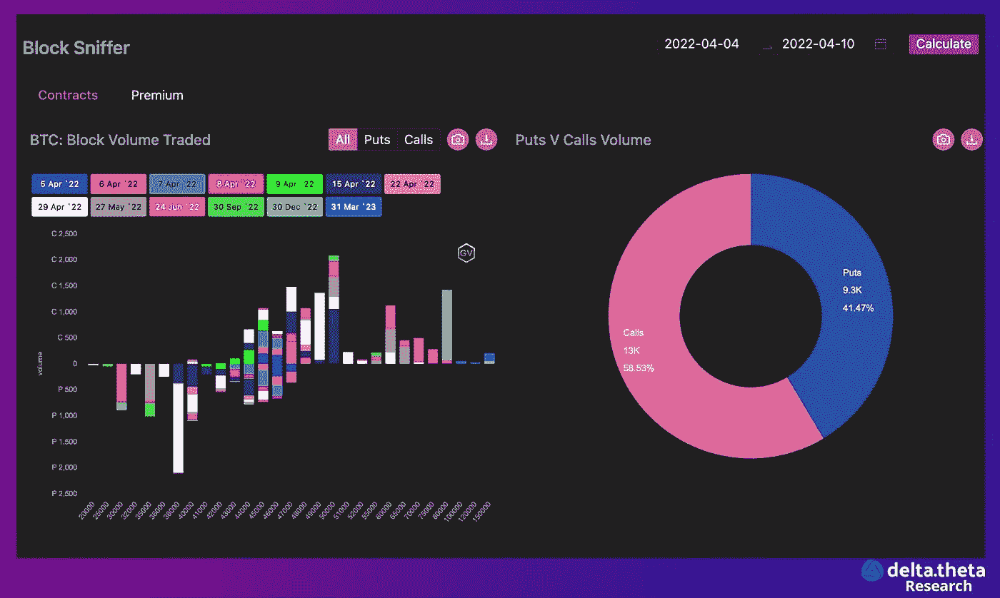

# 受到美联储压力的加密货币市场

> 原文：<https://medium.com/coinmonks/%D1%81ryptocurrency-market-under-pressure-from-the-fed-4935bcf105f?source=collection_archive---------14----------------------->

尽管预期如此，过去一周，加密货币的总市值从 2.11 万亿美元降至 1.835 万亿美元(13.03%)。美联储可能进一步加息的消息虽然已经司空见惯，但仍对市场情绪产生一些影响。

比特币是最“制度化”的资产，自然处于对此类事件反应的前沿。过去一周，“第一种加密货币”从 46 450 跌至 39 980(整体下跌 13.9%)。进一步的价格变动将在很大程度上取决于 40 000 点这一“心理”水平的强度。如果突破，下一个重要水平将是 35 000 点。

以太网的周跌幅相对较大，为 14.57%(从 3 500 降至 2 990)。3000 点附近的走势也将是决定性的。到目前为止，即使对历史上最大的以太网升级(ETH 2.0)的预期(应该在不久的将来发生)，也无法将资产排除在总体下降趋势之外。

# 新闻

本周见证了大型比特币迈阿密 2022 会议的结束。一天，风险投资家彼得·泰尔做了一个演讲。作为演讲的一部分，他直言不讳地谈到了“老派”亿万富翁投资者——沃伦·巴菲特、杰米·戴蒙和拉里·芬克。根据他的说法，“他们向后看的信念阻止了比特币的大规模接受”，也阻碍了比特币的指数增长。

加密投资公司潘迪拉资本正在[为一只新基金筹集资金](https://www.coindesk.com/business/2022/04/06/pantera-capital-eyes-mature-crypto-companies-with-new-200m-fund/)，计划在 5 月初完成筹资，筹集到 2 亿美元。潘迪拉精选基金在[的一篇博文](https://panteracapital.com/blockchain-letter/its-called-the-70s/)中表示，该公司将致力于帮助其合作伙伴获得已经到位的三笔成长期交易，以及未来一年的七至九笔交易。精选基金将比典型的成长型基金规模更小，更有针对性，因此更有针对性。

在前面提到的迈阿密加密货币会议上，来自几个国家的代表[透露了他们将比特币引入金融系统的计划](https://www.theblockcrypto.com/post/141087/honduras-portgual-jurisdictions-bitcoin-adoption)。例如，葡萄牙自治区马德拉的一名代表和洪都拉斯的一名代表在一次类似的会议上发表了与萨尔瓦多总统奈卜·布奎勒相似的讲话。尽管主要经济体的一些金融精英试图抵制比特币的引入，但新兴司法管辖区已经准备好在快速变化的世界中开辟新的增长机会。

NEAR Protocol [计划推出自己的算法稳定币](https://www.theblockcrypto.com/post/141274/near-protocol-is-set-to-launch-a-stablecoin-called-usn-source)。Near 的 USN 将以 Terra 的 UST 为模型。Near 已经与几家资本雄厚的 stablecoins 合作，提供 20%左右的年回报率。Near Protocol 是一个可扩展的区块链，最近[在 Tiger Global 牵头的一轮融资中筹集了 3.5 亿美元](https://www.theblockcrypto.com/post/140751/near-protocol-raises-350-million-in-new-funding-round-led-by-tiger-global)，参与方包括 Republic Capital、Hashed、FTX 风投、蜻蜓资本等。

# 市场形势

尽管上周有所下降，但 70%的比特币地址仍在盈利。这一数字明显高于过去的熊市阶段，这间接证实了未来下跌存在盈利储备。目前，市场继续受到宏观因素的压力——通胀、央行加息周期以及军事冲突导致的政治不确定性。

在评估比特币价格下跌的可能目标水平时，考察采矿业的盈利能力是有意义的。

在当前的价格运动周期中(2021 年春季和秋季的峰值之后)，采矿的产量比减半后的时期(找到区块的奖励减半的时刻)高 150%。这表明较低的价格尚未达到——挖掘成本是决定比特币“公平价值”的一个容易理解的界限。

目前的下跌趋势也反映在期权市场上。

交易的主要期权是一个月的看跌期权(行权日为 4 月 29 日，价格为 38000 英镑)。显然，交易者用它们来对冲更深的下跌。看涨期权的 47 000 点和 49 000 点也是本月价格可能回升的基准。

对于比特币期权的结构化大宗交易，主要关注的是 39000–49000 范围内的交易，这些交易采用各种期权策略组合(风险逆转、看跌价差和看涨价差)，执行日期在 4 月份。另外，一份执行日期为 12 月 30 日的大额看涨期权订单(80 000 份)值得一提。这是对比特币持续乐观的一种奇特反映，尽管这种乐观还很遥远。

目前，加密货币市场无法形成独立的运动向量，并继续在股票市场范式内运行。因此，更有可能的是，价格将继续下降，有所巩固，并寻找新的增长点。

> 加入 Coinmonks [电报频道](https://t.me/coincodecap)和 [Youtube 频道](https://www.youtube.com/c/coinmonks/videos)了解加密交易和投资

# 另外，阅读

*   [用于 Huobi 的加密交易信号](https://coincodecap.com/huobi-crypto-trading-signals) | [HitBTC 审核](/coinmonks/hitbtc-review-c5143c5d53c2)
*   [TraderWagon 回顾](https://coincodecap.com/traderwagon-review) | [北海巨妖 vs 双子星 vs BitYard](https://coincodecap.com/kraken-vs-gemini-vs-bityard)
*   [如何在 FTX 交易所交易期货](https://coincodecap.com/ftx-futures-trading) | [OKEx vs 币安](https://coincodecap.com/okex-vs-binance)
*   [OKEx vs KuCoin](https://coincodecap.com/okex-kucoin) | [摄氏替代品](https://coincodecap.com/celsius-alternatives) | [如何购买 VeChain](https://coincodecap.com/buy-vechain)
*   [ProfitFarmers 回顾](https://coincodecap.com/profitfarmers-review) | [如何使用 Cornix Trading Bot](https://coincodecap.com/cornix-trading-bot)