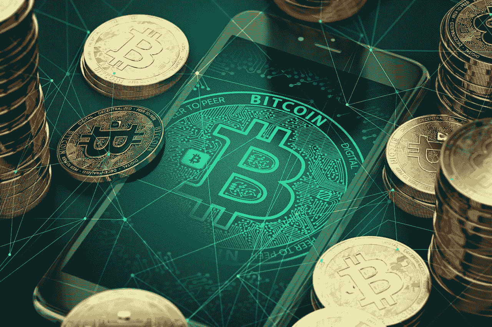

# 加密货币将重新定义现代金融世界

> 原文：<https://medium.com/coinmonks/%D1%81ryptocurrency-will-redefine-the-modern-financial-world-af4f227a0398?source=collection_archive---------52----------------------->

作为世界领先的金融公司之一，PayPal 的目标是为所有人铺平一条便捷高效的数字金融之路，PayPal 将创新视为其核心价值观之一。

为了保持该公司在行业中的领先地位，其高管明白跟踪加密货币发展的重要性。事实上，自去年以来，PayPal 已经允许用户通过其平台购买、出售和持有加密货币，向数字货币世界迈出了第一步。

密码产业发展迅速。随着越来越受欢迎，像*区块链*和 *NFTs* 这样的词正在成为我们日常词汇中更大的一部分。但是，数字货币不仅仅成为日常生活中更大的一部分；正如我们所知，它们也在重塑金融世界。

# 加密货币是如何改变金融面貌的？

全世界的央行都开始认真考虑发行数字货币作为法定货币。随着加密货币的增强效用变得更加明显，这是一种似乎不可避免的可能性。

中央银行数字货币(CBDC)、数字钱包、稳定货币和加密支付的有用性之间的十字路口是一个迷人的研究领域。但是，更重要的是，它是革命性的。随着时间的推移，这些类型的技术将对金融格局产生巨大影响——这种影响可能比我们目前所能想象的还要大。

# PayPal 在加密货币发展中的作用

对于大多数人来说，对加密货币的兴趣可能不会比将数字货币视为一种资产更深:我可以花多少钱购买加密？我能卖多少钱？明天的价格会是什么样子？但加密货币真正重要的地方在于它能在金融领域提供的效用。PayPal 明白这一点的重要性。

作为一家公司，PayPal 积极致力于加密货币的开发，旨在塑造区块链技术和数字货币允许更好地获得金融服务的方式。

今年 2 月，为了实现这一目标，PayPal 成立了区块链、加密和数字货币顾问委员会(BCDC)。这个团队由经济学、分布式技术和密码学方面的全球专家组成。

# 结束语

加密货币不仅仅是一种重要的资产。它的意义不在于它能给个人赚多少钱。相反，加密货币之所以重要，是因为它在支付时允许更大程度的实用性和可访问性。这样，加密货币必将重塑和重新定义我们所知的金融世界。

PayPal 雄心勃勃地站在支付和商务的最前沿，因此它完全有能力开创这个新时代。

> 加入 Coinmonks [电报频道](https://t.me/coincodecap)和 [Youtube 频道](https://www.youtube.com/c/coinmonks/videos)了解加密交易和投资

# 另外，阅读

*   [Bitget 评论](https://coincodecap.com/bitget-review) | [双子星 vs BlockFi](https://coincodecap.com/gemini-vs-blockfi) cmd| [OKEx 期货交易](https://coincodecap.com/okex-futures-trading)
*   [AscendEx Staking](https://coincodecap.com/ascendex-staking)|[Bot Ocean Review](https://coincodecap.com/bot-ocean-review)|[最佳比特币钱包](https://coincodecap.com/bitcoin-wallets-india)
*   [霍比评论](https://coincodecap.com/huobi-review) | [OKEx 保证金交易](https://coincodecap.com/okex-margin-trading) | [期货交易](https://coincodecap.com/futures-trading)
*   [网格交易机器人](https://coincodecap.com/grid-trading) | [Cryptohopper 审查](/coinmonks/cryptohopper-review-a388ff5bae88) | [Bexplus 审查](https://coincodecap.com/bexplus-review)