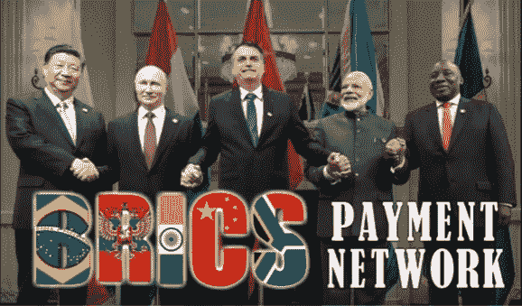

# 金砖四国将实施 SWIFT 的替代方案|这对加密的采用意味着什么？

> 原文：<https://medium.com/coinmonks/1-march-2022-ebc03a472a44?source=collection_archive---------25----------------------->

2022 年 3 月 10 日

SWIFT 要结束了吗？

随着全世界都在关注乌克兰发生的事件，关于 SWIFT 银行系统的问题已经成为最重要的问题。这导致双方在遗留的银行系统和跨境汇款方面都存在问题。发生这些事件的几个原因是因为当前 SWIFT 系统的安全漏洞，以及乌克兰盟友对当前与俄罗斯相关的中央银行系统实施的制裁。

俄罗斯及其盟友几年来一直在研究替代方案，现在看来是时候实施了。俄罗斯的金融信息系统 SPFS 将与中国的跨境银行间支付系统 CIPS 联网。这在两国之间已经讨论了一段时间，纳入金砖国家联盟其他成员的计划已经到位。尽管印度仍没有国内金融信息系统，但它计划将俄罗斯央行的平台与一项正在开发的服务连接起来。有传言称，金砖五国正在各自探索以本国货币进行贸易。

阅读更多信息，请访问:

[https://economic times . India times . com/news/economy/foreign-trade/India-Russia-China-explore-alternative-to-swift-payment-mechanism/articleshow/72048472 . CMS？UTM _ source = contentofinterest&UTM _ medium = text&UTM _ campaign = cppst](https://economictimes.indiatimes.com/news/economy/foreign-trade/india-russia-china-explore-alternative-to-swift-payment-mechanism/articleshow/72048472.cms?utm_source=contentofinterest&utm_medium=text&utm_campaign=cppst)

巴西、俄国、印度、中国和南非可能会成为首批正式采用新银行系统的国家，为加密和区块链在全球的采用铺平道路。西方的制裁可能会孤立俄罗斯，使其只能与中国和金砖四国进行贸易。

报告链接:[https://www . CNBC . com/video/2022/02/28/western-sanctions-can-isolate-Russia-into-trading-with-China-BRICS-only-economist . html](https://www.cnbc.com/video/2022/02/28/western-sanctions-could-isolate-russia-into-trading-with-china-brics-only-economist.html)

乌克兰官方推特账户最近出现了通过比特币请求捐款的趋势，引起了人们对区块链科技公司正在解决的巨大问题的大量关注，该公司提供了一个分散的平台来交易数字资产，并可以在任何有互联网连接的地方访问。这使得许多密码爱好者相信，快速采用是指日可待的。加密货币、区块链技术和 Web3 的结合提供了这些必要的工具，以促进新金融系统的引入。

加密采用

我们已经看到了 NFTs 的出现，以及应用于该技术的几种用途，以标记和清算在此类商品和贵金属之前无法完成的事情。NFT 博彩和 NFT 艺术公司在过去几年中一直处于领先地位，是加密采用和用例的催化剂。像[分散化](https://decentraland.org/)、[天空 Mavis](https://skymavis.com/) 、 [Animoca Brands](https://www.animocabrands.com/) 和 [Onix](https://onixcoin.io/) 这样的项目正在不断创新，吸引更多用户来到区块链。Sky Mavis 有一款受欢迎的 NFT 游戏，名为 Axie Infinity，它通过播放赚取功能引入了许多新用户，允许人们在游戏中赚钱。NFT 游戏公司为技术领域提供更多机会的另一个例子是 Onix 这样的项目。这个开发团队专门为 NFT 游戏设计了一个第 1 层区块链，并为两个独立的游戏开发者提供工具和资源。《密码大军》计划于 2022 年第三季度在该平台上首次发布。AAA 游戏项目 Animica brands 已经在全球舞台上产生了巨大影响。这家总部位于香港的公司很容易成为世界顶级品牌之一——他们负责 NFT 游戏 hit the Sandbox，以及其他总部位于 NFT 的游戏，如疯狂国王和疯狂防御英雄。与许多初创工作室不同，他们已经有了几款游戏，其中包括与大 IP 合作，如 WWE、漫威、Power Rangers 和 f1。

现在，随着乌克兰和俄罗斯所发生的一切，加上几个加密和区块链项目已经做好的基础工作，我们可以看到每天都有更多的家庭接触到这项技术。一个人们可以逃避我们今天所面临的严酷现实的元宇宙世界看起来越来越有吸引力了。虚拟互动将成为现实，并以我们永远无法想象的方式连接世界。无论是商业、教育、体育、娱乐、政治还是宗教，这项技术都将彻底改变我们相互交往的方式。随着世界已经通过 web 2.0 如此紧密地联系在一起，乌克兰的事件对大众来说是可见的，这种紧张局势的快速解决将比大多数人预期的更快。来自联合国大多数成员国的压力是双方都要找到一个和平的解决方案，还有世界各地观看现场直播的广大民众。工具和资源已经可以用来纠正俄罗斯和乌克兰正在经历的问题，现在只需要领导人达成协议。

作者:Trey Trillionaire

*最初发表于*[*【https://www.reddit.com】*](https://www.reddit.com/user/TreyTrillionaire/comments/t4gzdu/brics_to_implement_replacement_of_swift_what_does/?utm_source=share&utm_medium=web2x&context=3)*。*