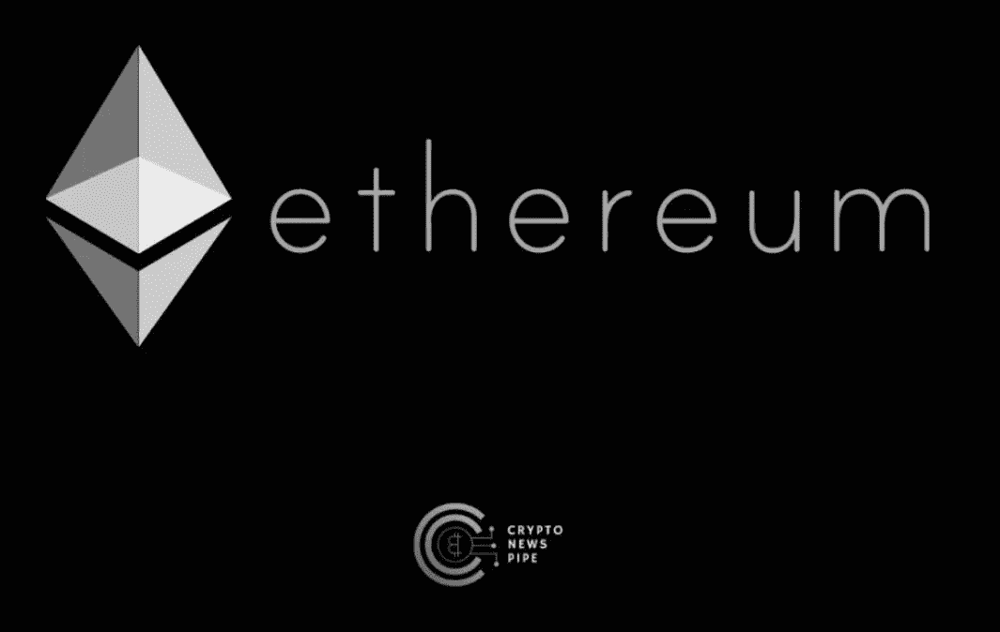

# 100 万 NFT 买家——以太坊的重要里程碑

> 原文：<https://medium.com/coinmonks/1-million-unique-nft-buyers-major-milestone-for-ethereum-b8d4839affed?source=collection_archive---------36----------------------->

[1 Million Unique NFT Buyers — Major Milestone for Ethereum](https://cryptonewspipe.com/1-million-unique-nft-buyers-major-milestone-for-ethereum/)

周日，以太坊网络，第二大区块链，[正式超过](https://forkast.news/headlines/ethereum-nft-buyers-gas-fees-sink/)100 万独特的 NFT 买家，七年后，第一个 NFT 在以太坊区块链创建。

虽然替代生态系统显著增长，使以太坊的统治地位岌岌可危，但新闻显示，维塔利科的孩子们目前仍在负责 NFT 游戏…