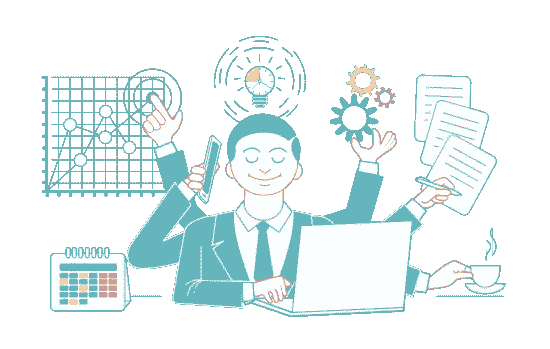
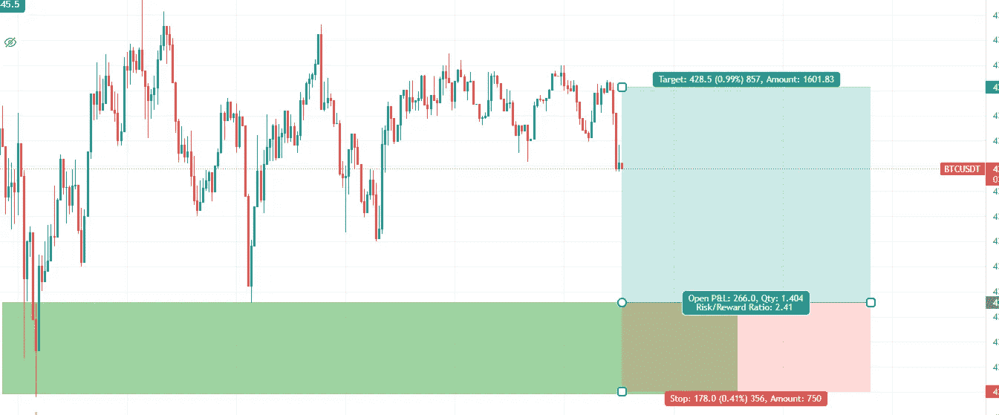
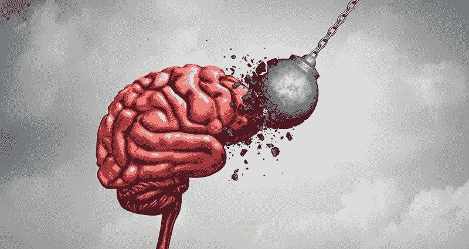
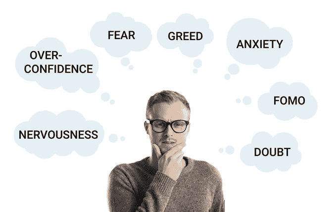

# 一年的业余加密交易经验

> 原文：<https://medium.com/coinmonks/1-year-of-crypto-trading-experience-of-an-amateur-5a6d97a12cc9?source=collection_archive---------30----------------------->

我写这篇文章是为了给自己，也给业余爱好者和新手一个指导。我只是强调我意识到并试图改正的错误。这篇文章包括一个普通智商的大学毕业生一年的交易经验。

我是一个试图通过交易加密货币赚钱的年轻人，希望从所有那些富人和大型投资基金那里偷一点钱。如今在家工作变得非常流行，我知道有很多人和我一样。这就好比 **w *这里有糖，蚂蚁就会激增。*** 是啊，我是一只追求糖的蚂蚁，我花了一年的时间来追求糖，但我担心我没有尝到甜味…

那么如果你想交易加密货币，你会怎么做呢？你可以谷歌一下，收集交易、硬币、外汇等方面的信息。学完简单的东西后，你就要穿过那个兔子洞了；技术分析…你通过教程开始学习，至少我是这么做的，而且我认为大多数人都会这么做。所以，我看了几百个小时的 youtube 上关于交易策略的视频，学到了几十个概念。斐波那契工具，艾略特波浪，支撑和阻力区，供需区，趋势线，双顶，楔形，旗帜…甚至有些声称有 90%的胜率！

我学到了所有这些概念，毫不奇怪，当你在图表中向左看时，它们似乎完美无缺。但是，我还是按照我所学的，炸了 3 个账号，最后痛苦了很久。我开始认为技术分析是个骗局。然后，我采取了更严肃的态度，花了很多时间探究我的错误。我记录了每一笔交易，思考我做错了什么，我可以做什么不同。经过长时间的回溯测试，我后来意识到技术分析不是问题，因为我的胜率在 60%以上，但我在交易的其他方面都不称职。

我忽略了这些术语；心理学、风险管理和心理弹性。

交易的本质是高度投机性和操纵性的，现在有效的相同的设置可能不总是在另一天有效。我对许多不同的设置进行了回溯测试，以找到最佳结果，一切看起来都很好，因为你可以通过多个概念或指标来解释价格行为。无论价格如何变动，都可以很容易地证明价格变动是合理的，例如，当价格在 50 均线和巨大的日线支撑区之间时。技术分析只能给你一点点关于价格行为概率的提示。如果价格是趋势性的，趋势延续的概率较高。然而，如果到达一个大的阻力点，你可以考虑平仓。交易没有具体的规则。当你想到这一点，毕竟，只需要一个鲸鱼感到无聊，并点击按钮的另一种方式为您的设置失败。

***市场上任何事情都有可能随时发生。*** 交易者应该对不同的结果非常积极主动。你需要为每种情况准备好你的策略、头脑和心理，永远不要情绪化地做出反应。要冷血，要冷静。如果事情变糟，尽快退出交易。如果你是对的，就继续留在交易中。这是交易的核心。赢多输少，所以风险管理从此成为你的钻石。

从长远来看，设定一个预先确定的风险回报比有助于你。 ***即使你的胜率低于%50，你仍然可以赚到钱。*** 有的交易者用 1，5，有的用 2 但还是，即使最差的风险收益比也大于 1。达到这样的比率需要预先确定的进入和退出。不管一笔交易成功的概率有多大，你永远不应该输得比你每笔交易的目标赢的多。

Risk-reward ratio is 2.41

采用风险回报比可以大大减少交易中的恐惧、恐慌和失望。我已经平仓或拖延了很多次，仅仅是出于恐惧或希望，这让我损失了很多钱。每个业余交易者都会经历这种情况，因为蜡烛一根接一根地被印出来时，我们会产生不同的情绪。这种情绪影响很容易导致我们在不考虑情况的情况下改变主意。为了我们的交易纪律，我们需要通过接受潜在的损失来进行交易，以防事情出错。拥有纪律和系统有助于你长期获利，而不是冲动的决定。

这样一个不稳定的环境，如果你在精神上和情绪上不沉稳，很容易引发你的情绪。你可能会进行突破交易，但它可能最终是一场骗局，或者交易对你来说是完美的，直到突然一根邪恶的蜡烛击中你的止损点，然后继续交易。这类事件让你觉得你生活在一个由一只讨厌的猴子运行的模拟环境中，这只猴子的目的只是想搞乱你。重要的是，在这里不要因为这样的不便而耿耿于怀。 这是一场马拉松， ***带着你的损失，围绕你的规则和原则计划另一场*** 。

情绪化的交易者最终注定要亏损。心态要围绕这个思路来构建； ***输赢是姐弟，你需要的只是获得更大的胜利和更小的损失*** 。如果你在一次亏损后打击了自己的士气，你会努力赢得下一次，并在期望、假设和报复的情绪下强行进行没有希望的交易。沸腾的头脑是交易中 100%亏损的机器，只会蒙蔽你的双眼。你的视线变得清晰，直到你再次平静下来。同时，你需要停止交易，否则你会做出非常糟糕的决定。我已经报复交易很多次，我赢了一些，但我失去了大部分，最终，我写了一篇关于我如何在交易密码失败的文章。心理弹性是交易者的另一个关键点。

不要认为你应该得到什么。市场不会仅仅因为你看了关于模式的视频或者你了解了供求区域就付钱给你。只有当你做正确的事情时，你才能赚钱，这是一个非常艰难的过程。

预期、假设和情绪反应只是交易者的障碍。不要爱上任何东西。没有最喜欢的硬币、平价或交易设置。没有荣誉，没有骄傲，没有屈辱。你需要有高度的灵活性和适应性。你需要通过维持风险和回报比率之间的有利平衡来冲浪。

自我对交易者来说是个大问题，它会让你表现得固执和不合逻辑。我意识到做一个失败者的痛苦比赔钱还难受。反过来说，比起挣钱，我更想对。在失败的情况下，我通常会觉得需要尽快结束痛苦并赢回来，即使这会让我失去所有的平衡。此外，如果你能在遭受重创后扭转局面并取得胜利，这将变得更具戏剧性和英雄性。如果我们经历所有这些感觉，我们会发现我交易是为了满足我的自我。你应该把你的自我放在一边，永远不要试图控制市场。

***即使成功也会引发问题***；一些连胜的人可能会被过度自信的陷阱抓住，仅凭一次冲动交易就把账户搞砸了。谢天谢地，我从来没有如此强劲的连胜，所以从来没有陷入困境，但我看到了一些迹象。当你取得连胜时，你会觉得自己是专家，再也不会输了。反过来也适用，你认为连败之后就再也不会赢了。在这方面，在你的生活中有一个斯多葛派的纪律或类似的实践，如冥想，可以帮助你实现心灵的稳定。

综上所述，我发现 ***精神和心理稳定*** 比技术分析更重要。 ***风险管理*** 是帮助你在那些领域保持稳定的巨大因素。交易就像一个陷阱，点击购买按钮是如此简单，但交易的执行需要钢铁般的意志和丰富的经验，这在人们当中是非常罕见的。

> 加入 Coinmonks [电报频道](https://t.me/coincodecap)和 [Youtube 频道](https://www.youtube.com/c/coinmonks/videos)了解加密交易和投资

# 另外，阅读

*   [Bookmap 评论](https://coincodecap.com/bookmap-review-2021-best-trading-software) | [美国 5 大最佳加密交易所](https://coincodecap.com/crypto-exchange-usa)
*   最佳加密[硬件钱包](/coinmonks/hardware-wallets-dfa1211730c6) | [Bitbns 评论](/coinmonks/bitbns-review-38256a07e161)
*   [新加坡十大最佳加密交易所](https://coincodecap.com/crypto-exchange-in-singapore) | [购买 AXS](https://coincodecap.com/buy-axs-token)
*   [红狗赌场评论](https://coincodecap.com/red-dog-casino-review) | [Swyftx 评论](https://coincodecap.com/swyftx-review) | [CoinGate 评论](https://coincodecap.com/coingate-review)
*   [投资印度的最佳密码](https://coincodecap.com/best-crypto-to-invest-in-india-in-2021)|[WazirX P2P](https://coincodecap.com/wazirx-p2p)|[Hi Dollar Review](https://coincodecap.com/hi-dollar-review)