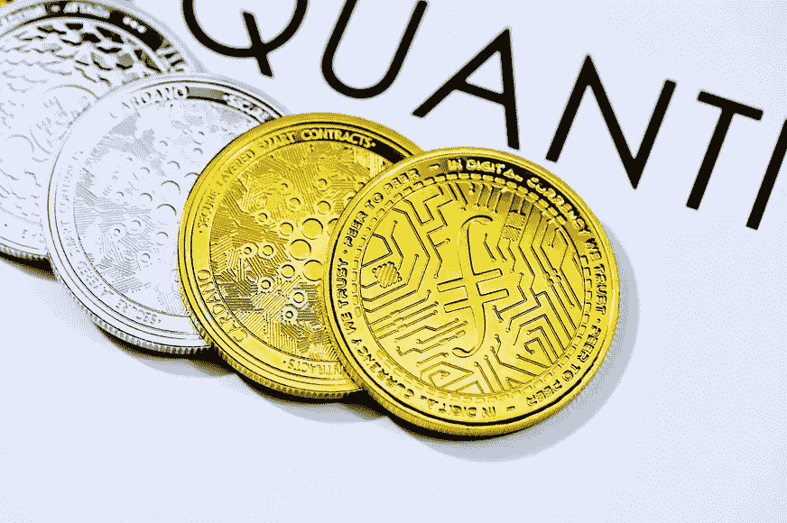

# 2022 年购买和持有的 10 种最佳一分钱替代硬币，以实现巨大的增长

> 原文：<https://medium.com/coinmonks/10-best-penny-altcoins-to-buy-and-hold-in-2022-for-immense-growth-9104ec61155d?source=collection_archive---------9----------------------->

Photo by [Quantitatives](https://unsplash.com/@quantitatives?utm_source=unsplash&utm_medium=referral&utm_content=creditCopyText) on [Unsplash](https://unsplash.com/?utm_source=unsplash&utm_medium=referral&utm_content=creditCopyText)

# 如果你正在寻找可以投资的最好的硬币，别再找了。以下是可以考虑的十大替代货币。

比特币领域正在迅速扩张。与细价股一样，细价替代硬币也在吸引加密投资者。尽管由于其适度的市场资本，它们是高风险企业，但投资起来并不昂贵。除了比特币，altcoins 是加密货币币。以太坊是最受欢迎的加密货币之一，但今天我们将讨论在 2022 年购买和保存便士替代硬币。有一点要记住，永远不要毫无准备地进入这个行业。在进入加密资产类别之前，做一些研究。说到投资加密货币，有几十种选择。

## 极限

Tether 是一种稳定的硬币，通过为交易所平台提供流动性，为投资者提供无成本退出方式，为交易所平台提供流动性，赋予投资者的投资组合以灵活性和稳定性。与典型的银行和金融机构交易相比，该系绳还可以以更快的速度和更低的费用传输到世界上的任何地方。

## 美元硬币

美元硬币是一种稳定的硬币，基于与美元挂钩的以太坊、Stellar、Algorand、Solana、Tron 和 Hedera Hashgraph 系统。对于寻求能跑赢 CDs 的低贝塔投资的传统投资者来说，USDC 是一个极好的选择。2022 年，它是投资和持有的顶级一分钱硬币之一。

## XRP

XRP 是一种加密货币，是不同货币之间的货币桥梁。它不区分法定货币和加密货币，使得一种货币与另一种货币的交易变得简单。它的内在价值高于其他密码，因为它在现实世界中的使用更便宜，更具可扩展性，交易每三到五秒发生一次。

## Dogecoin

杰克逊·帕尔默和比利·马库斯在 2013 年创立了 Dogecoin，作为一种开源的加密货币。Dogecoin 最初是一个受一个著名迷因启发的笑话。Dogecoin 的创造者设想它是一种轻松有趣的加密货币，将吸引更广泛的受众，而不仅仅是比特币用户。2022 年，它是最值得投资的加密货币之一。

## 柴犬

柴犬是 2022 年又一个要投资的新加密货币。多亏了像 Reddit 这样的社交媒体网站的聊天，SHIB 在 2021 年 10 月爆发，在短短一个月内爆炸了 1000%以上。因为它的受欢迎程度很大程度上是建立在炒作之上的，所以这个迷因币“与 Dogecoin 有着相似的氛围”。

## 美元币安

币安美元(BUSD)是一种新的以美元计价的稳定硬币，将与 Paxos 和币安合作开发。它已经获得了纽约州金融服务局(NYDFS)的认证。币安 USD 的目标是成为一个可靠和高效的平台，允许用户访问和交易广泛的加密资产。

## 分散土地

分散化是另一个年度顶级新加密计划。简单地说，分散土地是一个总部设在区块链的虚拟世界，用户可以设计自己的角色，并购买游戏中的地产。因为游戏中的商品都是以 NFT 的形式组织的，所以游戏中的漏洞可能会通过市场进行销售。

## TerraUSD

TerraUSD (UST)是 Terra 区块链的分散和算法稳定的硬币。这是一种与美元挂钩的可伸缩、有收益的硬币。TerraUSD 旨在为 Terra 社区提供价值，并为 Defi 提供一种可扩展的替代方案，以应对其他稳定的硬币领导者(如戴)正在经历的严重扩展问题。因此，TerraUSD 用户应该期待更高的可扩展性、利率准确性和链间使用。

## 主要的

如果你正在寻找一种潜力巨大的加密货币，Stellar 是一个不错的选择。Stellar 是一个分散的支付网络，运行在 Stellar Lumens (XLM)上，这是网络的本地加密货币。该网络使得低成本的支付能够被传送到世界上的任何地方，而不受货币的限制。

## 卡尔达诺

尽管 Cardano 经历了艰难的几个月，但这个开源的区块链网络有着光明的未来。Cardano 和 Ethereum 一样，是开发者创建 dApps 和智能合约的平台。另一方面，卡尔达诺的系统是由学者创造的，基于同行评议的研究。2022 年，它是投资和持有的顶级一分钱硬币之一。

> 加入 Coinmonks [电报频道](https://t.me/coincodecap)和 [Youtube 频道](https://www.youtube.com/c/coinmonks/videos)了解加密交易和投资

# 另外，阅读

*   [如何购买 Monero](https://coincodecap.com/buy-monero) | [IDEX 评论](https://coincodecap.com/idex-review) | [BitKan 交易机器人](https://coincodecap.com/bitkan-trading-bot)
*   [CoinDCX 评论](/coinmonks/coindcx-review-8444db3621a2) | [加密保证金交易交易所](https://coincodecap.com/crypto-margin-trading-exchanges)
*   [红狗赌场评论](https://coincodecap.com/red-dog-casino-review) | [Swyftx 评论](https://coincodecap.com/swyftx-review) | [CoinGate 评论](https://coincodecap.com/coingate-review)
*   [Bookmap 点评](https://coincodecap.com/bookmap-review-2021-best-trading-software) | [美国 5 大最佳加密交易所](https://coincodecap.com/crypto-exchange-usa)
*   [如何在 FTX 交易所交易期货](https://coincodecap.com/ftx-futures-trading) | [OKEx vs 币安](https://coincodecap.com/okex-vs-binance)