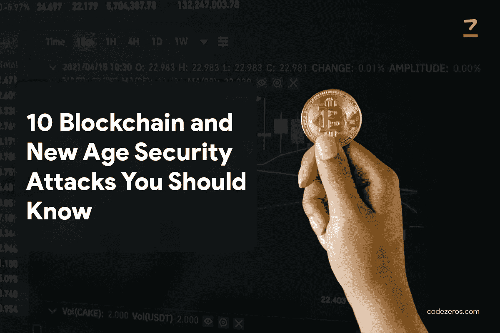

# 你应该知道的 10 个区块链和新时代安全攻击

> 原文：<https://medium.com/coinmonks/10-blockchain-and-new-age-security-attacks-you-should-know-60f76f8c68ad?source=collection_archive---------29----------------------->

自从引入加密货币和 NFT 以来，被称为区块链的新时代技术已经席卷了互联网和金融领域。 [**区块链发展**](https://www.codezeros.com/services/blockchain-development) 一般解释为一个记录信息的系统，以一种使其安全、可信、最难被黑客攻击或进行修改的方式构建。

区块链技术通过使用加密方法来认证数据和交易并提供安全性。然而，像历史上的其他技术一样，区块链也有自己的弱点，实际上很容易受到网络攻击和欺诈。在本文中，我们提出了您应该注意的 10 种区块链和新时代安全攻击。

10 Blockchain and New Age Security Attacks You Should Know

**01。月食攻击:**

Eclipse 攻击是一种基于对等网络的攻击，在这种攻击中，连接到节点网络的节点被从网络的合法连接中分离出来并被操纵。这是一种 [**区块链安全**](https://www.codezeros.com/) 威胁，其中 P2P 网络系统中的一个节点受到一个操纵者的攻击，该操纵者只启动他们自己编造的账本。它对节点是可见的，同时破坏了网络的分布式分类帐的视图。

**02。西比尔攻击:**

Sybil 攻击不同于 P2P 网络的 eclipse 攻击，因为 Sybil 攻击的目标是整个网络，而不是单个节点。它通过在网络中聚集大量具有假名身份的恶意节点来影响网络中的数据传输，从而对区块链安全构成威胁。它还可以在分类帐中创建一个分支，使攻击者能够随心所欲地进行各种其他攻击。

**03。挖掘恶意软件:**

这种攻击类型采用黑客使用的经典方法，如在网站中嵌入代码或电子邮件钓鱼攻击，通过这些方法，挖掘恶意软件被转移到受害者的计算机上。这种类型的区块链和新时代安全攻击使用受害者系统的计算能力来执行计算，以符合以前的加密货币交易，并使用这些信息为黑客生成和挖掘加密货币。

04 年。自私采矿攻击:

区块链最长的链条被认为是真实的，最新版本的账本。使用自私的 miner 算法，攻击者可以在秘密模式下创建一个链。在现有链上创建一个 lead 之后，他们可以发布他们的私有 fork，这将被声明为新的最长的真正链。这使得攻击者能够通过撤销他在发布之前所做的交易来进行双重消费，从而危及该过程的安全性。

**05。51%攻击:**

51%攻击是一种独特类型的 [**共识分叉**](https://www.codezeros.com/services/consensus-forking) 攻击，其中一个矿工或一群矿工掌管区块链网络中 51%的采矿权力。这种情况出现在较小的网络中，在较大的网络中非常少见。矿业集团在获得对大部分采矿权的控制后，就获得了撤销交易或阻止当前交易进行的能力。

**06。Timejack 攻击:**

P2P 网络中的节点维护中间时间，通过该中间时间来确定节点的内部定时。攻击者可以通过在网络中放置一组恶意节点来操纵这一时间。这种区块链安全攻击是在对目标节点实施 eclipse 攻击后进行的，由于时间戳不同，使其与网络分离。然后攻击者在网络中实施双消费。

**07。芬尼攻击:**

这是区块链中的一种攻击类型，攻击者扮演一个矿工，开采一个区块，并在秘密模式下执行交易。然后，他将货币交易给接受交易的商家，该商家未得到网络的确认。在此之后，矿工发布块并确认之前进行的交易。通过这种方式，矿工发生了双重支出。

**08。种族攻击:**

这种攻击与芬尼攻击的不同之处在于，它不需要预先开采区块。攻击者向商家提交一个未确认的交易，同时执行另一个他向网络确认的具有更高优先级的交易。商家将交易误认为是他们的，并完成手续。

**09。刀攻击:**

DAO 攻击是以太坊基金会发起的一个有争议的攻击。这是一种在区块链上利用 [**智能合约开发**](https://www.codezeros.com/services/smart-contract-creation) 发生的攻击。由于没有检查当前交易的状态，攻击者贡献了少量资金，并在递归函数的帮助下请求提取资金。

10。奇偶多重签名钱包攻击:

这是一种攻击，攻击者攻击奇偶校验客户端钱包，并扣留货币。钱包合同是使用用于自动支付的集中式库合同来达成的。攻击者发现一个漏洞，将他的帐户添加为所有者，并冻结货币。

**结论:**

区块链是不可变的，也是昂贵的，因此在部署加密货币和属性之前，有必要制定概念，进行安全审计，并进行测试。这是一个没有权限的网络，任何人都可以参与，他们的身份是匿名的。区块链安全方法考虑到这些漏洞应该加强。

> 加入 Coinmonks [电报频道](https://t.me/coincodecap)和 [Youtube 频道](https://www.youtube.com/c/coinmonks/videos)了解加密交易和投资

# 另外，阅读

*   [OKEx vs KuCoin](https://coincodecap.com/okex-kucoin) | [摄氏替代品](https://coincodecap.com/celsius-alternatives) | [如何购买 VeChain](https://coincodecap.com/buy-vechain)
*   [币安期货交易](https://coincodecap.com/binance-futures-trading)|[3 commas vs Mudrex vs eToro](https://coincodecap.com/mudrex-3commas-etoro)
*   [如何购买 Monero](https://coincodecap.com/buy-monero) | [IDEX 评论](https://coincodecap.com/idex-review) | [BitKan 交易机器人](https://coincodecap.com/bitkan-trading-bot)
*   [CoinDCX 评论](/coinmonks/coindcx-review-8444db3621a2) | [加密保证金交易交易所](https://coincodecap.com/crypto-margin-trading-exchanges)
*   [红狗赌场评论](https://coincodecap.com/red-dog-casino-review) | [Swyftx 评论](https://coincodecap.com/swyftx-review) | [CoinGate 评论](https://coincodecap.com/coingate-review)