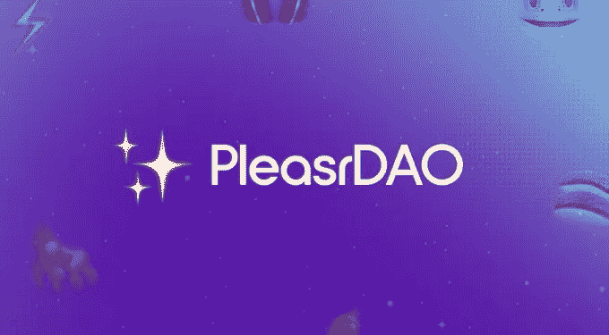

# 你现在需要知道的 10 个道

> 原文：<https://medium.com/coinmonks/10-daos-you-need-to-know-about-right-now-48ea1c66b5ec?source=collection_archive---------14----------------------->

DAO 于 2016 年首次出现在加密货币领域。这是一个由密码开发人员创建的组织，旨在自动化决策和促进加密货币交易。然而，DAO 在 2016 年 6 月遭到黑客攻击，他们从 ETH 偷走了高达 360 万美元的资产。

在我的上一篇文章中，我们谈到了对道的基本解释。但是，我还是在我的推特上收到了很多关于道斯[的问题。顺便说一下，如果你想让我写一些话题，你可以给我发信息。](https://twitter.com/SERGOMOSCOW)

目前，已经出现了几种 Dao，它们的架构、应用程序和治理各不相同。出于本文的目的，我们将关注 10 大有趣的 Dao 以及您需要了解的关于它们的所有信息。

当然，还有更多 Dao，但是为了保持简短，我将在我的下一篇文章中回顾它们。

# 1.Uniswap DAO

[Uniswap](https://uniswap.org/) 是一个去中心化的金融协议，用于交换加密货币。uni WAP 也是最初建立 uni WAP 协议的公司的名称。该协议通过使用智能合约，促进了以太坊区块链上加密货币令牌之间的自动化交易。

它是由西门子前机械工程师海登·亚当斯于 2018 年 11 月 2 日开发的。该公司是通过风险投资公司的投资启动的，包括 Union Square Ventures LLC、ParaFi、Andreessen Horowitz 和 Paradigm Venture Capital。Uniswap 因其在分散融资(DeFi)中的使用而受到交易商和投资者的欢迎。

Uniswap 是目前最大的分散化交易平台，市值为 98.2 亿美元。它每天为流动性提供商产生约 200 万至 300 万美元的费用，这些流动性提供商促进加密货币交易的流动性市场。

# 2.创客道

Maker 是建立在以太坊区块链上的协议。它创建于 2014 年。它的创造者将其描述为“创客系统的公用事业令牌、治理令牌和资本重组资源。”做市商系统的目的是生成另一个以太币令牌，称为 DAI，它寻求在交易所以正好 1.00 美元的价值进行交易。

MakerDAO 通过一种称为“过度抵押”的过程工作，用户提供的资产被锁定在智能合同中作为抵押品，以换取新创建的 DAI 令牌。戴是一个 ERC 20 代币，这意味着它运行在以太坊区块链。它旨在保持一美元的稳定价值。

MakerDAO DeFi 借贷平台通过一系列智能合同工作，允许用户在没有中央贷款提供商的情况下提供和借入加密货币。

MakerDAO 是最大的分散式贷款平台，市值为 23.9 亿美元

# 3.Aave

Aave 是一个分散的非托管流动性协议，用户可以作为存款人或借款人参与其中。存款人向市场提供流动性以赚取被动收入，而借款人能够以超额抵押(永久)或不足抵押(整笔流动性)的方式借款。

Aave 成立于 2017 年。它最初被称为 ETHLend，在首次发行硬币(ICO)中筹集了 1620 万美元，以创建一个分散的贷款平台。他们随后宣布成立母公司 Aave，该公司将提供多种不同的产品，包括 EthLend、Aave Lending、Aave Pocket、Aave 保管、Aave Clearing 和 Aave gaming。

Aave 目前的市值为 23.3 亿美元。

# 4.有利益的朋友

**【FWB】是一个生态系统，为使用 Web3 的工具建立社区和促进创意代理的文化创作者和维护者提供一个交汇点。有了$FWB 代币，成员可以集体拥有和管理社区的活动，同时分享他们共同创造的价值。**

**道是一个由艺术家、思想家、创作者和所有支持 web3 时代的人组成的社区。生态系统充当艺术家和创作者之间的桥梁，以及驱动牵引和促进集体使命的技术。这是一个密码与文化交叉的社区。**

# **5.曲线刀**

****

****曲线(CRV)** 是一个去中心化的交易所和自动化做市商协议。是给 Curve.fi 供电的以太币令牌。**

**[Curve DAO](https://curve.fi/) 使用自动做市商(AMM)管理流动性。它旨在使 ERC 20 代币(如 stablecoins)和基于以太坊的比特币代币之间的交换变得容易。为了将非永久性损失降至最低，该协议的大部分流动性池由类似资产组成，以将永久性损失降至最低。**

**曲线令牌可以锁定不同的时间段(最长 4 年)，以便对治理进行投票并要求协议费用作为奖励。**

**该曲线的市值为 160 亿美元**

# **6.复合的**

****

**[**复合**](https://compound.finance/) 是一个以太坊令牌，支持复合协议的社区治理。它让用户有空间将加密货币存入借贷池，然后提供给借款人。贷方然后从他们存放的资产中赚取利息。**

**当贷方存入其数字资产时，贷方将获得一种称为 cToken 的新加密货币。利息根据贷款期限自动生成。**

**该化合物的市值为 121 亿美元**

# **7.比特岛**

****

**比特岛是当今世界上最大的道之一。他们的愿景是为成员提供开放的金融和分散的象征性经济。**

**该协议由$位令牌持有者管理。BitDAO 目前的资金余额超过 20 亿美元，其中$ BIT tokens 以超过 10 亿美元的金额位居榜首，其次是以太坊，略高于 6.28 亿美元。**

**该项目得到了彼得·泰尔、创始人基金、潘迪拉、Bybit 和蜻蜓的支持。领先的加密交易所 Bybit 承诺向 BitDAO 财政部贡献 2.5 个基点(0.025%)的期货交易量。这每年超过 10 亿美元。**

# **8.请到**

****

**[pleaserdao](https://pleasr.org/)也值得一提。这是一个与区块链结盟的加密投资者团体，他们聚集在一起购买高价不可替代令牌(NFT)。PleasrDAO 被称为艺术收藏帝国。社区成员集体购买和资助文化上重要的艺术作品，然后在与社区分享之前对作品进行重大的基础添加。**

**该项目始于一条推文，该推文询问是否有人有兴趣创建一个 DAO 来竞标创世纪作品 Uniswap V3 NFT。从那以后，PleasrDAO 的使命发生了变化，现在收集代表重要和伟大思想的数字艺术**

# **9.生物岛**

****

**[BioDAO](https://www.biodao.xyz/) 是一个生物技术融资的 web3 解决方案。它致力于建立一个由密码经济学联合起来的生物技术经济。该生态系统是为社区创建的，以支持和资助早期生物技术创业、研究和创新。**

**BioDAO 将支持由 DAO 资助的项目建立的真实世界的生物技术资产。BioDAO 社区的成员将制定所有重要的战略和运营决策。**

# **10.分散道**

****

**[分散土地 DAO](https://dao.decentraland.org/en/) 拥有组成分散土地的大多数顶级智能合同和资产(土地、房地产合同、可穿戴设备、内容服务器和市场)。**

**分散之地道也拥有大量的法力，这使得社区能够完全自治，并资助分散之地的各种运作和活动。**

**分散土地道社区将决定哪些土地拍卖，NFT 合同白名单，以及政策更新是允许的。**

**随着分散的土地的法力硬币的市值超过 50 亿美元，分散的土地道理应在这个名单上的位置。**

****过去几年中,“一体行动”项目数量的增加表明，世界正逐步走向人人都是首席执行官的时代。企业将没有等级制度，社区成员将在项目中拥有平等的股份，不像我们今天看到的那样。虽然还有很长的路要走，但未来就在眼前。****

**如果您想了解有关道、、crypto、Play2Earn 和行业的最新动态和研究，并参加不同的密码比赛和活动 ***—*** [***请在 Twitter 上关注我。***](https://twitter.com/SERGOMOSCOW?ref=hackernoon.com)**

*****在此期间，如果你对 crypto 有任何疑问或者你是 Crypto / GameFi /元宇宙/ NFT 项目，想了解更多关于*** [***如何推广你的项目***](https://x10.agency/) ***，你可以随时通过*** [***电报(@baloyan)***](https://t.me/baloyan) 联系我**

> **加入 Coinmonks [电报频道](https://t.me/coincodecap)和 [Youtube 频道](https://www.youtube.com/c/coinmonks/videos)了解加密交易和投资**

# **另外，阅读**

*   **[有哪些交易信号？](https://coincodecap.com/trading-signal) | [Bitstamp vs 比特币基地](https://coincodecap.com/bitstamp-coinbase) | [买索拉纳](https://coincodecap.com/buy-solana)**
*   **[ProfitFarmers 点评](https://coincodecap.com/profitfarmers-review) | [如何使用 Cornix 交易机器人](https://coincodecap.com/cornix-trading-bot)**
*   **[十大最佳加密货币博客](https://coincodecap.com/best-cryptocurrency-blogs) | [YouHodler 评论](https://coincodecap.com/youhodler-review)**
*   **[my constant Review](https://coincodecap.com/myconstant-review)|[8 款最佳摇摆交易机器人](https://coincodecap.com/best-swing-trading-bots)**
*   **[MXC 交易所评论](/coinmonks/mxc-exchange-review-3af0ec1cba8c) | [Pionex vs 币安](https://coincodecap.com/pionex-vs-binance) | [Pionex 套利机器人](https://coincodecap.com/pionex-arbitrage-bot)**