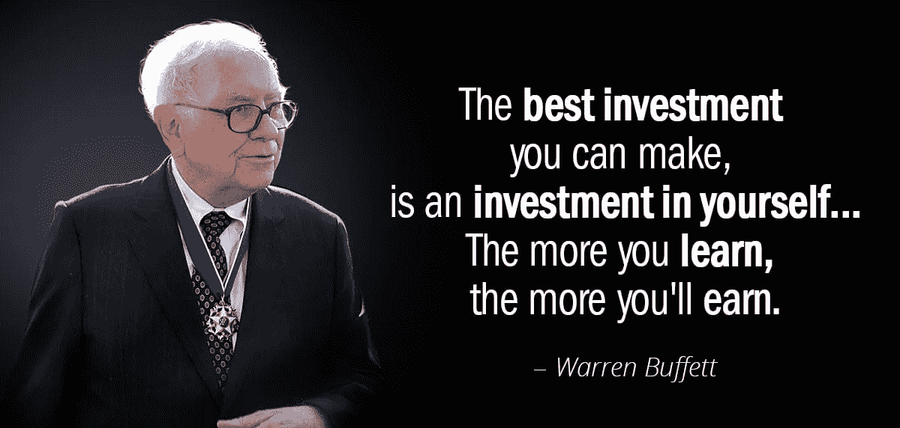

# 沃伦·巴菲特说的用你的钱做的 10 件天才的事情

> 原文：<https://medium.com/coinmonks/10-genius-things-warren-buffett-says-to-do-with-your-money-5a45a8455c7b?source=collection_archive---------9----------------------->

Source photo [warren buffett quotes — Bing images](https://www.bing.com/images/search?view=detailV2&ccid=%2fDlOQDk2&id=4B328A2540E00215E7B6E5BB448774C14439DEAF&thid=OIP._DlOQDk2pjuSmyjGZFdJHwHaDh&mediaurl=https%3a%2f%2fmarketmegood.com%2fblog%2fwp-content%2fuploads%2f2020%2f12%2fWarren-Buffett-Quotes-on-Leadership-and-Success-4.jpg&cdnurl=https%3a%2f%2fth.bing.com%2fth%2fid%2fR.fc394e403936a63b929b28c66457491f%3frik%3dr945RMF0h0S75Q%26pid%3dImgRaw%26r%3d0&exph=572&expw=1200&q=warren+buffett+quotes&simid=607989166913308563&FORM=IRPRST&ck=DD2E24CA161D19BF7A2ABA3DE845B823&selectedIndex=6&ajaxhist=0&ajaxserp=0)

沃伦·巴菲特无疑是世界上最知名、最受尊敬的投资者。巴菲特也因其脚踏实地的作风和著名的投资言论而闻名。

当试图登顶一座山峰时，小心翼翼地跟随在你之前成功登顶的人的脚步通常是明智的。如果你学习并追随巴菲特的…