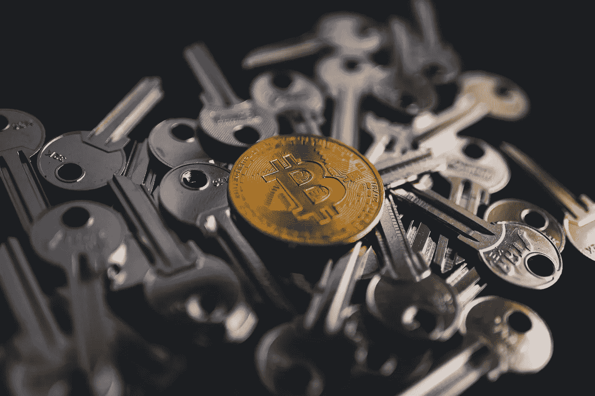
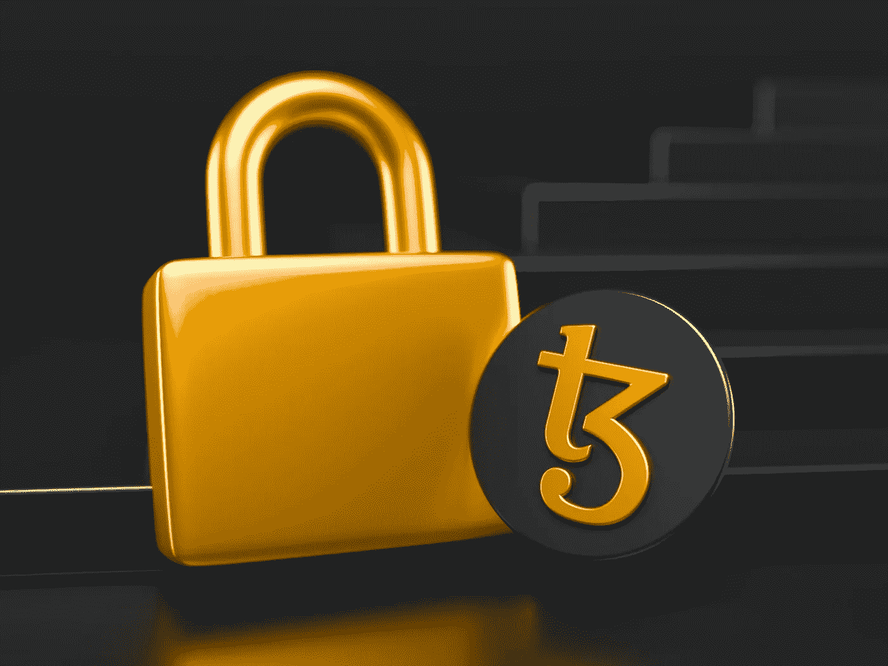
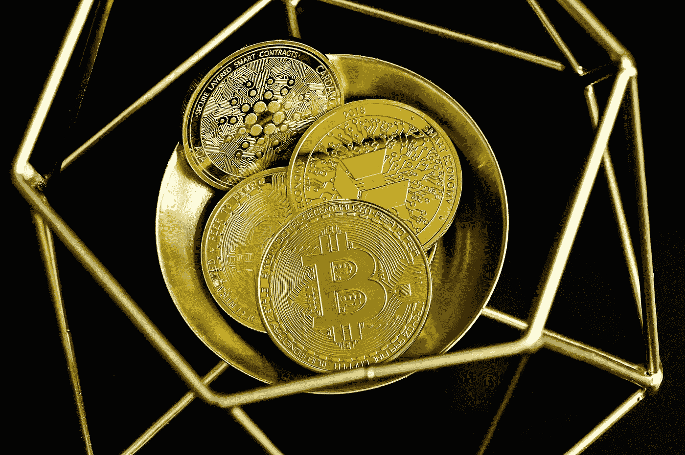

# 2022 年必须有 10 种加密货币。

> 原文：<https://medium.com/coinmonks/10-must-have-cryptocurrencies-in-2022-cc5c6cd9feeb?source=collection_archive---------28----------------------->

Source:Unsplash.com

自 2008 年中本聪发布比特币白皮书以来，市场经历了前所未有的增长。除此之外，加密货币的世界一直在发展，明天可能会看到下一个伟大的数字货币的推出。虽然比特币通常被视为加密货币的先驱，但专家们使用各种方法评估 BTC 以外的代币。

通常，加密货币不受政府操纵和控制。然而，随着加密货币越来越受欢迎，这一基本的生态系统组件受到了质疑。在比特币之后形成的加密货币被统称为替代币，它们经常试图将自己宣传为比特币的修改版或增强版。尽管这些货币中的一些可能具有比特币所缺乏的惊人特性，但还没有替代货币达到比特币网络的安全水平。

> **另见:** [**分权财政(DeFi) vs 集权财政(CeFi)。**](/@ilekeairende/decentralized-finance-defi-vs-centralized-finance-cefi-ede87a0bde07)

**什么是密码学？**

Source: Unsplash.com

前缀 crypto-指的是“密码术”，一种保护和隐藏信息免受入侵者攻击的技术。密码术是通过代码保护信息和通信的艺术，以便只有预定的接收者能够理解和解释信息。从而防止对数据的不必要的访问。前缀“crypt”表示“隐藏”，后缀“graphy”表示“书写”

密码术实现了数字资产的验证和交换，而不需要可信的第三方。在第二次世界大战期间，盟军使用加密技术来发送和接收秘密信息。密码学可以追溯到朱利叶斯·凯撒统治时期。计算机的出现使得更先进的加密技术成为可能。然而，目标仍然是一样的:将可读的消息(纯文本)转换成未经授权的读者无法理解的东西(密文)。

> **另见:** [**现在购买的 5 种最佳加密货币。**](/@ilekeairende/decentralized-finance-defi-vs-centralized-finance-cefi-ede87a0bde07)

**加密货币的种类。**

虽然所有加密货币都具有几乎相同的特征，但其中大多数都具有不同的功能。比如比特币作为支付方式，而以太坊等 altcoins 则用于构建 dapps。以太坊从未打算用作数字货币。相反，它是作为开发基于区块链的应用程序的大型平台而创建的。

以太坊将智能合约引入了该行业。智能合约可以在满足特定条件时自动执行交易。这些“项目”(也称为条件)在创建时就包含在智能合同中。

**比特币和以太坊有区别吗？**

Source: Unsplash.com

比特币和以太坊都是加密货币；然而，虽然比特币消除了直接支付中对第三方的需求，但以太坊通过智能合约消除了几种交易中对第三方的需求，如资产出售、借贷等。

**三种主要的加密货币。**

有三大类加密货币；

1.比特币

2.替代硬币

3.代币

**比特币**

比特币(BTC)目前的市场估值超过 5560 亿美元，是全球最有价值的加密货币。比特币是一种全球点对点电子支付系统，无需银行等中介。比特币白皮书是一份概述这种货币如何运行的文件，于 2008 年出版，标志着这种开创性的新货币的首次亮相。比特币网络自诞生以来，从未遇到过一段时间的宕机，允许随时进行价值转移。

比特币创造者所用的化名中本聪的身份仍不得而知。此外，还不清楚中本聪代表的是参与比特币项目的个人还是一群人。

比特币通常被视为法定现金和黄金的替代数字投资。比特币是一种很好的价值储存手段，类似于黄金，因为它可以像传统货币一样消费和储蓄。

> **另见:** [**5 玩赚游戏，将在 Q2 2022 炸掉。**](/coinmonks/5-play-to-earn-games-that-will-blow-up-in-q2-2022-33585b1e2a7e)

**山寨币**

自 2008 年比特币“开源”发布以来，已经开发了数百种新的加密货币。作为比特币的替代品，这些新货币被称为“替代币”。虽然一些替代加密货币的功能与比特币类似，但其他加密货币有多种用途。例如，使用以太坊，全球第一个可编程区块链，开发和部署去中心化应用(DApps)和智能合约是可行的。

包括比特币在内的所有替代加密货币都使用分布式账本技术在其网络上自主运行(DLT)。中本聪通过比特币引入的区块链技术是最知名、应用最广泛的数字账本技术类别(DLT)。每个协议的底层编码都将替代硬币相互区分开来，尽管它们都采用 DLT 标准。

**代币**

第三种主要的加密货币是代币。代币是没有自己的区块链的加密货币，它们与其他两种主要的加密货币完全不同。

它们通常建立在分散式应用程序(dApps)上，即建立在以太坊和 NEO 等区块链上的应用程序。因为 dApps 被设计为利用智能合约，所以它们使用令牌。

然而，他们的令牌不需要反映一个物理实体，如能源或房屋。相反，它们可以用来购买 dApp 上的商品。或者，他们可以用来获得特定的好处，如降低费用和投票费用。

代币可能是有价格的，所以一些个人购买代币来转售它们以获利，而不是在分散的应用程序上使用它们。

2022 年 10 种必备加密货币。

Source: Unsplash.com

**1。兑换令牌:**兑换令牌是交易所生成的加密货币，主要用于其交易平台和服务。币安币、霍比币和库币就是少数例子。

**2。建立在比特币协议上的加密货币**:众多的加密货币都是基于比特币协议，这也解释了为什么它们会如此广泛。其中最突出的加密货币是莱特币和比特币现金。

**3。基于功能的加密货币:**以太坊(Ethereum)，最知名的基于平台的加密货币，由于其使用智能合约和去中心化应用，被普遍认为是仅次于比特币的第二大最有价值的加密货币。随着 defi 空间的扩大，越来越多的公司采用 Dao，以太坊是必备的。

**4。Stablecoins:** Stablecoins 是一种加密货币，通过将其价值与法定货币或其他资产的价值挂钩来维持稳定的价格(每开采一个代币，银行账户中就会存入一美元)。通过将价格与稳定资产(如法定货币)挂钩，价格波动性大大降低。系绳，戴，美元硬币是其中最突出的例子。

> **另见:** [**Terra 的 LUNA 2.0 Testnet 现已上线。**](https://wire.insiderfinance.io/terras-luna-2-0-testnet-is-now-live-ec63bb60eff6)

**5。纯货币:**这些是充当商品和服务交换媒介的货币。BTC 就是这些加密货币中的一种；Ripple 是为国际交易而设计的，而 BCH(比特币现金)是为比比特币更快更便宜而设计的。莱特币的设计也是为了让交易比比特币更快。

**6。区块链平台:**这些加密货币作为具有智能合约功能的区块链平台，允许分散的应用程序在其上运行。常见的例子有以太坊、EOS、CARDANO、Vechain (VEN)、NEO 和恒星流明 XLM。

7.**生态系统币:**生态系统币的目标是加强和简化区块链生态系统。这些硬币包括 Nebulas (NAS)、Waves(允许开发者创建他们的代币)、SALT(允许用户使用他们的加密货币作为抵押品来套现贷款)、Chain Link(将数字加密货币世界与现实世界连接起来)、Ethos、Aion 等。

**8。隐私币:**这类硬币试图通过隐藏比特币地址背后的身份来为交易提供完全或可选的匿名性。其中有 Monero、Zcash (ZEC)、Verge (XVG)、Bytecoin (BTN)、Bitcoin Private (BTCP)、Komodo (KMD)、NAVCOIN (NAV)。

**9。游戏和游戏币:y 主要关注游戏产业。例如风暴令牌(Storm)、游乐场(Funfair)、分散之地(MANA)、沙箱(SAND)等。**

**10。社交网络币:**由于这些社交网络由一个集中的组织管理，使得信息和数据容易受到影响，因此社交网络上存在安全和隐私需求。有了这些代币，个人不仅能够保护他们的数据，还能够在利用社交网络时获利。这些硬币包括 RDD·雷德克币、斯蒂姆币和 MITH 币。