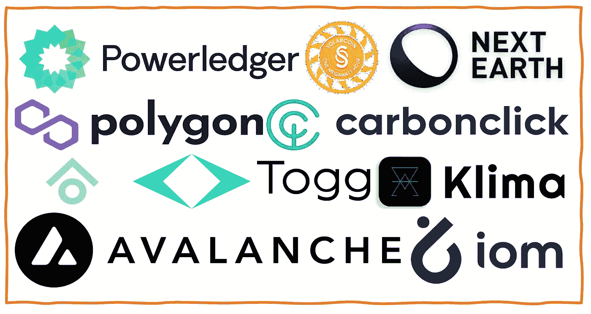

# 2022 年气候项目最酷的 10 个区块链

> 原文：<https://medium.com/coinmonks/10-of-the-coolest-blockchain-for-climate-projects-in-2022-2f174bfcaa96?source=collection_archive---------13----------------------->

随着我们进入第 52 个地球日，这是一个很好的时机来强调几个很酷的区块链项目，这些项目采用可再生的加密经济学来加速我们走向低碳经济的道路。我们知道，时间不多了！

**第一层和第二层**

区块链的基石是潜在的区块链本身。关于比特币和其他区块链工作证明的能源消耗，人们已经说了很多，尽管它们是能源密集型的，但按照碳强度衡量，它们促成的经济活动量远低于大多数其他行业。然而，一些第 1 层和第 2 层利用某种形式的利益证明，在实现非常低的最终碳负面影响方面取得了长足的进步。

1.  [**Polygon**](https://polygon.technology/) : Polygon，以太坊股份侧链的证明，最近宣布了他们的绿色宣言，重点是通过进一步的节能和碳抵消的结合来实现碳负。
2.  [**雪崩**](https://www.avax.network/) 也将低碳作为优先事项，并与 CCRI(Crypto Carbon Ratings Institute)合作评估其气候影响。1 月， [CCRI 发布了一份报告](https://carbon-ratings.com/pos-report-2022):股权区块链协议证据的能效和碳足迹。

*荣誉奖:* [海德拉](https://hedera.com/)实际上击败了 Polygon 对碳负的承诺。

**链条上的碳偏移和追踪**

3.[**klima Dao**](https://www.klimadao.finance/)**致力于通过鼓励透明使用和跟踪经认证的碳补偿来加速减缓气候变化。在撰写本文时，已经有 1700 万吨二氧化碳通过克利马道排放。**

**4.来自纽西兰的 Click 也在区块链的碳补偿领域兴风作浪，客户包括航空公司和 Shopify！**

***优秀奖:*[**climate trade**](https://climatetrade.com/+)**成立于西班牙，帮助欧洲 300 多家公司，现在全球范围内通过在 chain 上注册的经验证的项目自愿抵消他们的碳排放。****

******机动性******

****交通运输是唯一一个排放量低于 1990 年水平的行业。区块链可以帮助加速行业对低碳的贡献。****

****5.[**Togg**](https://www.togg.com.tr/en/)**可能是你可能从未听说过的最酷的电动汽车公司之一(至少现在还没有！).总部位于土耳其的 Togg 正准备在今年推出他们的第一辆电动汽车。Togg 不仅完全接受了 CASE 革命(互联、自主和共享电动汽车)，而且可能是第一家完全接受区块链的电动汽车制造商，以实现其目标，包括从智能电网到碳足迹跟踪的多项碳相关功能。Togg 首席执行官[在 2022 年 3 月巴塞罗那雪崩峰会](https://www.youtube.com/watch?v=M5tKqnOip6Q)上宣布了他们雄心勃勃的计划。******

******6.[**Iomob**](http://internetofmobility.org)**(披露，我是 Iomob 的 CEO！)于 2018 年成立，旨在建立一个分散的 intenet 移动网络。虽然我们当时还为时过早，必须集中技术堆栈，但 2022 年是我们回归本源的一年，去中心化和令牌化移动网络的互联网。Iomob 与其气候和影响投资者合作，评估通过模式转变实现减排的潜力，这种模式转变是通过对 IoM 采取全球规模的方法实现的。我们发现每年可以避免超过 1.3 万亿吨的二氧化碳排放。********

********能量********

****7.这家总部位于澳大利亚的初创公司成立于 2016 年，为个人和企业提供点对点能源交易。最近，Powerledger 获得了环境和绿色能源世界峰会奖。今天，Powerleddger 支持 P2P 可再生能源交易，在全球 12 个国家促进更优化和非民主化的使用和存储。****

****8. [**太阳能硬币**](https://solarcoin.org/) 太阳能硬币团队开发了一种奖励太阳能发电的代币，用太阳能硬币奖励太阳能植物。每生产一兆瓦的太阳能，经过验证的太阳能项目将在长达 30 年的时间里获得 1 太阳能币！****

******投资道******

****9.[**aera force**](https://www.aeraforce.xyz/)**对于 DAOs(分散自治组织)来说，最令人兴奋的一个用例是早期项目中风险投资的民主化。可持续发展和气候领域是投资 DAOs 的一个成熟领域。AeraForce 是这一领域的先行者，它率先使用投资 DAO 让散户投资者能够早期投资有前途的气候相关初创公司。******

********元宇宙为星球********

****10.NextEarth 是代币价值最高的五大元宇宙项目之一。与沙盒和分散土地等其他顶级元宇宙项目不同，Next Earth 是唯一一个基于地球卫星图像销售虚拟土地的区块链·元宇宙项目。也许毫不奇怪，他们似乎最致力于提高意识和支持环境倡议。例如，他们收入的 10%(不是利润，而是收入)由代币持有者投票分配给环境非政府组织。相应地，它们建立在多边形的顶部。****

******关于作者******

*****Boyd Cohen 是 Iomob 的首席执行官和联合创始人，Iomob 是一个分散的移动互联网网络。自 2001 年在科罗拉多大学获得战略和创业博士学位以来，他在过去的二十年里致力于加速实现低碳可持续经济。这包括出版了 3 本书，多篇同行评审的文章，经常为 Fast Company 投稿，并在智能城市和可持续发展领域创办了一些企业。*****

> ****加入 Coinmonks [电报频道](https://t.me/coincodecap)和 [Youtube 频道](https://www.youtube.com/c/coinmonks/videos)了解加密交易和投资****

# ****另外，阅读****

*   ****[本地比特币评论](/coinmonks/localbitcoins-review-6cc001c6ed56) | [加密货币储蓄账户](https://coincodecap.com/cryptocurrency-savings-accounts)****
*   ****[什么是融资融券交易](https://coincodecap.com/margin-trading) | [美元成本平均法](https://coincodecap.com/dca)****
*   ****[拥护卡审核](https://coincodecap.com/uphold-card-review) | [信任钱包 vs MetaMask](https://coincodecap.com/trust-wallet-vs-metamask)****
*   ****[Exness 评测](https://coincodecap.com/exness-review)|[moon xbt Vs bit get Vs Bingbon](https://coincodecap.com/bingbon-vs-bitget-vs-moonxbt)****
*   ****[如何开始通过加密贷款赚取被动收入](https://coincodecap.com/passive-income-crypto-lending)****
*   ****[BigONE 交易所评论](/coinmonks/bigone-exchange-review-64705d85a1d4) | [电网交易机器人](https://coincodecap.com/grid-trading)****