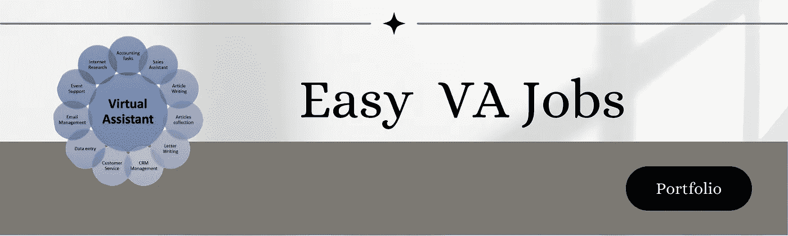
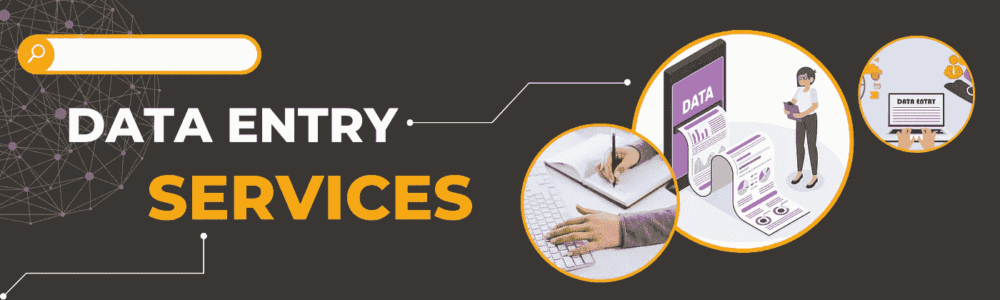

# 2022 年使用电脑赚钱的 10 种惊人方法

> 原文：<https://medium.com/coinmonks/10-stunning-ways-to-make-money-using-your-computer-in-2022-53697cec3742?source=collection_archive---------4----------------------->

## 2022 年你在寻找用电脑赚钱的方法吗？如果是这样，让我们来讨论一些最不可思议的利用电脑赚钱的方法。

10 Stunning Ways to Make Money Using Your Computer in 2022

个人希望在网上赚钱的动机有很多。你可以以较低的启动成本进入全球市场，并且可以自由地在家工作，时间安排灵活。有几种在线赚钱的方法，不需要开发物品或持有股票。

此外，由于新冠肺炎疫情，更多的人在网上购物。因此，电子商务领域的会员数量正在增加。这篇文章是为有兴趣了解互联网赚钱理念的你写的。我们将讨论 10 种在线赚钱的方法，包括 10 种快速方法和长期策略。

# 1.利用零工经济:

Leverage the Gig Economy

如果你有一台电脑和互联网连接，这是一个很好的机会，你可以通过利用零工经济开始赚钱。像 Fiverr、Upwork 和 Freelancer 这样的平台允许你在线提供服务，而且总会有人寻求帮助。

如果你有一些其他人需要的技能，有几种方法可以通过在线提供服务来赚钱。像 Fiverr 和 Upwork 这样的平台可以很容易地联系到需要你帮助的人，并且你可以设定你的价格。

**标准福利:**

-你可以自由工作，想什么时候工作就什么时候工作。

——事半功倍赚更多钱。

-再也不用担心你的财务状况了。

# 2.成为虚拟助理:

Becoming a Virtual Assistant

虚拟助理从远程位置向企业和企业家提供管理支持。作为虚拟助理，你可以处理客户服务、社交媒体管理、数据输入等。

如果你有一些行政或客户服务经验，成为虚拟助理可能是一个很好的利用电脑赚钱的方法。你可以在像 Upwork 和 Freelancer 这样的平台上找到几个虚拟助理的工作。

另一个在家赚钱的好方法是成为虚拟助理。虚拟助理帮助忙碌的专业人士安排约会、管理电子邮件等等。

**标准福利:**

-你可以做你喜欢的事情来谋生。

-你可以控制自己的时间表和收入。

-不再担心账单、租金或其他财务责任。

-做你的老板，设定你的时间。

# 3.开始你自己的网上生意:

Starting Your Own Online Business

在家赚钱的最有利可图的方法之一是开始你自己的网上生意。有了正确的想法和努力工作，你可以创建一个成功的网上业务，产生健康的收入。

开展网上业务有几种方式，最佳方式将取决于你的技能和兴趣。如果你有网页设计的背景，你可以开始网页设计业务。如果你擅长写作，你可以开一个博客或者开一个电子商务商店。

一些在线商业课程可以帮助你入门，像 Shopify 这样的平台可以很容易地建立一个在线商店。

**标准福利:**

-你掌控自己的收入和命运。

-你可以在世界任何地方工作。

-不再担心账单、租金或其他财务责任。

-做你的老板，设定你的时间。

# 4.自由职业者:

Freelancing

自由职业是另一个利用电脑赚钱的好方法。作为一名自由职业者，你可以向全世界的客户提供你的技能和服务。

如果你擅长写作、设计或编程，总会有人在自由职业项目上需要帮助。你可以在 Upwork、Freelancer 和 Fiverr 等平台上找到自由职业者的工作，或者你也可以开展自己的自由职业业务。

自由职业平台是允许人们找到自由职业工作的网站或应用程序。一些最受欢迎的自由职业平台包括 Upwork、Freelancer 和 Fiverr。作为一名自由职业者，你可以利用这些平台找到适合你的技能和时间表的工作。你也可以和潜在的客户建立联系，获得项目的聘用。

当你加入一个自由职业平台时，你创建了一个展示你的技能和经验的个人资料。潜在客户可以浏览个人资料，选择他们想合作的自由职业者。像 Upwork 和 Freelancer 这样的平台向自由职业者收取他们完成的每个项目的佣金。另一方面，Fiverr 向客户而不是自由职业者收费。

如果你正在寻找自由职业者的工作或需要自由职业者的企业，那么自由职业者平台是很好的。这些平台易于使用，并提供广泛的服务。它们也是联系世界各地有才华的自由职业者的好方法。

**标准福利:**

-你可以在世界任何地方工作。

-你可以控制自己的时间表和收入。

-不再担心账单、租金或其他财务责任。

-做你的老板，设定你的时间。

# 5.在线销售产品和服务:

Selling Products and Services Online

用你的电脑赚钱的最好方法之一是在网上销售产品和服务；如果你有产品或服务要卖，有几种方法可以开始。

你可以利用像 [Shopify](https://www.shopify.com/blog/make-money-from-home) 这样的平台开一家电子商务商店，或者你可以在亚马逊和易贝这样的市场上销售产品。如果你有一项服务可以提供，你可以开始一项自由职业或者推出订阅服务。

**标准福利:**

-你掌控自己的收入和命运。

-你可以在世界任何地方工作。

-不再担心账单、租金或其他财务责任。

# 6.创建和销售在线课程:

Creating and Selling Online Courses

如果你是某个特定学科的专家，你可以通过创建和销售在线课程来赚钱。在线课程变得越来越受欢迎，从网络开发到训狗，对各种课程都有巨大的需求。

如果你有别人想学的知识或专长，可以考虑创建一个在线课程。你可以使用像 Udemy 或 Teachable 这样的平台来开办你的课程，而且有可能获得高收入。

**标准福利:**

-你掌控自己的收入和命运。

-你可以在世界任何地方工作。

-不再担心账单、租金或其他财务责任。

# 7.联盟营销:

Affiliate Marketing

联盟营销是一种基于绩效的营销模式，你可以通过推广别人的产品或服务赚取佣金。作为代销商，你可以在你的博客或社交媒体渠道上推广产品，当有人通过你的链接购买时，你将获得佣金。

如果你有博客或社交媒体，联盟营销可能是一个利用你的电脑赚钱的好方法。你可以找到你感兴趣的产品和服务的代销商计划，有几种方法可以推广代销商链接。

**标准福利:**

-你掌控自己的收入和命运。

-你可以在世界任何地方工作。

-不再担心账单、租金或其他财务责任。

# 8.启动 YouTube 频道:

Starting a YouTube Channel

YouTube 是一个与世界分享你的知识和专长的好方法，你可以通过在 YouTube 上创作和发布视频来赚钱。你可以创建一个关于你感兴趣的任何事情的频道，从烹饪到游戏到时尚。

如果你对某个特定的主题有热情，开一个 YouTube 频道可能是用你的电脑赚钱的好方法。你可以通过广告来赚钱，也可以通过联盟营销或赞助来赚钱。

**标准福利:**

-你可以通过在 YouTube 上创作和发布视频来赚钱。

-您可以通过广告将您的渠道货币化。

-你也可以从联盟营销或赞助中赚钱。

# 9.数据输入:

Data Entry

数据输入是一种简单但有利可图的利用电脑赚钱的方式。作为一名数据输入员，你将为公司或客户向电子表格或数据库中输入数据。

人们总是需要完成数据输入工作，这是一个在线赚钱的好方法。你可以在像 Upwork 或 Fiverr 这样的自由职业平台上找到数据录入工作，或者你可以开始自己的数据录入业务。

**标准福利:**

-你可以在世界任何地方工作。

-不需要特殊技能或经验。

——可以快速上手，快速赚钱。

# 10.社交媒体营销:

Social Media Marketing

作为一名社交媒体营销人员，你将帮助企业在社交媒体平台上推广他们的产品和服务。您将创建和管理社交媒体帐户，发布内容，并与关注者互动。

社交媒体营销是利用你的电脑赚钱的好方法，而且是一个正在成长的行业。如果你擅长在网上推广产品和与人交流，考虑在社交媒体营销领域开始职业生涯。

**标准福利:**

-你可以在世界任何地方工作。

-不需要特殊技能或经验。

——可以快速上手，快速赚钱。

# 结论

有几种方法可以利用你的电脑赚钱，这些只是一些最受欢迎的选择。如果你想赚点外快，甚至开始新的职业生涯，考虑用你的电脑赚取收入。

感谢阅读！

> 加入 Coinmonks [电报频道](https://t.me/coincodecap)和 [Youtube 频道](https://www.youtube.com/c/coinmonks/videos)了解加密交易和投资

# 另外，阅读

*   [CoinLoan 评论](https://coincodecap.com/coinloan-review) | [YouHodler 评论](/coinmonks/youhodler-4-easy-ways-to-make-money-98969b9689f2) | [BlockFi 评论](https://coincodecap.com/blockfi-review)
*   [XT.COM 评论](https://coincodecap.com/profittradingapp-for-binance)币安评论 |
*   [SmithBot 评论](https://coincodecap.com/smithbot-review) | [4 款最佳免费开源交易机器人](https://coincodecap.com/free-open-source-trading-bots)
*   [比特币基地僵尸程序](/coinmonks/coinbase-bots-ac6359e897f3) | [AscendEX 审查](/coinmonks/ascendex-review-53e829cf75fa) | [OKEx 交易僵尸程序](/coinmonks/okex-trading-bots-234920f61e60)
*   [如何在印度购买比特币？](/coinmonks/buy-bitcoin-in-india-feb50ddfef94) | [瓦济克斯审查](/coinmonks/wazirx-review-5c811b074f5b)
*   [隐料斗替代品](/coinmonks/cryptohopper-alternatives-d67287b16d27) | [HitBTC 审查](/coinmonks/hitbtc-review-c5143c5d53c2)