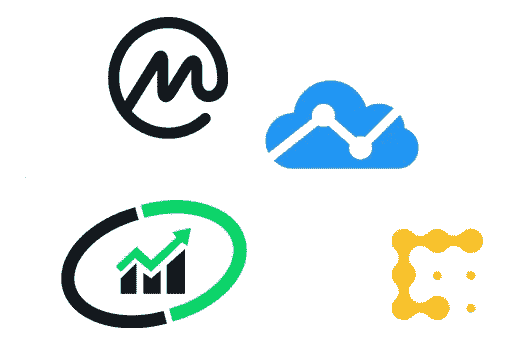
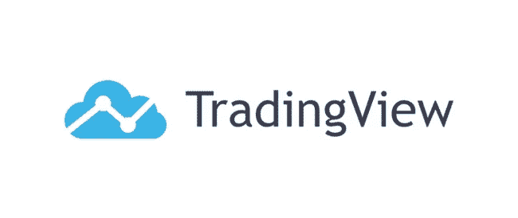
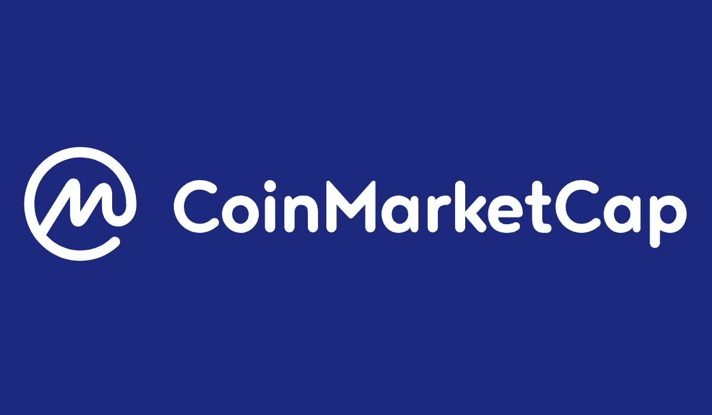
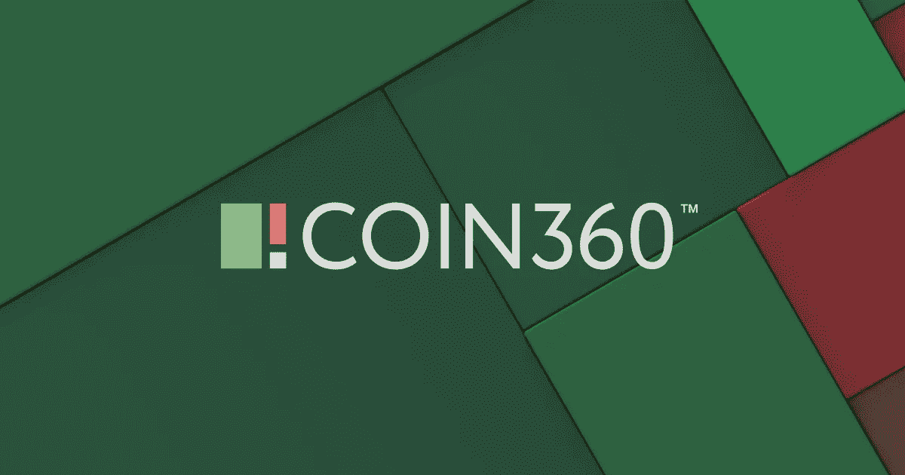

# 10 个有用的网站

> 原文：<https://medium.com/coinmonks/10-useful-websites-for-traders-a79efffcb5c9?source=collection_archive---------11----------------------->

在这篇文章中，我将介绍 10 个有用的网站，用于接收货币价格、价格图表、比较和审查服务以及关于投资机会的信息。

## **1。Tradingview.com**

除了在该网站上接收与国际股票交易所等金融市场相关的信息，您还可以查看 210 多种加密货币的图表，甚至可以使用基于网络的技术分析面板对其进行技术分析。

## **2。Coinmarketcap.com**

Coinmarketcap.com 网站，你可以看到数字货币的排名，从每个货币代码或硬币或密码的 Marketcap 部分，你可以看到其市场容量，比特币的市场容量超过 1 万亿美元，如果你继续，你还可以看到其他货币代码的排名。

但市场容量的重要之处在于，为什么市场规模对我们如此重要？因为它向你展示了已经投入到那个项目中的资本数量，而当我们说比特币有一万亿美元的市场容量时，这意味着等量的美元被从人们手中拿走，投入到这个市场中。可以给我们展示一个项目。

## **3。Worldcoinindex.com**

一个类似于 coinmarketcp.com 的网站，具有像观察列表和投资组合的功能。这个网站上的图表看起来比 coinmarketcp.com 好，但显然有些货币还没有列出来。

但总的来说，这是一个有用的网站，和 coinmarketcp.com 一样，你可以用来比较价格和查看图表，建立观察名单和投资组合。

## **4。Cryptocompare.com**

一个参考网站，在这里你可以阅读各种关于加密货币、兑换处、可提取货币、钱包和其他相关服务的评论。

采矿部分有计算器，向您展示数字货币提取的好处。

用户对 cryptocompare.com 上与加密货币相关的服务、钱包和其他网站的反馈有助于您识别声誉良好的网站和服务。

## **5。Coin360.com**

Coin360 是数字货币领域最重要和最有用的网站之一，为用户提供新闻、世界图表和列表视图。此外，coin360 网站收集这些货币的数据，以确定货币的价格和交易量。并得到声誉良好的交易所的批准。

事实上，coin360 网站是一个显示价格波动和市场趋势的应用平台。这对金融市场参与者来说非常重要，有很多应用。

## **6。Lunarcrush.com**

基于人工智能的 Lunarcrush，你可以获得实时信息，这些信息在任何网站上都没有，甚至在 coinmarketcap.com 也没有，而 lunarcrush 凭借其吸引人的图形空间拥有这些信息和数据。它可以以软件包的形式为您提供基本分析。

比如在这个网站上，如果你有兴趣知道哪个投币台使用最多，你可以很容易地看到排名，而 Tether 仍然在投币台的最上方。即使你去兑换部分，你可以看到国际兑换交易的金额是有效数据，即使你感兴趣，你可以看到最近 24 小时内有多少笔交易。

## **7。Blockchain.com**

另一个重要的数字货币网站是 blockchain.com。这是 7 个最常用的数字货币网站之一，世界各地的许多人都在使用它。这个网站有很多功能。例如，区块链是一种比特币区块链浏览器。另外就是比特币钱包，中庭，比特币缓存。

该网站提供最新交易等信息。它还为开发者提供与比特币相关的图表。您也可以在手机上安装并使用这个钱包应用程序。区块链是你可以使用的最有信誉的数字货币参考之一。

## **8。ICOalert.com**

有可能在这个网站的帮助下找到最初发行的货币代码。这些发行物中的大多数与其他发行物没有什么不同，货币的技术是从其他货币复制来的，但有时好的投资项目也会被公布。

## **9。Coindesk.com**

Coindesk 网站，在这里你可以快速看到这个网站上发布的关于每个项目的最新消息，在这个网站上，除了各种关于货币代码的文章，你还可以看到关于项目的重要消息。

## 10。**Bitinfocharts.com**

这个网站包含了很多信息，包括比特币和 atrium 的平均交易规模、活跃地址、哈希率、提取难度、提取盈利能力等等。

> 加入 Coinmonks [电报频道](https://t.me/coincodecap)和 [Youtube 频道](https://www.youtube.com/c/coinmonks/videos)了解加密交易和投资

## 另外，阅读

*   [有哪些交易信号？](https://coincodecap.com/trading-signal) | [Bitstamp vs 比特币基地](https://coincodecap.com/bitstamp-coinbase) | [买索拉纳](https://coincodecap.com/buy-solana)
*   [ProfitFarmers 回顾](https://coincodecap.com/profitfarmers-review) | [如何使用 Cornix 交易机器人](https://coincodecap.com/cornix-trading-bot)
*   [十大最佳加密货币博客](https://coincodecap.com/best-cryptocurrency-blogs) | [YouHodler 评论](https://coincodecap.com/youhodler-review)
*   [MoonXBT vs Bybit vs 币安](https://coincodecap.com/bybit-binance-moonxbt) | [Arbitrum:第二层解决方案](https://coincodecap.com/arbitrum)
*   [买 PancakeSwap(蛋糕)](https://coincodecap.com/buy-pancakeswap)|[matrix export Review](https://coincodecap.com/matrixport-review)
*   [最佳免费加密信号](https://coincodecap.com/free-crypto-signals) | [YoBit 评论](/coinmonks/yobit-review-175464162c62) | [Bitbns 评论](/coinmonks/bitbns-review-38256a07e161)
*   [OKEx 回顾](/coinmonks/okex-review-6b369304110f) | [Kucoin 交易机器人](/coinmonks/kucoin-trading-bot-automate-your-trades-8cf0ca2138e0) | [期货交易机器人](/coinmonks/futures-trading-bots-5a282ccee3f5)
*   [AscendEx Staking](https://coincodecap.com/ascendex-staking)|[Bot Ocean Review](https://coincodecap.com/bot-ocean-review)|[最佳比特币钱包](https://coincodecap.com/bitcoin-wallets-india)
*   [霍比审核](https://coincodecap.com/huobi-review) | [OKEx 保证金交易](https://coincodecap.com/okex-margin-trading) | [期货交易](https://coincodecap.com/futures-trading)
*   [比特币基地赌注](https://coincodecap.com/coinbase-staking) | [Hotbit 评论](/coinmonks/hotbit-review-cd5bec41dafb) | [KuCoin 评论](https://coincodecap.com/kucoin-review)
*   购买 Dogecoin 的 7 种最佳方式 | [ZebPay 评论](https://coincodecap.com/zebpay-review)