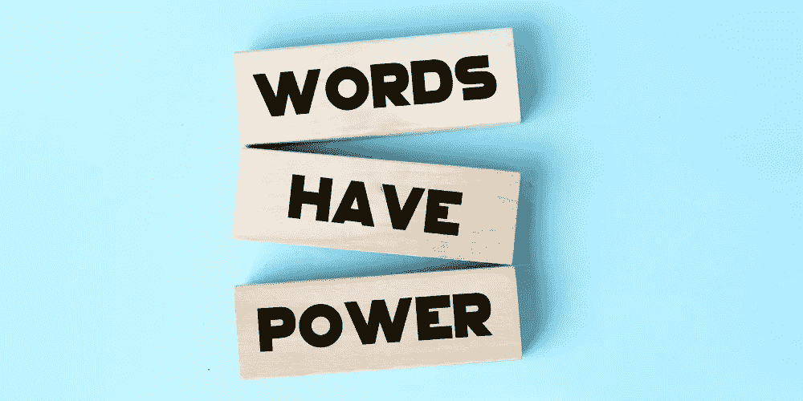

# 提高转化率的 10 个网站文案技巧

> 原文：<https://medium.com/coinmonks/10-website-copywriting-tips-to-boost-conversions-ee3cdd1b1d3f?source=collection_archive---------36----------------------->

## 文案是创造引人注目的内容的艺术和科学，吸引你的目标受众并鼓励他们采取想要的行动。

10 Website Copywriting Tips To Boost Conversions

你想提高网站的转化率吗？看看我们的 10 大文案技巧，这将有助于提高你的网站的转化率。从给人留下良好的第一印象到使用有说服力的语言，我们都涵盖了！

你只有几秒钟的时间给你的网站访问者留下一个好的第一印象。确保你的网站设计是最新的和专业的，并且你的内容写得很好，没有错误。

文案是以广告或营销为目的的文字写作过程。文案是一种沟通形式，使用文字来说服观众采取行动，通常是购买产品或服务。好的文案可以为你的网站带来更多的销售和转化。

您可以将这些技巧应用到您的 Shopify 商店、登录页面、电子邮件等。这里有 10 个技巧可以帮助你提高网站的转换率，提高文案质量:

# 1.写清楚简洁的标题

当人们登陆你的网站时，你的标题是他们首先看到的。你需要确保你的标题简洁明了，这样人们就能马上知道你的网站是关于什么的。一个好的标题也将是关键字丰富，这样它可以很容易地在搜索引擎中找到。

**例子:**

*   简明扼要:如何制作一杯完美的咖啡
*   关键词丰富:最佳家用咖啡机

写标题的时候，记住人们会很快浏览你的网站。你要确保你的标题突出，易于阅读。使用有力的关键词，确保你的标题不超过几个字。

# 2.使用强烈的行动号召

当人们登陆你的网站时，你的行动号召就是你希望他们做的。你要确保你的行动号召是强烈而清晰的，这样人们才能确切地知道你想让他们做什么。使用主动动词，如“购买”、“注册”或“了解更多”来增加人们采取行动的机会。

**例子:**

*   "注册订阅我们的时事通讯，了解所有最新消息！"
*   “现在购买，免费送货！”
*   "了解更多关于我们的产品和服务！"

确保你的行动号召是可见的，容易找到的。你不希望人们去寻找它；你希望它就在他们面前。使用颜色、字体和其他设计元素来突出它。你的行动号召应该与你网站的其他部分相关。

# 3.撰写有说服力的文案

你的网站应该有说服力，让人信服，这样人们才会想买你卖的东西。使用情绪化的、激励人们采取行动的强有力的语言。一定要用数据和证明来支持你的主张，让人们知道你是可信的。

**例子:**

“我们的软件是市场上最好的，因为它已经帮助成千上万的企业节省了时间和金钱。”

*   “你应该得到最好的，这就是我们公司提供的。”
*   “我们的团队拥有完成工作的经验和知识。”

所有这些有什么共同点？它们短小精悍，切中要害。在一个人们不断被信息轰炸的世界里，你需要确保你的信息清晰简洁。这就是为什么保持你的副本简短和甜蜜是至关重要的。

Words Have Power

# 4.保持你的副本简短和甜蜜

人们的注意力持续时间很短，他们更倾向于浏览你的文章，而不是逐字逐句地阅读。保持你的句子和段落简短，这样人们可以很容易地消化信息。使用项目符号和列表使你的文章更容易浏览。

**例子:**

使用项目符号:项目符号是一种简单的方法，可以分解大量的文本，使它们更容易浏览。

保持句子简短:短句比长而复杂的句子更容易阅读。如果一个句子太长，试着把它分成两个或更多更短的句子。

使用列表:列表是另一种分解文本并使其更容易浏览的简单方法。

使用标题和副标题:标题和副标题有助于组织你的内容，使其更容易浏览。

当你为网站写文章时，记住你的读者是很重要的。众所周知，网络用户缺乏耐心，经常会浏览内容而不是通读。因此，以一种易于浏览和消化的方式写作是很重要的。

# 5.使用图像和视频

比起阅读的信息，人们更容易记住他们看到的信息。在你的网站上使用图片和视频来分解文字，使你的观点更加有效。

**例子:**

*   在你网站的主页上使用图片来介绍你自己或你的企业。
*   使用图像和视频展示您的产品或服务。
*   使用图像和视频来解释复杂的概念。
*   使用图像和视频向客户展示客户评价或评论。

图片和视频是让你的网站更吸引人、信息量更大的好方法。明智地使用它们，以确保你的访问者会记住你的网站，并回来更多。

通过使用文本、图像和视频的组合，您可以创建引人入胜、信息丰富的内容，让您的访问者再次光顾。

# 6.突出显示重要信息

使用粗体、斜体和下划线来突出你的文稿中的重要信息。这将有助于人们挑选出最重要的信息，使他们能够迅速了解你的网站是什么。

**例子:**

*   这个网站旨在帮助你提高英语技能。
*   在这个网站上，你可以找到帮助你提高英语技能的资源。
*   我们提供帮助你提高英语技能的课程。
*   我们致力于帮助您提高英语技能

如果你想让人们留在你的网站上，让你的网页文本易于阅读和理解是很重要的。一种方法是用粗体、斜体和下划线突出重要信息。这将有助于人们挑选出最重要的信息，这样他们就能很快理解你的网站是关于什么的。

# 7.使用简单的语言

你要确保你的文案易于理解，这样人们才不会迷路或困惑。使用简单的语言，避免使用行话或专业术语。8.为你的读者写作

**例子:**

*   使用“您”这个词，而不是“我们的用户”
*   使用像“不要”这样的缩写代替“不要”

你也要确定你是在为你的观众写作。这意味着使用他们能理解的语言和术语。例如，如果你是为技术读者写作，你会希望使用更多的技术术语。如果你是为普通读者写作，你会希望使用更多的普通术语。

# 8.你为谁写作？

确保你的文案是面向你的目标受众的，这样他们就能与之产生共鸣。以迎合他们需求和兴趣的方式写作。

记住你在为谁写作，他们想知道什么，为什么他们会阅读你的文章。通过了解你的目标受众，你可以更好地写出在个人层面上与他们产生共鸣的文案。

**例子:**

如果你正在销售一种新型牙膏，考虑什么样的人会有兴趣使用它。如果你的目标受众是牙齿敏感的人，那么你的广告应该关注你的牙膏如何帮助他们。

如果你正在写一篇关于镇上一家新餐馆的博文，考虑一下什么样的人会有兴趣阅读它。如果你的目标受众是美食家，那么你的广告文案应该侧重于餐厅提供的独特菜肴。

无论你在写什么，都要记住你的目标读者，这样你才能更好地迎合他们的需求。通过了解你在为谁写作，你可以创作出更有可能在个人层面引起他们共鸣的文案。

# 9.测试您的副本

在你推出你的网站之前，先在一小群人身上测试你的文案。观察他们对此的反应，并做出相应的改变。尝试您的副本的不同版本，看看哪个版本执行得更好。

不要忘记测试您的行动号召！一旦你有了一个成功的副本，你就可以开始你的网站了！

**例子:**

*   在你点击发布之前，在几个不同的人身上测试你的文章。
*   在与全世界分享你的作品之前，先把它展示给朋友看。
*   在你上线之前先听听其他人的意见。

在你发表你的作品之前，征求一下别人的意见总是个好主意。请朋友或同事阅读你的文稿，并给你他们的反馈。这可以帮助你捕捉任何你可能已经错过的错误或错别字。这也是一个对你的工作获得新观点的好方法。

# 10.避免过度使用流行语

流行语是被过度使用和经常误用的词。它们会让你的文案听起来老套，让人们失去兴趣。避免在你的文案中使用流行词汇，以保持它的新鲜和有趣。

当你写文案时，使用你的听众能理解的语言是很重要的。但有时我们会不知不觉地陷入使用行业术语或行话的困境。这会让我们的文案听起来很老套，会让人们失去兴趣。

**例句**:

如果你想被认真对待，使用清晰简洁的语言是很重要的。当你过度使用流行语时，你可能会听起来像是在试图给人留下深刻印象而不是进行交流。所以下次你想用一句陈词滥调的时候，后退一步，想想是否有更准确的方式来表达你的意思。

**另一个有趣的阅读:** [在家工作时保持高效](https://lifemasterytips.com/how-to-stay-productive-when-youre-working-from-home/)

遵循这些建议，你可以为你的网站写出更好的文案，提高你的转化率。

> 加入 Coinmonks [电报频道](https://t.me/coincodecap)和 [Youtube 频道](https://www.youtube.com/c/coinmonks/videos)了解加密交易和投资

# 另外，阅读

*   [如何在 FTX 交易所交易期货](https://coincodecap.com/ftx-futures-trading) | [OKEx vs 币安](https://coincodecap.com/okex-vs-binance)
*   [CoinLoan 评论](https://coincodecap.com/coinloan-review) | [YouHodler 评论](/coinmonks/youhodler-4-easy-ways-to-make-money-98969b9689f2) | [BlockFi 评论](https://coincodecap.com/blockfi-review)
*   《XT.COM 评论》的[《币安评论》的](https://coincodecap.com/profittradingapp-for-binance)|
*   [SmithBot 评论](https://coincodecap.com/smithbot-review) | [4 款最佳免费开源交易机器人](https://coincodecap.com/free-open-source-trading-bots)
*   [比特币基地僵尸程序](/coinmonks/coinbase-bots-ac6359e897f3) | [AscendEX 审查](/coinmonks/ascendex-review-53e829cf75fa) | [OKEx 交易僵尸程序](/coinmonks/okex-trading-bots-234920f61e60)
*   [如何在印度购买比特币？](/coinmonks/buy-bitcoin-in-india-feb50ddfef94) | [WazirX 审查](/coinmonks/wazirx-review-5c811b074f5b)