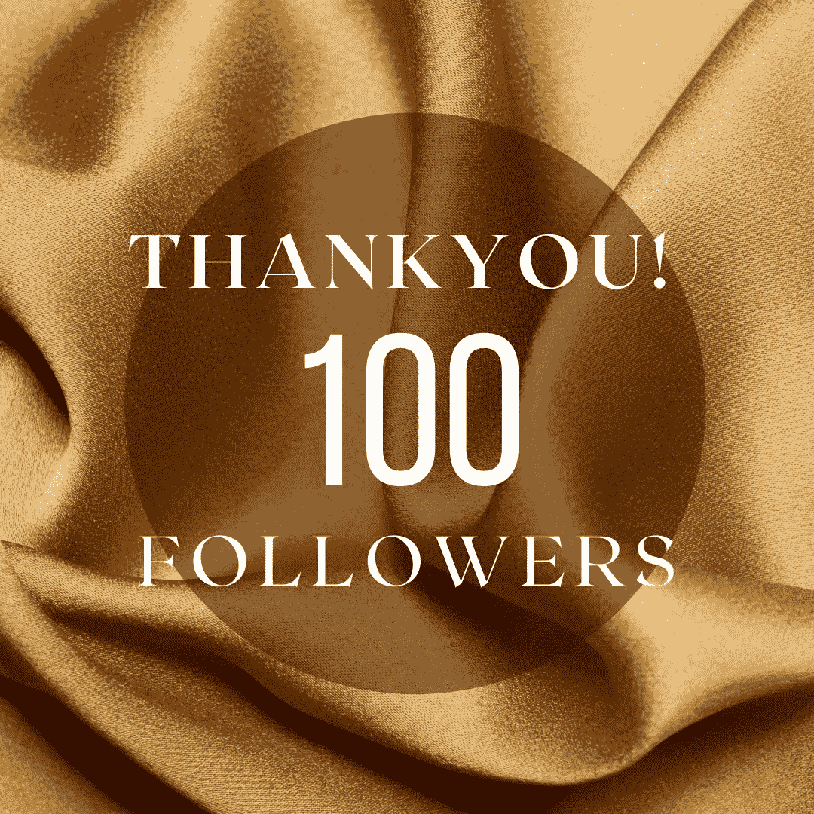

# 100 名密码爱好者追随者

> 原文：<https://medium.com/coinmonks/100-crypto-enthusiast-followers-950c00b6baf3?source=collection_archive---------54----------------------->

我哥哥问了我一个简单的问题:你写得相当好吗？他问我。为什么你找不到他追随的 100 个追随者？嗯！

所以，我想把这个问题传递给你，我在媒体上写了更多的密码，尽管我经常在我的推特上写诗——因为我倾向于写短诗。我想请密码社区回答我哥哥问我的问题，并跟着我。

所以我现在是一个探索中的探索。感谢[诺丽](/ways-to-increase-your-followers-number/100-followers-i-am-helping-new-writers-to-get-100-followers-6df1f20ba2a)和她的朋友们——谢谢你们，给了粉丝们支持。

交给你的秘密社区。

> 加入 Coinmonks [电报频道](https://t.me/coincodecap)和 [Youtube 频道](https://www.youtube.com/c/coinmonks/videos)了解加密交易和投资

# 另外，阅读

*   [3 商业评论](/coinmonks/3commas-review-an-excellent-crypto-trading-bot-2020-1313a58bec92) | [Pionex 评论](https://coincodecap.com/pionex-review-exchange-with-crypto-trading-bot) | [Coinrule 评论](/coinmonks/coinrule-review-2021-a-beginner-friendly-crypto-trading-bot-daf0504848ba)
*   [莱杰 vs n rave](/coinmonks/ledger-vs-ngrave-zero-7e40f0c1d694)|[莱杰 nano s vs x](/coinmonks/ledger-nano-s-vs-x-battery-hardware-price-storage-59a6663fe3b0) | [币安评论](/coinmonks/binance-review-ee10d3bf3b6e)
*   [Bybit Exchange 评论](/coinmonks/bybit-exchange-review-dbd570019b71) | [Bityard 评论](https://coincodecap.com/bityard-reivew) | [Jet-Bot 评论](https://coincodecap.com/jet-bot-review)
*   [3 commas vs crypto hopper](/coinmonks/3commas-vs-pionex-vs-cryptohopper-best-crypto-bot-6a98d2baa203)|[赚取秘密利息](/coinmonks/earn-crypto-interest-b10b810fdda3)
*   最好的比特币[硬件钱包](/coinmonks/hardware-wallets-dfa1211730c6) | [BitBox02 回顾](/coinmonks/bitbox02-review-your-swiss-bitcoin-hardware-wallet-c36c88fff29)