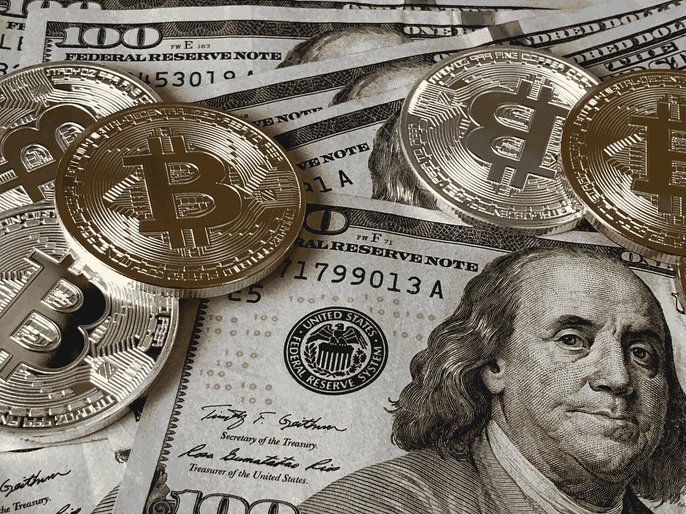
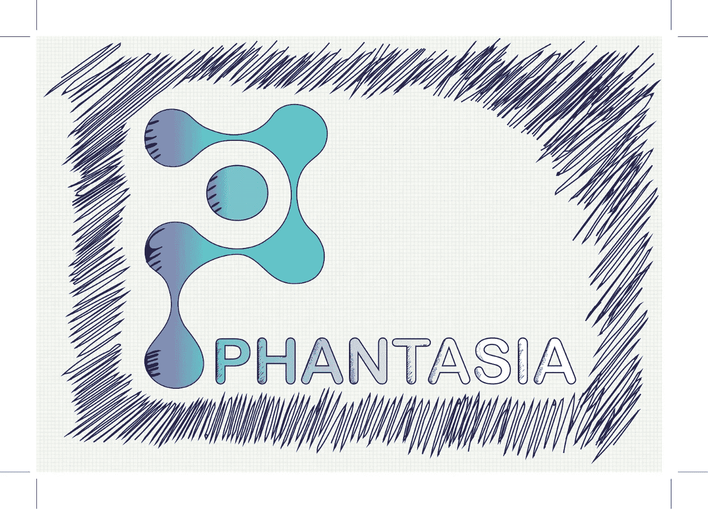
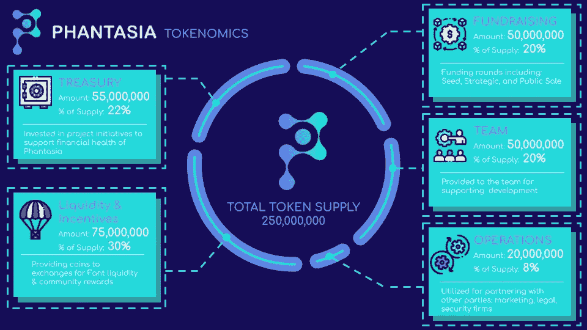

# 100 到 1000 倍的登月梦想(第一部分)

> 原文：<https://medium.com/coinmonks/100x-to-1000x-moonshot-dream-part-1-47bed2fe4996?source=collection_archive---------5----------------------->

*关注我的* [*Twitter*](https://twitter.com/observer_kel) *和*[*Medium*](/@keltheobserver)*，订阅我的免费* [*简讯*](https://cbresearch.substack.com/) *获取更多关于 Web3、NFTs 和 crypto 的前瞻性思想和 alpha。*

有句话说得好，“下一个周期的 100 倍项目是你没听说过的。”

虽然这是一个合理的说法，但在上一个周期和熊市期间，有几个独特的项目尚未达到 100 倍至 1000 倍，这也是合理的。

考虑到这一点，我会一直提倡适当的风险管理。将一生的积蓄用于登月计划很可能是通往雷克特维尔的单程票。

是的，有很多人把他们的积蓄投资在一枚硬币上，并获得了 1000 倍的回报。

但是对于这些故事中的每一个，可能还有 1000 多个关于痛苦和不幸的故事。

因此，我谨慎地接受任何项目；我没有拿 shill 当报酬，我只是喜欢上了它，并在脑子里对风险/回报进行了评估。

还有，这不是理财建议。

尽管如此，如果一个人把 100 美元投资在一个能做 100 倍的项目上，那就是一万美元。如果它做 1000 倍，甚至更好，那是一个疯狂的 100，000 美元。

这些登月计划很难实现，需要很大的运气。根据你的个性，放弃 5 倍甚至 10 倍的利润也很难。

最好的登月项目是那些你只投入很少的资金，然后就忘记了的项目。

举个例子，当 Matic/Polygon 在 0.02 左右时，我给它分配了 500。那是 25，000 马克。我获利 2 倍，认为我是一个精明的投资者。

想象一下骑着这个数字到 2.00？从 500 美元的投资中得到整整 50000 美元。但是我有勇气坚持到那时吗？可能没有，我没有。

因为上面的经历，我对获利水平做了有根据的猜测，然后我把这个数字减半，这就是我的新水平。

项目继续运行没关系；早点止盈，总比不止盈骑到零好。

我也尽可能的把我的初始投资拿出来；令人惊讶的是，它给人一种信念，让人们可以毫无顾虑地把硬币留在新 ATH 或归零。但是永远记住要获利。

那么，我正在寻找的项目有 100 到 1000 倍的潜力吗？目前，我有两个。但我不会给每个人分配超过 500 英镑的钱。我会假设这是损失的钱，直到我获利或收回我的初始资本。

**幻影**

鉴于 STEPN 的显著发展，弥合了现实世界和加密/虚拟之间的差距，我们已经看到了类似应用的潜力。

在这一点上，令牌经济学和庞兹经济学真的没有太大关系，市场会搞清楚的。

我们所看到的是“零售商”利用模糊底层区块链层的应用程序参与奖励激励计划的偏好。

如果一个应用程序奖励用户的多巴胺点击量，并且足够简单，那么它是否与区块链协议交互就真的无关紧要了。

只要它易于使用，用户得到回报，并且有一个用户友好的菲亚特到加密的入口，用户就会来。

此外，鉴于 GameFi 在上一个周期中的突出地位，利用这种叙事结合现实世界桥接“零售”用户的项目有着巨大的机会。

我认为 Phantasia 可以成为这样一个应用程序。

Phantasia 及其 FANT token 旨在将 Web3 的愿景带入 200 亿美元的梦幻体育市场。

Phantasia 是一个区块链驱动的点对点幻想运动平台。该平台是在幕后的索拉纳区块链上运行的 iOS 或 Android 应用程序。

用户可以轻松地用他们的电话号码、电子邮件或现有的 Solana 钱包注册，与他们的同龄人比赛，找到涵盖他们最喜欢的运动的比赛，选择球员，跟踪现场比赛，发起付费比赛并赢得奖品。

比赛包括职业棒球大联盟、NBA、NFL、EPL 和 DFS。

为了评估 Phantasia 的潜力，人们必须将该项目与流行的幻想体育和体育博彩公司 DraftKings 进行比较。

2021 年 9 月，DraftKings 拥有约 883，000 名月独立用户。它的年收入从 2013 年的 300 万美元增长到 2021 年的 13 亿美元(我估计这可能是由于移动应用交付和移动技术的进步)。

如果 Phantasia 只获得了 DraftKings 月独立用户数的 1%，那就相当于 8，830 个月独立用户。

获得类似的收入百分比相当于每年 1200 万美元。

与 DraftKings 不同，Phantasia 渴望完全去中心化，它试图通过提供 FANT token 作为激励来实现这一目标。

Phantasia 还利用 NFT 的宣传，为用户提供定制玩家卡或游戏中身份的能力，以及来自市场的 NFT。

老实说，区块链空间中的许多项目都不需要令牌。由于散户投机，代币帮助开发团队资助项目。尽管如此，这是一种通过激励参与来分散权力的直接方式。

开发团队试图使令牌成为一个实用工具和治理令牌，通过参与竞赛和购买 NFTS 获得。

隐秘的熊市和风险投资的授权时间表彻底摧毁了 FANT 的股票价格。价格下跌了近 90%，历史价格图类似于可怕的索拉纳生态系统“只跌不涨”模式。给那些买了顶的人。

如果该项目在熊市中幸存下来，团队实现了他们的愿景，并且 iOS 和 Android 应用程序获得了牵引力，Phantasia 可能会对 STEPN 采取类似的行动。

不过要小心行事；不要把房子再抵押，不要动用存款，也不要拿家庭农场做赌注。一切都可能化为乌有。如果它发生在 Luna 身上，它也可能发生在任何项目上。

因此，我不会分配超过 250 的代币。这不是财务建议，我只是在讨论我的个人计划。

在撰写本文时，FANT 的最大供应量为 2.5 亿份，目前的流通供应量接近 7200 万份。目前完全摊薄后的估值约为 600 万美元。因此，如果这个项目有朝一日拉动一个台阶或一个无限轴，我们可以看到 100 倍到 1000 倍。但我估计，人们可能会忘记他们拥有这种代币，只是有一天会发现每个 FANT 代币的价格约为 2 美元或 20 美元。一个人只能做梦。

注意风险投资的授权时间表和他们在象征性私人销售中支付的价格；你不想退出流动性。

这是我的看法，小心行事。如果成功了，这可能是一次登月。

***免责声明*** *:本文提供的信息并非财务建议。您选择如何处理这些信息完全是您的责任。加密货币是不受监管且高度不稳定的资产，极有可能出现超过 100%的资本损失。*

> 加入 Coinmonks [Telegram group](https://t.me/joinchat/Trz8jaxd6xEsBI4p) 学习加密交易和投资