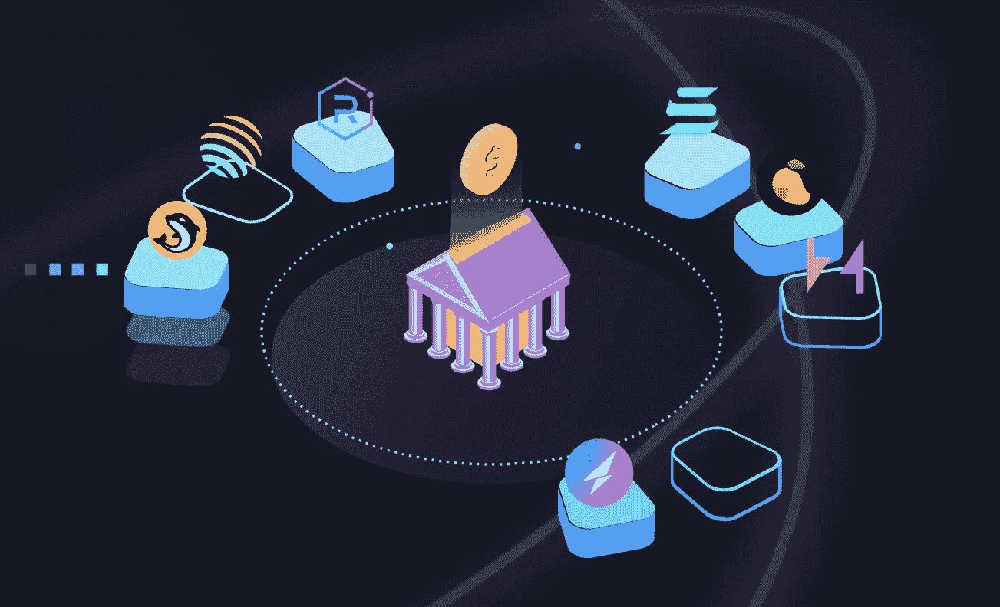
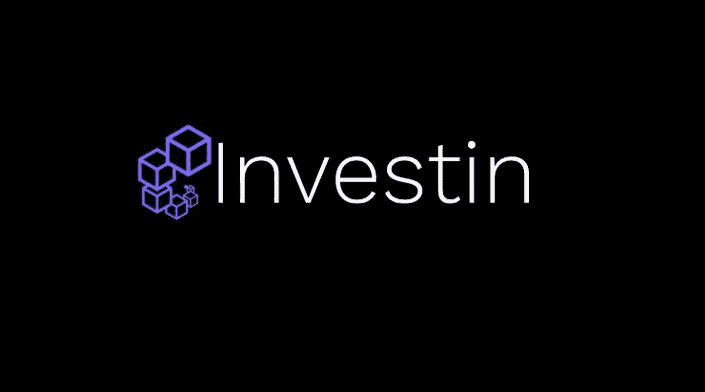

# 100 倍到 1000 倍的登月梦想(下)

> 原文：<https://medium.com/coinmonks/100x-to-1000x-moonshot-dream-part-2-a8fd5bd433c8?source=collection_archive---------14----------------------->

在这个由两部分组成的系列的第一部分中，我讨论了点对点分散式梦幻体育项目 Phantasia 及其 FANT token 做 100x 到 1000x 的可能性。

请注意，这是高度推测性的，可能不会发生。它可能会像建在月球上的房子一样倒塌。对不起那些遭受痛苦损失的人。

如果星星排成一线，项目团队交付成果，iOS 和 Android 应用程序吸引零售商的注意力，这一切都有可能发生。但不要拿你一生的积蓄做赌注，因为风险管理至关重要。

在本文中，我将讨论另一个我在 crypto casino 漫步时发现的令人兴奋的项目——Investin Pro。

Investin Pro 是一种分散化的基金管理协议，使任何人都可以在索拉纳区块链上以无信任的方式投资或创建对冲基金。

交易者可以启动他们的基金，而不用担心投资者的资产托管，投资者可以探索最适合他们投资策略的基金——存放加密资产的连锁金库。

只有投资者可以提取他们的存款，因为智能合同持有资产，产生一个令牌，作为他们原始存款的收据。

本质上，投资者将 IVN 令牌存入智能合约库，收到确认令牌，他们可以将其发送回库或基金以结束他们的投资。这一行动将回报他们的投资以及计算的利润或损失。

只有负责部署金库或资金的合同地址可以与存款进行交易。

该项目首先在币安智能链上启动，但迁移到了索拉纳区块链，以利用高交易速度和低交易成本。

> 加入 Coinmonks [电报频道](https://t.me/coincodecap)和 [Youtube 频道](https://www.youtube.com/c/coinmonks/videos)了解加密交易和投资

Investin Pro 在提供 DeFi 对冲基金参与方面具有独特的价值主张。经验丰富的交易员和基金经理可以利用该平台聚集投资资本，通过娴熟的交易和精明的基金管理获利。他们可以制定定制策略，参与各种 DeFi 活动，如农业、赌博、贷款、借款和保证金交易。

具体而言，基金经理可以创建一篮子交易令牌(ETF)，在多个 AMM 中提供流动性，并通常以非托管和分散的方式参与盈利的链上活动。

同样，投资者可以评估符合其风险承受能力的基金经理和基金，选择谁来管理他们的资产，并通过将资金分配给他们认为表现最佳的经理和交易员来赚取利润。

我认为 Investin Pro 有两个机会。首先是价值累计机制。投资者和基金经理可以制定策略，通过交易、下注、做市和许多其他策略在牛市或熊市中获利。第二种更投机。如果该项目被采用，鉴于只有大约 9，000，000 个令牌，并且市值小到足以成为微微市值，有可能达到 100 倍到 1000 倍。这种推理考虑了大量用户采用和令牌稀缺，但这种思路是高度投机的。以上是我的想法，不构成理财建议。如果我决定购买代币，我可能不会分配超过 500。

尽管来自 DYDX、UniLayer、Perpetual Protocol、PsyOptions 和类似协议的竞争日益激烈，但我的策略依赖于用户采用率的增长。iOS 和 Android 上的可访问性以及底层区块链层的模糊化——与 STEPN 相同——可能是这种增长的催化剂。

该项目的团队旨在超越其加密起源，正如该团队的一篇博客帖子中所述，并计划提供新的功能，包括结构化产品、到期期权和期货交易。这些计划可能是上面提到的催化剂。

该团队最近在一轮融资中筹集了 120 万美元，GSR 和 3KVC 是领投人。对于一个由五名开发人员组成的小组来说，这次融资意义重大，他们的社交媒体足迹很小，不过他们在 LinkedIn 上有个人资料，这给这个项目增加了一些可信度。

尽管如此，在秘密赌场里还是要小心行事；我可能会做一个小的分配，并认为这笔钱是“损失”的，直到我收回我的初始资本或该项目做了重大的倍数。

虽然 Investin Pro 具有先发优势，但也有资金更充足的项目，如 DYDX、Perpetual Protocol、PsyOptions 等。此外，对于一个小团队，考虑到他们正在做的协议优化和博客帖子的数量，人们必须想象他们是捉襟见肘的。这些更新是乐观的，但团队必须扩大以保持领先或与更新的协议竞争。普通密码市场也仍然是一个巨大的风险；我们可能正处于熊市。如果这种情况持续下去，我们可能会看到资金不足的小团队项目变得默默无闻。

*关注我的* [*Twitter*](https://twitter.com/observer_kel) *和*[*Medium*](/@keltheobserver)*，订阅我的免费* [*简讯*](https://cbresearch.substack.com/) *获取更多关于 Web3、NFTs 和 crypto 的前瞻性思想和 alpha。*