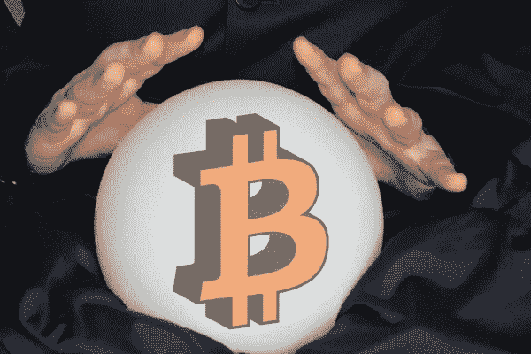

# 105 关于后超比特币化的思考

> 原文：<https://medium.com/coinmonks/105-thoughts-on-post-hyperbitcoinization-6bd5200179f?source=collection_archive---------23----------------------->

## 或者比特币的冲动将如何扩大到未来。

德国版。)

> *未来已经到来——只是分布不均匀。“威廉·吉布森*

无节制的环境破坏、对公民越来越多的监视以及政治极化让一件事变得很清楚:民主正在全世界范围内退化。我们需要一条出路。

我确信比特币是出路。它影响到将重新校准我们民主的最重要的领域。为了说明比特币的影响，同时保持我的想法简短，我将在下面仅涉及它。**只要把这些想法相互结合**就能想象出更加切实的未来。

我的想法集中在那些对我们民主下一阶段至关重要的领域，比如公理。有了这些基本原则，我不要求说服你。不如把它当成通向另一个未来的大门。通过告诉你自己，你就能随心所欲地使用这扇门。自己决定自己想怎么活，就能过门，也能不过门。通过对他人的观点保持开放并与他们妥协，你可以帮助塑造通向未来的大门。

**比特币的引力**

1.)最多可以有 2100 万比特币的额度。

2.)这种限制会影响到的领域:权力、税收、知识、新闻、选举制度和共同福利。

3.)这些地区中的大多数将被迫保存他们的比特币，因为无法创造更多的比特币。

4.)这种稀缺性将导致一种更好的制度变革。

**比特币分配权力**

5.)比特币仍然是世界上人类唯一信任的去中心化货币。

6.)其他密码试图模仿比特币，但无法与之相比。

7.)比特币不相信任何人。

8.)比特币的协议确保所有参与者都遵守网络规则。

9.)比特币通过政治或经济逃避变革。

10.每个人都可以决定把钱花在什么地方，而银行或政府无法阻止他们。

11.)比特币仍然是可靠的货币，包括所有人共同决定其进一步发展。

12.)稀缺将是通胀的唯一原因。

13.)社会技术进步会让比特币通货紧缩。

14.)稀缺性和丰富性决定价格的高低。

15.)价格汇总了有关市场需求的信息。

16.)价格是个人决定如何行动的信号。

17.)价格信号引起人们对人类需求变化的关注。

18.)高价格标志着增长市场，低价格标志着市场饱和。

19.)高利润促进市场竞争。

20.)当地经济是由需求驱动的。

21.)局部决策决定全局行动。

22.)比特币将是主观价值和人类需求的衡量工具。

23.)中央权力分散到个人决策上会带来更多的决策自主权和自我决定权。

**税收引导社会**

24.)比特币支付的匿名性会增加。

25.)没有法定货币，只有 Satoshis 或比特币会在它们的所有者之间交换(没有 KYC)。

26.)当今匿名化的可能性(如 BTC 混合器、匿名交换等。)会改变他们的外表，但不会改变他们的目的。

27.)银行只会存储或出借比特币，却无法凭空创造。

28.)比特币会给各州带来税收损失。

29.)各州将被迫从根本上重新考虑它们的税收制度。

30.唯一可控制的减税形式将是消费税。

31.消费税由各种子税组成(如环境污染税)。

32.)分税将根据奖惩制度决定人类行为。

33.)奖惩系统会实时影响人们的行为。

34.)实时税是社会在购买时对一种产品或服务是否符合他们最大利益的反馈。

35.)例如，如果两台计算机中的一台是以环保方式制造的，而另一台不是，客户可以在环保低价和包括污染税的高价之间进行选择。

36.)再生能源将是有利可图的，因为它可以大量生产，多余的产能可以用于比特币挖矿。

37.)化石能源已经成为过去，因为它价格昂贵，而且会产生二氧化碳，必须为此缴纳环境税。

38.)如果税收收入只惠及少数人而非所有人，公民就会想方设法通过比特币来规避。

39.)如果公民确信他们的社会目的，他们就不会逃避消费税。

40.)为了确保这一点，公民将决定税收——而不是政治家或政党。

41.)实时税将为个人提供价值准则，使他们在目的上团结起来，并作为一个社会保持团结。

**知识竞赛**

42.为了最大限度地降低成本，教育部的工作以及教育系统将以更加分散的方式进行组织。

43.教育部的任务将减少到评估学习成绩和促进教师之间的教学方法交流。

44.)衡量学生的标准将不再是他们记忆的知识，而是他们集体解决问题的能力。

45.)每个老师都会设计并负责自己的课程，因为他们最了解学生的需求。

46.)从公共资助的研究中获得的知识将可以自由获取。

47.上学是一种义务，但学习是一种权利。

48.老师必须确保他们的学生喜欢学习，但不能强迫他们这样做。

49.)这种学习经历将影响员工在公司的合作方式。

50.)组织会减少层级。

51.)还有，因为比特币迫使他们储蓄。

52.)员工会组织成灵活的小组，可以互相重叠。

53.)每组的员工将一起确定即将到来的任务并确定其优先级。

54.)每个员工将能够从那些已经集体优先化的任务中选择他们的任务。

55.)他们将负责完成，其结果将由同事复核。

56.)这将提高学校和企业的效率和福祉。

57.)每天的工作时间将减少到 6 小时以下——而不会有任何工资损失。

58.)比特币将改变学校和企业，让每一个人都可以自由决定自己想如何为社会做贡献。

**非营利新闻业**

59.随着 Satochis 的价值增加，人们会把它们存起来，而不是花在研究不充分的文章上。

60.媒介素养成为公民的义务。

61.)人们会对假新闻发展出第六感。

62.)大多数人会意识到，新闻出版商更感兴趣的是获取利润，而不是发布真相。

63.)增加个人自主性需要值得信赖的信息。

64.)这将导致大众资助的新闻研究服务的增加。

65.)优质新闻成为新闻出版商的生存策略。

66.)非营利记者成为以营利为目的的新闻出版商最大的竞争对手。

67.自主并不意味着什么都要靠自己，而是要建立值得信赖的关系网。

**为话题投票，而不是为人物或党派投票**

68.)比特币将把民主带到一个新的高度。

69.)比特币迫使政客们省钱。

70.)国家机器将会萎缩。

71.)各州持有的比特币数量不足以支持猪肉桶政治。

72.)这种重组将产生一个社会，其公民收集思想、目标和主题，以便在自由选举中做出决定。

73.选举制度将从选举政党/政治家转变为选举下一个立法期的工作议题。

74.税收收入将只用于资助那些大多数人认为有意义的主题。

75.)在有意义和可能的地方，新法律会自动成为奖金税的智能合约。

76.)法律只有在造福大多数人的时候才会持久。

77.)独裁统治将会消失，因为如果没有对比特币的控制，它们将会变得贫穷。

78.)直接民主将取代议会民主。

79.)个人观点汇集成大多数人支持的社会目标。

**为了共同福利的自决**

80.)比特币削弱了经济政策，促进了按需经济。

81.税收用于资助选定主题的实施和社区基础设施。

82.)比特币促进可持续发展，这意味着每一代人的生活都是以自己为代价，而不是以后代为代价。

83.)比特币会奖励储蓄，但不会奖励继承。

84.)比特币将促进其平等分配，以此作为对自动化和人工智能导致工作岗位流失的反应。

85.)比特币会给每个人带来一个世界性的无条件基本收入。

86.)一个世界性的无条件基本收入将协调全世界的价格。

87.)这将抵消公司和工作向不发达国家的迁移，以及对不发达国家的剥削。

88.无条件的基本收入将导致有尊严的自决，因为没有人必须为生计而工作。

89.每个人都将能够有尊严地决定什么对他们最有利。

90.)这包括在每次购买时选择价格不同的同等产品。

91.)越贵的产品包含越多的实时税，因为它们会给社会带来危害。

92.)无条件的基本收入将充当个人风险资本，推动社会和技术进步。

93.)无条件的基本收入会激励人们去完成伟大的事情留下自己的名字而不是一笔财富。

94.)无条件的基本意志给予每个公民选择的自由和为了社会利益的自决。

**比特币制造骗局**

95.)比特币的特点从 2100 万的限额开始，一直到它的民主演变，都让货币变得更加稀缺。

96.)因为比特币不可能凭空造出来，不同的地区就要存钱。

97.紧缩压力将导致社会重组。

98.)这一重组将把政府的中央集权任务交还给公民。

99.这种权力下放为了社区的利益促进了自决。

100.)这，我称之为 Spoconism。

101.)这个词是由拉丁词 spontaneitas 和 conducibile 组成的，意思是:为了共同利益的自主行动。

102.)我错过了什么？

103.)比特币还能把我们带到哪里？

104.)有什么想补充的？

105.)比特币是为了 Spoconism。

***

我的 10，076 个字符给了你新的见解吗？通过闪电捐赠来纪念他们。你想从我这里读到更多？用几只小智支持我的工作。理解需要时间。你的提升让我有时间整理思路，写下来。

Lightning address: LNURL1DP68GURN8GHJ7MR9VAJKUEPWD3HXY6T5WVHXXMMD9AKXUATJD3CZ7CTSDYHHVVF0D3H82UNV9UMNYWFNC2GDKG

***

## 目录

I)摘要:[金钱的社会影响力](/p/the-social-influence-of-money-b3703cc2d528)

II)问题描述:[比特币 FUD 的后果](/p/consequences-of-the-bitcoin-fud-1814ac512c16)，[法定货币和比特币的不平等分配](/p/the-unequal-distribution-of-fiat-money-and-bitcoin-56d56bf5f03c)

III)愿景:关于后超比特币化的 105 种想法

四)解决方法: [14 个理由，为什么比特币导致无条件的基本收益](/@ELTankred/14-reasons-why-bitcoin-leads-to-an-unconditional-basic-income-fa44a43fb75e)