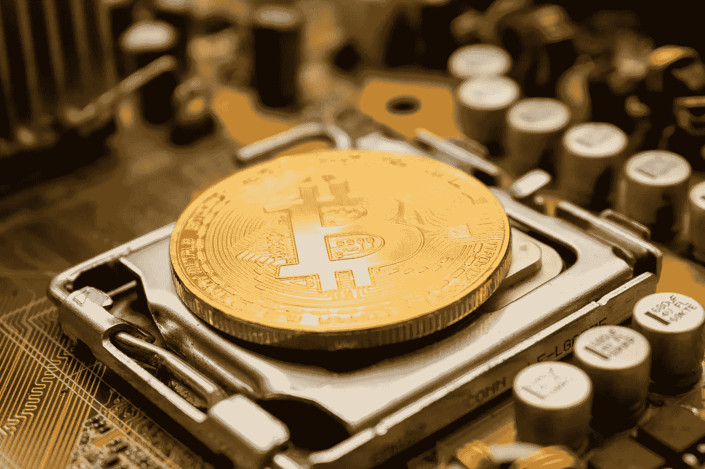

# 比特币今天面临的 12 个最大问题？

> 原文：<https://medium.com/coinmonks/12-biggest-issues-facing-bitcoin-today-eae1e08a34a7?source=collection_archive---------18----------------------->

Source: Unsplash.com

许多人认为比特币注定会被主流采用，但事实可能截然不同。我们不能否认有一天加密货币会飙升到前所未有的受欢迎程度，它将颠覆当前的金融系统，成为新的统治货币。不受央行监管的数字货币将让社会受益匪浅，但这不会马上实现。

在成为世界主导货币之前，比特币必须找出并克服阻碍其成为主导货币的问题。为了提供最好的比特币体验，当前的问题必须得到解决。

> **另见:** [**比特币是通胀的避风港吗？**](/coinmonks/is-bitcoin-a-haven-from-inflation-7a05e709aaf3)

**比特币如何运作？**

Source: [https://news.bxmi.io/](https://news.bxmi.io/)

人们使用比特币来买卖商品和服务，因为它被广泛接受为一种交换媒介。

比特币是中本聪自 2009 年推出以来的第一种加密货币，他是在目睹了最近次贷危机期间货币政策造成的灾难后决定这样做的。为了避免依赖中央机构，如银行，比特币采用加密来提供安全性，因此不需要中央机构。

这一切之所以成为可能，是因为区块链，一种记录所有交易的分类账。因此，防止了欺诈行为，例如试图重复消费。

比特币和法定货币的不同之处在于，一个国家可以继续制造钞票来偿还债务，尽管这样做会对经济产生不利影响。说到比特币这样的加密货币，总供应量只有 2100 万。

即便如此，我们还没有达到这个上限，一个被称为采矿的过程每天都在创造新的硬币。作为挖掘过程的一部分，复杂的数学算法由强大的计算机解决。矿工的努力会得到比特币形式的补偿。

> [**另见:需要用 Bitxmi 交易所交易的 8 个理由。**](/coinmonks/8-reasons-you-need-to-trade-with-bitxmi-exchange-c4bff2ab3096)

参与的人越多，求解计算方程的难度就越大。一直到 2100 万硬币用完的那一刻。

这表明该系统如何抵御通货膨胀、经济危机和其他与干预经济相关的限制，因为没有实体可以直接影响它。

2008 年，随着比特币的推出，中本聪提出了一个解决数字货币重复支出问题的方案。

**比特币特有的问题**

Source: Pixabay.com

1.  **可扩展性:**

由于比特币难以规模化，它无法在其网络上存储海量的交易数据。由于块大小限制为一兆字节，比特币网络每秒只能处理三笔交易。你用比特币进行的交易越多，花费的时间就越长，即使你是从最方便的来源获得的。交易完成的速率不变。

**“区块链可扩展性？”到底什么是可伸缩性？**

可伸缩性是一个在爱好者中变化很大的词语。可伸缩性被定义为无论在任何给定时间有多少人在使用系统，都能够提供出色的用户体验。系统可伸缩性是系统在最基本的意义上增长的能力。举例来说，一个网络或服务器可以在计算机中以多种方式来处理不断增长的需求。区块链接受额外用户的能力称为可伸缩性。不可避免的是，随着更多的用户，区块链将会看到更多的“竞争”活动和交易。

> **另见** [**:比特币是很好的通胀对冲工具吗？**](https://news.bxmi.io/crypto-news/is-bitcoin-a-good-hedge-against-inflation)

为了与传统的支付处理技术竞争，区块链网络必须高度可扩展。每秒可以处理几笔交易的区块链的例子有比特币和以太坊(TPS)。相比之下，Visa 的 VisaNet 网络能够处理 24，000 TPS。这些区块链网络的可伸缩性正由各种各样的开发者进行研究。

可伸缩性是阻止区块链接受流行的遗留服务的最重要的问题。为了让比特币和以太坊这样的区块链网络起飞，它们必须能够快速处理交易。

**2。没有内在价值**

如今加密货币最严重的问题之一是它没有内在价值。这是一个在投资者中流行的词，用于根据公司的资产和负债来评估公司的价值。这将比特币转化为一种商品，因为其价格完全由需求和购买者愿意为每单位支付的金额决定。这是一个具有挑战性的问题。因为根据定义，它没有内在价值，它的价格将永远由供求关系决定，这使得价格预测极其困难。

**3。使用方便**

尽管近年来购买、出售和使用比特币变得简单了很多，但它还不够用户友好，不足以鼓励广泛使用。一旦在比特币基地这样的比特币交易所开设了账户，用户就需要连接借记卡或信用卡(这通常需要额外的费用)，并等待交易结算许多天。

像 Square 这样的第三方组织和其他类似的公司可能会通过进入比特币行业来解决这个问题。换句话说，如果能够使用 Square Cash 这样的应用程序购买比特币，那么更多不了解技术的人可以进入数字货币领域，数百万人已经在使用这种应用程序。

**4。高度的不可预测性(波动性)**

由于比特币不受约束的波动性的名声，许多新投资者不愿意参与其中。市场波动越大，相关的风险和回报就越大。

如果波动性很小，投资者不会亏损或赚很多钱。对于投资者来说，这些极度波动的时期提供了一个绝佳的机会，可以通过以高于当初购买时的价格出售资产来获利。

然而，比特币的巨大波动性导致人们在几个小时内损失了数百万美元，但许多人也因此成为了亿万富翁。比特币的波动性是一把双刃剑，它可能会帮助你赚很多钱，也可能会让你更容易失去一切。谨慎的做法是在投资比特币等波动性较大的资产时保持谨慎，并在做出任何决定之前进行广泛的尽职调查。

**5。对低技术用户来说不舒服**

对于我们中的许多人来说，我们需要做的只是阅读一些提示，下载一些软件，然后开始交易比特币。然而，许多人，尤其是上一代人，很难使用这项新技术。因此，他们对银行或政府不支持的东西有一种排斥感，而这些东西已经成为他们生活的一部分。

许多人无法使用它，因为这样做需要一系列复杂的先决条件。遗憾的是，他们被未来拒之门外。因此，社区必须努力改善行业教育，促进比特币和其他加密货币的使用。

**6。交易需要很长时间**

比特币区块中包含的交易在十分钟或更长时间后得到确认。因此，我们必须等待汇款确认后才能收到我们急需的产品，这是一个重大挫折。比特币缺乏即时可兑换性，使得其流动性不如其他金融产品。

然而，有许多方法可以解决这个问题。有些支付处理者首先在链外执行交易，确保即时支付，并具有高度的安全性和隐私保护。

另一方面，SegWit 和 Lightning Network 正试图实现同样的目标。

**7。税收和执法问题**

比特币没有税收或监管的法律框架。因为加密货币太新了，政府很难弄清楚应该如何处理它。世界上许多国家作为这一领域的先驱采取了行动，每个国家对这一问题都有自己独特的做法。

为了让个人开始利用加密货币，必须有一套明确和最低限度的规则来规定他们如何才能这样做。这意味着可能出现的问题以及可能的补救措施都有很好的记录。但是要达到这个目标，你必须在一个全新的行业中经历一个复杂的过程。

这些技术在美国(包括美国)、日本、加拿大和以色列等国家仍然可用。另一方面，玻利维亚、厄瓜多尔、中国和摩洛哥等国家抵制这种新的经营方式。

总而言之，政府必须想出如何对数字货币征税。对于不确定如何继续的人来说，这是一个关键问题。管理加密货币没收的法律将随着加密货币经济的增长和发展而变化。比特币的税收没有得到适当的监管。因此，某些人可能更容易逃避纳税。如果你出售比特币赚的钱比你花在这上面的钱多，你必须将差额计入你的应税收入。每次执行交易时，你都必须披露购买价格和购买比特币的成本之间的差异，这可能很耗时。

**8。没有找回被盗比特币的方法论。**

如果您的信用卡或银行帐户有问题，支持这些服务的组织可以帮助您。然而，在比特币的情况下，被盗的货币是不可挽回的损失。

不幸的是，没有办法拿回你的比特币，这对任何犯了小错误的人来说都是一个可怕的消息。

然而，这种加密货币和其他加密货币的所有者不必绝望，因为有可靠的存储技术可以帮助他们避免这些问题。硬件钱包是一种既方便又安全的方式来保护你的钱。

说到保护加密货币的安全，有许多公司提供保险库服务。如果钱包丢失，可以使用备份来恢复访问。谨慎的投资者总是欢迎我们能采取的任何行动。

**9。零售是不可能的。**

这个问题源于前面讨论过的两个因素:呆滞交易和高佣金。这使得我们很难坐在餐馆里点几美元或几欧元的比萨饼，因为佣金会吃掉账单的很大一部分。此外，我们必须等待 10 分钟才能确认我们的交易，这使得许多经济活动无法进行。

人们必须等待几天甚至几周才能将比特币放进钱包，所以这 10 分钟是最好的情况。正因为如此，有第三方服务处理器在这个过程中充当中介。

10。变化率

比特币同样面临价格波动的问题。个人永远不知道会发生什么。比特币价值的增加可能会让投资者受益。然而，如果比特币要实现广泛采用，它必须是稳定的。稳定是 it 发展成为可靠的价值来源的必要条件。货币价值的快速变化将降低其被广泛采用的前景。

**11。比特币日益增长的能源需求**

在过去几年中，开采比特币所需的电量已经成为一个激烈辩论的话题。按照设计，比特币是一个非常耗能的过程，因为在没有第三方参与的情况下，完成其促进金融交易的主要功能(点对点)需要大量的哈希计算。电是所有这些计算的主要能源。与爱尔兰(3.1 千兆瓦)和奥地利等国家相比，比特币网络目前消耗的电力估计为 2.55 千兆瓦，未来可能为 7.67 千兆瓦(8.2 千兆瓦)。根据经济研究，比特币的耗电量预计将在这个数字附近上升。

因为比特币的设计是在不使用中间人(点对点交易)的情况下发挥作用，所以这是一个设计上消耗大量能量的过程。电是所有这些计算的主要能源。

**12。国家调控**

为了应对比特币和其他加密货币，世界各国政府以各种方式做出了反应。一个恰当的例子是，一些政府似乎对比特币不感兴趣，而另一些政府则完全持敌对态度。因此，交易员和投资者密切关注世界各地的动态。

国际货币基金组织(IMF)总裁克里斯蒂娜·拉加德(Christine Lagarde)最近表示，对数字货币的国际监管是不可避免的。

尽管韩国禁止比特币交易，但该国表示不会阻碍加密货币的交易。出于税收目的，比特币等虚拟货币被美国国税局(IRS)归类为无形财产。结果，比特币所有者被征收资本利得税。

**结论**

正如你将看到的，比特币远非理想，有一系列你应该知道的缺陷。事实上，他已经取得了很大的成就，并且有潜力在未来取得更大的成就。其广泛的应用可以对我们的生活产生深远的影响。

我们希望本指南为您提供了所需的信息，以便您在未来做出更明智的决策。

> [每天关注 Bitxmi 新闻，了解最新的加密货币新闻。](https://news.bxmi.io/)
> 
> [加入 Bitxmi 交易所，以极低的费用交易超过 144 种资产。](https://www.bitxmi.com/en_US/)

***免责声明:*** *Bitxmi 博客是一个新闻平台，不提供财务建议。Bitxmi 的作用是让加密货币和区块链社区了解该行业的最新动态。在进行任何投资之前，请进行自己的研究。Bitxmi News 将不对任何财务损失承担责任。*

> 加入 Coinmonks [电报频道](https://t.me/coincodecap)和 [Youtube 频道](https://www.youtube.com/c/coinmonks/videos)了解加密交易和投资

# 另外，阅读

*   [分散交易所](https://coincodecap.com/what-are-decentralized-exchanges) | [比特 FIP](https://coincodecap.com/bitbns-fip) | [宾邦评论](https://coincodecap.com/bingbon-review)
*   用信用卡购买密码的 10 个最佳地点
*   [加拿大最佳加密交易机器人](https://coincodecap.com/5-best-crypto-trading-bots-in-canada) | [Bybit vs 币安](https://coincodecap.com/bybit-binance-moonxbt)
*   [阿联酋 5 大最佳加密交易所](https://coincodecap.com/best-crypto-exchanges-in-uae) | [SimpleSwap 评论](https://coincodecap.com/simpleswap-review)
*   [购买 Dogecoin 的 7 种最佳方式](https://coincodecap.com/ways-to-buy-dogecoin) | [ZebPay 评论](https://coincodecap.com/zebpay-review)