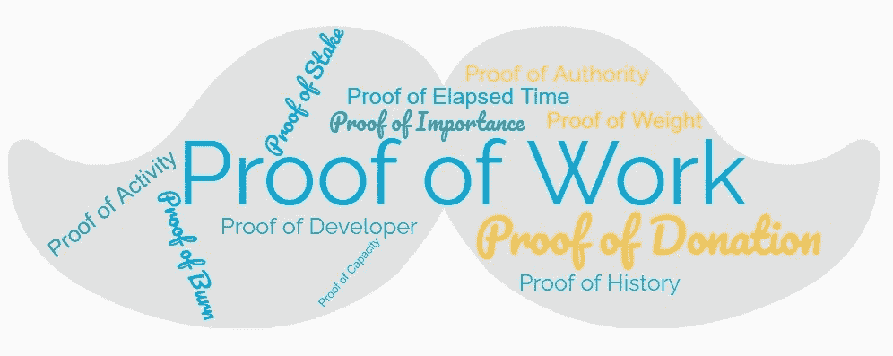

# 12 个区块链共识机制揭秘

> 原文：<https://medium.com/coinmonks/12-blockchain-consensus-mechanisms-demystified-73179d35b59f?source=collection_archive---------4----------------------->

## x 的证据到底是什么？

Blockchain Consensus Mechanisms

# **#1 —活动证明(PoA)**

活动证明(PoA)结合了工作证明(PoW)和利益证明(PoS)共识模型的最佳特性。

*   **采矿块:**采矿块用 PoW。矿工互相竞争解决密码难题和…