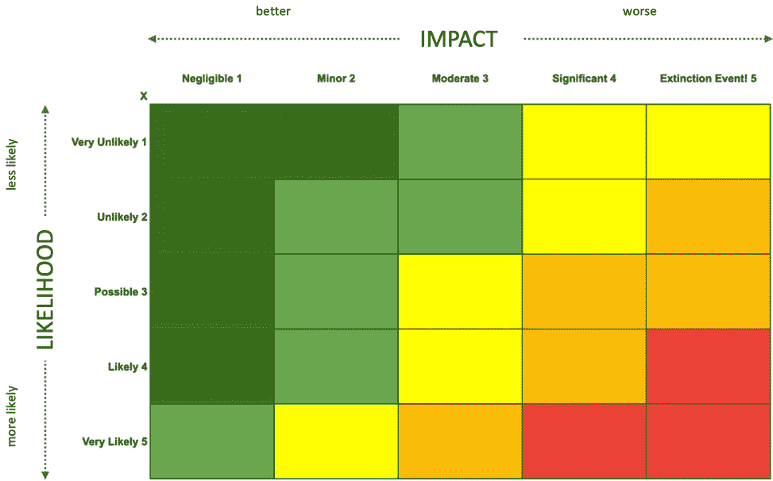
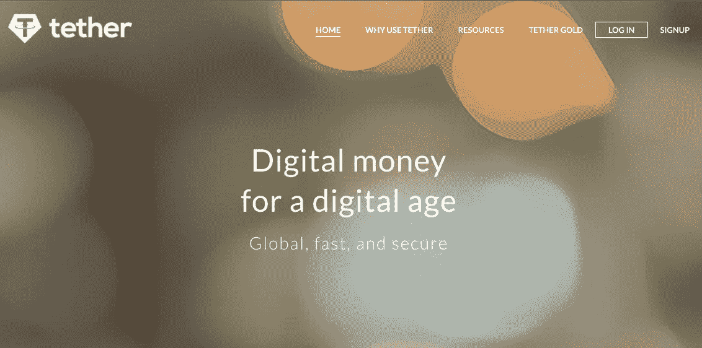

# 13 种毁灭性的加密风险将加密货币的价值推向熊市

> 原文：<https://medium.com/coinmonks/13-devastating-crypto-risks-that-are-driving-cryptocurrency-values-deep-into-bear-market-territory-3fcf1956f258?source=collection_archive---------1----------------------->

Graphic from the EthereumFear Index. Source: [Twitter](https://twitter.com/EthereumFear).

## 加密和 NFT 市场风险很大

## 对影响您当前投资的主要宏观加密风险的详细评估。

请注意，这只是我的半知半解的观点，而不是 crypto 的唯一风险。这是 ***而非财务建议*** *请* ***在对您的投资组合进行任何投资或变更之前，做好自己的研究*** *。*

从政府监管和大公司到名人微博和碳排放，隐藏风险的清单很长，而且似乎每天都在增加。

在这篇文章中，我深入研究了影响 crypto 的*关键宏观风险*的细节，以及如何减轻这些风险。

我用一个简单的风险评分矩阵将它们按风险加权顺序从最严重到最轻微列出，如下所述。

# 风险矩阵

每种风险都是由平均发生在你身上的风险的*可能性* *或*与发生在你身上的风险的*影响*来绘制的。当这些数字相乘时，会给出一个单一的*风险分数*，它允许风险按照*破坏*的顺序排列。

The risk scoring table I used to rank each risk by likelihood and impact.

按风险评分破坏程度排列的风险——风险评分越高，破坏程度越大:

Macro crypto risks ranked by risk score — and yes, an Elon Musk tweet is a real risk!

本文的其余部分详细讨论了每种风险以及潜在的缓解措施。

# TL；速度三角形定位法(dead reckoning)

对于一些人来说，加密技术是一项很好的投资，自从 NFT 出现以来，它变得很酷，很有趣，但正如当前的加密熊市所示，风险也很大，因此更好地理解它们并尽可能减轻风险是值得的。

区块链技术及其相关硬币能否在当前十年以及未来继续存在，在很大程度上取决于每个区块链能在多大程度上创新并适应监管、气候和公用事业的三重挑战。停滞不前根本不是一个选项。

好了，话虽如此，让我们开始冒险吧！

## 想帮忙吗？

> 如果您喜欢这篇文章，或者它挑战了您的想法，并且您还没有一个允许您无限制访问所有媒体文章的媒体订阅计划，请考虑使用我的 [**链接**](https://mrnewq.com/membership) 进行注册。如果你这样做，我可能会收到一点版税。

# 风险#1:监管/cdbc

Government regulators cracking down on [crypto](https://www.bloomberg.com/news/articles/2021-09-24/china-deems-all-crypto-related-transactions-illegal-in-crackdown) hurts.

## 得分:5 x 4 = 20(极端风险)

## 有什么风险？

*政府对加密技术过于严厉，通过不适当且繁琐的监管和税收来抑制大众的创新和吸收。*

中央银行的数字硬币(CDBCs)证明了它们是唯一稳定的硬币，并打算消灭 USDC 和泰瑟这样的竞争对手。

## 描述:

R 监管和税收并不是什么新鲜事，就连世界上最大的密码交易所【】币安的创始人兼首席执行官赵昌鹏也对此听之任之。

在许多行业，监管需要阻止洗钱者、骗子和价格欺诈者利用不太成熟的市场参与者，重复过于激进的商业模式做法，以及避免过去的庞氏骗局。

至少，这是乐观的观点。

悲观的观点认为，监管就像看门人一样保护现有的市场参与者，如传统的金融服务业和政府中央银行，从而阻止新的和破坏性的进入者进入市场。

The total power used by computers for Bitcoin mining in 2019 and 2021, by country. Source [Statista](https://www.statista.com/chart/25969/bitcoin-mining-hashrate-share-of-computer-energy-by-country/).

当金融法律和法规在几十年前，有些甚至是几百年前被毫无差别地应用于新的范式转换技术，如加密、DeFi 和 NFTs 时，问题变得更加复杂。

政府实施加密监管的诀窍是，不要认为你已经知道所有的答案，并使用昨天的锤子(旧法律)来扼杀创新，而是重新审视这个行业，看看什么是相关的，并首先应用或编辑它。

政府至少需要首先努力理解创新，毕竟，监管者的工作应该是加强市场的完整性，而不是彻底摧毁市场。

中国最近试图为其人民堵住一些秘密交易的漏洞，包括[禁止](https://www.bloomberg.com/news/articles/2021-09-24/china-deems-all-crypto-related-transactions-illegal-in-crackdown)秘密采矿，导致大量比特币采矿平台逃离该国，许多最终流入美国。

> “监管者的工作应该是加强 T21 市场的完整性，而不是彻底摧毁市场…

虽然中国最近的禁令被密码界视为中华人民共和国一长串无效禁令中的一个，但这次禁令范围更广，旨在从根本上切断密码供应。

尽管监管机构现在禁止在中国大陆境内外的集中交易平台上进行采矿和加密交易，但坚定的中国加密交易者仍然可以通过使用 VPN 和 DEX(分散交易平台)不受阻碍地继续他们的加密投资策略，就像在那里没有 KYC(了解你的客户)要求，以便匿名交易他们的袋子。

事实是，像比特币和以太坊这样的顶级加密货币在设计上是**去中心化*的，因此任何一个政府都不可能在不对其人民关闭整个互联网的情况下禁止它们的使用，而且似乎即使是中国的*防火长城*也有漏洞，其人民可以并且确实利用了这些漏洞。*

*话虽如此，crypto 并非不受国家禁令的影响。*

*[U.S. House Committee on Financial Services](https://www.youtube.com/channel/UCiGw0gRK-daU7Xv4oDMr9Hg)*

*在一个国家禁止加密会减缓甚至阻止人口的进一步大规模采用，通过银行扼杀法定货币进入加密生态系统的上/下斜坡。*

*鉴于中国对其公民的钳制，在一段时间内，除了政府批准的“监控币”之外，私人加密技术的采用不太可能大幅增加，也不太可能出现在有国家支持的“央行数字货币”之外。央行数字货币(CBDC)也被称为“数字元”。*

*但至少直到最近，在摆脱了中国的打击、在全球范围内没有太多问题地搬迁了密码开采设备之后，它仍然需要应对印度、欧洲，当然还有美国日益增长的监管风险。*

*亚洲、非洲、南美洲和中美洲的大部分地区似乎更欢迎加密，或者至少不可知论者/听天由命地认为它会发生，并且没有真正的杠杆来影响或减少它的采用，即使他们反对加密。*

*然而，印度总理莫迪最近提交了一份禁止私人加密货币的法案。中国和印度代表了世界近一半的人口和大部分的增长，因此，如果该法案以目前的形式通过，这将是对大众采用私人密码的又一次沉重打击。*

**

*[India](https://www.outlookindia.com/website/story/business-news-indian-crypto-bill-under-consideration-for-finalisation-bitcoin-fall-continues/404956), the beating heart of tech outsourcing for US, UK and EU corporates is considering banning crypto’s.*

*英国和欧洲似乎在慢慢来，也许正在制定一个更微妙的方法。*

*在美国，SEC(证券交易委员会)和 CFTC(商品期货交易委员会)都在与美联储争夺加密监管的领导地位。*

*过去两人都没有对 cryptos 表现出太多的好感，这些组织的负责人为了获得这份工作，试图安抚执政的拜登政府。*

**

*Even the [EU](https://digital-strategy.ec.europa.eu/en/policies/regulatory-framework-blockchain) is considering a digital Euro.*

*不言而喻，如果美国政府效仿中国，或许还有印度，实施严厉的、破坏创新的监管，加密技术的价值将大幅下降。*

*谢天谢地，彻底禁止[看起来不太可能在美国](https://www.coindesk.com/policy/2021/10/05/sec-chair-gensler-a-ban-on-crypto-would-be-up-to-congress/)通过，因为这需要国会的决定，而不是像证券交易委员会这样的政府机构——尽管[正在尝试](https://www.nytimes.com/2021/11/01/business/stablecoins-cryptocurrency-regulation.html)。*

*然而，我认为，如果监管机构大举介入，它们可能会在四个主要领域采取行动，造成市场不稳定，按优先顺序排列如下:*

1.  ***Stablecoins** ，是与美元等稳定储备资产的价值挂钩的加密货币，例如 Tether、DAI、PAXOS 等。*
2.  ***DeFi** **(去中心化财务)**，Uniswap、Aave 等协议。提供智能合约来交换加密货币，借出、借入加密抵押品并赚取利息。*
3.  ***采矿作业**、工作证明(PoW)像比特币这样的区块链消耗大量电力，而且很容易成为政府关闭的目标，因为你无法隐藏巨额能源账单。没有一个健康的矿业生态系统，区块链就会变得不稳定，容易受到黑客攻击。然而，高能源费用和吸干电网造成的滚动停电也是一个风险。幸运的是，有电力的替代品，如以太坊在 2022 年走向的股份证明(PoS)。在以后的风险中会有更多的介绍。*
4.  ***NFT(不可替代的代币)**，其中一些具有类似证券的功能，并以代币的形式向持有者支付*收益*——引用的经典例子是*CyberKongz NFT*的持有者，他们以每天 10 枚的价格获得 [*香蕉*](https://www.coingecko.com/en/coins/banana) 代币——截至本文撰写之时，香蕉代币的交易价格相当不错，为 cyber kongz 持有者提供了每天 150 美元的潜在收入流。*

*许多人认为，即使在密码界，监管 stablecoins 也是有意义的，这似乎是迄今为止最大的风险所在，特别是对于市值 710 亿美元的 T2 系绳公司(USDT)，它可能很难达到监管级别(稍后将详细介绍系绳风险)。*

*有可能[政府](https://decrypt.co/86746/senate-banking-committee-quizzes-stablecoin-issuers-on-business-safeguards)决定用他们的中央银行数字货币(CBDCs)来接管加密生态系统中稳定货币的角色。*

*另一方面，由于其分散的性质，DeFi 活动更难监管，特别是一旦被释放到野外，因为不确定立法者如何在法庭上对一份*智能合同负责？**

*尽管监管者可以追踪协议开发者，或者潜在地追踪管理协议的 [DAO](https://www.youtube.com/watch?v=j91PcO9Fk5Y) (去中心化自治组织)中最活跃的成员，这是可行的，尽管起诉案件可能是新奇的。*

*由于高能耗和相关的碳排放，禁止采矿作业正在成为许多国家越来越多的选择，哈萨克斯坦是最新的一个。*

**

*但是，如何监管已经存在的数以百万计的非金融资产就不那么显而易见了，有些非金融资产通过发行代币来换取持有者持有或持有的证券？*

*与默认情况下被设置为金融工具的加密货币和 DeFi 协议不同，NFT 模糊了金融、文化和技术之间的界限。*

*他们通常从艺术开始，像亲民党的收藏品(社交媒体的个人资料图片，呱呱！)，或者在类似于 [OpenSea](https://opensea.io/collection/cryptoadz-by-gremplin?search[sortAscending]=true&search[sortBy]=PRICE&search[toggles][0]=BUY_NOW) 的交易所购买的文化迷因。然后，随着时间的推移，一些演变成一个专属俱乐部的会员通行证，NFT 持有者可以享受各种好处，包括每日代币收益付款。*

*然后是 Axie 这样的平台上的*游戏 NFT*。*

**

*[Axie Infinity](https://axieinfinity.com/), Ethereum based gaming play to earn.*

*证券交易委员会或 CFTC 真的想监管下一个每天支付 10 美元剑代币的阿拉贡火焰剑吗？*

*可能不会——至少可以说，这些物品将有数百万件，它们所属的司法管辖区可能是虚假的。*

*他们能禁止吗？*

*嗯，他们已经向 OpenSea 这样的集中式交易所施加压力，限制提供明显财务收益的 NFT 交易，但交易从集中式转向分散式 NFT 交易所以避开它可能只是时间问题。*

*简而言之，监管可以在某种程度上让加密变得合理，但在此期间，两者都会给对方带来很大的麻烦。*

*最后，税法发生了变化，将以前不属于加密货币范围的事件和服务包括在内。当前的例子是拜登的基础设施法案，其中有许多加密条款，以帮助弥补后疫情时代数万亿美元政府挥霍的成本。*

*尽管新的加密税法要到 2024 年 1 月才生效，但这些行动已经抑制了加密市场，导致它们从历史高点下跌，因为包包持有者明白了全部影响。*

## *风险缓解:*

*你必须按政客们理解的规则行事，那就是通过 [*游说*](https://www.reuters.com/legal/litigation/coinbase-expands-lobbying-network-by-hiring-wilmerhale-veteran-2021-10-28/) 。加密行业的游说，尤其是最著名的加密组织和风投，如比特币基地和 A16z，确保了加密故事的双方都被听到。*

# *风险#2:全球深度衰退*

*Crypto is no shelter from a global economic recession. This is the age of the ‘Everything Correlation’. Source [IMFNews](https://twitter.com/IMFNews)*

## *分数:5 x 4 = 20(极限)*

## *有什么风险？*

**由于一系列金融或地缘政治冲击，加密资产会对全球深度衰退产生不利影响。**

**主要风险包括通货膨胀、利率、中国房地产、疫情封锁和战争，尤其是中国入侵台湾和俄国入侵乌克兰的双重威胁。**

## *描述:*

*投资者和狂热爱好者喜欢认为加密市场与传统的股票、债券和房地产市场无关，但是数据并没有证明这一点，而且加密和传统市场之间的相关性近年来一直在增长。*

*如果由于高通胀或战争等重大事件(例如，中国入侵台湾，或俄罗斯入侵乌克兰)，人们对全球经济普遍失去信心，投资者就不太可能冒险将更多资金投入股市，甚至在行情好的日子会出现波动，并冒着损失更多的风险。*

**

*[Federal Reserve](https://www.federalreserve.gov/publications/2021-november-financial-stability-report-near-term-risks.htm) financial stability report, fall 2021 for the next 12- 18 months.*

*根据美联储的“ [*金融系统近期风险*](https://www.federalreserve.gov/publications/2021-november-financial-stability-report-near-term-risks.htm) ”报告，金融系统已知的最大*感知风险*排在前面——加密货币和稳定货币甚至榜上有名。*

*在过去 18 个月的印钞热潮之后，通货膨胀将得到报应，这是最大的担忧。随着疫苗耐药 [COVID 变异](https://finance.yahoo.com/news/bitcoin-retreats-20-time-high-090916759.html)的出现，导致更多的封锁和对日常生活的破坏。*

*Covid variants remain a huge concern to the markets, crypto is not immune.*

*然后还有*中国*，它在美联储的*休克登记簿*上以不同的面目出现了不下*三次*。*

*以中国房地产市场为例，像恒大这样的大型房地产开发商正徘徊在资不抵债的边缘，事实上，他们可能已经资不抵债，只是在中国政府考虑如何处置他们的时候得到政府的支持？*

*房地产开发商恒大规模如此之大，以至于金融专家担心它的倒闭会引起多米诺骨牌效应，在没有强大金融防火墙的情况下，在中国价值 5 万亿美元的房地产市场引起反响，并波及世界其他市场。*

*Cathie Wood believes China’s economy may have already crashed if you take into consideration the reduced demand for commodities like iron ore and copper.*

*被称为“牛市女王”和领先的科技和加密投资者的凯西·伍德认为，如果你考虑到对铁矿石和铜等大宗商品的需求减少，中国经济可能已经崩溃，问题是，人们只是还不知道这一点。*

*此外还有中国可能入侵台湾的问题。*

*如果中国真的入侵台湾(希望不会)，市场可能会在一段时间内走向世界末日，尤其是如果局势升级，美国也卷入其中。*

## *风险缓解:*

*理论上，比特币和黄金一样，被认为是一种很好的通胀对冲工具，但老实说，*我们还不知道这一点*，因为，自 2009 年以来，我们在西方只有低通胀，到 2022 年为止，比特币的价值自 2021 年峰值以来减半，这一论点不成立。*

*在战争中，*世界大战*，特别是，法币(美元，欧元，英镑…)往往变得毫无根据，尤其是如果你是失败的一方，但是两个或更多的全副武装的核对手之间的世界大战是未知的，希望不太可能。*

*更有可能的是，西方与中国和/或俄国之间的战争将在*网络空间*展开，对手瞄准控制对手经济、金融、能源和基础设施的计算机系统和网络。*

*很容易想象，一个拥有中国金融和技术资源的国家会使用集中的网络/病毒攻击，通过 DDOS 攻击追捕、摧毁或禁用区块链节点，使任何加密货币都无法使用。*

*事实是，我们只是还不知道，因为 crypto 从未经历过超级大国之间的战争(老实说，让我们希望它永远不会发生),战场在网络空间[进行的可能性与在陆地、空中和水上进行的可能性一样大。](https://decrypt.co/86829/hillary-clinton-warns-of-china-and-russia-manipulating-crypto)*

**提醒:别信我的话，我只是个癞蛤蟆，你自己去研究吧。**

# *风险#3: WEB3 可用性*

*The crypto user experience is not always intuitive.*

## *得分:5 x 4 = 20(高)*

## *有什么风险？*

**Crypto、NFTs 和其他 web3 技术对普通公众来说太难理解和使用，抑制了增长和大规模采用。**

## *描述:*

*eb3、crypto、NFTs 和区块链携手将加密钱包与区块链支持的艺术、金融、游戏以及现在的*元宇宙*结合起来。*

*问题是*可用性*并不总是处于 web3 加密体验的最前沿。事实上，对于除了最精通网络的用户之外的所有人来说，这简直太可怕了。*

*今天，加密领域的大多数人都精通技术，并设法获得成功，但看看 NFT 收藏家@punk6529 的这条 50 多条推特帖子，以及他关于如何保护你的 NFTs 的建议，你就会知道，主流采用加密技术离仍有*很长的路要走。**

*punk6529 explains to us all how to secure our NFTs in a 50+ tweet thread, he was serious as well.*

*现在，如果你认为我的退休阿姨和数百万(甚至数十亿)像她一样的其他非技术人员会一头扎进 punk6529 的 tweet 线程来保护他们的 NFT 和密码，那么你喝了太多的 crypto-cool-aid，我的朋友！*

*从概念到可用性，*规范*和当前密码*无创造者*的障碍是多重的:*

*举个例子，*

*   *对许多人来说，数字货币的概念还是一个谜*
*   *汇率波动，为什么要购买那些相对于他们的收入波动如此剧烈的东西，比如美元、英镑、欧元等等。？*
*   *什么是加密钱包，如何使用？*
*   *什么是区块链？*
*   *当我有问题的时候，我应该打电话给谁？*
*   *我的公钥、私钥、地址、种子短语和密码短语之间有什么区别？！*
*   *什么是 NFT？*
*   *ERC-20 令牌与 ERC-721 令牌有何不同？还是 ERC-1155 代币？*
*   *什么是气体？*
*   *等等。等等…*

*问题太多了。*

*这意味着，尽管在撰写本文时，crypto 已经在*存在了超过 12 年*，但它目前仍然只对技术精英早期采用者可行。*

*是的，*我们早到了*，但这可能只会是有史以来最忙的时候——换句话说，也许我们已经经历了峰值加密？*

*Crypto 目前有大约 7000 万用户，或者换句话说，大约是世界人口的 1/100，这对于一个目标不亚于统治世界的运动来说是一个相当大的限制因素。*

> *是的，*我们早到了*，但这可能只会变得越来越忙…*

*相比之下，一家由脸书、Instagram、WhatsApp 和 Messenger 组成的大型科技公司 *Meta Inc* 覆盖了世界上大约一半的人口*(超过 30 亿人)，而且只比 crypto 多存在了几年。**

*E.M. Rogers 在 1962 年开发了一个流行的模型，称为创新扩散(DOI)理论，显示了创新像密码一样在社会系统的参与者中随着时间的推移而传播的过程。*

**

*Crypto is yet to ‘cross the chasm’. © Diffusion of Innovation model, [link](https://leadworklife.com/illustrations/diffusion-of-innovation/)*

*近 30 年后，杰弗里·摩尔在模型中加入了一个新的部分，叫做“*鸿沟*”。在他广受欢迎的书《跨越鸿沟》中，摩尔强调了原始模型中的漏洞，这些漏洞大到足以让最伟大的想法脱轨。*

*如果我们将加密的采用映射到这条曲线上，很快就会发现我们仍然处于微小的*创新者*和*早期采用者*阶段——加密者还没有跨越鸿沟*进入主流，尽管为了成为主流，它将不得不很快面对它。**

*如果加密技术不能跨越鸿沟进入公共领域，那么它将永远是一种好奇心、一种爱好和一个人们从现实世界撤退的地方，但永远不会成长为一种主导的文化力量。*

*Companies like Coinbase can help bridge the usability chasm.*

*可用性是这一点的关键，像*比特币基地、脸书和 Instagram 这样的加密平台开发的 NFT 平台更类似于公众熟悉的社交媒体体验*，将有助于过渡。*

*然而，如果开发者和投资者继续专注于增加更多创新，而不是*简化*他们已经得到的东西，那么 *cryptos 根本不会成功*。*

## *风险缓解:*

*更加注重基于 web3 的应用程序的可用性和更智能的工作流程来完成工作。*

*更多的抽象层掩盖了底层的细节和复杂性。*

*密码企业家们，请花尽可能多的时间*简化*你所拥有的，而不是不断创新更抽象的想法！*

# *风险#4: WEB2 现有者接管*

**

*[Meta](https://about.facebook.com/meta), aka Facebook, is trying to dominate the metaverse narrative.*

## *分数:5 x 4 = 20(极限)*

## *有什么风险？*

**像 Meta Platforms Inc(又名脸书)这样的 Web2 公司进入加密领域，拥有自己的* ***私有*** *硬币、区块链和元宇宙平台，主导叙事，并使现有的公共、去中心化的区块链(如以太坊)成为多余，除非是专门用途。**

## *描述:*

*方舟·扎克伯格(扎克伯格)是 2005 年左右开始的 Web2 社交媒体革命中仅存的仍在经营自己公司的创始人之一。*

*当时，他已经建立了一家近万亿美元的估值公司，他的社交媒体帝国在新更名的 [Meta Platforms Inc](https://decrypt.co/84721/facebook-metaverse-new-company-name-meta-nft) (前脸书公司)应用程序套件中拥有约 30 亿活跃用户账户，其中包括脸书、Messenger、Instagram、WhatsApp 和 Occulus 等。*

*虽然扎克因其加密野心而被美国参议员边缘化，但他最近强烈表示，他打算在未来十年甚至更长时间内将他的庞大组织转变为元宇宙。*

*虽然扎克对元宇宙的愿景可能更类似于一个巨大的在线迪士尼乐园*T1，那里一切都是对家庭友好的*T3，而与此相反的是那些在*秘密社区*的人的观点，即元宇宙应该更类似于像纽约或伦敦这样的大城市——一个有些地方可能有点脏的地方， 但是分散的创造力和*数字财产所有权*才是最重要的，而不仅仅是*租用数字空间*，这是过去社交媒体平台的工作方式，冒着被禁止/取消平台的风险。***

Gary Vee ‘interviews’ Mark Zuckerberg on the future of Meta and Web3.

虽然有空间让*多元货币和*货币共存——就像目前有空间让多种加密货币和法定货币共存一样——但风险在于，随着元平台大量接触大众，*目前几乎是世界人口的一半*,*zuckerbverse*叙事将最终主导普通民众和主流媒体的元宇宙讨论，因为它吸走了其他人视野中的所有空气。

事实上，扎克本人在接受加里·维采访时表示，他认为像脸书、Instagram 和 WhatsApp 这样的 Web2 社交媒体应用是进入元宇宙的“起点”*——而且，很容易假设他在这里谈论的只是扎克伯格的*，而不是元宇宙的任何其他愿景。**

*正如在之前的风险中所讨论的，截至本文写作之时，区块链钱包的数量估计只有大约 7000 万。如果加密社区是一个 Web2 社交媒体平台，与脸书、Twitter、抖音、Snap 甚至 Pinterest 相比，它将是一条相当小的鱼。*

*从这个意义上来说，目前 *Cryptoverse 在以太坊区块链上的元宇宙的*实例，以及类似 [*沙盒*](https://www.sandbox.game/) 和 [*分散化*](https://decentraland.org/) 的平台，可以被认为仅仅是扎克所说的每年投资 100 亿美元*开发的元宇宙愿景的*最低可行产品* (MVP)。**

*因此，战斗正在进行，这场战争很可能在私有的**公司元韵文*和基于以太坊的*公共加密韵文*之间展开。**

****

**Meta’s stablecoin, the [Diem](https://www.diem.com/en-us/).**

***除外，***

**老实说，我认为私人和公共的元诗可以而且将会共存，将会有*多元诗*你可以在里面闲逛，娱乐，工作，甚至*在里面工作*。**

**一家人会去 Zuckerverse(和其他*迪斯尼*元宇宙的)娱乐，甚至可能去他们的虚拟公司工作区，然后*天黑后*成年人会溜进*以太*(真的)在更前卫的基于以太坊的 *cryptoverse* 闲逛，在那里可以找到艺术家、音乐家和*自由思想者*。**

**然而，Web3 和 *cryptoverse* 背后的整个风气是，即使有多个元宇宙，即使现在*还有*，尽管很原始，你仍然可以*将你的财产和数据*从一个移动到另一个，不像今天的社交媒体账户。**

> **一家人会去扎克世界(和其他迪斯尼化的 T21 元宇宙)娱乐，甚至可能去他们的虚拟公司工作区，然后天黑后，大人们会溜进以太世界(非常真实地)去更前卫的隐世世界闲逛，在那里可以找到艺术家、音乐家和自由思想者...**

**如果所有的 metaverses 都建立在相同的基础上，例如*以太坊区块链*，并使用相同的 ERC-721(或 1155) NFT 标准来建模“事物”，那就很容易了，但我高度怀疑(尽管我不确定)一个 Zuckerverse 区块链(又名*[*Diem*](https://www.diem.com/en-us/))很可能会试图把它的人和他们购买的东西留在自己的生态系统中，就像它今天对脸书和 Instagram 所做的那样***

**总而言之，**

**像 Meta 这样的 Web2 社交媒体公司，以及像微软这样的“传统”科技和媒体公司，很可能还有苹果、亚马逊、谷歌、网飞和其他公司，都可能试图用他们自己的风格来诱惑我们，就像他们现在对电影流媒体服务所做的一样。**

**对我来说，大技术公司不太可能在他们无法控制的东西上建立他们的 metaverses，也就是以太坊这样的*公共区块链*，尽管随着时间的推移可能会有*区块链桥*允许个人资料和财产的转移。**

**元宇宙是一个巨大的加密扩展机会，错过了它，因为大公司的接管将是一个毁灭性的打击。**

***cryptoverse* 会成为 *Crypto Twitter* 亚文化和以太坊 NFT 艺术家们闲逛的新地方吗？**

**或者，它是否能够比 Zuckerverse、Microsoftverse 和 Appleverse 更能吸引*无创新者*和*无创新者*的注意？老实说，*可能不是*，因此，加密投资者所能期望的最好结果是一个多元的元宇宙，在那里，私人和公共的区块链 metaverses 都存在。**

## **风险缓解:**

**这看起来像是对最大加密公司的诅咒，但考虑分散你的投资组合，投资一些像 Meta 这样的大型科技和社交媒体公司作为对冲，以防这些公司最终主宰元宇宙的故事。**

**除此之外，必须学会对大众进行教育，以确保我们不会再犯过去在 Web2 社交媒体上犯下的错误，在 web 2 社交媒体上，大型科技公司依靠创造者致富。**

***尽管记住，我只是一只癞蛤蟆，这不是理财建议。***

# **风险#5:主要的区块链漏洞**

****

**Dev’s and Node operators are not infallible, Source: [Coindesk](https://www.coindesk.com/tech/2021/08/27/ethereum-faces-chain-split-as-node-operators-fail-to-update-geth-hotfix/])**

## **得分:4 x 4 = 16(高)**

## **有什么风险？**

***区块链代码发布包含漏洞和利用，允许犯罪分子或流氓国家等不良行为者诈骗用户或禁用/破坏网络，导致信心和价值大幅下降。***

## **描述:**

**鉴于区块链软件开发的去中心化本质，比如比特币、以太坊等，人们有时很容易忘记每个协议背后都有一群人在编写代码。**

**现在，在这些区块链上工作的人都是超级聪明的 T21，然而，他们都是人，因此容易受到一系列人类痛苦的伤害，从自我中心和偏见确认，到宿醉，破裂的关系，草率的工作和没有正确理解规格。**

**考虑到区块链软件的复杂性，无论是从智力角度还是从工程角度来看，都不可避免地会不时出现一些小问题。**

**举个例子，**

**2021 年的两次以太坊升级，[柏林](https://www.theblockcrypto.com/linked/101771/coinbase-ledger-openethereum-client-sync-berlin-hard-fork)和[伦敦](https://www.coindesk.com/tech/2021/08/27/ethereum-faces-chain-split-as-node-operators-fail-to-update-geth-hotfix/)在发布后都遭遇了严重的问题，需要修补软件补丁。**

**这两个问题很快就被修复了，谢天谢地，对大多数用户来说，是检测不到的。**

**从那以后，[牛郎星](https://decrypt.co/84750/ethereum-altair-upgrade-quietly-goes-live-unlike-previous-hard-forks)的升级在 10 月份悄无声息地顺利进行。**

> **…以太坊协议已经准备好在 2022 年进行人类的*心肺移植。***

**然而，**

**就像洛杉机和三藩市的居民总是担心“*大地震*来袭一样，有经验的加密用户也有同样的心态，那就是，**

> **在未来的升级中，真正令人讨厌的事情发生只是时间问题…**

**虽然所有的区块链，甚至是[比特币](https://decrypt.co/86027/bitcoins-biggest-upgrade-since-2017-taproot-just-went-live)，都在不时地进行软件升级，以改善它们的功能，并堵住骗子和黑客利用的漏洞，但*以太坊协议*尤其适合于在 2022 年进行相当于*心肺移植的*——实际上，这是该协议成败的*年。***

**The Bankless team talk about how Ethereum becomes ultra-scalable. It’s good, but not trivial.**

**[Eth2](https://ethereum.org/en/eth2/) 或“Serenity”升级版旨在使以太坊网络:**

***莫'可扩展***

***莫坐稳***

**而且，可以说最重要的是更广泛的采用，**

***莫‘永续！***

**…引入了*利益证明* (PoS)共识机制，从而将网络[二氧化碳排放量](https://fortune.com/2021/07/29/ethereum-going-green-ether-crypto-carbon-footprint/)减少了 99.9%以上。**

**整个向 Eth2 的迁移不仅仅是一次，而是上线所需的大量软件升级，其中的任何一次都有可能导致重大灾难。**

**当然，核心开发团队正在尽一切努力避免一个重大问题(毕竟他们已经在这个问题上工作了很多年了！)并且毫无疑问会准备多个应急计划，以便在发生严重故障时进行回滚，但是正如我们在过去所看到的， *sh*t 发生了！***

**我会屏住呼吸，等待*升级上线时解除警报。***

## **风险缓解:**

**把你的投资分散到不止一个区块链身上可能会有好处。**

**你可能是 ETH 或 BTC 马克西，但考虑分配一小部分给其他即将到来的区块链作为对冲。**

**NFA。当然不要接受癞蛤蟆的财务建议。**

# **风险 6:骗子数量庞大**

****

**When you wake up and find you’ve lost your entire [net worth](https://twitter.com/0xflim/status/1459673602874249216) in a scam, :(**

## **得分:4 x 4 = 16(高)**

## **有什么风险？**

**攻击加密用户的骗子数量之多推迟了公众的采用，从而抑制了进一步的采用。**

## **描述:**

**任何一个在加密或 NFT 市场呆过的人，即使只有几个星期，都知道有人是骗局的受害者。**

**有时候，这是一个你可以一笔勾销的无关紧要的损失——有时候，这是你的全部净资产，就像上面那个可怜的家伙所经历的那样。**

**电子邮件钓鱼、下载病毒和键盘记录程序的可疑链接、不和谐的 DMs 和索要你钱包的网站*种子短语*或*私钥*比比皆是……不胜枚举。**

**诈骗者甚至会在流行的 Discord 服务器的支持区逗留，并与受害者进行视频通话，以“帮助”他们。然后，他们要求受害者透露他们的加密钱包的私钥或 QR 码，这样他们就可以直接在屏幕上扫描它。**

**A satirical take on the Squid Game rug — it’s no joke though**

**不用说，一旦骗子进入你的钱包，你的密码将在 60 秒内消失，你的 NFTs 将被出售，通常低于最近交易所的底价。**

**这还没有提到 NFT 和硬币项目骗子进行的大量*地毯*，其中“投资者”愿意将他们数千美元的密码交给 un-doxxed，以及后来证明是*骗子的*，希望 NFT 或硬币会在披露后*月亮*——最近的[鱿鱼游戏](https://cryptopotato.com/squid-game-pulls-the-rug-squid-price-crashes-99-99/)令牌地毯是一长串令人遗憾的线中最新的一个主要例子。**

****

**Squid Game rug, with the token price quickly losing 99.99% of its value after a huge hype pump. Source: [Cryptopotato](https://cryptopotato.com/squid-game-pulls-the-rug-squid-price-crashes-99-99/).**

**最糟糕的是？**

**尝试向当地警方举报类似的犯罪。**

**即使你的钱包被掏空了你一生的积蓄，警察可能也不知道你在说什么，更不用说如何帮你找回了。**

**对许多人来说，crypto 的一大卖点是，“成为你自己的银行”。**

**原来这也是它最大的诅咒。**

**当你想到这一点的时候，不断警惕骗子是令人疲惫的，并且将所有的钥匙或者你的大部分净资产放在像 MetaMask 这样的 Chrome 浏览器扩展中也似乎有点疯狂。**

****

**Hacks of truly monumental amounts are common in the crypto sphere. Source: [BBC](https://www.bbc.co.uk/news/business-58163917).**

**当然，还有进一步提高安全性的方法，包括像 [Ledger](https://www.ledger.com/) 和 [Trezor](https://trezor.io/) 这样的*硬件钱包*和像 [gnosis](https://gnosis-safe.io/) 这样的多签名钱包，但这些方法中很少能够阻止“*扳手攻击*”——即罪犯用重物(扳手)击打受害者，直到他们或他们信任的朋友/关系/同事交出他们的加密储蓄的钥匙。**

**这也不总是归因于你天真的行为。**

**有时，这是由那些在 *Fiverr* 上发现的没有经验的开发人员在第一时间编写协议或智能合同的。**

**举个例子，**

**[保利网络](https://www.bbc.co.uk/news/business-58163917)最近遭受了最大的一次超过 6 亿美元的黑客攻击。原来，黑客最终[归还了](https://www.theverge.com/2021/8/23/22638087/poly-network-600-million-stolen-crypto-hack-restored-defi)被黑的代币，但许多受害者就没那么幸运了。**

## **风险缓解:**

**获得一个硬件钱包，设置它并学习如何使用它。**

**如果你是一只鲸鱼，那就设置一个多重钱包，这样你就不太容易受到扳手的攻击。**

**分散你的加密资产，以防其中一个成为黑客的受害者。**

**永远不要与任何人分享你的钱包的种子短语或私钥——这样做会让他们立即访问你存储在那里的加密和 NFTs。**

# **风险#7:能源消耗和碳排放**

**It’s only a matter of time before western governments ban PoW based energy-intensive crypto-mining in order to hit strict carbon emissions targets.**

## **得分:4 x 4 = 16(高)**

## **有什么风险？**

**在我看来，这是房间里的大象。**

***基于工作证明(PoW)的区块链(如比特币)的巨大碳足迹，加上更多环保意识的政府和投资者需要达到低碳目标的兴起，意味着二氧化碳含量高的“脏”硬币将不会成功，除非它们适应使用更少浪费的区块链技术，如 PoS。***

## **描述:**

**在 2021 年，世界各国政府*终于*意识到，如果我们继续向大气中排放碳，人类及其大部分生态系统将面临即将到来的厄运。**

**最近在义大利和哥拉斯哥举行的关于气候变化的第 26 次联合国气候变化大会强调，各国政府开始采取措施来减少全球排放量，并将温度上限提高到 1.5 摄氏度**

**当然，这些承诺是否会兑现，或者人类是否会因为特大风暴、野火和热寂而被列入我们星球上已经灭绝的物种名单，还有待观察。**

****

**Governments haven’t yet cracked down on wasteful blockchain tech, but they soon will.**

**因此，非常不幸的是，由于越来越多的用户从机构化买家、DeFi、游戏、NFTs 以及毫无疑问很快**元宇宙进入该领域，区块链活动的排放量持续上升，而经济的另一部分却没有相应的净储蓄来抵消所有这些创新。****

***虽然已经有很多关于区块链[排放](https://digiconomist.net/bitcoin-energy-consumption)的文章，但我个人认为，那些推广极其浪费的 [*工作证明*](https://coinmarketcap.com/view/pow/) (PoW)共识机制的用户和组织，特别是比特币和以太坊，由于其受欢迎程度，迄今为止被极其轻松地放过了*。****

***虽然看到 NFT 的艺术家、摄影师和收藏家因参与以太坊链条上所谓的“*星球燃烧*”NFTs 而受到指责是令人难过的，但这是*而不是* *完全不公正的批评*，对于那些宣称“*绿色证书*”的艺术家来说肯定特别尴尬。***

****

**Since the start of 2021, energy consumption on the [Ethereum](https://digiconomist.net/ethereum-energy-consumption) chain has exploded. © digiconomist.net**

**任何人否认以太坊链上的 NFT 的铸造、购买和销售(至少在 2021 年)不会有助于整体网络容量的扩张，因此会排放大量额外的碳，这在我看来就像是否认气候变化，他们只是没有参与科学。**

> **“在我看来，任何否认以太坊链(至少在 2021 年)上的 NFT 的铸造、购买和销售不会有助于整个[网络容量](https://digiconomist.net/ethereum-energy-consumption)的扩张，因此会排放大量额外的碳，就像是否认气候变化一样，他们只是没有参与科学…**

**各国政府在气候变化问题上行动极其缓慢，已经到了疏忽的地步，但是现在他们终于行动了(嗯，也许他们是…)，我看不出在这十年里，以战俘为基础的区块链怎么会不在排放聚光灯的视线之内。**

**虽然*比特币 maxi 的*可能会认为比特币区块链的巨大能量消耗是阻止链被攻击的唯一原因，但我认为这是它的*致命弱点。***

**以电力为基础的区块链所进行的极其昂贵、能源密集和碳含量高的采矿活动使他们容易受到政府的攻击，政府可以简单地禁止他们国家的采矿活动，因为没有办法隐藏如此惊人的能源消耗。**

**中国是第一个禁止比特币挖矿的国家，最近是哈萨克斯坦，这一点在美国和欧洲引起了激烈的争论。**

****

**Pros and Cons of PoS according to [Ethereum.org](https://ethereum.org/en/developers/docs/consensus-mechanisms/pos/).**

**因此，我的猜测是，以电力为基础的区块链的采矿活动，像比特币一样，*将在本十年的某个时候在大多数西方国家被宣布为非法或受到严重限制*，就像正在制定计划逐步淘汰内燃机和煤炭以满足日益严格的碳排放目标一样。**

> **“你不能禁止比特币，但你可以禁止比特币矿工……**

**基于 PoW 的加密的问题是，对于一些链，最著名的是[比特币](https://theblockchainland.com/2021/03/02/bitcoin-will-move-pos-why-hasnt-yet/)，矿工在社区中有着极其有影响力的声音，就像土耳其的不要为圣诞节(或感恩节)投票一样，矿工不会投票通过转向像 PoS 这样的低碳替代品来削减他们的费用，不管更广泛的环境效益如何——当然，除非他们有*没有选择*。**

**好消息是，最近大多数提供智能合同服务的区块链，例如 [*Solana*](https://solana.com/) 和*[*Avalanche*](https://www.avax.network/)(仅举两个例子)，已经是利用*股权证明* (PoS)的低排放网络。***

****

**Energy consumption per transaction for Bitcoin vs Eth PoW vs Eth PoS (coming in 2022), source: [ethereum.org](https://ethereum.org/en/energy-consumption/)**

**据说，从排放的角度来看，使用基于 PoS 的区块链并不比使用常规的社交媒体、观看 YouTube 或从电子商务网站上买东西更糟糕— *不是说这没什么*—*但是比同等的电力链需要更少的能源*。**

**此外，*以太坊*，NFTs 和 DeFi 的主要平台，正计划在 2022 年转移到 [PoS](https://ethereum.org/en/developers/docs/consensus-mechanisms/pos/) ，在此过程中减少其网络排放约 99.9%。**

**以太坊开发者越早转向 PoS 越好，这不仅是为了这个星球，也是为了迎合越来越多的环保用户和机构，他们希望在所谓的*大发展*期间进入加密和 NFTs 领域。**

****

**The [WWF](https://www.wwf-nfa.com/en/) is using low carbon sidechain [Polygon](https://polygon.technology/) to issue NFTs to support endangered species.**

**如果不提及以太坊*第二层*上已经有低碳替代品，比如[多边形](https://polygon.technology/)，这是 WWF 野生动物慈善机构用来铸造 NFT 的，其收益用于帮助拯救濒危物种。**

**这使得比特币、莱特币、Dogecoin 和一堆其他的*脏币*仍然存在于极其浪费的 PoW 算法中。**

***他们会变成什么样？***

**我个人的观点是，以电力为基础的区块链隐藏在监管者的视线之外，但在某个时候，他们将被迫适应或冒着关闭采矿业务的风险，这是由于多种因素造成的*不仅仅是* [*二氧化碳排放*](https://decrypt.co/87490/elizabeth-warren-takes-aim-new-york-bitcoin-mining-firm-environmental-record)——还由于极高的电力消耗，这导致了从得克萨斯州到卡拉日斯坦和中国等地的电网停电。**

**更不用说，有点讽刺的是，经过多年的忽视，拥有更严格的 ESG(环境、社会和治理)目标的机构投资者正在慢慢意识到他们有责任进行道德投资，而不仅仅是为了获得最高利润。**

**Bitcoin will be more in the firing line as governments face having to hit CO2 emissions targets.**

**环境、社会和治理运动的影响力越来越大，迫使资产管理公司和大型企业越来越多地基于环境理由来证明其投资决策的合理性。**

****

**The Bitcoin Energy Consumption Index provides an estimate of the total energy consumption of the Bitcoin network, equivalent to somewhere between Poland and Thailand currently.**

**现在，看着比特币的能源消耗而不感到震惊是不可能的——你必须投入相当大的资金，或者有明显的心理变态倾向。**

**甚至在 2021 年 5 月，由于对气候变化的担忧，埃隆·马斯克也撤销了接受比特币支付特斯拉的决定，导致 BTC 股价下跌 10%。**

**想象一下，如果更多的蓝筹股首席执行官和投资经理由于来自 ESG 活动人士的压力而做出同样的承诺，会是什么情况？**

***比特币矿工*和 *maxi 的*当然会一直战斗下去，但最终，*金钱说话*，如果他们失去了对环境叙事的控制，零售和机构投资者将开始把菲亚特消防水管从比特币购买转向其他链，如以太坊 2.0(以太坊 PoS 切换后)，这是出于对 ESG 的担忧，甚至可能是政府监管，如果他们曾经一起行动的话。**

## **风险缓解:**

**区块链排放可能还没有进入所有政府的雷达，但随着地球变热，*字面上的*，**没有哪个部门**会不受影响，最肮脏和最浪费的技术将付出代价或被彻底禁止。**

**我们已经看到，尽管政府无法阻止公众使用加密货币，*他们可以禁止基于电力的加密货币(如比特币)所依赖的巨大能源浪费的采矿场*。**

**将采矿场转向可再生能源也不是一个真正的解决办法，因为那很可能是从公共用途中转移出来的能源。**

**因此，我个人决定*从任何基于 PoW 的区块链*剥离我的加密产品组合，这些公司没有计划在 2022 年底前转向更环保的区块链技术(例如使用 PoS 的公司)。**

**请记住，在一个更加环保的区块链投资加密技术不仅可以拯救环境，还可以*从长远来看节省你的回报*——如果你等待政府强迫矿工和区块链开发者清理他们的行为，没有转换计划的脏硬币可能会价格暴跌。**

**问题是，目前整个加密市场仍然与比特币的价格高度相关——所以任何影响比特币价格的事情，比如美国禁止 PoW 采矿作业，也可能影响非 PoW 区块链的价格，比如以太坊 2.0，至少在短期内。**

***而且记住，癞蛤蟆不会给 DYOR 这样的理财建议。***

# **风险#8:定义黑客/利用**

****

**REKT Database, Top 10 DeFi Exploits, by [defiyield.app](https://defiyield.app/rekt-database)**

## **得分:4 x 4 = 16(中等)**

## **有什么风险？**

***当前为自动化去中心化金融(DeFi)功能编写的智能合同，如代币互换，可能容易受到黑客攻击和利用，2021 年报告了几起大型 DeFi 协议和前端黑客攻击。用户不仅会失去他们在该协议上的全部投资，而且由此产生的负面影响会导致普通公众对加密技术的采用率降低。***

## **描述:**

**感觉就像每隔一周就有一个 DeFi smart 合同黑客或漏洞被公布，有些价值数亿美元。**

**事实上， [CryptoSec](https://cryptosec.info/defi-hacks/) 网站报告称，截至 2021 年 11 月底，共发生了 *73 起 DeFi 攻击(黑客攻击)* *，损失资金总计约为*15 亿美元(攻击发生时)，具体如下:***

*   ***以太坊:50 次冒险***
*   ***币安智能链:20 个漏洞***
*   ***雪崩:2 次冒险***
*   ***多边形:2 个漏洞***

*****注意:一些漏洞会出现在多个链上****

**截至发稿时，有消息称 DeFi protocol [BadgerDAO](https://www.theblockcrypto.com/post/126072/defi-protocol-badgerdao-exploited-for-120-million-in-front-end-attack) 和 [The Defiant](https://thedefiant.io/rug-pullers-and-black-hats-ran-wild-in-2021-with-2-2b-lost-to-theft-report/) 最近报道称，2021 年黑客、地毯和漏洞的总价值达到惊人的 22 亿美元。**

**BadgerDAO takes one for the team — $120.3 million hack**

**DeFi 的问题是它仍然是一项相当不成熟的技术。**

**DeFi 的第一次真正使用据说是 MakerDAO 在 2017 年 12 月在以太坊网络上推出的 [Dai](https://en.wikipedia.org/wiki/Dai_(cryptocurrency)) stablecoin。**

**从那时起，DeFi 生态系统经历了一场巨大的*寒武纪*式的新产品和服务的爆炸，经验不足、有时无能和/或过度劳累的*开发人员*编写合同，每天处理价值*数亿美元的合同*。**

**除此之外，还有创始人的前沿态度和一般的秘密文化，当然，你也有应对偶尔发生的 T21 DeFi 灾难的方法。**

**对于使用 DeFi 服务的最终用户来说，如果你不幸被黑客掏空了钱包，问题是你该去找谁拿回你的钱？**

**开发商？**

**监管者？**

**警察吗？**

**政府？**

**“管理”它的道？**

***Lol！***

**事实是，如果你正在使用的 DeFi 智能合约或前端遭到黑客攻击，你的投资(几乎)就没了。**

**如果你幸运的话，你可能会发现黑客原来是一个白帽子，就像最近价值 6 亿美元的 Poly networks 黑客一样，他在戏弄了开发团队后退还了钱，以便收集 bug 奖金。但通常情况下，收益会消失在一些龙卷风现金不倒翁永远不会再被追踪。**

## **风险缓解:**

**需要对最终用户和开发者社区进行更多的教育。**

**作为一名用户，当你第一次开始使用 DeFi 方案时，请务必阅读附属细则，以便了解风险，不要将所有内容都放在一个方案中，以防失败。**

**例如，利多在其 Eth 赌注合同中有一个很好的页面列出了风险。**

**问问你自己，你了解这些风险吗？**

**如果你有，你如何减轻他们，也许通过使用许多不同的 DeFi 协议，而不是只有一个分散风险？**

# **风险 9:主要稳定币内爆**

****

**Tether memes abound**

## **得分:3 x 4 = 12(高)**

## **有什么风险？**

**稳定币目前受到监管机构的关注，有传言称各国央行希望发行自己的 CBDC(央行数字货币)和/或严格监管现有稳定币的使用。**

***此外，Tether 是加密生态系统中第一个也是最大的稳定币(市值最近才被 USDC 超过)，它不断受到来自金融新闻来源和比特币 maxi 的 FUD 的冲击。***

## **描述:**

**对大多数人来说，包括世界各地的金融监管者在内， [Tether](https://tether.to/) 是一个被包裹在神秘之中的谜题，也是比特币交易者马克西·FUD·斯林格最喜欢的目标。**

**对于外行人来说，Tether 是一个运行在以太坊区块链上的*稳定币* ( [USDT](https://www.coingecko.com/en/coins/tether) )，截至本文撰写之时市值超过 780 亿美元。*稳定点*在秘密熊市期间被用作避风港，在牛市期间也是许多秘密交易策略的另一面。**

**为了保持稳定货币的价值，它需要持有*以美元计价的流动性资产*(或与其挂钩的任何货币的资产)与稳定货币市值的比例。**

**这也是许多分歧和 FUD 发生的地方，因为… *如果一种稳定的货币没有以 1 比 1 的比例支持其市值会怎样？***

****

**[Tether](https://tether.to/) (USDT) the digital money stablecoin**

**多年来，著名的比特币 maxi 加密影响者和主流金融媒体一直在诽谤和发表关于 Tether 消亡的文章，比如最近的[彭博/商业周刊](https://www.bloomberg.com/news/features/2021-10-07/crypto-mystery-where-s-the-69-billion-backing-the-stablecoin-tether)文章，但它总是被该公司的[驳斥](https://tether.to/tether-responds-to-bloomberg-businessweek-article/)，该公司的开曼群岛会计师提供季度保证证明，声明不，实际上*一切都很好***。****

****

**Snippet from Tether’s independent [accountant](https://tether.to/wp-content/uploads/2021/08/tether_assuranceconsolidated_reserves_report_2021-06-30.pdf) asserting its stated reserves are reported correctly.**

**然而，Tether 本身对[争议](https://www.investopedia.com/terms/t/tether-usdt.asp)并不陌生，据称在 2017 年被黑客窃取了 3100 万美元的 Tether 硬币。而在 2019 年，它被纽约州总检察长 [Letitia James](https://ag.ny.gov/press-release/2021/attorney-general-james-ends-virtual-currency-trading-platform-bitfinexs-illegal) 指控隐瞒了 8.5 亿美元的损失。**

**Whale 先生，一个伪匿名的加密影响者，最近发表了一篇关于 Tether 缺点的[文章](https://cryptowhale.medium.com/the-tether-scandal-the-biggest-threat-to-the-crypto-ecosystem-23a169003205)，声称其背后的组织只有 *13 名确认的雇员*，并且其美元资产支持是不透明的。**

****

**Mr Whale, a crypto trading influencer regularly [publishes](https://cryptowhale.medium.com/the-tether-scandal-the-biggest-threat-to-the-crypto-ecosystem-23a169003205) damning articles on Tether.**

**就连英国最重要的财经报纸、*《金融时报》*也公开宣称“*监管机构正在包围*”，许多专家认为，美国证券交易委员会(SEC)或 CFTC 引入的任何与稳定资本有关的新法规都会让泰瑟难以实现合规。**

**所有这些都没有考虑到中央银行希望通过他们的中央银行数字货币(CBDCs)成为加密生态系统中稳定货币的唯一提供者，这本身将使 Tether 和所有其他当前稳定货币(、戴等)成为可能。)多余，甚至可能*违法*。**

## **风险缓解:**

**考虑你的资产有多分散？**

**也许没有加密的东西？**

**如果 stable 爆发，对所有加密包的中短期影响可能是灾难性的。**

***警告:蛤蟆建议不是理财建议。***

# **风险#10:区块链创新衰退**

**Giancarlo makes some great points about Ethereum falling behind its competitors.**

## **得分:3 x 4 = 12(高)**

## **有什么风险？**

**技术不断过时，这使得以太坊和比特币等加密货币赖以运行的区块链公共事业在几十年的生命周期中逐渐衰退，因为构建它们的软件被取代了。**

**未来几十年，区块链必须跨越许多障碍，包括新的技术创新和初创公司，如果没有明显的价值转移出口，它们可能会被淘汰。**

## **描述:**

**作为知名投资人[苏柱](https://twitter.com/zhusu)无疑会告诉你，*没有什么比软件*更新得更快，或者用他在 *Crypto Twitter* 上的原话来说，**

****

**Su Zhu not mincing his words about Ethereum.**

**苏在推特上概括的问题是，软件，即使是像*以太坊区块链*这样伟大的软件，也会过时，*快*。这一年一切都很糟糕，下一年它是如此受欢迎*随着油价飙升，它几乎不适合用途。***

***不仅如此，当你的系统是一个价值几千亿美元的账户的实时财务记录时，它会全天候运行，这也让升级变得有点棘手。***

***多年来，比特币几乎已经僵化了，除了最近的主根升级，没有任何进一步的消息被证实。但那是因为比特币只是试图占据*数字财产*的空间。比特币开发者真的不需要做那么多，除了同意保护其 2100 万比特币上限，让每个人都开心。***

**另一方面，*以太坊*和其他*智能合约区块链*，就像风险投资支持的*索拉纳*和*雪崩*一样，需要以极快的速度进化，以便在竞争对手面前保持自己的地位。**

****

**The Scalability Trilemma claims that there is a trade-off between three important properties: decentralization, scalability, and security.**

**区块链的问题是他们遭受所谓的*可伸缩性三难选择*的困扰。**

**从广义上讲，这是区块链设计的三个重要方面之间的权衡:如上图所示的*去中心化*、*可扩展性*和*安全性*。**

**理论上来说，在你的设计中，你只能满足三个组件中的两个，因为所有的区块链都需要针对安全性进行优化，所以剩下的只是对另外两个组件中的一个进行优化。**

**据说以太坊针对*去中心化*和*安全性*进行了优化，使得*的可伸缩性*在撰写本文时仅为每秒 13 个事务(tps)。**

**[*另一方面，Solana*](https://solana.com/) 据称针对*可伸缩性*和*安全性*进行了优化，因此其闪电般的交易速度远远超过 1000 tps。**

**以太坊的支持者说，解决*可扩展性*比解决*去中心化*更容易，Eth2 计划的目标之一就是要做到这一点。**

****

**Vitalik Buterin (Ethereum co-founders) May 2020 best guess plan for Ethereum upgrades. Source: [tweet](https://twitter.com/VitalikButerin/status/1240365047421054976?s=20)**

**那么，这里有什么风险呢？**

**简而言之，公众区块链需要存在很长一段时间，他们需要继续发展。**

**如果你相信比特币区块链会一直存在，直到最后一个比特币被开采出来(*你相信吗？实际上*)，那么将需要软件，更重要的是*软件开发商*，在 2140 年——也就是从现在起大约 120 年*左右处理它。***

**你能想象到那时软件会有多么不同吗？**

**不，我也不知道。**

**保持*代际、*潜在*多世纪公共*(不是由公司或类似政府的组织运营的私有)像这样的软件在软件行业是一个全新的范例。**

**这就引出了一个问题，**

**谁会想要在 2045 年维持比特币区块链，更别说 2140 年了，除非它在此期间大规模进化？特别是区块链，像比特币一样，是公共账本，大部分是未支付的开发人员。**

**所有这一切意味着，你可能将一生的积蓄都投入其中的区块链软件将在未来的某个时候 100%过时，除非它的开发者社区能够跟上所有进入市场的新贵的步伐。它不像黄金这样的实物资产会一直存在到世界末日，你只需要把它储存起来。**

**你可能会想*这一切都是几十年后的事情*，但这正是*以太坊*现在面临的问题，我听到 [Giancarlo](https://youtu.be/7jWu9Wnp3_A?t=290) 使用的一句话，“伟大的入职”正开始在比特币基地 NFTs、Robinhood wallet、Twitter pfp 等网站上发生。所有这些都潜在地将数以百万计的新用户带入了加密领域，许多人无需担心传统的加密投资。**

**正如我之前提到的，以太坊将在 2022 年进行一些*巨大的*和*必要的*升级——相当于人类经历*心肺*移植——以提高其*可扩展性*、*安全性*以及可以说最重要的*可持续性、*引入*利益相关证明* (PoS)共识机制。**

**然而，问题是，抵挡不遵循以太坊去中心化的核心创始精神的新区块链是否为时已晚？**

## **风险缓解:**

**如果你是一个利润最大化者，一个短线交易者，你可能已经在不同的区块链持有不同的密码。**

**有些人肯定会失败，但有些人也可能成为房间里的下一个 800 磅的区块链大猩猩。**

**或者，如果你是一名信奉分权而非短期利润的 Eth maxi，那么在 2022 年充满挑战的一年里坚持与 Eth 在一起，可能会为中长期利润的产生奠定基础。**

**如果你是比特币持有者，请阅读我在 *dirty coins* 上发表的关于二氧化碳排放的文章。**

***附注:不要把这当成理财建议，我只是一只癞蛤蟆。***

# **风险#11:主要的加密交换攻击**

****

**Mt. Gox was the first big exchange hack and my what a hack it was!**

## **得分:3 x 4 = 12(高)**

## **有什么风险？**

***人们信任像比特币基地和币安这样的交易所来保护他们的加密资产，它们通常是没有创造者进入加密世界的第一站。***

**然而，加密交易所过去曾被黑客攻击，导致客户遭受不可挽回的损失，再加上没有政府担保能像传统银行那样弥补损失，所以如果到了紧要关头，你就掌握在交易所保险公司的手中。**

## **描述:**

**以前发生过几次*其实是*。**

**任何经历过比特币早期的人都会记得 Mt. Gox 的第一次大规模交易所黑客攻击。**

**从 2010 年 7 月到 2014 年 2 月，该交易所仅运营了三年，高峰时处理了全球 70%以上的比特币交易。**

**在黑客攻击中，Mt. Gox 损失了超过 85 万个客户比特币，按今天的估值，价值近 480 亿美元，这是一笔相当可观的金额。**

**但是从那以后，事情肯定发生了变化，这种情况再也不会发生了，对吗？**

***不会再发生了吧！？***

****

**Exchange hacks happen more often than you think. From [The Block](https://www.theblockcrypto.com/post/127231/crypto-exchange-ascendex-hacked-for-78-million-in-latest-swindle).**

**嗯，我讨厌带来坏消息，但是…**

**像传统银行一样，集中式加密交易所是全球顶级黑客组织的明显目标，因此每天都受到大量不良分子的攻击，他们利用复杂的漏洞，对员工进行社交工程，并猜测旧密码。**

**好消息是，大多数大型交易所都向用户提供某种形式的保险，这样，如果他们遭到黑客攻击，保险公司至少在理论上会赔偿用户的损失。**

****

**A great source of hack and scam info is the REKT database of DeFi and Exchange Hacks. Source: [Defiyield.app](https://defiyield.app/rekt-database)**

## **风险缓解:**

**好消息是，如今交易所的资本状况好得多，这意味着它们可以在网络防御上投入巨额资金，并为损失投保。**

**较大的交易所，如比特币基地，有一个客户保险保障计划来补偿由于交易所的过失而遭受黑客攻击的客户——然而，一般的鲁莽行为，例如把你的密码给骗子之类的不在此列。**

**你也可以将你的密码转移到硬件钱包中，比如 Ledger 或 Trezor，但这也有其自身的风险，比如*扳手攻击*，小偷只需用重物击打你，直到你或你的家人/朋友交出你的密钥。**

**如果你要把你的密码保存在交易所，那么就要练习安全保密。至少，使用*双因素认证*来确认您的登录或从您的帐户转移加密资产，并使用由数字、大小写字母和符号组成的*随机生成的强密码*。**

# **风险#12:量子计算黑客**

****

**The first country to Quantum Supremacy will reign supreme, Source: [TechRadar](https://www.techradar.com/uk/news/us-blacklists-chinese-quantum-computing-firms-over-security-fears)**

## **得分:2 x 5 = 10(高)**

## **有什么风险？**

***量子计算能力正在快速增长，破解当前密码算法的潜力也在增长，这些算法是网络隐私的基石。***

**如果敌对或流氓国家在量子技术上突然取得突破，它可能会导致 51%的攻击，并使区块链理工大学变得多余，从而将加密值降至零。**

***量子计算是这个列表中的一个风险，对于当前的区块链来说，这是一个潜在的灭绝事件，因为他们没有强化他们的算法来应对未来的量子攻击。***

## **描述:**

**量子计算的进步对所有形式的网络安全和隐私都是潜在的威胁，从银行、医疗和军事，当然还有加密货币。**

**问题是，量子计算和相关算法，特别是肖尔的算法，有望在未来的某个时候破解当前的加密——问题是，没有人知道什么时候。**

**但随着谷歌和 IBM 等大型科技公司的进步——更不用说俄罗斯和中国等敌对的民族国家了——在未来一二十年的某个时候，量子计算机可能会出现，可以破解目前用于保护从银行、健康和军事数据到密码的一切“安全”加密。**

**一旦具有这种能力的量子计算机存在，标准加密将能够被“随意”破解，其中的数据将被解读为*明文*——从加密的角度来看，这包括你钱包里的*私钥*。**

**像比特币一样，对*工作证明*区块链的另一种攻击方式可能是通过 [*格罗弗算法*](https://www.quantum-inspire.com/kbase/grover-algorithm/) ，这至少在理论上可以成倍地加快那些拥有足够量子计算能力的人的挖掘过程。**

**除了通过比任何人都更快地解决挖掘难题使矿工变得异常富有之外，更具破坏性的用途可能是允许*量子攻击者*控制网络 50%以上的挖掘散列率，即所有专用于挖掘和处理事务的计算能力的总和，从而在链上发起所谓的 [*51%攻击*](https://www.coindesk.com/learn/what-is-a-51-attack/) 。**

**51%攻击，也称为*多数攻击，*允许恶意代理*重写*部分区块链并撤销他们自己的交易，导致[双倍花费](https://www.coindesk.com/the-double-spend-what-bitcoins-white-paper-solved-forever)硬币。**

**尽管通过[分叉](https://www.theguardian.com/technology/2014/jun/16/bitcoin-currency-destroyed-51-attack-ghash-io)链(正如过去[中所做的那样](https://www.forbes.com/sites/billybambrough/2021/08/04/bitcoin-fork-suffers-massive-51-attack-in-attempt-to-destroy-the-cryptocurrency-sending-its-price-sharply-lower/))并使新的分叉成为共识有可能从 51%的攻击中恢复，但如果攻击者可以利用他们的*量子优势*来持续攻击链，那么这样做将是毫无意义的。**

**在最坏的情况下，这种攻击会很快使整个区块链的价值接近于零，不一定是通过黑客攻击本身，而仅仅是通过黑客攻击的新闻和投资者的相关恐慌性抛售 T21。**

**可以想象，像敌对的民族国家这样的恶意实体可以瞄准并摧毁加密货币的价值，作为对世界各国政府的警告，他们已经在威胁或控制传统银行系统或军事目标之前实现了量子霸权。**

## **风险缓解:**

**在量子计算机能够破解区块链加密技术之前，可能还需要很多进步。**

**此外，已经有抗量子的算法可用，因此在资源和计算能力允许的情况下，在重大量子突破发生之前，由每个区块链的开发者社区整合这些算法。**

**鉴于加密，事实上互联网和整个电子金融和国防都是基于加密，对于一个敌对的国家或公司来说，在没有提前几年通知的情况下取得如此重大的突破，将是西方政府情报的严重*失误。***

***话虽如此，人们、政治家、*整个社会* …正如我们从疫情期间 covid 病例的上升中所看到的，不理解*指数增长*在这种情况下，很长一段时间什么都不会发生，此后进展不受控制地迅速发生。***

# **风险#13:埃隆·马斯克的推特**

****

**[Elon Musk](https://twitter.com/elonmusk) has the ability to move the crypto markets in an almost *God-like way.***

## **得分:5 x 2 = 10(高)**

## **有什么风险？**

***埃隆·马斯克的推文推动了加密市场，他可以创造或打破你的加密袋，至少在短期内是如此。***

***因此，在极度动荡和迷因驱动的密码市场，埃隆对你的密码的看法对你的财富非常重要。***

## **描述:**

**E lon Musk，又名 Tesla 和 SpaceX(以及其他公司)的老板，*又名* *Meme Lord，又名 Dogefather，*以及其他多个*狗币 w* 的父亲，他的[*7000 多万 Twitter*](https://twitter.com/elonmusk) 追随者，有能力以近乎*神一般的*方式*推动加密市场。***

**问题进一步复杂化，因为当马斯克推动比特币市场时，包括以太坊在内的所有其他加密技术*也在朝同一方向移动，以太坊*与比特币的关联度超过 95%。**

**2021 年 5 月的一条关于特斯拉因气候问题不再接受比特币的推文，导致比特币价值[下跌超过 10%](https://www.bbc.co.uk/news/business-57096305) 。**

**Elon Musk air’s his concerns over Bitcoin’s climate impact causing a 10% drop in price.**

**马斯克还有推动“ *dogcoin* 市场的神话般的能力，这个市场由像[dog coin](https://coinmarketcap.com/currencies/dogecoin/)、 [Shiba Inu](https://coinmarketcap.com/currencies/shiba-inu/) 、 [Floki Inu](https://coinmarketcap.com/currencies/floki-inu/) (以他自己的柴犬小狗命名)和其他人组成，只有一条*推特。***

**你可以令人信服地争辩说，这些硬币的 500 多亿美元的总市值主要是由于他的推文，他的追随者给他的头衔是“*”。***

******

***Shiba Inu coin logo***

***事实是，许多 crypto 的价值受*迷因文化*和*名人代言*的影响与受健全经济学的影响一样大——因此，你必须了解 crypto 中的*社交层*才能真正理解正在发生的事情——尽管马斯克是个天才，但他非常乐意有时装傻，为他的追随者四处闲逛。***

****

**Graph of Elon Musk tweets vs bitcoin prices, a case of correlation does not imply causation? recode By [Vox](https://www.vox.com/recode/2021/5/18/22441831/elon-musk-bitcoin-dogecoin-crypto-prices-tesla).**

**现在这可能是真的，由于它们的高市值，马斯克无法完全摧毁比特币和以太坊等更成熟的货币，除非他真的全力以赴对它们开火，但如果他对他的推特简自豪(又名他的 *twuzi)* 不小心，他已经并且可以造成相当大的损害。**

****

**Musk and Dorsey are Web3’s most high profile sceptics. Source: [Decrypt](https://decrypt.co/88978/dorsey-musk-web3)**

**看起来马斯克目前并不相信 Web3 运动，并对其颇有微词，这可能是因为他与高调的比特币 maxi 和 Twitter 创始人杰克·多西有联系，他们定期在 Twitter 上聚会，讨论这个问题。**

**多尔西和马斯克是否正确还有待观察，然而，鉴于比特币的有限用途和高碳足迹，像多尔西一样，只押注比特币似乎有点短视。**

## **风险缓解:**

**没有人会猜测马斯克或其他名人接下来会做什么，只希望你的包在他的推文的右边，或许避开 *dogcoins* 除非你喜欢高波动性。*不是理财建议。***

# **结论**

**在这篇长而详细的文章中，我努力让你深入了解我认为加密货币的采用和估值面临的主要宏观风险，并提供一些支持证据。**

> **区块链技术及其相关硬币能否在当前十年以及未来存活下来，在很大程度上取决于它们的创新和适应三重挑战的能力:监管、T21、气候、公用事业。原地踏步绝对不是一个选项。**

**虽然加密货币有许多与之相关的风险，但自从最近十年问世以来，比特币和以太坊等主要加密货币的价值已经爆炸式增长。**

**区块链技术及其相关硬币能否在当前十年以及未来存活下来，在很大程度上取决于它们的创新和适应三重挑战的能力:监管、气候、公用事业。原地踏步绝对不是一个选项。**

## **现在轮到你了？**

**你最大的加密顾虑是什么？**

**请在下面的评论中留下你的想法，无论你同意还是不同意我的列表或排名，我都很乐意听到它们。**

## **想帮忙吗？**

> **如果你喜欢这篇文章，或者它挑战了你的想法，并且你还没有一个能让你无限制访问所有媒体文章的媒体订阅计划，请考虑使用我的 [**链接**](https://mrnewq.com/membership) 来注册。如果你这样做，我可能会收到一点版税。**

****披露:**
本帖无任何理财建议。我持有以太坊，少量比特币(即将剥离)，NFTs，黄金，特斯拉，Meta 股票。**