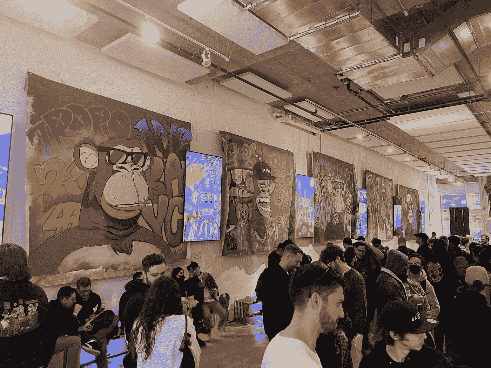
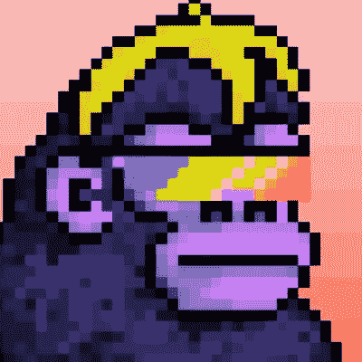
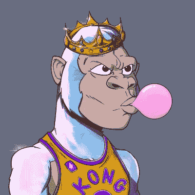
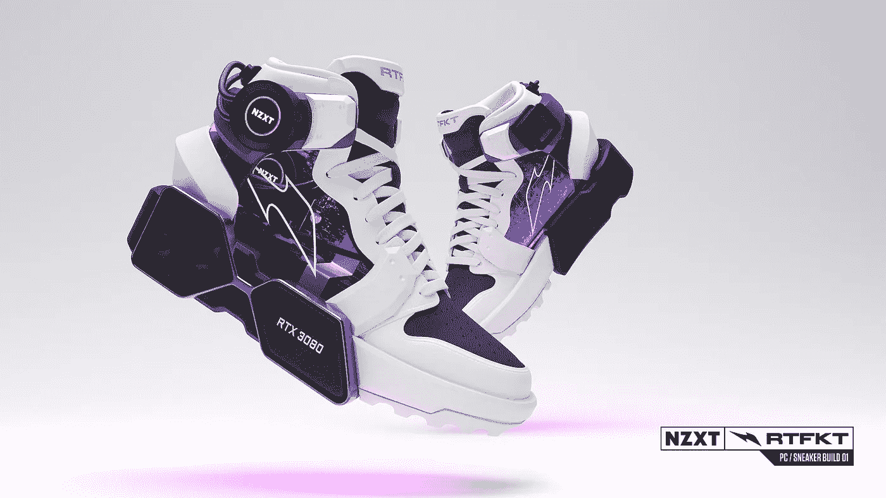
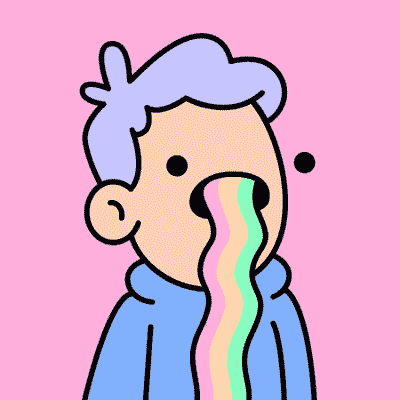
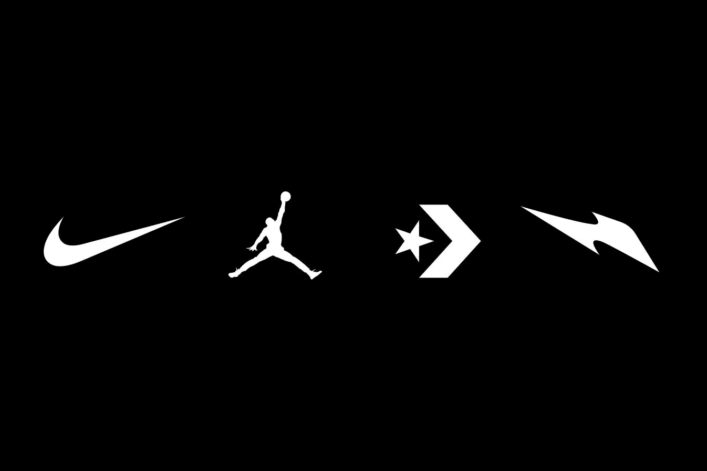
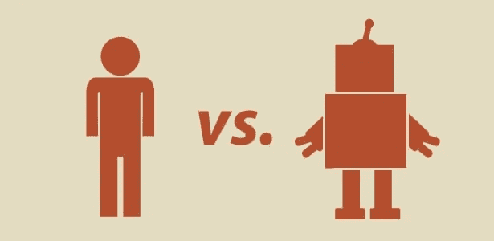
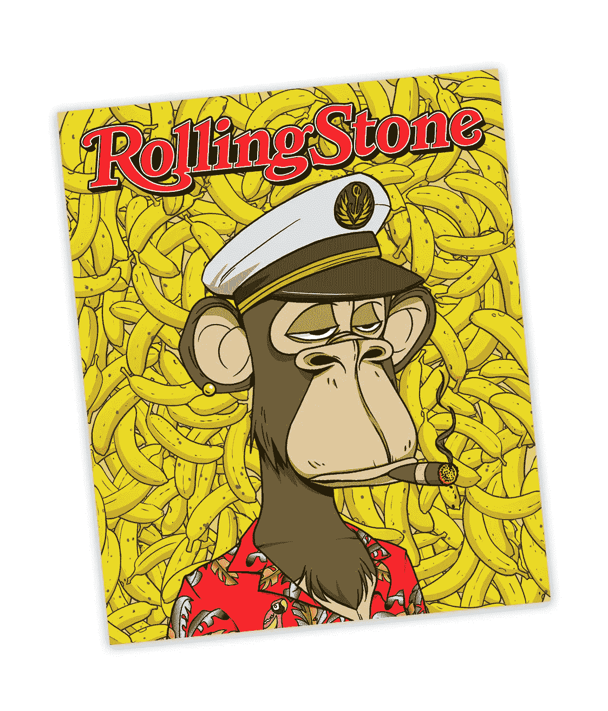
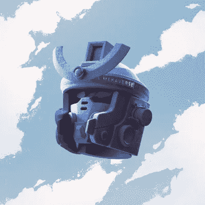

# 及早发现 NFT 蓝筹股项目的 13 种方法

> 原文：<https://medium.com/coinmonks/13-ways-to-spot-a-blue-chip-nft-project-early-7aab29541335?source=collection_archive---------0----------------------->

好吧，我想我们都同意，NFT 市场充斥着垃圾项目，它们都是成功蓝筹股的翻版。对于每一个伟大的项目，都有一百个糟糕的项目会化为乌有。在这些蓝筹项目破产之前找到它们，比看起来要困难得多。在 Twitter 上，似乎每个人都在阿尔法上制造阿尔法，但这与事实相去甚远。就像 Instagram 上的人只会发布他们的胜利，没有人会吹嘘他们钱包里那些毫无价值的 NFT。

这里有一个清单，列出了一些可以增加你选择蓝筹项目机会的事情。如果你完整地阅读了这篇文章，并在投资前仔细阅读了这份清单，我保证你更有可能成功地找到阿尔法。

# **效用**

所有的项目都是不同的，一些收藏依赖于他们艺术的力量，而另一些则作为专属社区的成员。效用这个术语流传很广，但它实际上是什么意思呢？效用可以定义为 NFT 为其所有者提供的价值。

## **1。访问实用程序**

[BAYC](https://mobile.twitter.com/BoredApeYC) 为 Ape 持有者举办派对和活动。考虑到这个社区的排他性和现在投资无聊猿类的人的能力，很容易看出作为持有人的价值。在这种环境下建立关系网可以为会员带来有利可图的机会。Vee Friends 授权 Vee Con 参加由独一无二的加里·维纳查克支持的营销和商业会议。加里在 NFT 的影响力远远弥补了他平庸的艺术技巧。

*The first-ever BAYC Ape Fest APED NYC at Bright Moments Gallery. Credits: Twitter via Ryan (@Neutral_Spirit)*

# **Defi 力学**

## **2。奖励**

CyberKongz 每天以本国货币“香蕉”的形式向拥有创世纪 Kong 收藏的人发放象征性的奖励。在一个点上，持有香蕉的人仅仅因为持有 NFT 就可以每天赚 860 美元！

*Credits: Twitter via* [*CyberKongz*](https://medium.com/u/ea706ca2dde1?source=post_page-----7aab29541335--------------------------------)

## **空投**

RTFKT 工作室以奖励 NFT 持有者而闻名，这些家伙花了一大笔油费向 [CloneX](https://clonex.rtfkt.com/) 持有者免费空投巨石、太空舱和战利品舱。如果你足够幸运，拥有 RTFKT 去年发布的 200 只 Meta 鸽子中的一只，你会从他们的空投政策中受益匪浅。拥有一只元鸽可以让你拥有三双赛博运动鞋、六个克隆体、六个战利品舱、六块巨石和六个太空舱。在撰写本文的时候，这相当于价值 50 万美元的非金融资产。这绝对是惊人的！

## **3。津贴和福利**

许多面向游戏的 NFT 让玩家在游戏中获得优势。隆隆金刚联盟是一个伟大的新游戏 NFT 的例子。该项目旨在推出一款以篮球为主题的游戏，让“隆隆金刚”的所有者可以加入球队和联盟。

Credits Twitter via [@RumbleKong](https://twitter.com/rumblekongs)s

每个玩家的强项和弱项是由他们特定的 NFT 的属性决定的。一个可能有很好的防守，而另一个有很好的投篮。 [Axie Infinity](https://axieinfinity.com/) 是另一个赢得游戏 NFT 的知名游戏，它为 NFT 持有者提供游戏内增强功能和福利。

# **团队**

## **4。公开 vs 匿名**

我们都知道 BAYC 与一个完全匿名的团队(直到最近)一起推出了一个超级成功和声誉卓著的项目，但让我们称他们为例外。总的来说，最好投资于有公共团队的项目，这样可以减少项目失败或团队无法实现路线图的可能性。当人们把自己的名誉置于危险境地时，你知道他们会尽全力保护自己的名誉。

## **5。跟踪记录**

现在你知道创始人是真实的人，试着找出他们是正确的真实的人。看看他们的简介和以前在 NFT 领域的成就和努力。他们过去交付过成功的项目吗？我又一次去了 RTFKT 工作室。在发布 [CloneX](http://Each players strengths and weaknesses are defined by the properties of their particular NFT. One might have good defense while the another has great shooting. Of course, Axie Infinity is another well-known Play to Earn gaming NFT that provides NFT holders with in-game power ups and benefits.) 之前，创作者们有一系列非常成功的项目，如[赛博运动鞋](https://opensea.io/collection/rtfkt-x-jeffstaple)和 [Meta 鸽子](https://opensea.io/collection/rtfkt-x-jeffstaple)。

Credits via [Utah Business Magazine](https://www.utahbusiness.com/rtfkt-made-millions-off-of-nft-cybersneakers/)

## **6。艺术家**

这位艺术家很有名吗？拥有一位知名或知名的艺术家对任何项目都是一个巨大的推动。在涂鸦项目之前，[涂鸦](https://mobile.twitter.com/doodles)、**、**、[烤焦的吐司](https://twitter.com/burnttoast)背后的艺术家在 Instagram 和 Twitter 上拥有大量粉丝。这也有助于提高社区的质量，因为会有更多的持有人真正关注艺术家，真正关心艺术。

Credits via Twitter [@doodles](https://mobile.twitter.com/doodles)

值得一看的 NFT 流行艺术家有:

*   [稀少的](https://mobile.twitter.com/fewocious)
*   [村上隆](https://mobile.twitter.com/takashipom)
*   [达明安·赫斯特](https://mobile.twitter.com/hirst_official)
*   马库斯·马格努松

## 7。与知名品牌的合作关系

RTFKT 工作室最近被服装巨头耐克收购。进入 NFT 空间的公司意见不一，许多人认为它们的存在与 NFT 空间的理想相矛盾。然而，如果在非功能性交易中有利润可赚，那么不可避免的是，这些公司不会走得太远。一个与大品牌合作的项目将拥有更好的营销和建设项目的资金实力，这对持有者来说只能是好事。关注更多品牌的参与。

Credits via [Sneaker Freaker](https://www.sneakerfreaker.com/news/nike-rtfkt-studios-metaverse-nft)

## **8。社区:人还是机器人？**

看看这个社区，它是真实的还是充满了机器人。项目很容易在 Twitter 上购买关注者。这样做是为了提高项目的视觉效果和知名度。检查并查看是否有人以有意义的方式参与其帖子。

Credits via [Orbit Media](https://www.orbitmedia.com/blog/robots-vs-humans/)

也进入不和谐，看看社区是不是关心项目的实用性或艺术性的人，而不仅仅是一群不停谈论地板的脚蹼。还要分析社群，他们是什么样的人。有钱人，聪明人。在这方面真正成功的社区的一个例子是[新东京](https://opensea.io/collection/neo-tokyo-identities)。广受欢迎的加密 YouTube[Alex Becke](https://www.youtube.com/c/AlexBeckersChannel)r 是该项目的创始人。一个包含聪明、富有或名人的社区无疑会给社区成员带来更多的机会。

## **9。社区参与度**

留意那些与社区成员沟通良好的项目。DeadFellaz 团队非常适合与社区互动，回答关于项目的问题并发布有趣和有价值的内容。

## **10。艺术**

说到 NFT 艺术，我总会想到儿童睡前故事《皇帝的新装》。我的意思是，一些有影响力的人说酷猫艺术“不可思议”或“火”，每个人都同意。我看到一幅非常基本的图画，一个六岁的孩子可能会复制，但也许我缺乏艺术敏锐度来真正欣赏这些东西。

艺术可能不会成就或破坏这个项目，虽然酷猫可能不是我所说的美丽的艺术，但它确实有其他品质。这种艺术非常容易识别或品牌化，因为我可以看到一部电视剧或一个服装系列，很容易被识别为酷猫品牌的延伸，它也简单而干净，这些都是你应该注意的品质。

有些艺术太糟糕了，其实想想 Cryptoadz 还不错。模因性是另一个重要方面。马特·弗瑞是青蛙佩佩的创造者，它成为了互联网上最受欢迎的角色之一。

Vee Friends 是另一个项目成功的例子，尽管它的艺术作品很糟糕，但是这个项目恰好是加里·维纳查克空间最有影响力的人的作品。

## **11。版权所有**

谁拥有 NFTs 的知识产权，是属于创造者还是所有者？BAYC 和 WOW(妇女的世界)将每幅 NFT 的版权交给持有者，这意味着他们可以合法地以商业方式使用该图像，并有权保留所有利润。

## **12。文化**

BAYC 是一种“文化现象”,它创造了巨大的社会趋势，吸引了名人和各种高调的买家。10，000 只无聊猿猴的收藏可能激发了 10，000 多只猴子主题的收藏，它们都试图复制一些猿猴的魔法。如果一件收藏品具有文化意义，那么它肯定是赢家。如果内容创作者在 YouTube 或 Medium 上创建关于某个系列的博客或文章，那绝对值得一试。要查看一个项目是否有趋势，检查搜索量，Crypto Slam 或 Dapp Radar 是查看不同项目数据的好网站。

Credits via Twitter [@RollingStone](https://twitter.com/rollingstone/status/1455222360571777024)

## 13。炒作

谨防炒作！一个项目有很多炒作，并不代表一定会成功。最突出的例子就是 [MekaVerse](https://mobile.twitter.com/mekaverse) 。在最初的宣传预告片发布后，该项目被预测为下一个 BAYC。他们的艺术远远高于当时该领域的任何其他项目，但该项目未能达到预期。没有迅速得到稀有作品的买家开始抛售，导致地板坍塌，项目再也没有恢复。底价目前徘徊在略低于 ETH 的水平。

Credits vis Twitter [@MekaVerse](https://mobile.twitter.com/mekaverse)

## **结论**

投资 NFTs 是有风险的，所以请注意只投资你能承受损失的钱。在你投资你的血汗钱之前，做好你的研究，记住我们很可能处于泡沫之中，这些项目中的大部分将化为乌有。追逐诱人的上升趋势很容易被冲昏头脑，但从那些经历过艰难困苦的人那里，你会发现要小心行事。

如果你完成了这份清单，你将大大增加你选择赢家的可能性。

在推特上关注我吧 [@blindboinft](https://mobile.twitter.com/blindboinft)

> 加入 Coinmonks [电报频道](https://t.me/coincodecap)和 [Youtube 频道](https://www.youtube.com/c/coinmonks/videos)了解加密交易和投资

## 另外，阅读

*   [加拿大最佳加密交易机器人](https://coincodecap.com/5-best-crypto-trading-bots-in-canada) | [Bybit vs 币安](https://coincodecap.com/bybit-binance-moonxbt)
*   [阿联酋 5 大最佳加密交易所](https://coincodecap.com/best-crypto-exchanges-in-uae) | [SimpleSwap 评论](https://coincodecap.com/simpleswap-review)
*   购买 Dogecoin 的 7 种最佳方式 | [ZebPay 评论](https://coincodecap.com/zebpay-review)
*   [最佳期货交易信号](https://coincodecap.com/futures-trading-signals) | [流动性交易回顾](https://coincodecap.com/liquid-exchange-review)
*   【Huobi 的加密交易信号 | [Swapzone 审查](/coinmonks/swapzone-review-crypto-exchange-data-aggregator-e0ad78e55ed7)
*   最佳[密码交易机器人](https://coincodecap.com/best-crypto-trading-bots) | [购买索拉纳](https://coincodecap.com/buy-solana) | [矩阵导出评论](https://coincodecap.com/matrixport-review)
*   [Coldcard 评论](https://coincodecap.com/coldcard-review) | [BOXtradEX 评论](https://coincodecap.com/boxtradex-review)|[uni swap 指南](https://coincodecap.com/uniswap)
*   [比特币基地评论](/coinmonks/coinbase-review-6ef4e0f56064) | [德里比特评论](/coinmonks/deribit-review-options-fees-apis-and-testnet-2ca16c4bbdb2) | [FTX 评论](/coinmonks/ftx-crypto-exchange-review-53664ac1198f)
*   [n 零审核](/coinmonks/ngrave-zero-review-c465cf8307fc) | [Phemex 审核](/coinmonks/phemex-review-4cfba0b49e28) | [PrimeXBT 审核](/coinmonks/primexbt-review-88e0815be858)
*   最佳[区块链分析](https://bitquery.io/blog/best-blockchain-analysis-tools-and-software)工具| [赚比特币](/coinmonks/earn-bitcoin-6e8bd3c592d9)