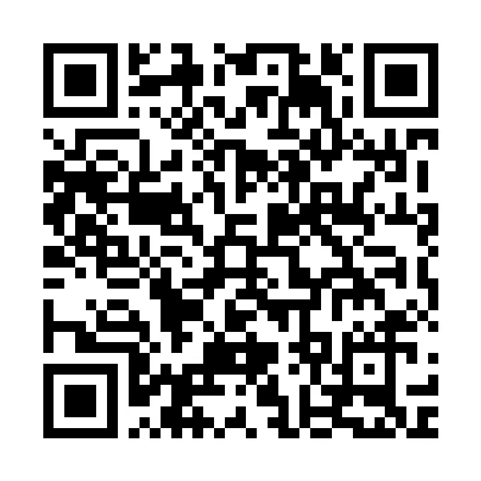

# 比特币带来无条件基本收入的 14 个原因*

> 原文：<https://medium.com/coinmonks/14-reasons-why-bitcoin-leads-to-an-unconditional-basic-income-fa44a43fb75e?source=collection_archive---------30----------------------->

## 或者:比特币如何能消除金钱的社交面

([Klicke hier für die Deutsche Version。](/@ELTankred/14-gründe-warum-bitcoin-zum-bedingungslosen-grundeinkommen-führt-ed97e4a0773c))

**无条件基本收入是一项财政转移支付政策提案，在该提案中，所有公民无需进行经济状况调查，即可定期获得法律规定的平等财政补助。[1]*

进化还是革命？许多路通向未来。但是所有的道路都是从现在的问题开始的。进化的特征是许多小的解决方案改善了当前的状况。另一方面，革命带来了许多问题的单一解决方案，也带来了从过去汲取教训的新开端。

比特币是革命的先兆。与此同时，比特币也在与自己的问题作斗争。 [FUD](/p/consequences-of-the-bitcoin-fud-1814ac512c16) 和[比特币的不均衡分布](/p/the-unequal-distribution-of-fiat-money-and-bitcoin-56d56bf5f03c)只是其中两个。这些问题以及其他问题，比如比特币的易变性或缺乏用户体验，阻碍了比特币被世界上所有人接受。比特币是否会成为无可争议的世界货币还不确定。

此外，比特币作为一种无可争议的世界货币，只能充分发挥其优势。只要它仍然是一种存储价值，它就只能改变我们的社会，而不是变革我们的社会。

这种困境提出了一个问题:在比特币显示出它能做什么之前，如何说服每个人使用它？因为争论并不能改变世界，而是行动，我只有一些必要的能力，我想分享我的想法。我相信，无条件基本收入将导致比特币在全球范围内的使用。尽管如此，我们欢迎其他建议。

## 我的基本思想

1.)没有什么比免费的东西更能吸引人了。

2.)用比特币(UBIB)实现的无条件基本收入可以利用这一点。

## 使用比特币获得无条件基本收入的技术原因

3.)比特币的闪电网络允许引入 UBIB，无需决策。

4.)获得 UBIB 是人们克服比特币当前可用性问题的动力。

5.)UBIB 支持将是任何钱包都离不开的杀手级功能。

## 比特币带来无条件基本收入的货币原因

6.)UBIB 将比特币在菲亚特系统中的巨大易变性所带来的不适降至最低。

7.UBIB 促进了比特币的流通，这进一步降低了比特币的易变性。

8.)UBIB 平衡了当前[不平等的货币分配](/p/the-unequal-distribution-of-fiat-money-and-bitcoin-56d56bf5f03c)以及由此产生的社会问题。

## 比特币无条件基本收入的博弈原因

9.)天才 Satoshis 是为了他们自己而做的广告。

10.)无论是 FUD 问题、分配不平等问题还是比特币的其他问题，没有一个怀疑论者会愿意忘记天赋异禀的 Satoshis 钱，而不必为它工作。

11.)没有商家可以避开 UBIB，因为顾客只有在可以看到商家支付 BBGE 费用的情况下才会收到 UBIB。

12.)这让消费者有权将不想支付 BGE 费用的商家排除在购买之外。

13.)如果比特币没有实现无条件基本收入，另一种加密货币将会实现。

14.)任何首先引入无条件基本收入的(法定或加密)货币都将在货币竞争中胜出。

## 支持和战友

你想要什么？在细节上还是 [Spoconism](/p/105-thoughts-on-post-hyperbitcoinization-6bd5200179f) ？进化还是革命？

如果您对基于比特币的无条件基本收入感兴趣，请支持我的实施。我可以想到三种方法:

我们可以一起工作。我是一个在 HTML/Javascript 方面有一些经验的 UX 专业人士。但是我不能为闪电网络开发软件。任何有意义地补充我或我正在建立的团队的资格都是受欢迎的:[eltankred@gmail.com](mailto:eltankred@gmail.com)

除了这个想法，我对它的实现有初步的概念。因为我既不能估计技术限制和可能性，也不能在我的考虑中看到错误，所以我需要和闪电开发者交谈。你对合作感兴趣吗？请联系我:[eltankred@gmail.com](mailto:eltankred@gmail.com)

b)当然，您可以为这个项目捐款。我(很快就会成为我们)希望推动比特币的无条件基本收入，而不用担心谋生。

onchain wallet address: bc1q9athuda8zg00ttqdq5ps5n5afdt38hnnt90dzc

c)最后但同样重要的是，您可以通过比特币推广无条件基本收入。只需分发这篇文章的链接，这样明天我们就可以自由决定我们想把生命奉献给什么样的意义和目的。

***

我的 4360 个角色给了你新的见解吗？通过闪电捐款向他们致敬。你想从我这里读到更多吗？用几个 Satoshis 支持我的工作。理解需要时间。你的晋升给了我时间来整理我的想法并写下来。

Lightning address: LNURL1DP68GURN8GHJ7MR9VAJKUEPWD3HXY6T5WVHXXMMD9AKXUATJD3CZ7CTSDYHHVVF0D3H82UNV9UMNYWFNC2GDKG

***

## 目录

I)摘要:[金钱的社会影响力](/p/the-social-influence-of-money-b3703cc2d528)

二)问题描述:[比特币 FUD 的后果](/p/consequences-of-the-bitcoin-fud-1814ac512c16)，[法定货币和比特币的不平等分配](/p/the-unequal-distribution-of-fiat-money-and-bitcoin-56d56bf5f03c)

III)愿景: [105 关于后超比特币化的思考](/p/105-thoughts-on-post-hyperbitcoinization-6bd5200179f)

IV)解决方案:比特币导致无条件基本收入的 14 个原因

***

## **来源**

[1][https://en.wikipedia.org/wiki/Universal_basic_income](https://en.wikipedia.org/wiki/Universal_basic_income)状态:2022 年 2 月 23 日

> 加入 Coinmonks [电报频道](https://t.me/coincodecap)和 [Youtube 频道](https://www.youtube.com/c/coinmonks/videos)了解加密交易和投资

# 另外，阅读

*   [AscendEx 保证金交易](https://coincodecap.com/ascendex-margin-trading) | [Bitfinex 赌注](https://coincodecap.com/bitfinex-staking) | [bitFlyer 审核](https://coincodecap.com/bitflyer-review)
*   [Bitget 评论](https://coincodecap.com/bitget-review) | [双子星 vs BlockFi](https://coincodecap.com/gemini-vs-blockfi) cmd| [OKEx 期货交易](https://coincodecap.com/okex-futures-trading)
*   [AscendEx Staking](https://coincodecap.com/ascendex-staking)|[Bot Ocean Review](https://coincodecap.com/bot-ocean-review)|[最佳比特币钱包](https://coincodecap.com/bitcoin-wallets-india)
*   [霍比审核](https://coincodecap.com/huobi-review) | [OKEx 保证金交易](https://coincodecap.com/okex-margin-trading) | [期货交易](https://coincodecap.com/futures-trading)
*   [电网交易机器人](https://coincodecap.com/grid-trading) | [Cryptohopper 审核](/coinmonks/cryptohopper-review-a388ff5bae88) | [Bexplus 审核](https://coincodecap.com/bexplus-review)
*   [7 个最佳零费用加密交易平台](https://coincodecap.com/zero-fee-crypto-exchanges)
*   [氹欞侊贸易评论](https://coincodecap.com/anny-trade-review) | [霍比融资融券交易](/coinmonks/huobi-margin-trading-b3b06cdc1519)
*   [分散交易所](https://coincodecap.com/what-are-decentralized-exchanges) | [比特 FIP](https://coincodecap.com/bitbns-fip) | [Pionex 审查](https://coincodecap.com/pionex-review-exchange-with-crypto-trading-bot)
*   [用信用卡购买密码的 10 个最佳地点](https://coincodecap.com/buy-crypto-with-credit-card)