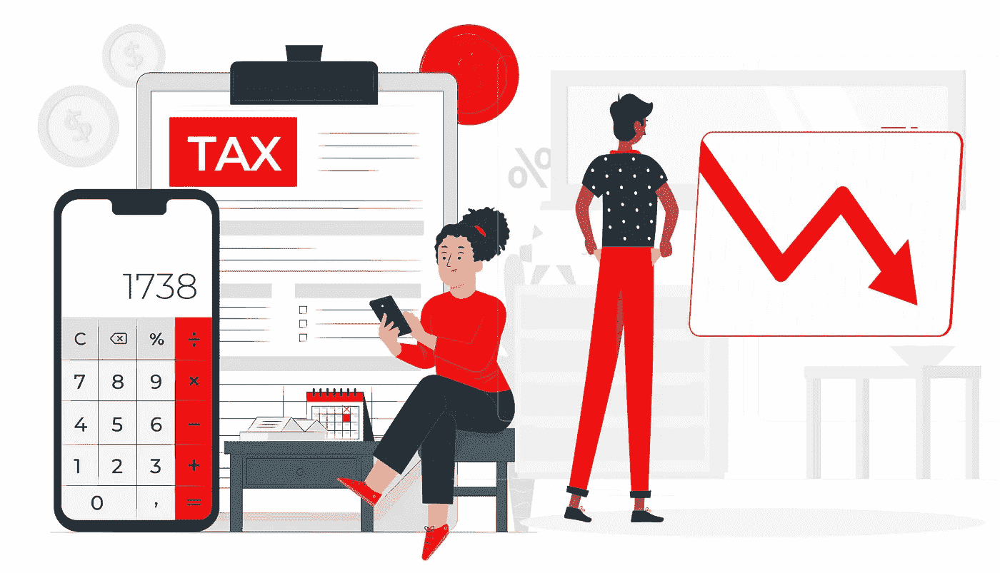

# 减少税收的 14 件事(像富人一样)

> 原文：<https://medium.com/coinmonks/14-things-to-do-to-reduce-your-taxes-like-the-wealthy-808185c5e39c?source=collection_archive---------16----------------------->

我们都想在税收上省钱，但有时感觉情况对我们不利。富人似乎总能找到方法来最大限度地减轻他们的税务负担，而我们其他人却不得不支付我们所欠的一切。

但是不一定要这样！实际上，日常生活中人们可以做很多事情来减少他们的税收。这里有 14 种方法可以让你