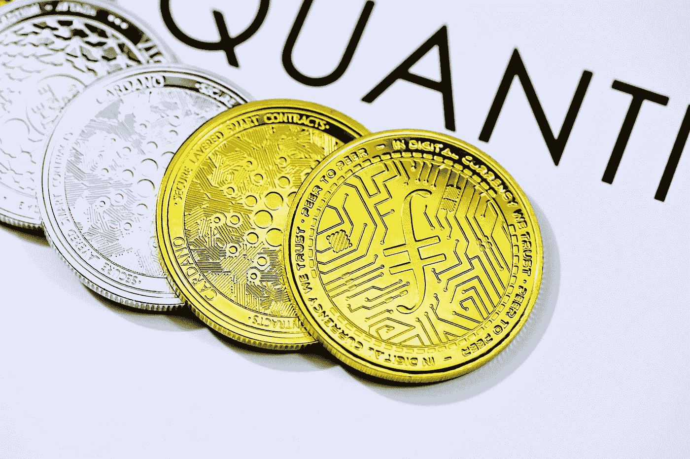

# 今年要投资的 15 种终极高回报替代币

> 原文：<https://medium.com/coinmonks/15-ultimate-high-return-altcoins-to-invest-this-year-95e09e72546e?source=collection_archive---------80----------------------->

Photo by [Quantitatives](https://unsplash.com/@quantitatives?utm_source=medium&utm_medium=referral) on [Unsplash](https://unsplash.com?utm_source=medium&utm_medium=referral)

鉴于其优势，替代硬币吸引了众多的金融支持者，形成了一个非常严肃的加密市场。

Crypto 作为真正有新闻价值的东西脱颖而出，高级资源会议没有给出回拨的迹象。altcoins 在市场上的意义在于，它给了金融支持者一种预期，即他们贡献的密码可以变成下面的比特币或密码统治者。替代硬币背后的专门分支继续变化和改进，取决于比特币的预期降价。许多替代硬币利用了一种既节省能源又节省时间的利害关系证明协议系统。这篇文章记录了今年将会带来难以置信的回报的 15 个最好的替代硬币。

**阅读更多:** [10 种最好投资的加密货币 202](https://xbmproject.com/index.php/2021/11/19/10-best-and-low-risk-cryptocurrencies-to-invest-in-2021/) 2

# 1.波尔卡多(点)

市值:459.6 亿美元

波尔卡多特是以太坊的选修课程，具有卓越的协议能力，可以快速有效地循环交换。Polkadot 之所以与众不同，是因为它的互操作性，即与其他区块链进行交流的能力，这是为了实现加密市场的最重要的目标。该点被认为是值得称赞的 11 月，因为它将开始其准链易货。由于有一定数量的 para-chain 空间，项目需要在组织上提供租赁空间  。

# 2.恒星(XLM)

市值:93.28 亿美元

最近，天堂与地球上最大的现金转移组织之一合作，使其在 11 月期间对金融支持者产生了巨大的吸引力。其区块链创新带来了快速有效的现金流动和交换。它旨在与世界范围内的货币管理机构合作，建立一个独立的组织。它的产品是开放和分散的，允许每天熟练处理数百万次交易。

# 3.币安硬币(BNB)

市值:1078.1 亿美元

如果客户利用当地的交易加密组织，现在很低的交易费用将减半。币安基本上是为其在币安环境中的利用而制造的，这提供了支持其利用的激励极限。它提供闪电般快速的交易，可以用来购买和出售各种加密形式的货币，并且没有任何危险。

# 4.奇利兹(CHZ)

市值:33.25 亿美元

Chiliz 于 2018 年推出，预计将成为下一个顶级加密领主。它围绕着体育界的适应和粉丝承诺。Chiliz.net 是世界上第一个代币化的体育交易，球迷可以交换体育标志的代币。它与世界各地的服装公司阿森纳、尤文图斯等合作，让客户有机会参与管理他们喜爱的游戏品牌。

# 5.茄属植物

市值:739.51 亿美元

一些密码出现在持续发展的以太坊之后，SOL 就是其中之一。在最近几个月的过程中，索拉纳显示出快速发展，成为全球市场上第五大数字货币。SOL 支持一种混合协议设计，即验证利害关系和历史惯例的证据。目前，SOL 正逐步用于 Defi 应用和 NFT。推动其惊人的价值反弹。

# 6.DogeCoin (Doge)

市值:347.6 亿美元

Dogecoin 支付框架项目于 2013 年推出，被其组织者开了一个玩笑。最终，柴犬图像、迷人的犬科动物和密码的组合令人难以置信，足以引起科技大亨埃隆·马斯克的注意。他偏爱它，他的追随者得到了它，剩下的就是历史了。

# 7.柴犬(SHIB)

市值:288.26 亿美元

柴犬是其标记的一个示范。最近，crypto 已经跃升到新的高度，证明了它的价值，并表明尽管它可能是从一个图像中构思出来的，但它可能被认为是一种旷日持久的猜测。自 2021 年 8 月创建以来，altcoin 的成本强劲上涨。金融支持者强烈呼吁罗宾汉市场(hood)将 SHIB 列入其基金。

# 8.地球(月球)

市值:226.6 亿美元

LUNA token 背后的组织 Land 表示，区块链计划建立一个卓越的计算机化货币框架。LUNA 允许在 Terra 网络之上形成精明的协议和 dApps，这融合了 Defi 惯例，如锚和镜子。为了帮助接待，他们还与分期付款和在线业务阶段合作，如韩国的 TMON 和 Yanolja。

# 9.包装比特币(WBTC)

市值:156.3 亿美元

拿一枚比特币，将它放入监护状态，“包装”它，将其作为基于以太坊的令牌，并在比特币的成本中持有股份——很快，你就制成了包装好的比特币！因此，WBTC 是一个以太坊 ERC-20 代币，价值与 BTC 挂钩，就像价值与美元挂钩一样。

# 10.FileCoin

市值:77.42 亿美元

FileCoin 是一个去中心化的存储框架，这意味着存储人类的主要数据。加密利用其分散的性质来确保信息区域的可信度，这使得它可以有效地恢复并且难以编辑。通过参与 Filecoin 网络的挖掘和存储，客户实际上会希望获得更多的方块奖励。

# 11.莱特币

市值:189.3 亿美元

莱特币是在 2011 年制造的，与众多当前的替代硬币相比，这种加密技术具有很高的可信度。与比特币相比，查理·李基本上让莱特币成为了一种更优越、更快捷的选择。考虑到更有限的交换确认时间，LTC 具有更快的阻塞率。LTC 在 2021 年上涨了一半以上，是最著名的另类硬币之一。

# 12.雪崩

市值:216.81 亿美元

Avalanche 是第一层区块链，是 Defi 应用和定制区块链网络的舞台。这可能是以太最大的对手期望消除以太从他的高位置。AVAX

# 13.比特币现金(BCH)

市值:1280.8 万美元

比特币现金是 2017 年通过比特币区块链的硬分叉创建的，旨在解决 BTC 的交易速度问题。当 BTC 社区的成员无法就比特币区块大小的可能变化达成一致时，分歧就出现了。

# 14.以太坊经典(等)

市值:73.6 亿美元

以太坊经典(ETC)在 2016 年从以太坊(ETH)分裂出来，原因是哲学上的原因导致了更突出的长期差异。基本的有用性是类似的，库存截止值为 2.107 亿等。使用 ETH 的应用程序或精明的协议可以选择使用 ETC，而几乎不做任何更改。

# 15.阿斯彭硬币(ASPD)

市值:1800 万美元

作为同类产品中的第一个，阿斯彭硬币可以被认为是对 a 的一部分。2018 年，美国奢华的圣里吉斯阿斯彭度假村宣布提供这种资源的安全令牌(STO)支持给予授权金融支持者的安全令牌。