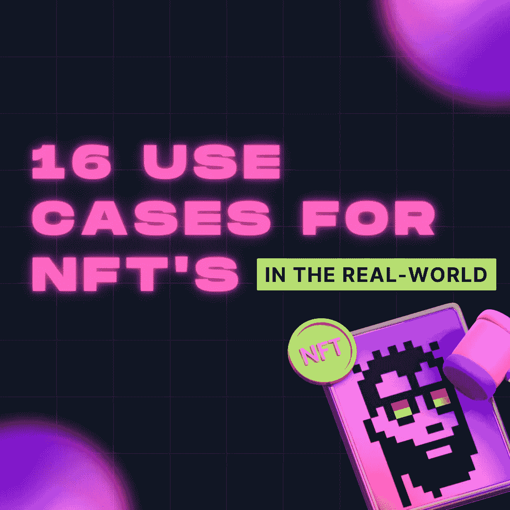

# NFT 在“现实世界”中的 16 种用途

> 原文：<https://medium.com/coinmonks/16-uses-for-nfts-in-the-real-world-790c1d03f1fe?source=collection_archive---------12----------------------->

web 3.0 世界正在发生转变，不可替代的令牌有着广泛的现有和潜在用途；从时尚到分散融资，从医疗保健到教育——全球对 NFTs 力量的迷恋显而易见。

虽然很多人将 NFTs 视为数字版的蒙娜丽莎，但它很快变得有点像会员卡或你从乐购收到的收据。抱歉让他们听起来这么不性感！

时尚与金融
在现实世界中，将 NFT 融入时尚产业和 DeFi 组织是一种不断发展的实践。这些行业是最快采用这项技术的行业之一。阿迪达斯、巴黎世家、耐克等众多时尚品牌都发布了 NFT，开创了时尚界的新潮流。古驰现在允许顾客在现实世界*和*元宇宙[拥有他们的产品](https://vault.gucci.com/en-US/story/metaverse)，而拉夫·劳伦在 [Roblox](https://www.roblox.com/ralphlauren) 的虚拟存在自 2021 年就已经存在。将数字所有权纳入品牌识别的远见卓识可能会在收入增长方面获得回报；不久之后，你将会看到越来越多的年轻一代的财富被储存在数字资产中，即 NFT 中。

但是这项技术不仅仅在高级时装领域有应用案例，DeFi 也在寻求积极推动该领域的创新——但该领域最大的挑战之一是让更广泛的市场将它们视为另一种东西，而不仅仅是另一家在线银行。

在 DeFi 创新这个主题上，该领域已经有一些公司在以 NFTs 为抵押进行贷款，而且根据我们现在看到的采用情况，更大的真实世界资产的令牌化将成为一种趋势，这只是时间问题。

然而，正如我们已经在本博客中分享过几次，并通过我们的 [**理解加密**](https://podcasts.apple.com/gb/podcast/understanding-crypto/id1613425432) 播客分享过几次，尽管每个人都说他们想要银行业真正的去中心化自治，但这个概念可能比现实更有吸引力。例如，*同样在理论上*，如果你拖欠了在区块链上管理的一笔付款，你可以——自动地，没有通知或任何警告——发现数字资产*(被用作担保)*将被转移到借贷平台。在这种情况下，债务收集过程变得更容易和更有效的方法。但不要让我把它说得像厄运和黑暗；这是摇摆和迂回— **如果资产的安全性更容易收回，那么贷款监管也可以放松。**

只有时间会证明一切。

我们迟早会发现自己生活在一个非金融资产和实物资产相结合可以支撑资产价值的世界里。

**社交媒体和娱乐** NFTs 强大的后端智能合约技术可以发挥作用的另一个领域是各种社交媒体和娱乐应用。从消费者的角度来看，音乐会或活动门票有可能成为可收集的 NFT，同时消除了对后端中间人的需求，从而允许更有效的收入分配。例如，无论何时售出一张票，智能合同可以自动将门票销售*的收益分配给所有相关方。*

在社交媒体领域，NFTs 也可用于追踪影响力和认证各种社交平台的身份。目前，内容创作者被迫在多个平台上传播他们的影响力，并根据具体情况出售他们的影响力、参与度和销售能力。但是，从理论上来说，通过一个组合的方法，**他们可以利用一个组合的网络影响力总量**。拥有一个 NFT 和算法来给你一个总体分数和等级影响，这在技术上是可行的——因此，这将使一笔金额能够作为所有在线平台上的统一广告费率来支付。这可以为每一个想要接近某个品牌的影响者提供准确而具体的信息，反之亦然。

围绕 NFTs 创作音乐是另一个重要的应用。虽然这不是一个新概念，但通过 NFTs 向粉丝提供数字化激励所有权可以将社区参与推向新的高度。对粉丝成为他们最喜欢的艺术家的音乐的利益相关者的早期测试似乎显示了一种真正的兴趣，并可能改变我们购买音乐的方式和原因，我们与音乐互动的方式以及版税的分配方式。音乐似乎总是即将到来的事情的前兆，评价来自[、](https://www.sound.xyz/katenash/try-to-forget-it)等乐队的 NFT 滴滴肯定很有趣。虽然音乐往往是新技术的早期采用者，但这个行业的后端却慢得惊人——看看智能结算如何被用来自动支付版税将会很有趣；**在伟大的传统艺术家和抖音最新潮流影响者之间建立真正的全面平等。**

NFTs 的无限可能性 web 3.0 技术的一些用例可能看起来很超前，但其他更基本的功能却适合“嗯，差不多是时候了！”反应。让我们来看看医疗记录——如果你曾经试图将你的记录从医疗服务的一个部分转移到另一个部分，你很可能知道这种经历就像拔牙。为什么你的医疗不能安全地保存在你的钱包里，作为一种象征性的资产，你——作为“资产”的所有者——可以把它分发给你喜欢的任何人和任何地方。

正如本博客开头所提到的，谦逊的 NFT 将从蒙娜丽莎变成每周购物收据或购物证明。用不了多久，你就可以进入元宇宙的虚拟商店，通过与数码工作人员的交谈，购买下一件家居用品。几天后，它就会被送到，当你签字说它已经送到时，就会制造一个 NFT，开始对你的物品进行 2 年保修。

这个版本的未来比我们想象的更近。

当然，要实现这些概念，需要一些重大的技术突破，但在未来 5 年内，NFTs 将在我们的日常生活中发挥作用，这可能不是一个奇怪的猜测。

> 加入 Coinmonks [电报频道](https://t.me/coincodecap)和 [Youtube 频道](https://www.youtube.com/c/coinmonks/videos)了解加密交易和投资

# 另外，阅读

*   [Bookmap 评论](https://coincodecap.com/bookmap-review-2021-best-trading-software) | [美国 5 大最佳加密交易所](https://coincodecap.com/crypto-exchange-usa)
*   [加密交易机器人](/coinmonks/crypto-trading-bot-c2ffce8acb2a) | [造币评论](https://coincodecap.com/coingate-review)
*   最佳加密[硬件钱包](/coinmonks/hardware-wallets-dfa1211730c6) | [Bitbns 评论](/coinmonks/bitbns-review-38256a07e161)
*   [新加坡十大最佳加密交易所](https://coincodecap.com/crypto-exchange-in-singapore) | [购买 AXS](https://coincodecap.com/buy-axs-token)
*   [红狗赌场评论](https://coincodecap.com/red-dog-casino-review) | [Swyftx 评论](https://coincodecap.com/swyftx-review)
*   [投资印度的最佳密码](https://coincodecap.com/best-crypto-to-invest-in-india-in-2021)|[WazirX P2P](https://coincodecap.com/wazirx-p2p)|[Hi Dollar Review](https://coincodecap.com/hi-dollar-review)