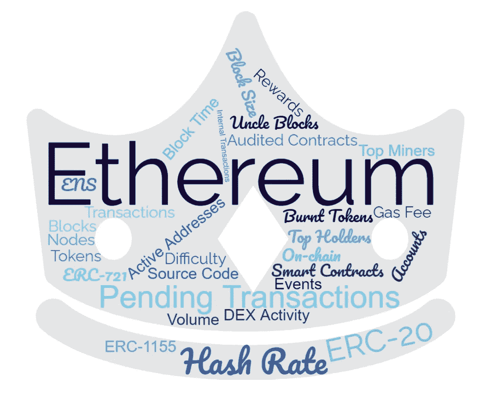

# 使用“以太扫描”块浏览器可以做的 17 件很酷的事情

> 原文：<https://medium.com/coinmonks/17-cool-things-you-can-do-using-etherscan-block-explorer-7c840d31fa1?source=collection_archive---------5----------------------->

## 一个完整的“以太扫描”指南，帮助您更好地了解以太坊区块链。



```
**Table of Contents:** · [Introduction](#01e0)
· [#1 — Current Status of Ethereum Blockchain](#c99e)
· [#2 — Ether Daily Price (USD) Chart](#7886)
· [#3 — Transactions](#d62c)
· [#4 — Ethereum Gas Tracker](#1b14)
· [#5 — Ether Total Supply and](#6f35)…
```