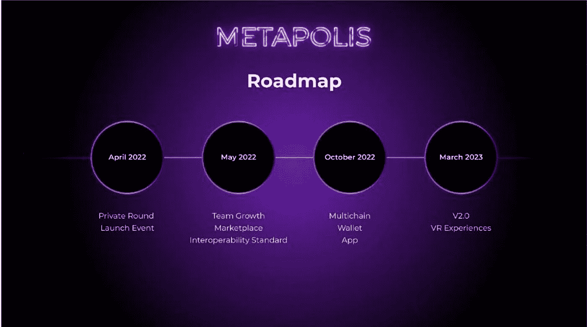
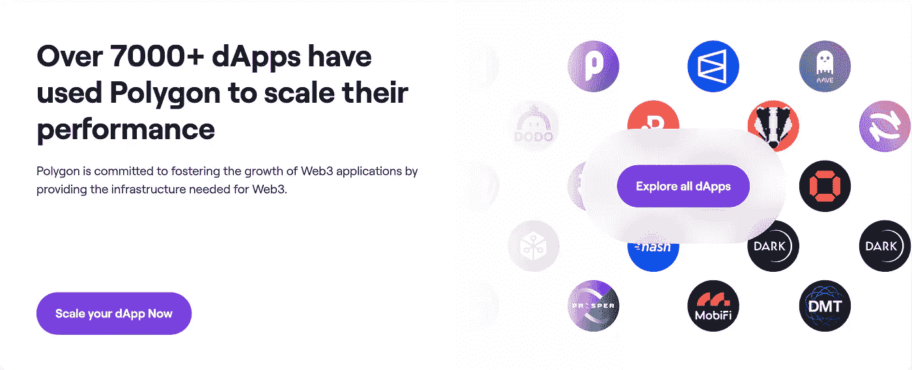

# 4 月份的两项加密货币选择

> 原文：<https://medium.com/coinmonks/2-cryptocurrency-picks-for-april-4989e4d59a7a?source=collection_archive---------21----------------------->

*请注意，本文中的任何信息都不是财务建议

随着加密货币反弹并突破重要技术指标，投资者开始变得更加乐观。因此，让我们来看看两种加密货币的发展前景和令人兴奋的消息。这些硬币有着令人鼓舞的消息，但也是基本合理的项目，我们相信从长远来看会做得很好。

**Zilliqa:**

我们四月份的第一个选择是 Zilliqa。Zilliqa 是一个领先的 L1 智能合约平台，它利用分片(将区块链分成更小的组，称为“分片”)来扩展网络。Zilliqa 的市值为 17 亿美元，是第 66 大加密货币。

Zilliqa 的令牌 ZIL 从最近的低点到高点上涨了 500%以上，从大约 0.037 美元到 0.23 美元。这主要是由于 Zilliqa 的元宇宙即服务(MaaS)平台 Metapolis 的推出，在该平台上，品牌和个人可以使用 Zilliqa 提供的工具构建自己的 metaverses，而无需任何编程知识。Metapolis 路线图看起来很有希望。4 月，Metapolis 将启动私人销售和发布。预计 Zilliqa 还将宣布 Metapolis 的新合作伙伴关系。这无疑会给 Zilliqa 带来很多关注，因为 ZIL 令牌被用来给 Metapolis 供电。用户需要使用 ZIL 为交易提供资金，并与平台互动。因此，对 ZIL 代币的需求将呈指数增长，这将对价格产生积极影响。

Metapolis Roadmap

除了 Metapolis，Zilliqa 也有一个良好的生态系统和技术，背后有一个伟大的开发团队。你可以在 Zilliqa 上找到你想要的一切，无论是 NFTs (Okimoto 等。)、DEX (ZilSwap、Switcheo 等。)或 DeFi(碳、柱协议等。).Zilliqa 的 TVL 令人印象深刻，约为 7.06 亿美元，尽管随着令牌价格从最近的高点波动，这一数字将会发生变化。此外，Zilliqa 的钱包数量正在快速增长，拥有超过 560 万个钱包。相比之下，拥有 410 亿美元市值的 Cardano 只有 350 万个钱包。这一指标表明 Zilliqa 的价格仍有上涨空间。

值得注意的是，美国最大的专业另类资产管理公司之一瓦尔基里拥有 Zilliqa 信托。这让 Zilliqa 向希望获得较小加密货币敞口的大型投资者敞开了大门。

话虽如此，Zilliqa 的生态系统仍不像其更大的竞争对手那样成熟。Zilliqa 目前有 30 个跑步 dApps，与 Cardano 的 500+和 Solana 的 350+相比相形见绌。Zilliqa 锁定的总价值也不如其竞争对手令人印象深刻。然而，鉴于 Zilliqa 的市值较小，这一切都是有道理的。随着越来越多的人开始使用 Zilliqa 网络并看到它的潜力，更多的 dApps 和 DeFi 活动自然会随之而来。

要更深入地了解 Zilliqa，请看我以前的文章。然而，4 月份似乎有好消息，Zilliqa 继续增长也就不足为奇了。

**多边形:**

接下来，让我们来看看加密货币领域发展最快、最令人兴奋的项目之一 Polygon。Polygon 的原生令牌 MATIC 的市值为 128 亿美元，是第 17 大加密货币。Polygon 位于印度，由一家名为 Polygon technologies 的软件公司建造。

Polygon 是以太网上的第 2 层扩展解决方案，可能是最流行的第 2 层。截至目前，Polygon 的股权证明链是 Polygon 最活跃的链，每秒可处理约 65，000 笔交易。这是以分散化为代价的，目前只有 100 个验证器。为了解决这个问题，Polygon 目前正在寻找改善去中心化的方法。

Polygon 正在大力投资零知识汇总解决方案，许多人认为这是智能合约的未来。零知识(ZK)是指一方能够向另一方证明交易是有效的，除了交易是有效的这一事实之外，无需传达任何额外信息(想象一下，你的老板知道你真的有大学学位，而无需实际查看你的大学证书)。本质上，第二层区块链离线执行计算和存储，同时定期拍摄一组事务的快照，“将它们汇总”，并将快照发送到区块链。这将减少网络拥塞并增加以太坊网络的可扩展性，这将是非常有价值的，因为面对即将到来的以太坊 2.0 更新，以太坊网络的需求将会增加。目前，Polygon 已经有一个名为 Polygon Hermez 的运行中的 ZK 汇总链，并且正在开发另外 3 个，Polygon Miden，Polygon Zero 和 Polygon Nightfall。由于以太坊虚拟机(EVM)，一个在以太坊上运行 smrt 合同的计算引擎，并没有考虑 ZK 证明，Hermes 正在重新创建一整套指令机器代码，以从头开始构建 zkEVM。这将使 Polygon 处于 ZK 技术的最前沿。

很明显，Polygon 拥有尖端技术。最近的进展如何？嗯，Polygon 一整年都在发布有希望的消息。在一篇文章中包含太多，所以我们将涵盖主要的。Polygon 以 4 亿美元收购了 ZK 初创公司 Mir，以创建 Polygon Zero scaling 解决方案，并与安永(Ernst Young)和 Reddit 等知名品牌建立了合作关系。1 月底，Polygon 邀请 Youtube 游戏主管 Ryan Wyatt 协助开发 Polygon 的 NFT、元宇宙和游戏生态系统。领先的 DeFi 协议 Aave 在 Polygon 上推出了去中心化社交媒体平台 LENS。两个开发商已经将 Polygon 的 POS 链添加到《我的世界》。3 月初，Polygon 与 Tether 合作，将 USDT 带到瑞士城市卢加诺，与比特币一起用作法定货币。甚至流行的体育博彩公司 DraftKings 也加入了 Polygon 作为验证器。Adobe 还与 Polygon 合作，将其 POS 链用于与 Adobe Behance 社交媒体平台相关的 NFT。Polygon 的开发每隔几天就来一次，展示了 Polygon 超越其竞争对手的快速发展步伐。

Polygon 的生态系统大得惊人，因为与 Solana 和 Avalanche 等流行的 Layer 1s 相比，Polygon 的市值相对较小。Polygon 有超过 7000 个 dApps 运行在 Polygon 上或使用 Polygon 的缩放解决方案。目前最大的元宇宙游戏，沙盒和分散的土地，都与 Polygon 有合作关系，允许他们的令牌在 Polygon 网络上运行。Uniswap 是世界上最大的分散式交易所，现在运行在 Polygon 上。显然，Polygon 拥有一个成熟的生态系统，其中包含一些世界上最著名的加密货币项目。Polygon 还以 47.6 亿美元的 TVL 自居，这比 Cardano 的 2.5438 亿美元大得多，只有 Solana 80 亿美元的一半。Polygon 还有超过 1.35 亿个地址。作为参考，以太坊有 1.92 亿个地址，币安有 1.49 亿个地址。去年 10 月，Polygon 的活跃用户实际上已经超过了以太坊。所有这些都归功于 Polygon 以指数速度扩张的强大生态系统。

当然，多边形也有缺点。一个值得关注的问题是 Polygon 相对缺乏去中心化，只有 100 个验证器。这种相对集中可能会受到一些人的青睐，因为某些区块链游戏不需要大规模分散，允许每分钟数百万笔小额交易。然而，对于其他大额交易，如 DeFi 中的交易，Polygon 的集中化可能是一个值得关注的问题。去年 12 月，Polygon 在其 POS 链中发现了一个漏洞，使 240 亿美元面临风险。Polygon 的 POS 连锁店也遭受了拥堵和高额汽油费，当时 Polygon 上的区块链游戏向日葵农民的机器人蜂拥而至。因此，Polygon 确实有一段灾难史。然而，这些灾难在整个区块链都存在，这并没有影响 Polygon 令人印象深刻的技术和生态系统。

总而言之，通过查看上面提到的某些指标，Polygon 与其他加密货币相比似乎被相对低估了。这可能会说服新投资者将 Polygon 作为一种投资选择。最近，Polygon 的 EIP-1559 升级版允许用户手动刻录 Polygon，给其供应带来了通缩压力。Polygon 还推出了 polygon ID，这是 ZK 针对 Web 3.0 的身份倡议，用户可以获得基于区块链的身份，以便在不危及隐私的情况下进行在线验证。这些更新只是进一步增加了 Polygon 令人印象深刻的生态系统。因此，多边形网络将继续快速增长，并成为加密货币领域的技术先锋。

> 加入 Coinmonks [电报频道](https://t.me/coincodecap)和 [Youtube 频道](https://www.youtube.com/c/coinmonks/videos)了解加密交易和投资

# 另外，阅读

*   [3 商业评论](/coinmonks/3commas-review-an-excellent-crypto-trading-bot-2020-1313a58bec92) | [Pionex 评论](https://coincodecap.com/pionex-review-exchange-with-crypto-trading-bot) | [Coinrule 评论](/coinmonks/coinrule-review-2021-a-beginner-friendly-crypto-trading-bot-daf0504848ba)
*   [莱杰 vs n rave](/coinmonks/ledger-vs-ngrave-zero-7e40f0c1d694)|[莱杰 nano s vs x](/coinmonks/ledger-nano-s-vs-x-battery-hardware-price-storage-59a6663fe3b0) | [币安评论](/coinmonks/binance-review-ee10d3bf3b6e)
*   [Bybit 交易所评论](/coinmonks/bybit-exchange-review-dbd570019b71) | [Bityard 评论](https://coincodecap.com/bityard-reivew) | [Jet-Bot 评论](https://coincodecap.com/jet-bot-review)
*   [3 commas vs crypto hopper](/coinmonks/3commas-vs-pionex-vs-cryptohopper-best-crypto-bot-6a98d2baa203)|[赚取加密利息](/coinmonks/earn-crypto-interest-b10b810fdda3)
*   最好的比特币[硬件钱包](/coinmonks/hardware-wallets-dfa1211730c6) | [BitBox02 回顾](/coinmonks/bitbox02-review-your-swiss-bitcoin-hardware-wallet-c36c88fff29)