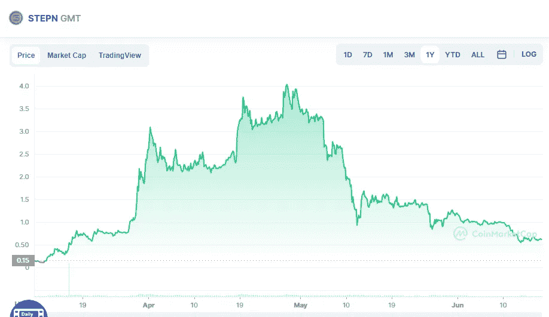

# 6 月 17 日，今天购买两种好的加密货币

> 原文：<https://medium.com/coinmonks/2-good-cryptocurrencies-to-buy-today-17th-of-june-7dccbec83587?source=collection_archive---------41----------------------->

# STEPN (GTM)

Source photo [STEPN price today, GMT to USD live, marketcap and chart | CoinMarketCap](https://coinmarketcap.com/currencies/green-metaverse-token/)

使用加密货币健身应用 Stepn (GTM)赢取积分。在散步、慢跑或跑步时，该软件允许您以其本地 GMT 令牌的形式赚取免费的加密货币。

为了应用程序的工作，用户必须首先购买斯戴普 NFT 鞋。用户每行驶一公里，就会获得 GMT。