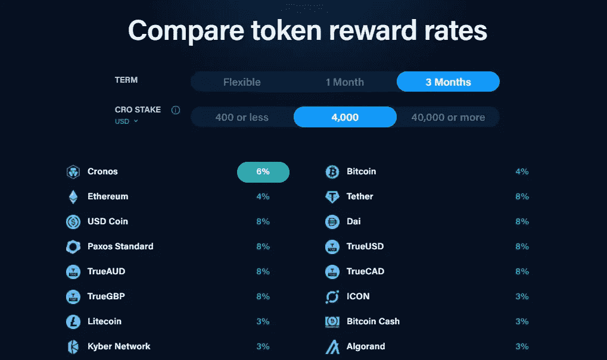
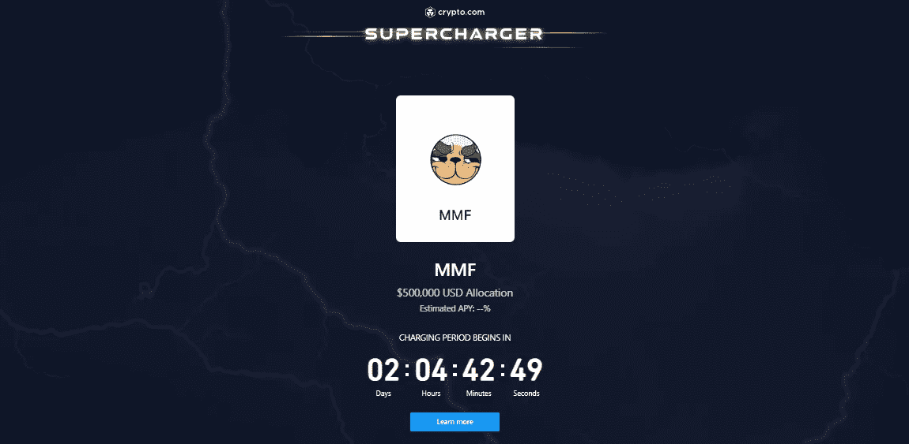
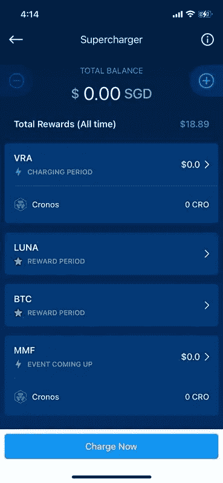
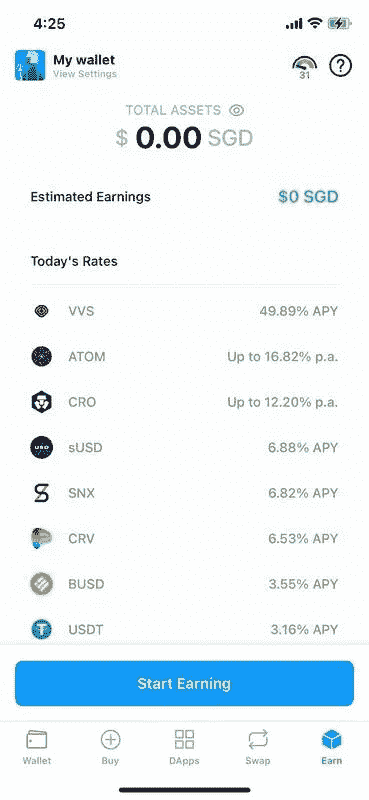
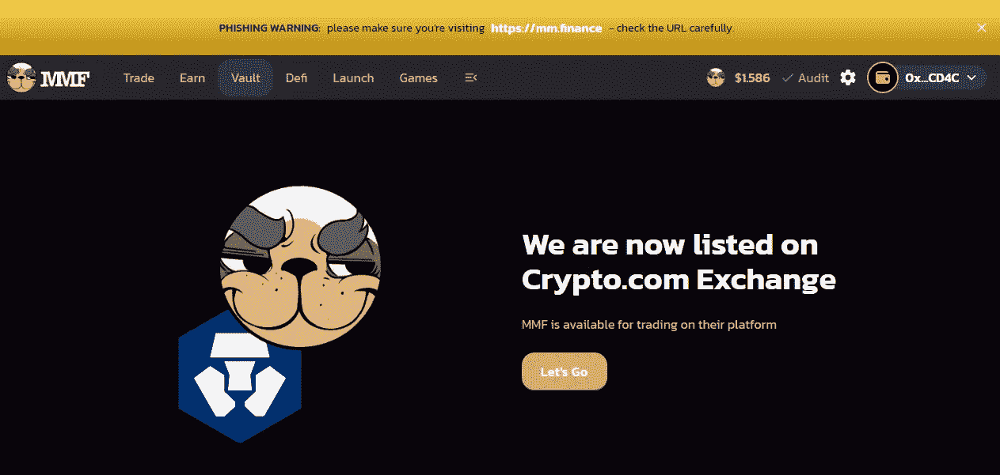

# 最大化 Crypto.com 回报的两种方法

> 原文：<https://medium.com/coinmonks/2-hacks-to-maximize-your-returns-on-crypto-com-de4c6d9fc115?source=collection_archive---------9----------------------->

## 如果你刚刚开始使用 Crypto.com 应用程序，这里有一些你可能不知道的提示和技巧

Photo from [NBC Los Angeles](https://www.nbclosangeles.com/on-air/after-20-years-staples-center-will-be-renamed-crypto-com-arena/2761367/)

我在 Crypto.com 的过去一年绝对改变了我的生活。我周围的同事都是密码爱好者，他们教会了我许多关于 Crypto.com 生态系统的不同东西，帮助我实现了回报最大化。

今天我在这里向你们传授一些知识。

> 免责声明:这篇文章是为密码世界或 Crypto.com 的初学者准备的。如果你也是一个密码迷，你可能知道我今天分享的东西。

# 1.最大化您的回报——Crypto.com 应用

如果你是 Crypto.com 应用的新手，你会意识到你可以通过**‘赚取’**或**‘超级玩家’**功能来押注你的加密货币，以赚取你的加密货币的“利息”，而不仅仅是 HODL。

> **什么是赌注？**
> 
> 赌注是一种奖励区块链参与者的方式，类似于采矿。

## 获得

Image taken from [Crypto.com website](https://crypto.com/sg/earn)

这将为你赢得你下注的加密货币的固定百分比，你获得的 APY 回报将取决于你下注的加密货币以及你选择的锁定期。

## 增压器

这类似于赌注，但不完全是。

Image taken from [Crypto.com Supercharger](https://crypto.com/exchange/supercharger)

简单地说，你把你的 CRO 代币和其他代币放在一起；你得到的回报将取决于你对资金池的贡献，而不是其他人。您收到的回报也将是规定的加密货币形式，而不是您提供的 CRO。*(在这种情况下，它将是 MMF 令牌)*

## 我个人的建议？

如果你是一个初学者， **Earn** 为你的硬币提供了不错的 APY 回报率(6-12%)，而且下注也很简单。例如，下注$MATIC 将在 3 个月的固定锁定期内为您赢得 12%的回报 *($MATIC 也是一个非常好的代币！)*

**千万不要**把你的 CRO 插进**增压器**。除非你是一条财大气粗的鲸鱼，否则你的回报可能是微不足道的。你可以在下面的截图里看到我赚的有多少。

My personal experience with Supercharger

举个例子，我在 Supercharger 上押了 7000 交叉赌注(约 4500 新元)，在参加了两次 Supercharger 活动后，我的回报只有约 19 新元。你可以在其他地方用你的 CRO 做更多的事情。

# 2.最大化您的回报——Crypto.com Defi 钱包

现在，如果你仍然对 6-10%的回报率不满意，并希望进一步最大化，那么下一个选择将是使用**Crypto.com DeFi 钱包。**

你可以先下载**Crypto.com Defi 钱包 App。下载后，有两种主要方法可以让你的收益最大化。**

## 获得

这和**Crypto.com 应用中的‘赚’功能完全一样。**您只需下注一种加密货币即可获得奖励。

Earn rates from Crypto.com Defi Wallet App

唯一的区别是，只有某些代币可以让你获得比上面的**Crypto.com 应用更高的 APY %回报:**

*   VVS 代币——49.89% APY(应用程序中未提供)
*   ATOM——16.82%的 APY(相比之下，应用程序中的最大 APY 为 5%)
*   CRO——12.2%的 APY(相比之下，应用程序中 APY 的最高值为 6%)

你所要做的就是首先从你的应用程序 **(a)** 将代币存入你的 Defi 钱包 **(b)** 直接在 Defi 钱包内购买代币，然后点击**“赢取”**选项卡开始赢取。

## 分散式应用

Dapps 是在区块链上运行的分散式应用程序。通过学习如何利用 Dapps，你可以赚更多的钱。在 Dapp 上最受欢迎的赚钱方式是参与流动性池/收益农业。

我目前正在使用的一款 Dapp 叫做 **MM Finance。**它是克罗诺斯区块链上最大的生态系统，在路线图上有许多令人兴奋的项目。其中一个例子就是最近 1000 美元疯狂代币的下跌.

Image taken from [MM Finance website](https://mm.finance/)

通过参与 MM Finance 的流动性池，你可以获得更高的回报。例如，我目前投资于他们的 SVN-MMF 流动性池，这个池**能给你带来大约 7000%的 APY！** *(请注意，这个 APY 将根据它们的记号组学不断变化)*

Crypto.com Defi 钱包应用程序最棒的一点是它已经集成了不同的 dapp。这让你可以直接与 Dapp 互动，甚至不用离开你的 Defi Wallet 应用。那有多酷？

一些可用的 Dapps 有:

*   VVS 金融— DEX
*   MM 金融— DEX
*   构造贷款
*   OpenSea — NFT 市场

# 最后的想法

如果你是一个初学者，坚持使用 Crypto.com 的应用程序，使用他们的“赚”功能。它简单、快速，并提供可观的回报。

**如果您对加密稍微熟悉一点，**将代币存入 Crypto.com·迪菲钱包，让您的 CRO/ATOM 回报最大化。

**如果你是一名专家，并且对波动性感到舒适，**那么就去投资流动性池，在分散的应用中创造收益。这为您提供最优惠的价格，有些甚至提供超过 30，000%的 APY！

## 放弃

*   就像我说的，这本指南是为初学者准备的。所以如果你是密码新手，我会强烈建议你不要尝试 Dapps。
*   这不是理财建议，你应该在花掉自己的血汗钱之前做好自己的研究。

我希望这篇文章能帮助你在 Crypto.com 生态系统中做出更明智的加密决策。如果你们想让我更深入地教授如何使用不同的应用程序，也请告诉我！

如果你喜欢我的文章，请给我一个关注和订阅。如果你能使用我的推荐人注册成为中级会员，我将不胜感激。我真的很感谢你的支持！

如果你们刚到 Crypto.com，并且喜欢我的教育内容，如果你们能使用我的推荐代码注册你们的 Crypto.com 账户，我将非常感谢你们的支持。

【https://crypto.com/app/49mgm3cxm4】*转诊代码:***

***这让我们都赚了 25 美元:)谢谢！***

> **加入 Coinmonks [电报频道](https://t.me/coincodecap)和 [Youtube 频道](https://www.youtube.com/c/coinmonks/videos)了解加密交易和投资**

# **另外，阅读**

*   **[Bitsgap 审查](/coinmonks/bitsgap-review-a-crypto-trading-bot-that-makes-easy-money-a5d88a336df2) | [Quadency 审查](/coinmonks/quadency-review-a-crypto-trading-automation-platform-3068eaa374e1) | [Bitbns 审查](/coinmonks/bitbns-review-38256a07e161)**
*   **[加密复制交易平台](/coinmonks/top-10-crypto-copy-trading-platforms-for-beginners-d0c37c7d698c) | [Coinmama 评论](/coinmonks/coinmama-review-ace5641bde6e)**
*   **[印度加密交易所](/coinmonks/bitcoin-exchange-in-india-7f1fe79715c9) | [比特币储蓄账户](/coinmonks/bitcoin-savings-account-e65b13f92451)**
*   **[OKEx vs KuCoin](https://coincodecap.com/okex-kucoin) | [摄氏替代品](https://coincodecap.com/celsius-alternatives) | [如何购买 VeChain](https://coincodecap.com/buy-vechain)**
*   **[币安期货交易](https://coincodecap.com/binance-futures-trading)|[3 commas vs Mudrex vs eToro](https://coincodecap.com/mudrex-3commas-etoro)**