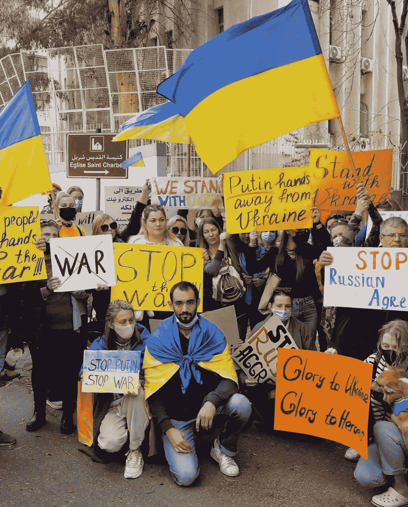

# 你可以帮助乌克兰的两种有意义的方式(2022)

> 原文：<https://medium.com/coinmonks/2-meaningful-ways-you-can-help-ukraine-2022-e81a10f93853?source=collection_archive---------44----------------------->

周四，俄罗斯宣布将在乌克兰“实施一项特殊的军事行动”,该行动已经开始。虽然我们能提供的帮助是有限的，但我们也能做很多重要的事情。

**A woman sobs as she leaves her home in Sievierodonetsk, the Luhansk region, eastern Ukraine, Feb. 24, 2022.**

**乌克兰发生了什么？**

周四，俄罗斯总统弗拉基米尔·普京宣布，俄罗斯将在乌克兰“开展特别军事行动”。乌克兰表示，将以“全力防御”作为回应

世界各国都谴责了这些袭击，并呼应了美国总统拜登的声明，即俄罗斯的入侵将带来“灾难性的生命损失”

据报道，十几个乌克兰城市发生了爆炸，袭击来自地面、空中和海上，包括首都基辅。俄罗斯军队在乌克兰南部的敖德萨登陆。

乌克兰政府报告了数十名士兵的伤亡情况。平民伤亡人数不详。

**A group of protesters in Kyiv, Ukraine, Feb. 25, 2022.**

**我能帮什么忙？**

虽然面对如此规模的地缘政治阴谋，我们中的许多人可能会感到无助，但我们现在已经总结了一些可以帮助乌克兰人民的方法。

## 捐赠

捐[这里](/@justinequalstimee/ukraine-crisis-fund-urgent-aid-for-4-million-give-now-76d9df7edcce?source=friends_link&sk=4ac3665797f2b501758b327324189f85)。

**1。医疗用品和人道主义援助**

*   乌克兰非营利组织 Nova Ukraine 为公民提供从婴儿食品和卫生用品到衣服和家居用品的一切。
*   **需要帮助的人**正在向[当地超过 20 万人](https://www.peopleinneed.net/media/publications/1707/file/ar_2020_eng.pdf)提供人道主义援助。对于那些最需要的人，他们提供食物包、紧急避难所、安全饮用水、卫生用品和取暖用煤。
*   乌克兰红十字会做了大量的人道主义工作，从援助难民到培训医生。
*   **国际医疗团**在第一线，准备帮助公民提供紧急医疗服务，以及精神健康和心理社会支持。该机构还在整个危机期间始终将疫情放在首位，优先考虑新冠肺炎宣传和预防服务，以帮助流离失所的公民远离疫情。

**A demonstrator in support of the Ukrainian people, in Kyiv, Feb. 25, 2022.**

**2。关注社交媒体上的信息账户，了解最新消息**

如果你接收和消费新闻的第一来源是社交媒体，那么关注这些账户，打开你的通知，了解突发事件以及你可以帮助公民的方式。

*   **与乌克兰站在一起**

Stand With Ukraine 是一个社区页面，上传简洁而又消息灵通的 Instagram 帖子和故事，致力于分享基于当前局势的知识总结，以及追随者可以从任何地方支持公民的方式。

*   **斯维多米**

从这个 Instagram 帐户(乌克兰社交媒体媒体的英文版本)获得正在发生的冲突的最新消息，该帐户分享简短但频繁的帖子，准确描述前线正在发生的事情，以及谁受到的影响最大。

*   **团结一致的乌克兰人**

这是一个 Instagram 账户，发布了关于追随者如何支持乌克兰公民的可消化信息，并利用该平台上传了声援该国公民的信息。此前，该账户曾被用于声援黑人的命也是命运动，并教导乌克兰公民如何成为有色人种的盟友。

> *加入 Coinmonks* [*电报频道*](https://t.me/coincodecap) *和* [*Youtube 频道*](https://www.youtube.com/c/coinmonks/videos) *了解加密交易和投资*

# 另外，阅读

*   [有哪些交易信号？](https://coincodecap.com/trading-signal) | [Bitstamp vs 比特币基地](https://coincodecap.com/bitstamp-coinbase) | [买索拉纳](https://coincodecap.com/buy-solana)
*   [ProfitFarmers 回顾](https://coincodecap.com/profitfarmers-review) | [如何使用 Cornix Trading Bot](https://coincodecap.com/cornix-trading-bot)
*   [十大最佳加密货币博客](https://coincodecap.com/best-cryptocurrency-blogs) | [YouHodler 评论](https://coincodecap.com/youhodler-review)
*   [my constant Review](https://coincodecap.com/myconstant-review)|[8 款最佳摇摆交易机器人](https://coincodecap.com/best-swing-trading-bots)
*   [MXC 交易所评论](/coinmonks/mxc-exchange-review-3af0ec1cba8c) | [Pionex vs 币安](https://coincodecap.com/pionex-vs-binance) | [Pionex 套利机器人](https://coincodecap.com/pionex-arbitrage-bot)
*   [我的密码交易经验](/coinmonks/my-experience-with-crypto-copy-trading-d6feb2ce3ac5) | [比特币基地评论](/coinmonks/coinbase-review-6ef4e0f56064)
*   [CoinFLEX 评论](https://coincodecap.com/coinflex-review) | [AEX 交易所评论](https://coincodecap.com/aex-exchange-review) | [UPbit 评论](https://coincodecap.com/upbit-review)
*   [AscendEx 保证金交易](https://coincodecap.com/ascendex-margin-trading) | [Bitfinex 赌注](https://coincodecap.com/bitfinex-staking) | [bitFlyer 点评](https://coincodecap.com/bitflyer-review)