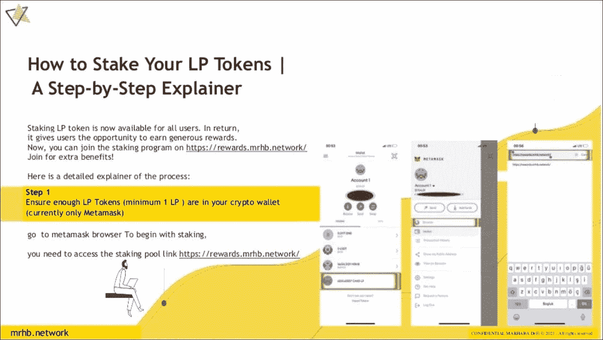

# 为 Pancakeswap 池中的流动性提供商提供 200 万美元的 MRHB！

> 原文：<https://medium.com/coinmonks/2-million-mrhb-for-liquidity-providers-on-pancakeswap-pool-3bf71584168e?source=collection_archive---------64----------------------->

世界上第一个清真和道德分散金融(DeFi)平台 MRHB DeFi 于 2021 年 12 月在流行的 PancakeSwap DEX 上推出了他们的$MRHB 令牌。为了推动上市，该公司留出了 500 万枚 MRHB 代币，奖励流动性提供商(LP)，直到 3 月底。 **MRHB 现已决定将 LP 奖励期延长至 6 月 30 日，并在奖励池中增加 200 万 MRHB 代币。**

对于任何不知道这个机会的人，细节如下:有限合伙人必须向 PancakeSwap 上的 [USDT/MRHB 流动性池](https://pancakeswap.finance/info/pool/0xa32bbaa2a8df16f347250df0f77808bd9a8aa77c)提供流动性，才有资格获得奖励。总共 200 万 MRHB 代币将在三个月内分配给所有参与的有限合伙人。这项奖励是由 MRHB DeFi 作为第三方提供的有条件礼物(“hibah muallaqah bi al-sharth”)，根据伊斯兰教律，这是允许的。

通过在 PancakeSwap 上提供流动性，LP 帮助支持 MRHB token，其使命是为基于信仰的社区和其他人带来道德金融。多年来，加密一直处于无监管和不确定状态；现在是时候在隐世中开辟一个安全的空间了，在那里有道德意识的人可以安心地管理他们的财务。

**LPs 的附加信息**

通过 DEX 提供流动性并非没有风险。所有潜在的有限合伙人必须首先理解“非永久性损失”的概念。如果您对该术语不熟悉，请参考[这篇文章](https://academy.binance.com/en/articles/impermanent-loss-explained)，以便对所涉及的风险有一个明确的了解。

这里有几个对 LP 有用的视频:

*   如何使用 Metamask 钱包购买/交换 MRHB 代币:[https://www.youtube.com/watch?v=A-LqaeY9Ttw](https://www.youtube.com/watch?v=A-LqaeY9Ttw)
*   如何通过在 Pancakeswap 上提供流动性来获得被动收入:[https://www.youtube.com/watch?v=jebBMzes0HY](https://www.youtube.com/watch?v=jebBMzes0HY)

或者，查看 mrhb 博客帖子，获取关于如何在 Pancakeswap: [上增加流动性的](https://mrhbdefi.medium.com/how-mrhb-token-holders-can-earn-passive-income-from-trading-fees-and-5-million-pool-of-mrhb-6848152d51c7)[分步幻灯片](https://mrhbdefi.medium.com/how-mrhb-token-holders-can-earn-passive-income-from-trading-fees-and-5-million-pool-of-mrhb-6848152d51c7)演练 http://mrhbdefi . media . com/how-MRHB-token 持有者可以从交易费用和 500 万美元 MRHB 池中获得被动收入-6848152d51c7

最后，对互联网保持警惕的重要性怎么强调都不为过——诈骗犯比比皆是。永远不要把你的钱包密码给任何人。当向流动性池发送资金时，要在交易所内进行——不要发送到陌生人给你的地址。

MRHB DeFi 永远不会向您索要资金。唯一可以信任的链接和信息是那些通过官方渠道分享的。

**MRHB。网络官方频道**

网站: [https://mrhb.network](https://mrhb.network/)

MRHB 奖励仪表板:[https://rewards . MRHB . network](https://rewards.mrhb.network/)

推特:[https://twitter.com/marhabadefi](https://twitter.com/marhabadefi)

电报:[https://t.me/mdf_official](https://t.me/mdf_official)

电报通知:[https://t.me/marhabadefi_ANN](https://t.me/marhabadefi_ANN)

YouTube:[https://www.youtube.com/c/MarhabaDeFi](https://www.youtube.com/c/MarhabaDeFi)

中:[https://medium.com/@mrhbdefi](/@mrhbdefi)

领英:[https://www.linkedin.com/company/marhabadefi](https://www.linkedin.com/company/marhabadefi)

不和:[https://discord.com/invite/DubSjKmkBX](https://discord.com/invite/DubSjKmkBX)

脸书:[https://www.facebook.com/MRHBDeFi](https://www.facebook.com/MRHBDeFi)

电报(阿拉伯语):[https://t.me/mdf_arabic](https://t.me/mdf_arabic)

电报(俄文):[https://t.me/marhabadefi_russia](https://t.me/marhabadefi_russia)

电报(土耳其语):[https://t.me/MarhabaDefiTR](https://t.me/MarhabaDefiTR)

> 加入 Coinmonks [电报频道](https://t.me/coincodecap)和 [Youtube 频道](https://www.youtube.com/c/coinmonks/videos)了解加密交易和投资

# 另外，阅读

*   [3 商业评论](/coinmonks/3commas-review-an-excellent-crypto-trading-bot-2020-1313a58bec92) | [Pionex 评论](https://coincodecap.com/pionex-review-exchange-with-crypto-trading-bot) | [Coinrule 评论](/coinmonks/coinrule-review-2021-a-beginner-friendly-crypto-trading-bot-daf0504848ba)
*   [莱杰 vs n rave](/coinmonks/ledger-vs-ngrave-zero-7e40f0c1d694)|[莱杰 nano s vs x](/coinmonks/ledger-nano-s-vs-x-battery-hardware-price-storage-59a6663fe3b0) | [币安评论](/coinmonks/binance-review-ee10d3bf3b6e)
*   [Bybit Exchange 审查](/coinmonks/bybit-exchange-review-dbd570019b71) | [Bityard 审查](https://coincodecap.com/bityard-reivew) | [Jet-Bot 审查](https://coincodecap.com/jet-bot-review)
*   [3 commas vs crypto hopper](/coinmonks/3commas-vs-pionex-vs-cryptohopper-best-crypto-bot-6a98d2baa203)|[赚取加密利息](/coinmonks/earn-crypto-interest-b10b810fdda3)
*   最好的比特币[硬件钱包](/coinmonks/hardware-wallets-dfa1211730c6) | [BitBox02 回顾](/coinmonks/bitbox02-review-your-swiss-bitcoin-hardware-wallet-c36c88fff29)