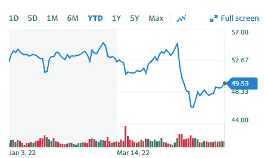

# 熊市中最好买的两只股票

> 原文：<https://medium.com/coinmonks/2-stocks-to-buy-in-bear-market-2f23e2e7657b?source=collection_archive---------17----------------------->

# 威瑞森

Source photo [Verizon Communications Inc. (VZ) Stock Price, News, Quote & History — Yahoo Finance](https://finance.yahoo.com/quote/VZ?p=VZ&.tsrc=fin-srch)

通信巨头威瑞森公司(NYSE: VZ)为全球超过 1 亿的客户和组织提供电话、互联网和视频服务。提供手机服务、互联网接入和直播电视内容带来了经常性收入。

威瑞森去年创造了 1336 亿美元的收入，派发了 104 亿美元的股息。它已经提高了它的…