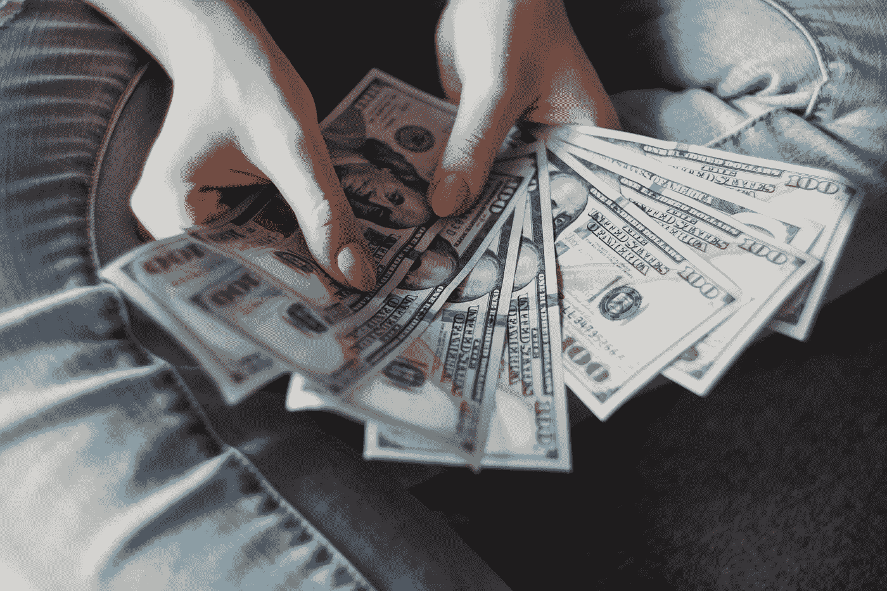

# 2 股神巴菲特股票分割，你现在就可以购买

> 原文：<https://medium.com/coinmonks/2-warren-buffett-stock-split-that-you-can-buy-right-now-14f4ab10d9f8?source=collection_archive---------21----------------------->

Source photo Unsplash.com

沃伦·巴菲特不喜欢股票分割。伯克希尔·哈撒韦公司 A 类股目前的交易价格超过 52.9 万美元，这是他过去做出的承诺。1996 年，当伯克希尔哈撒韦公司引入 b 股作为投资者持有公司股份的一种更廉价的方式时，巴菲特表示同意。