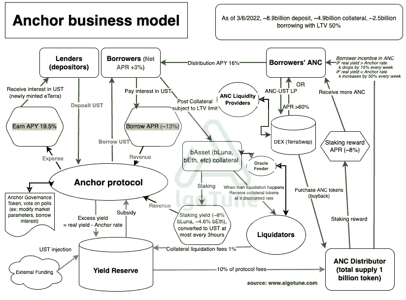
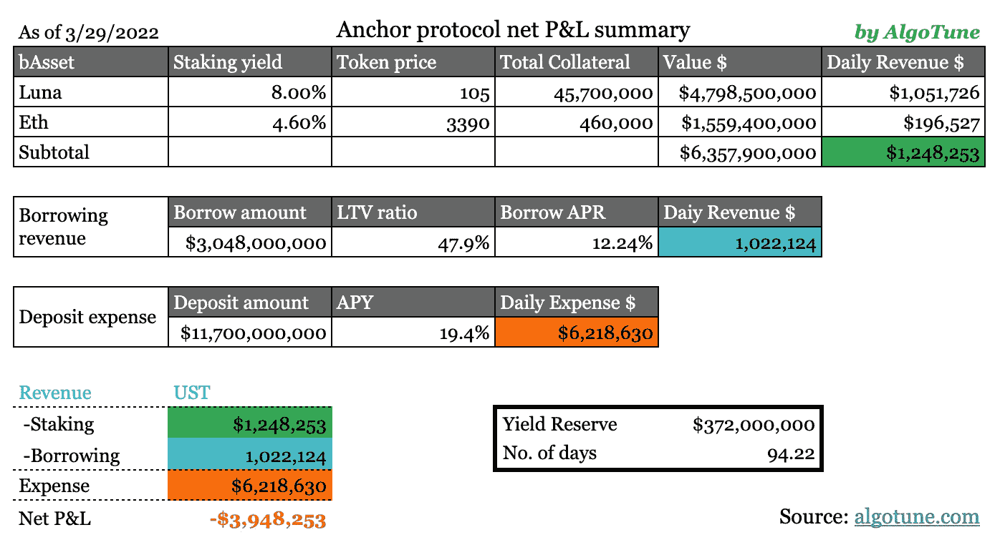
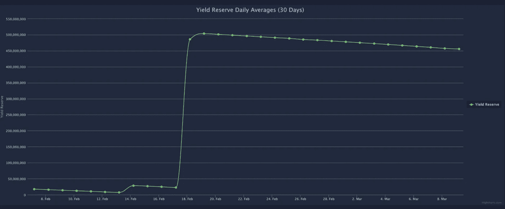

# 20%的收益率？疯子还是天才？第 1 部分—深入研究 Anchor 协议的业务模型

> 原文：<https://medium.com/coinmonks/20-yield-lunacy-or-brilliance-part-1-deep-dive-into-anchor-protocols-business-model-12b5450efd66?source=collection_archive---------16----------------------->

Anchor protocol 成为过去一年最受欢迎的高收益平台之一。自一年前(2021 年 3 月 17 日)推出以来，其存款总额从 0 亿美元增长到 10 亿美元以上，目前是区块链第二大贷款协议。增长率绝对令人着迷。是什么促成了主播的崛起？主播的商业模式可持续吗？作为存款人和借款人有什么风险？潜在的解决方案是什么？这一系列的文章试图解决上述问题，将分为三个部分:

1.  锚协议商业模式的整体观点
2.  生态系统中每个参与者的激励
3.  主要风险和潜在解决方案

**主播介绍**

简而言之，锚协议就像密码世界中的银行一样工作。银行从储户那里获得存款，然后把钱作为贷款贷给个人或企业。借贷利率和存款利率之间的利息差是银行赚钱的方式。在 Anchor 协议中，用户存入 UST(与美元 1:1 挂钩的稳定货币)，可以获得 19.5%的稳定利率。然后，Anchor 向借款人放贷，借款人通过在协议中加入利益证明(PoS)加密资产来抵押贷款。这些 PoS 资产通过以太坊等各种网络赚取赌注收益。Anchor 将收益返还给储户。

> *在研究主播的商业模式之前，先提供一些 Terra 和 Luna 的背景资料。Terra 和 Luna 是西班牙语单词，它们分别表示“地球”和“月亮”。Anchor protocol 是 Terra 区块链生态系统的一部分，这是一个由 Cosmos SDK 提供支持的风险区块链。Terraform Labs 是 Terra 背后的公司，4 年前由 Do Kwon 联合创立。Do Kwon 的愿景是为每个人的金融需求创造一个一站式商店，从支付(通过 Chai)到投资(通过 Mirror 协议)和储蓄(通过 Anchor 协议)。他的目标是将 Terra stablecoins 构建成未来的货币。为了实现这一目标，美元版的稳定货币——UST——需要被尽可能多的用户采用，这些用户实际上是将他们的部分美元系绳或 USDC 转移到了 UST。USD Tether 和 USDC 是世界上最大的两家银行，市值分别为 780 亿美元和 500 亿美元。它们以集中的方式管理，每一种稳定的货币都由法定流通货币——美元支持。与 USD Tether 和 USDC 不同，UST 是分散的，并由 Luna 提供算法支持。自 2020 年 9 月推出以来，由于其可扩展性，它迅速受到欢迎，现在以超过 100 亿美元的市值排名第四(我们可能会在未来的帖子中谈论 stablecoins，因为它已经成为加密生态系统中如此重要的一部分)。概括地说，稳定货币是使用各种机制与法定货币(如美元、欧元、韩元和日元)挂钩的加密货币类型。一方面，稳定币具有法定货币的价格稳定性，另一方面，稳定币保持了加密货币(如以太坊和比特币)的可编程属性。*
> 
> *什么是露娜？月神是区块链土地的土著象征，它为所有者提供赌注奖励和统治权。更重要的是，它被用来吸收 UST 的价格波动。简而言之，每铸造一个新的 UST，就有一个等量的月神被烧掉。当 UST 偏离 1:1 挂钩时，该协议会激励用户烧掉 UST 或露娜，以使供需动态恢复平衡。露娜的价格由市场决定，但它的价值与 UST 在 Terra 生态系统中的使用成正比。由于 Terra 生态系统的快速经济增长，Luna 迅速成为全球十大代币，价值超过 300 亿美元。*
> 
> *以上就是关于背景信息的全部内容。这是一个非常强大和不断发展的生态系统，当然上面的简要描述无法涵盖所有细节。在以后的帖子中，我们肯定会回到 Terra/Luna。*

所以让我们继续锚定。

Anchor 是 DeFi suites 的一部分，旨在颠覆传统储蓄行业。在 Anchor 之前，还有类似的 DeFi 产品，如 Compound 和 Curve。但这些产品中的大多数都无法提供稳定的收益，因为存款利率与借款利率相关，而借款利率又取决于资金池的利用率(利用率=借款价值/存款价值)。例如，在复合协议中，利用率和存款利率随着 ETH 价格波动——这是我们在之前的峰谷周期中反复观察到的循环模式。为了解决这个周期性问题，Anchor 引入了稳定收益概念，结合了两个最重要的区块链创新:PoS(股权证明)和 stablecoins (UST)。此外，Anchor 利用收益率储备进一步稳定存款利率。由于向储户提供 19.5%的 APY 和借款人的正净借款利率(借款人获得借款报酬)，Anchor protocol 吸引了竞争激烈的农业领域的所有注意力，并在一年内将其存款基础从零增长到超过 110 亿美元。

它实际上是如何工作的？

我们在下面创建了一个流程图，以提供协议如何工作的整体视图。

商业模式中的一个重要组成部分是左下方的产量储备。收益率准备金旨在成为一个缓冲区，为存款人稳定 APY 提供稳定性。收益率储备收到来自 Terra 的外部资金启动。当锚协议产生的收入大于支出时，净利润进入产出储备。

我们将超额收益率定义为实际收益率(收入)和锚定利率(费用)之间的差额。

*   当超额收益率为正时，UST 流入收益率储备。
*   当超额产量为负时，UST 从产量储备中流出以补贴协议

另外，收益准备金在贷款清算时收取 1%的抵押物清算费。如果该协议产生净收入，其中的 10%将用于回购 ANC 令牌(我们将在下一篇文章中讨论 ANC 令牌)。

source: [www.algotune.com](http://www.algotune.com)

正如我们在存款/借款历史图表中注意到的，存款价值已经大大超过了借款价值。借款人产生的收入根本无法满足支付给储户的成本。在下表中，我们试图计算出有多少锚在补贴用户，并估计这种情况会持续到下一次注入。

source: www.algotune.com

截至 2022 年 3 月 29 日，Anchor Dashboard [链接](https://app.anchorprotocol.com/)显示有 117 亿存款，64 亿抵押物，30 亿借款。根据提供的数字，我们估计 Anchor 每天从赌注中产生 120 万美元的收入，假设 Luna 的赌注收益率为 8%，ETH 为 4.6%。使用 12.24%的借款年利率(每天波动)，我们估计每天从借款中产生另外 100 万美元的收入。在费用方面，估计每天要支付 620 万美元。扣除成本后，Anchor protocol 每天会产生 395 万美元的*净亏损*，由收益准备金提供资金。鉴于目前的支出速度，收益率储备估计可持续约 94 天。有趣的是，2022 年 2 月 18 日，当产量储备接近枯竭时，Terra 刚刚向产量储备注入了 4.5 亿美元 ust。几天后，Luna Foundation Guard (LFG)完成了由 Jump Crypto 和三箭资本(3AC)牵头的 10 亿美元私人代币销售。它展示了生态系统的财务实力，自注入以来，存款额进一步从 60 亿美元增加到 90 亿美元。存款和借款之间的差距变得更大了。因此，产量储备的消耗速度加快了。我们认为，如果协议没有重大改变，这从长远来看是不可持续的。

source: [https://mirrortracker.info/anchor](https://mirrortracker.info/anchor)

在下一篇文章中，我们将放大生态系统的每个部分，并使用说明性的例子来理解激励机制是如何工作的，以及它们如何可能对每个玩家不起作用。敬请期待！

**参考文献**

[1] [Terra 文档](https://docs.terra.money/docs/learn/protocol.html) —关于 Terra 协议

[2] [锚协议](https://docs.anchorprotocol.com/)

[3]锚点协议[白皮书](https://www.anchorprotocol.com/docs/anchor-v1.1.pdf)

[4] [推特](https://mobile.twitter.com/stablekwon/status/1494470634042060800)关于最新注入的公告

[5]LFG 10 亿美元[融资](https://www.theblockcrypto.com/post/134871/luna-founation-guard-token-sale)

> *加入 Coinmonks* [*电报频道*](https://t.me/coincodecap) *和* [*Youtube 频道*](https://www.youtube.com/c/coinmonks/videos) *了解加密交易和投资*

# 另外，阅读

*   [Bookmap 点评](https://coincodecap.com/bookmap-review-2021-best-trading-software) | [美国 5 大最佳加密交易所](https://coincodecap.com/crypto-exchange-usa)
*   最佳加密[硬件钱包](/coinmonks/hardware-wallets-dfa1211730c6) | [Bitbns 评论](/coinmonks/bitbns-review-38256a07e161)
*   [新加坡十大最佳加密交易所](https://coincodecap.com/crypto-exchange-in-singapore) | [购买 AXS](https://coincodecap.com/buy-axs-token)
*   [红狗赌场评论](https://coincodecap.com/red-dog-casino-review) | [Swyftx 评论](https://coincodecap.com/swyftx-review) | [CoinGate 评论](https://coincodecap.com/coingate-review)
*   [投资印度的最佳密码](https://coincodecap.com/best-crypto-to-invest-in-india-in-2021)|[WazirX P2P](https://coincodecap.com/wazirx-p2p)|[Hi Dollar Review](https://coincodecap.com/hi-dollar-review)