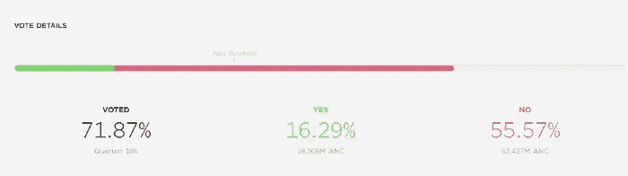
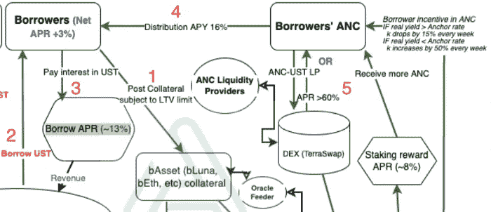
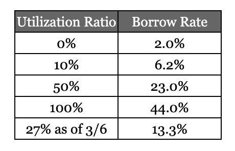
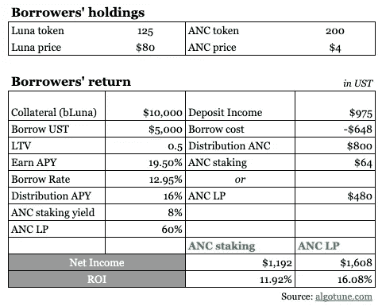
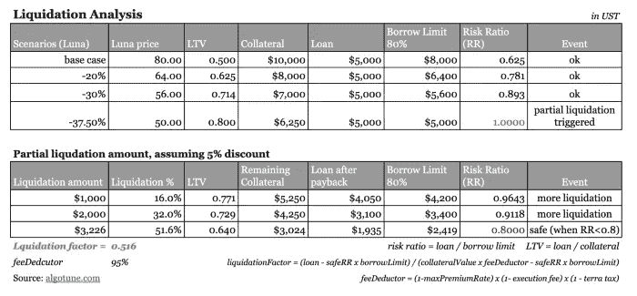
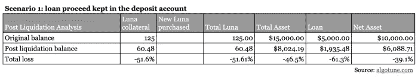
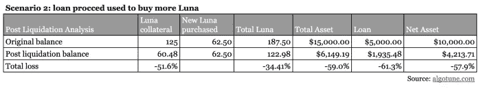

# 20%的收益率？疯子还是天才？第 2 部分—深入研究 Anchor 协议的业务模型

> 原文：<https://medium.com/coinmonks/20-yield-lunacy-or-brilliance-part-2-deep-dive-into-anchor-protocols-business-model-aba1a2e0152a?source=collection_archive---------7----------------------->

在我们之前的[帖子](/algotune/deep-dive-into-anchor-protocols-business-model-part-1-b0d02c522cf)中，我们展示了 Anchor 商业模式的流程图，讨论了收益储备的功能，并提出了对协议可持续性的关注。在本帖中，我们将讨论生态系统中每个参与者的激励机制。

在锚协议中，生态系统中有 4 个主要参与者:存款人、借款人、清算人和 ANC 流动性提供者。

# 存款人

储户是最直白易懂的。激励因素是获得 19.5%的年回报率。储户首先需要得到 UST 稳定的货币。一旦存款人将 UST 存入 Anchor 协议，他们将收到“aUST ”,该利息将一直累积到他们取款的那一天。所有的现金流都在 UST，算法上与美元 1:1 挂钩(我们在之前的[帖子](/algotune/deep-dive-into-anchor-protocols-business-model-part-1-b0d02c522cf)中简单提到了挂钩机制)。自产品上市以来，APY 一直保持在 20%左右。该比率可以根据锚定治理而变化。该逻辑类似于其他区块链协议，其中通过锚令牌(ANC)的股份来管理治理。ANC 用于投票，投票权与 ANC 的金额成正比。在协议中可用的投票类型中，“修改市场参数”允许协议改变锚货币市场中的参数。换句话说，19.5%的 APY 将保持不变，直到现有非国大股东提出并批准一项提案。

值得一提的是，在撰写本文时，有一个与赢得 APY 相关的活跃的[民意调查](https://app.anchorprotocol.com/poll/18)。该提案旨在将存款金额超过 50 万 UST 的 APY 降至 10%。显然，它没有得到很好的接受，目前的数据显示，超过 56%的人投了反对票，所以它是非常不可能通过。

Source: [https://app.anchorprotocol.com/poll/18](https://app.anchorprotocol.com/poll/18)

# 借用人

借款人是生态系统的关键组成部分。让我们放大借款人的现金流和激励。

source: algotune.com

1 借款人以抵押资产(bAssets)的形式在 Anchor 协议上提交抵押品。目前可用的选项有键合 Luna (bLuna)和键合 Ether (bETH)。什么是低音提琴？简而言之，债券资产是一种在区块链中具有流动性的有利害关系的衍生资产。它们是流动的，因为它们可以自由交易，而不是锁定在区块链中赚取赌注回报的赌注资产。它们是衍生品，因为它们有权获得赌注回报。债券资产与其基础资产 1:1 挂钩，以允许价格发现。作为债券资产的持有人，您将获得相应基础资产的赌注回报。例如，如果你拥有一些 ETH，你可以通过 [Lido](https://lido.fi/) (以太坊的一个赌注协议)将它们转换成 bETH。在向 Lido 支付费用(用户赌注奖励的 10%费用)后，您将获得 ETH 条款的赌注奖励(4.5%)。如果你决定将贝丝作为抵押品，你将无权获得赌注奖励，这些奖励将传递给主播协议。同样的机制也适用于 Luna。

2 借款人借 UST。然后，他们可以将 UST 存回锚中，赚取 19.5%的 APY，或者用所得购买更多的 Luna、ETH 或其他加密货币，以增加他们的加密敞口。借款人可以借入的 UST 金额受 LTV(贷款价值比)限制。对于 50%的 LTV 限制，这意味着借款人可以借用高达 50%的抵押品价值。例如，如果一个借款人提供相当于 10，000 美元的 UST 币作为抵押，他/她最多可以借 5，000 美元的 UST。存在相关的清算风险，即当抵押品价值崩溃时，借款人需要提交额外的抵押品，否则抵押品将被清算。值得一提的是，在关于主播治理的第 15 次调查中，2022 年 2 月 7 日，LTV 对布伦娜的限制从 50%增加到 80%(贝丝的 60% LTV 限制在此次调查中没有变化)。

在 UST，借款人支付利息。借款利率是由市场对稳定债券的供给和需求通过算法决定的。下面的公式和表格提供了借款利率如何随利用率成比例变化的最准确的图像。

*   借款利率=利用率 x 利息乘数+基本利率
*   其中 1)利用率=借入的稳定存款/存入的稳定存款(应计利息值)，2)利息乘数设定为 0.42，3)基本利率设定为 2%，
*   截至 2022 年 3 月 6 日，计算的借款率约为 13%，利用率约为 27%。

borrow rates vs utilization rates

借款者收到分发令牌作为使用锚协议的激励。锚令牌(ANC)是协议的本地治理令牌，可用于创建新的轮询。赌注下的 ANC 可以用于投票(一个人赌注下的 ANC 令牌越多，他的投票权就越大)。理论上，ANC 的内在价值应该与 Anchor 的 AUM(管理的资产)成比例。在过去的一年里，价格在 1.3 美元至 6 美元的大范围内波动。截至 2022 年 3 月 6 日，ANC 的交易价格为每枚代币 4 美元。总共有 4 亿个代币(总最大供应量的 40%)将在至少 4 年的时间内作为借款人奖励进行算法分配，即每年最多分配 1 亿个 ANC，这相当于 4 亿美元的 UST 等值。使用 25 亿美元的借款基数，计算出的分布 APY 约为 16% (= 4 亿/25 亿总借款)，这与 Anchor 仪表板中显示的相符。ANC 分配利率每周根据当前存款利率和目标存款利率之间的关系进行调整。基本逻辑是，当当前存款利率低于目标利率时，提高排放率以吸引更多借款人。为了控制年度供应量，目前每个区块的上限约为 20 ANC。

5 借款人如何处理他们的 ANC 代币？第一，他们可以和他们的国民大会一起提议和投票(例子是前面提到的 15 号和 18 号投票)。第二，在他们下注 ANC 后，他们可以获得额外的 8%下注收益(以 ANC 支付)。最后，他们可以选择向 TerraSwap 提供流动性，以赚取超过 60%的 APR。简而言之，ANC 令牌用于激励借款人借入 UST 稳定债券，并积极参与生态系统。

从借款人的角度来看，当仪表板显示正的净借款利率时，这意味着借款人因分配 APY 超过抵消借款利率而获得借款报酬(截至 2022 年 3 月 6 日为 3% = 16% -13%)。

为了说明借款人可以赚多少钱，让我们使用前面的例子:借款人提交 10，000 美元的 bLuna 抵押品，以借入 5，000 美元的 UST，并将 UST 放回锚中。如果借款人更积极，愿意向 ANC-UST TerraSwap 池提供流动性，他/她可以从他/她收到的 ANC 代币中额外赚取 60%的 APR。当然，正如我们在 [DEX](/algotune/decentralized-exchanges-part-2-b8e200402593) 上的[帖子](/algotune/uniswap-unicorn-at-work-part-2-17040e6a71a5)中所阐述的，流动性提供者会遭受非永久性损失。如果借款人采取更保守的方法，他/她可以简单地将 ANC 代币下注，赚取 8%的下注年利率。

如下表所示，假设 ANC 价格保持在 4 美元不变，即 800 美元 UST 等值，借款人一年内将获得 200 个 ANC 代币作为奖励。他/她从他/她的$5，000 存款中进一步赚取$975。借款费用为 648 美元。考虑 ANC 和 LP 后，这两种情况下的 ROI(投资回报)分别为 **~12%和 16%** 。尽管总投资回报率低于储户 19.5%的 APY，借款人仍然很高兴，因为他们可以在不出售资产的情况下保持加密货币的长期敞口。作为借款人要考虑的一件重要事情是与 ANC 代币相关的价格风险。假设 ANC 价格下降 50%至 2 美元，投资回报率将分别下降至 7.6%和 9.7%。借款人应该考虑的另一个风险因素是清算风险。我们将在下一节讨论这个问题。

source: algotune.com

# 清算人

清算人在 Anchor 的生态系统中扮演着非常关键的角色。他们是储户存款原则的保护者。当 LTV 比率超过限制时，他们会观察并清算抵押品——在 2 月初，bLuna 抵押品的比率已经提高到 80%。在清算过程中，清算人提交具有优先折扣率的投标。具有最低折扣的投标首先被执行。然后，清算人向 UST 支付清算抵押品的费用。收益用于偿还借款人的贷款。为了激励清算人积极监控风险贷款并触发清算，清算价值的 1%被预留出来支付给清算人。除此之外，清算价值的另外 1%作为清算费用被发送到 Anchor 的收益储备。

有两种类型的清算:完全清算和部分清算。阈值为 2000 美元 UST，当抵押品价值低于该阈值时，将被完全清算。

为了说明这是如何工作的，我们将再次使用前面的例子:一个借款人提交 10，000 美元的 bLuna 抵押品，以借入 5，000 美元的 UST。借款限额现在是 80%，这意味着只要 LTV 低于 0.8，抵押品就是安全的。在 Luna 价格下跌超过 37.5%(如下表所示)的情况下，抵押品从 1 万美元下跌至 6.25 万美元，并触发部分清算。

为了证明清算人在清算过程中赚了多少钱，让我们假设总折扣为 5%。这意味着每 100 美元的 UST 抵押品价值，借款人可以得到 95 美元的 UST。在支付的 5 美元中，1 美元用于支付 Terra 税，另外 1 美元作为协议费进入收益准备金，3 美元进入清算人，即清算价值的 3%。

风险比率定义为贷款除以借款限额。0.8 或更低的安全风险比率被认为是安全的，即 LTV 需要降低到 0.8(借款限额)x 0.8(风险比率)= 0.64。如第二个表所示，需要清算担保品的 3，226 美元 UST，以使贷款回到安全状态(RR -> 0.8)。从数学上讲，清算系数(要清算的担保品的百分比)=(贷款-安全率 x 借款限额)/(担保品价值 x 进料喷射器-安全率 x 借款限额)=(5000–0.8 x 5000)/(6250 x 95%-0.8 x 5000)= 0.516。因此，我们得出总清算金额= 6，250 美元 x 0.516 = 3，226 美元 UST，其中 5%(161 美元)归锚协议/特拉区块链/清算人所有。剩余的 3065 美元 UST 收益用于偿还部分 5000 美元 UST 贷款。在部分清算后，借款人以 3024 美元的 Luna 抵押品结束，以 0.64 的利率从 LTV 获得 1935 美元的 UST 借款。

source: algotune.com

清算事件中借款人损失多少？我们使用以下两种情景来说明借款人面临的清算风险。

**情景 1** :如果借款人用借款收益投资 Anchor 的存款账户，随着 37.5%的 Luna 价格暴跌，他/她将损失 39.1%的净资产——折价出售部分抵押品产生的 1.6%的差额。

**情景 2** :如果借款人用所得购买更多的 Luna，在 37.5%的 Luna 价格下，他/她将损失 57.9%的净资产——传统智慧总是说杠杆是一把双刃剑。

# ANC 流动性提供者

锚协议的最后一个主要组成部分是 ANC 流动性提供者，它向 ANC-UST Terraswap 对提供流动性。借款人受到 ANC 代币的激励，有了流动性池，他们可以很容易地将 ANC 转换回 UST。

作为 ANC 流动性提供者，他/她有强烈的参与动机，因为通过提供流动性可以获得超过 60%的 APR(受制于非永久性损失)。

到目前为止，我们已经讨论了 Anchor 生态系统中的四个主要参与者，在下一篇文章中，我们将讨论这种商业模式的主要风险以及减轻这些风险的潜在解决方案。

> 加入 Coinmonks [电报频道](https://t.me/coincodecap)和 [Youtube 频道](https://www.youtube.com/c/coinmonks/videos)了解加密交易和投资

# 另外，阅读

*   [BlockFi 信用卡](https://coincodecap.com/blockfi-credit-card) | [如何在币安购买比特币](https://coincodecap.com/buy-bitcoin-binance)
*   [火币交易机器人](https://coincodecap.com/huobi-trading-bot) | [如何购买 ADA](https://coincodecap.com/buy-ada-cardano) | [Geco。一次复习](https://coincodecap.com/geco-one-review)
*   [加密复制交易平台](/coinmonks/top-10-crypto-copy-trading-platforms-for-beginners-d0c37c7d698c) | [五大 BlockFi 替代方案](https://coincodecap.com/blockfi-alternatives)
*   [CoinLoan 点评](https://coincodecap.com/coinloan-review)|[Crypto.com 点评](/coinmonks/crypto-com-review-f143dca1f74c) | [火币保证金交易](/coinmonks/huobi-margin-trading-b3b06cdc1519)
*   [Bybit vs 币安](https://coincodecap.com/bybit-binance-moonxbt)|[stealth x 回顾](/coinmonks/stealthex-review-396c67309988) | [Probit 回顾](https://coincodecap.com/probit-review)