# 2021 年 NFT 年度报告:2022 年 NFT 会是 Web 3.0 的未来吗？

> 原文：<https://medium.com/coinmonks/2021-nft-annual-report-will-nft-be-the-future-of-web-3-0-in-2022-cd2096506405?source=collection_archive---------6----------------------->

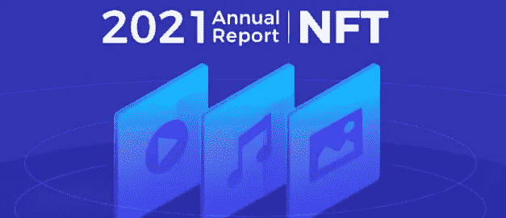

数据来源: [2021 年 NFT 年报仪表盘](https://www.footprint.network/guest/dashboard/nft-annual-report-dashboard-in-2021-fp-0eea200c-b571-4ebe-a005-524b121a5102?channel=u-DBc983)

虽然 NFT 的概念自 2014 年以来就一直存在，但直到去年，它们才突然成为世界各地的头条新闻。正如 DeFi 将资本带入加密市场一样，NFT 也将人们带进了市场——带着令人困惑的艺术品、利润丰厚的游戏，甚至一些实际的用例。

# 什么是 NFT？

NFT 或不可替代的令牌是唯一的、不可分割的令牌，可以以分散的方式代表数字资产的所有权。它们天生的防伪特性和交易过程的透明性，使它们成为具有里程碑意义的互联网创新。

**2021 年发生了什么？**

去年对 NFT 来说是疯狂的一年，因为他们首先引起了密码爱好者的注意，然后是机构投资者。让我们看看 2021 年的 [NFT 数据，看看哪些项目表现最好。](https://www.footprint.network/guest/dashboard/nft-annual-report-dashboard-in-2021-fp-0eea200c-b571-4ebe-a005-524b121a5102?channel=u-DBc983)

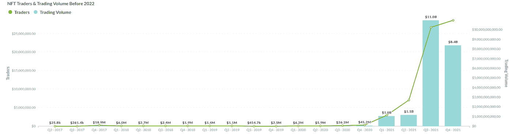

*Footprint Analytics：Quarterly Trading Volume and Traders Before 2022*

根据[足迹分析](https://www.footprint.network/)，截至 2021 年底，非金融交易的累计交易量为 215 亿美元，而 2021 年前为 1.2 亿美元，累计交易量增长了 200 倍。交易者的数量也翻了一番，从不到 130 万人增加到 2021 年的 6540 万人，增长了 50 倍。

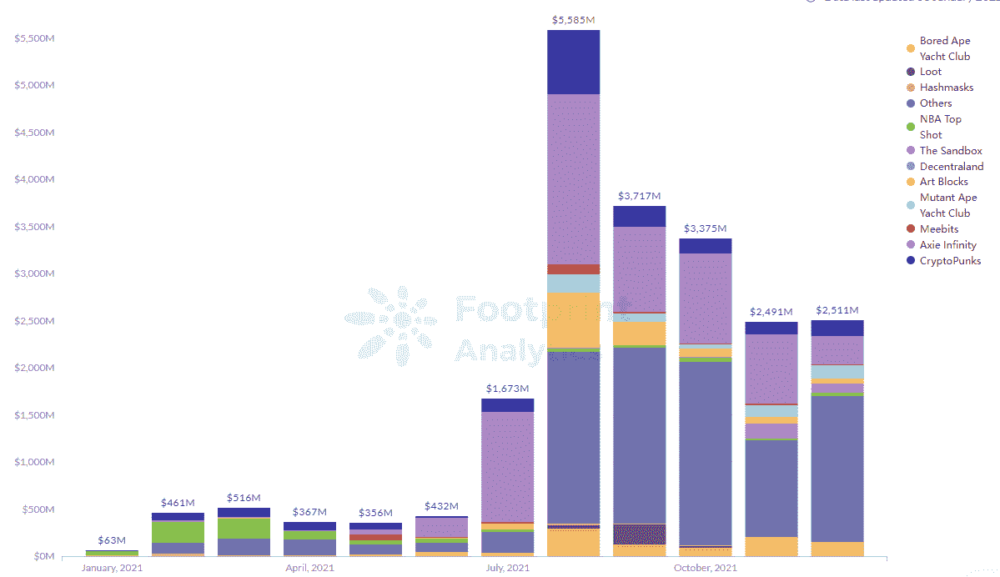

*Footprint Analytics — NFT Monthly Trading Volume by Projects in 2021*

*   **在 Q1 和 Q2，随着体育联盟、艺术家和名人采用 NFT，NFT 开始增长**

今年 2 月，Dapper Labs 的 NBA Top Shot 以 NFT 形式出售视频集锦，收入 2.26 亿美元，超过了整个 NFT 市场去年的收入。这引起了其他类别的秘密投资者的注意。

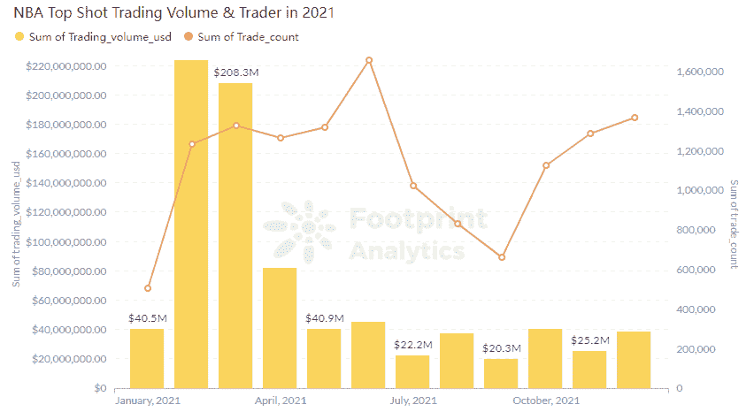

*Footprint Analytics — NBA Top Shot Trading Volume & Trader in 2021*

3 月 11 日，皮普尔在佳士得拍卖会上以 6900 万美元的价格出售了他的数字作品《头 5000 天》，这是在世艺术家的第三大单次拍卖。

3 月 23 日，推特首席执行官[杰克·多西 2006 年的第一条推特](https://twitter.com/jack/status/20?s=20)以 NFT 的身份卖出了 290 万美元，进一步推动了热潮。

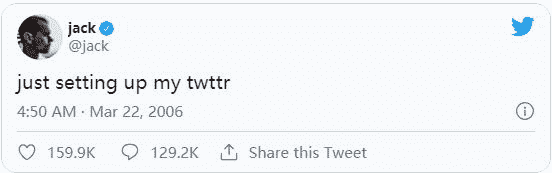

其他阿凡达项目，如幼虫实验室的 2D 密码朋克和 3D Meebits，已经获得了媒体和公众的认可。

*   **在第三季度，GameFi 开始统治 NFT 领域**

Axie Infinity 是最初突破性的“玩到赚”区块链游戏，8 月份的交易额达到 18 亿美元，与 2021 年 1 月相比增长了 1500%，交易者有 280 万人。

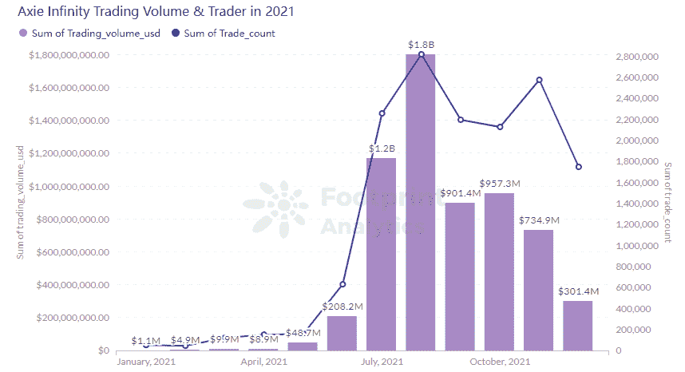

*Footprint Analytics — Axie Infinity Trading Volume & Trader in 2021*

也许更不可思议的是，游戏的代币 AXS 的价格与所有已知的加密趋势背道而驰，脱离了 BTC 的价格走势。

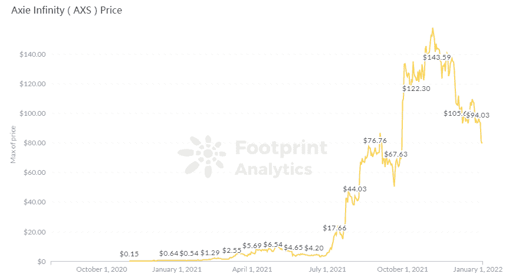

*Footprint Analytics — AXS Price*

生成艺术项目 Art Blocks 的交易量也在 8 月份创下了 5.87 亿美元的历史新高，交易人数超过了 2 万人。从那以后，它成为了 NFT 销售额最大的艺术项目。

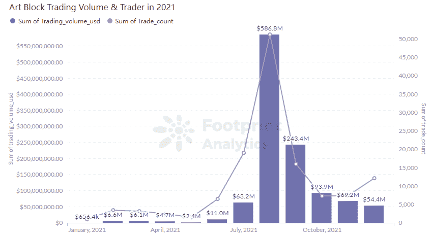

*Footprint Analytics — Art Blocks Trading Volume & Trader in 2021*

在外人看来，Loot 似乎是 NFT 突破项目中最奇怪的例子。与大多数出售符号化图像的其他游戏不同，战利品 NFT 由 8 行文字组成，拼出随机生成的幻想冒险者装备——战锤、龙皮腰带、护身符等。目前还没有一款游戏可以让玩家将这些应用到游戏中。

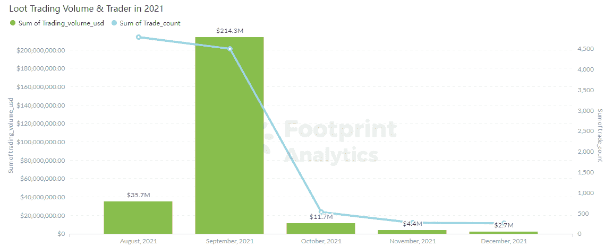

*Footprint Analytics — Loot Trading Volume & Trader in 2021*

无聊猿游艇俱乐部(BAYC)在名人中变得特别受欢迎。今年 8 月，NBA 球星斯蒂芬·库里花了 18 万美元买了一只无聊的猿猴。其他所有者包括吉米·法伦，罗根·保罗和沙奎尔·奥尼尔。

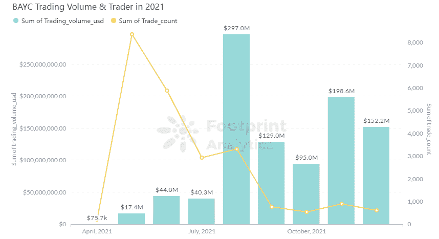

*Footprint Analytics — BAYC Trading Volume & Trader in 2021*

*   **第四季度，元宇宙房地产变得珍贵**

10 月 28 日，脸书宣布将更名为 Meta，并在元宇宙上全力以赴。

这挑战了公众的想象力，导致人们开始猜测数字房地产的未来价值。到 2021 年底，越来越多的投资公司开始在虚拟世界购买土地，如[、沙盒](https://www.footprint.network/guest/dashboard/the-sandbox-dashboard-fp-ad5201b9-83ab-443c-8761-0e9a04b8c368?channel=u-DBc983)和[分散土地](https://www.footprint.network/guest/dashboard/decentraland-dashbosard-fp-4da47c18-2d94-4ae7-a3e0-168680c0d88b?channel=u-DBc983)。11 月 23 日，分散地的一块数字土地以 243 万美元的价格售出。

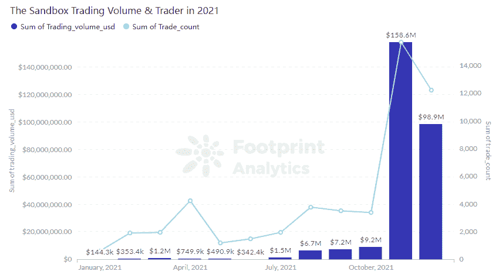

*Footprint Analytics — The Sandbox Trading Volume & Trader in 2021*

# **NFT 2021 概要:繁荣多，势头小**

柯林斯字典将 NFT 评为 2021 年度单词。

诚然，NFT 几个子类别的价格爆炸吸引了人们对这种新兴数字技术的极大关注。然而，没有一家公司能够维持几个月以上的势头，之后投资者发现了一个新的有前途的利基市场，交易量在之前的几个月有所下降。

# **2022 年 NFTs 将如何演进？**

*   **更多行业和品牌**

2021 年下半年，许多品牌开始参与 NFT 市场，包括耐克、阿迪达斯、百威啤酒和迪士尼。很可能会有更多的品牌和公司加入进来。

*   **创作者将专注于解决现实问题**

NFT 仍然是密码行业的一个非常年轻的领域。随着交易量、资产流动性和新用户数量的增加，以及 Web 3.0 基础设施的发展，创作者将努力解决现实世界中的问题，如版权索赔和数字资产验证。

*   **NFT 将补充实物资产**

出于多种原因，一些创新型公司已经开始使用区块链技术在链上发行有形资产。例如，音乐 NFT 开始改变艺术家从他们的作品中获利的方式。