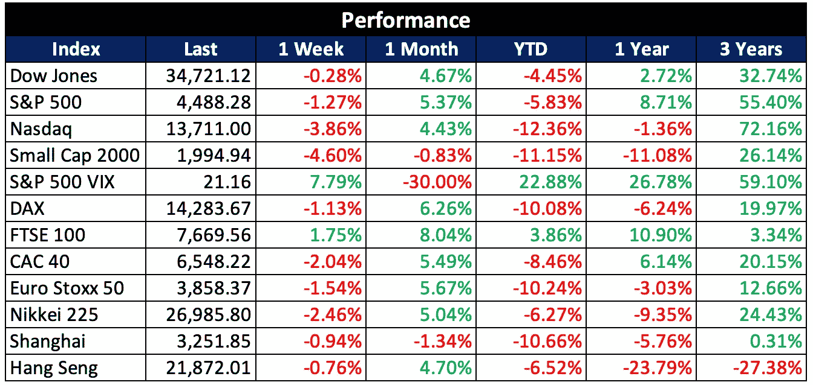
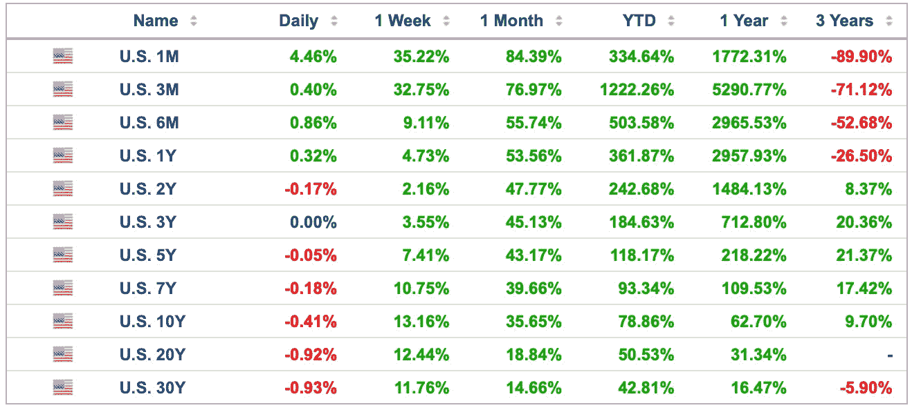
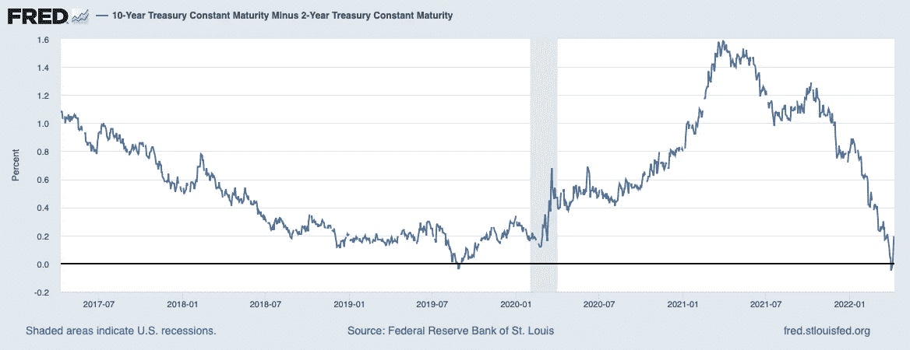
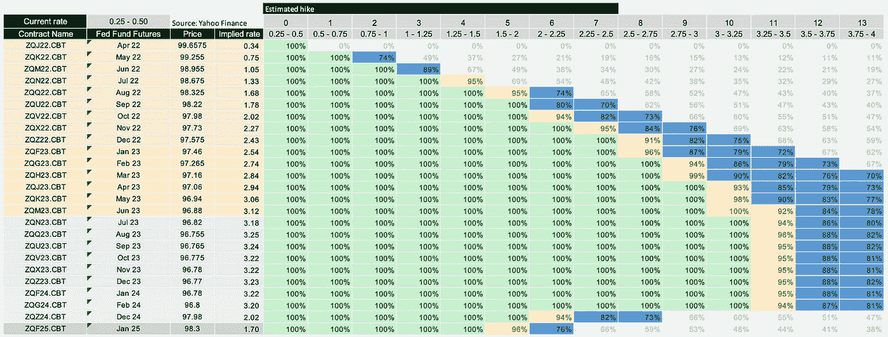
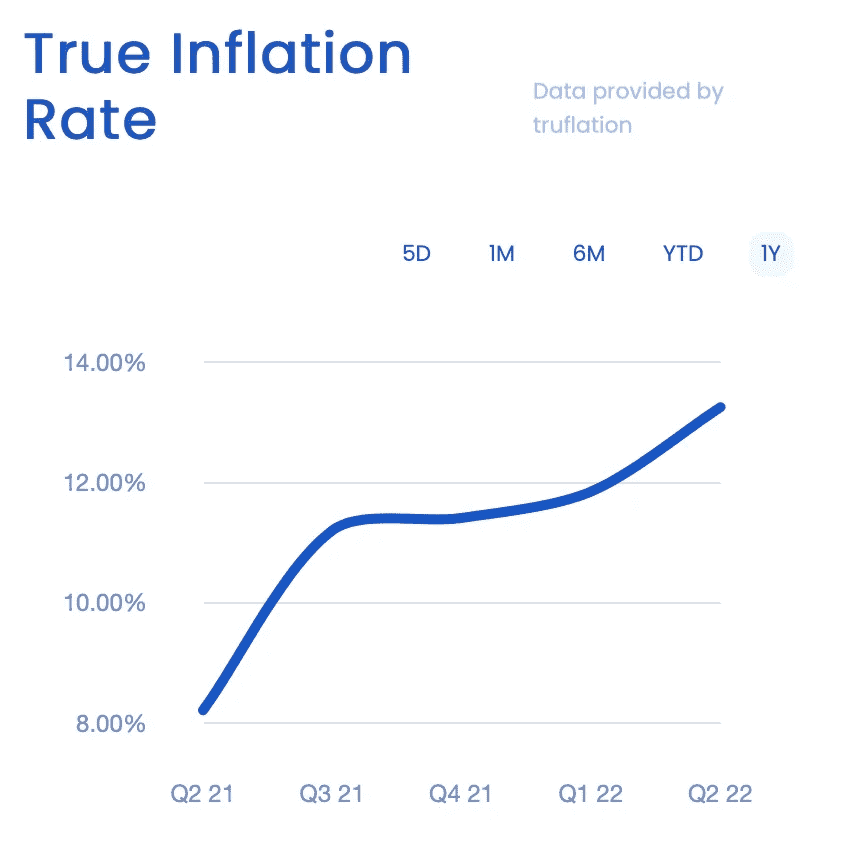
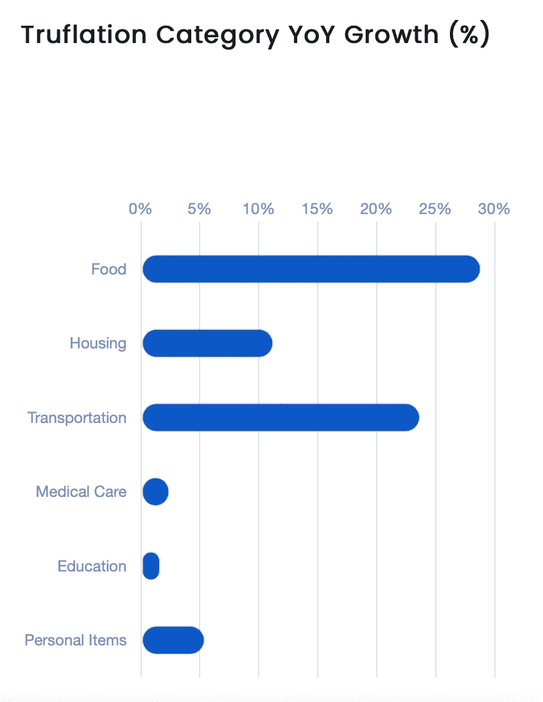
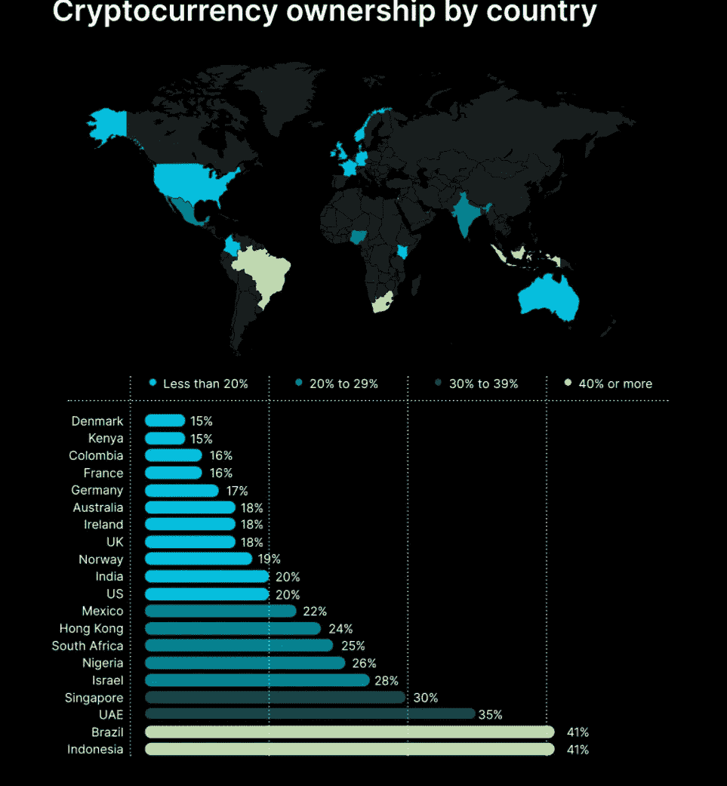
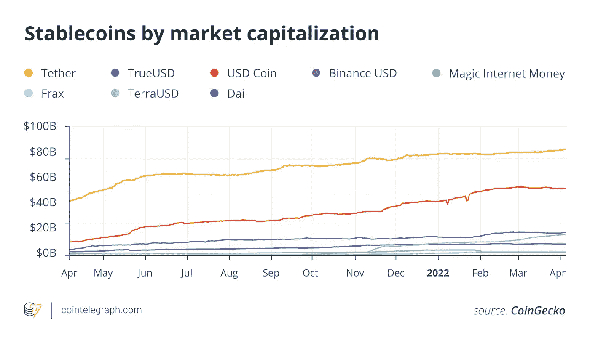

# 2022 04 10 YOLO 市场周刊摘要

> 原文：<https://medium.com/coinmonks/2022-04-10-yolo-markets-weekly-recap-2a7889be3820?source=collection_archive---------68----------------------->

在 Medium、Twitter 和 Instagram @nerdzvest 上关注我

# 关键事件

> **三月份世界粮食价格创历史新高**

随着乌克兰战争抑制农作物供应，全球食品价格正以有史以来最快的速度飙升，给消费者带来更多通胀压力，并加剧全球饥饿危机。

[https://www . Bloomberg . com/news/articles/2022-04-08/food-prices-jump-most-on-record-as-war-sparks-supply-chaos？srnd =高级-亚洲](https://www.bloomberg.com/news/articles/2022-04-08/food-prices-jump-most-on-record-as-war-sparks-supply-chaos?srnd=premium-asia)

> **上海仍处于封锁状态**

随着上海继续封锁，一些人在购买食品杂货时面临问题，甚至不得不转向微信购买面包和牛奶(易货贸易)。

[https://www . Bloomberg . com/news/articles/2022-04-08/Shanghai-s-locked-down-elite-are-joining-hunt-for-杂货？srnd=premium-asia](https://www.bloomberg.com/news/articles/2022-04-08/shanghai-s-locked-down-elite-are-joining-hunt-for-groceries?srnd=premium-asia)

> **摩根士丹利将重点转移到“被忽视的”家族理财室领域**

摩根士丹利(Morgan Stanley)一直在开发面向家族理财室的产品，将公司带入新的平台，并增加了超过 250 亿美元的资产。该银行还在开发一个撮合平台，初创企业可以直接向该银行融资，利用家族理财室和其他超高净值客户的资金。

[https://www . CNBC . com/2022/04/08/mor gan-Stanley-unveils-family-office-unit-looking-to-serve-rich-rich-of-rich . html](https://www.cnbc.com/2022/04/08/morgan-stanley-unveils-family-office-unit-looking-to-serve-richest-of-the-rich.html)

> **特斯拉和埃隆·马斯克因奥斯汀派对、加密采矿试点和 Twitter 收购而登上头条**

特斯拉首席执行官埃隆·马斯克举办了“网络竞技”派对，为奥斯汀工厂揭幕，该工厂旨在每年生产 50 万辆 Model Y 汽车。马斯克还调侃了仍在开发中的产品，包括 Cybertruck 和“robotaxi”。

[https://www . CNBC . com/2022/04/07/Tesla-CEO-elon-musk-hosts-cyber-rodeo-party-to-open-Austin-factory . html](https://www.cnbc.com/2022/04/07/tesla-ceo-elon-musk-hosts-cyber-rodeo-party-to-open-austin-factory.html)

埃隆·马斯克在推特上说，特斯拉可能会直接大规模进入锂矿开采和提炼业务，因为制造电池的关键成分金属的成本已经变得如此之高。

[https://www . CNBC . com/2022/04/08/elon-musk-telsa-may-have-get-into-mining-refining-lithium-directly . html](https://www.cnbc.com/2022/04/08/elon-musk-telsa-may-have-get-into-mining-refining-lithium-directly.html)

Adam Back 宣布，Blockstream 和 Block 正在德克萨斯州建造一个试点加密矿，将由特斯拉太阳能装置和电池供电。

[https://www . coin desk . com/tech/2022/04/08/Tesla-block stream-and-block-to-mine-bit coin-using-solar-power-in-Texas/](https://www.coindesk.com/tech/2022/04/08/tesla-blockstream-and-block-to-mine-bitcoin-using-solar-power-in-texas/)

埃隆·马斯克购买了 Twitter 9.2%的股份，使他成为这家社交媒体公司的最大股东。这让加密界兴奋不已，因为他对 Twitter 的投资可能有助于加快 Twitter 的加密应用和潜在的 Doge 集成。

[https://coin telegraph . com/news/what-elon-musk-s-investment-can-mean-for-Twitter-s-crypto-plans](https://cointelegraph.com/news/what-elon-musk-s-investment-could-mean-for-twitter-s-crypto-plans)

> **汇丰银行为其富有客户推出元宇宙基金**

汇丰控股为新加坡和香港的富裕客户推出了元宇宙投资产品。元宇宙自主策略投资组合基金将专注于元宇宙生态系统中五个主要领域的投资(基础设施、计算、虚拟化、体验和界面)。

[https://coin telegraph . com/news/HSBC-首次亮相-元宇宙-亚洲投资基金-报告](https://cointelegraph.com/news/hsbc-debuts-metaverse-investment-fund-in-asia-report)

> **Bitstamp 为其加密交易服务提供白标**

Bitstamp 已经在欧洲提供“Bitstamp 即服务”好几年了，同时也向拉丁美洲的金融机构提供服务。该服务建立在 Bitstamp 的现有技术基础上，允许公司访问该交易所的纳斯达克匹配引擎，从而赋予该服务可扩展性和可靠性。它还提供特定市场和合规的反洗钱(AML)和了解客户(KYC)功能，以及冷热钱包的托管服务。

[https://www . coin desk . com/business/2022/04/08/bitstamp-to-offer-white-label-version-of-its-crypto-trading-services-in-us/](https://www.coindesk.com/business/2022/04/08/bitstamp-to-offer-white-label-version-of-its-crypto-trading-services-in-us/)

> **Meta 将在其应用中引入 Zuck Bucks**

据报道，脸书的母公司 Meta 正计划引入虚拟货币以及其拥有的应用程序的借贷服务，脸书、WhatsApp、Instagram 和 Messenger 可能会受到影响。Meta 的潜在数字货币，据报道，员工在内部以首席执行官马克·扎克伯格的名字命名为“扎克雄鹿”，将在元宇宙使用。

[https://coin telegraph . com/news/meta-may-introduce-tokens-and-digital-currency-lending-services-to-apps-report](https://cointelegraph.com/news/meta-may-introduce-tokens-and-digital-currency-lending-services-to-apps-report)

[https://cryptoslate . com/meta-to-take-another-stab-at-crypto-this-time-with-zuck-bucks/](https://cryptoslate.com/meta-to-take-another-stab-at-crypto-this-time-with-zuck-bucks/)

> **越来越多的国家和公司采用加密和数字资产**

洪都拉斯正式采用比特币作为法定货币。

[https://cryptos late . com/洪都拉斯-采用比特币作为法定货币-但是-这是一个陷阱/](https://cryptoslate.com/honduras-adopts-bitcoin-as-legal-tender-but-theres-a-catch/)

比特币将通过闪电网络提供给超过 40 万家店面和所有美国 Shopify 网站。

[https://cryptoslate . com/bit coin-to-be-accepted-by-McDonalds-and-Walmart-via-lightning-network/](https://cryptoslate.com/bitcoin-to-be-accepted-by-mcdonalds-and-walmart-via-lightning-network/)

总部位于新加坡的跨境支付公司 Nium 宣布推出一种新的基于 API 的解决方案，名为 Crypto Accept，允许企业开始接受加密货币支付。消费者将选择他们喜欢的加密货币钱包，并扫描二维码来完成交易。

[https://coin telegraph . com/news/Singapore-fin tech-adds-bit coin-payment-for-merchants-with-bit pay-partnership](https://cointelegraph.com/news/singaporean-fintech-adds-bitcoin-payments-for-merchants-with-bitpay-partnership)

英国政府周一宣布了一系列举措，以实现其使该国成为全球加密技术和投资中心的目标，这是将 stablecoins 纳入英国支付系统的第一步。

[https://www . coin desk . com/policy/2022/04/04/uk-aims-to-being-global-crypto-hub-says-exchequer/](https://www.coindesk.com/policy/2022/04/04/uk-aims-to-become-global-crypto-hub-says-exchequer/)

CLabs 将与 eCurrency 合作，允许中央银行(试验或启动 CBDCs)使用 Celo 区块链，允许最终用户访问分散金融(DeFi)产品。

[https://www . coin desk . com/business/2022/04/08/clabs-to-work-with-e currency-to-integrate-CBD cs-with-defi/](https://www.coindesk.com/business/2022/04/08/clabs-to-work-with-ecurrency-to-integrate-cbdcs-with-defi/)

# 市场更新

> **市场在波动中下跌，美联储成员& FOMC 会议纪要暗示更激进的加息**

在美联储成员和 FOMC 会议纪要暗示将更积极地加息后，广泛的市场随着波动性的加剧而回撤。在 Covid 局势的支持下，中国股市下跌。反向美国收益率曲线变陡，长端涨幅大于短端。

> **美联储期货凸显市场预期更激进的加息**

基于真实通货膨胀率，通货膨胀率继续上升到 13%左右。毫不奇怪，市场参与者开始将更大幅度加息的可能性计入价格。联邦基金期货显示，到 2022 年底，可能会有 2%的涨幅，这意味着在剩余的 6 次 FOMC 会议中，有一次可能会宣布加息 50 个基点。

本周，明星们抢尽了风头

最近几周，稳定货币已经成为一个非常热门的话题，无论是直接在 DeFi 还是更广泛的加密货币标题中。同时，与发达国家相比，发展中国家的密码拥有率更高。

# nerdzvest 洞察力

> **预计大盘将持平，通胀报告和公司收益的任何意外都可能动摇市场**

各地区股市可能会保持大致持平。Nerdz 认为，市场参与者将保持谨慎，等待来自通胀报告和公司收益的任何惊喜。

> ***Nerdz 指示器***

短期:谨慎至中性

中期:中性至看跌

长期:机会主义

> 加入 Coinmonks [电报频道](https://t.me/coincodecap)和 [Youtube 频道](https://www.youtube.com/c/coinmonks/videos)了解加密交易和投资

# 另外，阅读

*   [3 商业评论](/coinmonks/3commas-review-an-excellent-crypto-trading-bot-2020-1313a58bec92) | [Pionex 评论](https://coincodecap.com/pionex-review-exchange-with-crypto-trading-bot) | [Coinrule 评论](/coinmonks/coinrule-review-2021-a-beginner-friendly-crypto-trading-bot-daf0504848ba)
*   [莱杰 vs Ngrave](/coinmonks/ledger-vs-ngrave-zero-7e40f0c1d694) | [莱杰 nano s vs x](/coinmonks/ledger-nano-s-vs-x-battery-hardware-price-storage-59a6663fe3b0) | [币安评论](/coinmonks/binance-review-ee10d3bf3b6e)
*   [Bybit Exchange 评论](/coinmonks/bybit-exchange-review-dbd570019b71) | [Bityard 评论](https://coincodecap.com/bityard-reivew) | [Jet-Bot 评论](https://coincodecap.com/jet-bot-review)
*   [3 commas vs crypto hopper](/coinmonks/3commas-vs-pionex-vs-cryptohopper-best-crypto-bot-6a98d2baa203)|[赚取加密利息](/coinmonks/earn-crypto-interest-b10b810fdda3)
*   最好的比特币[硬件钱包](/coinmonks/hardware-wallets-dfa1211730c6) | [BitBox02 回顾](/coinmonks/bitbox02-review-your-swiss-bitcoin-hardware-wallet-c36c88fff29)