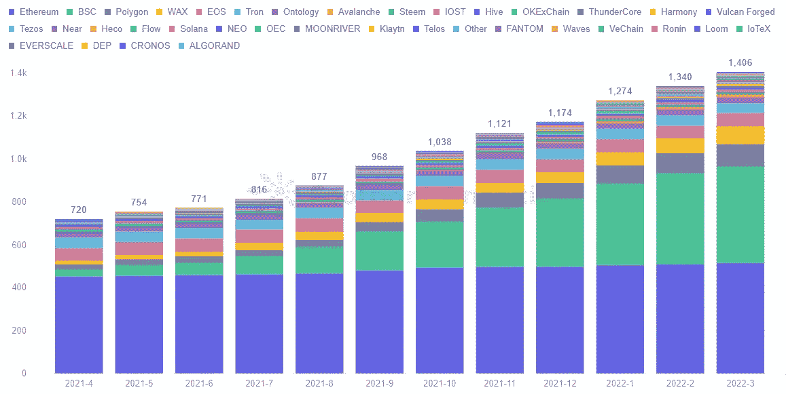
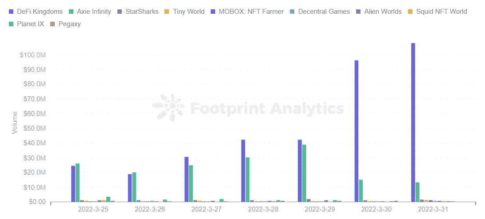

# 2022 04 17 YOLO 市场周刊摘要

> 原文：<https://medium.com/coinmonks/2022-04-17-yolo-markets-weekly-recap-45ecb8a70300?source=collection_archive---------58----------------------->

在 Medium、Twitter 和 Instagram @nerdzvest 上关注我

# nerdzvest 洞察力

> **预计大盘将谨慎等待指示**

各地区股市可能会保持大致持平。Nerdz 认为，市场参与者将保持谨慎，等待本周末即将到来的讲话带来的任何惊喜或确认。

# 特殊加密

> **通货膨胀、货币贬值和缺乏适当的金融体系正在推动新兴国家采用数字资产**

Gemini 的 2022 年全球加密状况报告强调，加密货币在 2021 年达到了一个临界点，从许多人认为的利基投资演变为一个既定的资产类别。接受调查的全球 41%的加密所有者在 2021 年首次购买加密。

这项研究基于对六大洲 20 个国家的 3 万名成年人的调查，也有力地证明了通货膨胀和货币贬值是加密应用的强大驱动力，尤其是在新兴市场(EM)国家。巴西就是一个例子，该国政府寻求在 H1 2022 年前建立一个围绕数字资产的法律框架。

“在本币对美元贬值的国家，加密被视为‘必须拥有’的投资，而在发达国家，加密在很大程度上仍被视为‘最好拥有’"

此外，KuCoin 的“进入 Cryptoverse 报告”也显示了尼日利亚加密应用的惊人增长，这是由非洲有限的平价菲亚特金融服务推动的。点对点交易是尼日利亚投资者将法定货币转换为加密资产的最受欢迎的方法。35%的人口(3340 万人)在过去六个月中拥有或交易过加密货币，其中近 1736 万人将超过一半的资产分配给了加密货币。

[https://coin telegraph . com/news/crypto-see-as-the-future-of-money-in-inflation-泥潭国家](https://cointelegraph.com/news/crypto-seen-as-the-future-of-money-in-inflation-mired-countries)

[https://coin telegraph . com/news/lack-of-proper-financial-services-boosts-crypto-ownership-in-Nigeria-says-report](https://cointelegraph.com/news/lack-of-proper-financial-services-boosts-crypto-ownership-in-nigeria-says-report)

[https://cryptoslate . com/Latin-American-bit coin-adoption-gathers-pace-as-Brazil-make-its-move/](https://cryptoslate.com/latin-american-bitcoin-adoption-gathers-pace-as-brazil-makes-its-move/)

> **GameFi 的势头越来越猛，DeFi 王国一路领先**

GameFi 项目在 2 月和 3 月表现出对负面宏观环境的强大抵抗力，许多开发领域稳步增长。

Footprint Analytics 数据显示，GameFi 游戏项目的数量上升至 1，406 个，同比增长 5%。值得注意的是，BSC 的项目数量增长最快，同比增长 1303%,这得益于其较低的天然气费用和较高的吞吐量。与此同时，一些连锁店面临着一个项目驱动整个生态系统的问题，如 Hive 中的 Splinterlands。

DeFi Kingdoms 过去 30 天活跃用户增长超过 25000%，日成交量超过 Axie Infinity。

用户数量是整个 GameFi 生态系统健康运行的关键。如果没有用户，游戏项目就变得一文不值。截至 3 月 31 日，总活跃用户数为 1096 万，其中新增用户 127 万。与 2 月份相比，活跃用户数量增加了 56%。

虽然 GameFi 的交易量因俄罗斯-乌克兰冲突而呈下降趋势，但这一趋势已经逆转，3 月底交易量迅速回升，当月交易量为 1.29 亿美元，较 2 月份增长 154%。它也逐渐从人均约 30 美元恢复到人均 105 美元。

3 月份 GameFi 投资为 4.58 亿美元，相比 2 月份增长了 307%。在投资领域方面，GameFi 类别中的 NFT 和 Web3 增幅最大。

[https://cryptoslate . com/who-was-gamefis-bigger-winner-in-March-March-monthly-report/](https://cryptoslate.com/who-was-gamefis-biggest-winner-in-march-march-monthly-report/)

# 关键事件

> **中国城市封锁给全球通胀带来风险**

在过去的几个星期里，mainland China 通过封锁和旅行限制应对了两年来最严重的一次飓风。这可能会给全球通胀带来更大的风险，因为世界越来越依赖中国出口(2021 年，中国占全球出口的份额上升至 15.4%)。

[https://www . CNBC . com/2022/04/15/Bernstein-China-2022-covid-lock downs-inflation-risk-bigger-vs-2020 . html](https://www.cnbc.com/2022/04/15/bernstein-chinas-2022-covid-lockdowns-inflation-risk-bigger-vs-2020.html)

https://www . Bloomberg . com/news/articles/2022-04-15/more-Chinese-cities-look-to-lockdown-as-outbreak-spreads？srnd=premium-asia

> **PBOC 出人意料地保持关键利率不变**

中国央行将一年期中期贷款利率维持在 2.85%不变，并将大多数银行的存款准备金率下调了 25 个基点，低于经济学家的预期，并将小型银行的存款准备金率下调了 50 个基点。这是出乎意料的，因为大规模封锁引发了对其 GDP 增长将低于政府今年 5.5%的目标的预测，促使一些经济学家和分析师预计降息。中国当局周五还敦促商业银行降低存款利率。

[https://www . CNBC . com/2022/04/15/in-an-unexpected-move-China-holds-back-on-cutting-key-rate . html](https://www.cnbc.com/2022/04/15/in-an-unexpected-move-china-holds-back-on-cutting-key-rate.html)

[https://www . Bloomberg . com/news/articles/2022-04-15/中国央行下调银行存款准备金率以刺激增长？srnd =高级-亚洲](https://www.bloomberg.com/news/articles/2022-04-15/china-s-central-bank-cuts-reserve-ratio-for-banks-to-spur-growth?srnd=premium-asia)

[https://www . Bloomberg . com/news/articles/2022-04-15/中国敦促银行下调存款利率以支持经济？srnd=premium-asia](https://www.bloomberg.com/news/articles/2022-04-15/china-urges-banks-to-cut-deposit-rates-in-bid-to-support-economy?srnd=premium-asia)

> **在动荡的市场中，主要银行公布的业绩好于预期**

高盛公布了第一季度的业绩，收入下降 27%，至 129.3 亿美元，但这仍然超过了分析师 118.3 亿美元的预期，因为其交易部门介入，以弥补第一季度并购、首次公开募股和债券发行放缓的影响。由于交易好于预期，摩根大通、摩根士丹利和花旗集团都公布了超出预期的业绩。

[https://www.cnbc.com/2022/04/14/gs-earnings-1q-2022.html](https://www.cnbc.com/2022/04/14/gs-earnings-1q-2022.html)

> **以太坊合并被设置为延迟**

期待已久的以太坊合并将再次推迟，负责升级的开发人员估计完成时间为 6 月份的“几个月后”。直到客户团队确信软件实现已经过彻底的测试并且没有错误，具体的日期才会确定。另一个重要的因素是难度炸弹，或者是采矿难度的自动增加，旨在降低 PoW 采矿的吸引力，这将在 5 月左右开始在以太坊引起注意。

[https://coin telegraph . com/news/ether eum-merge-a-months-after-June-dev-clears-up-what-s-going-on](https://cointelegraph.com/news/ethereum-merge-a-few-months-after-june-dev-clears-up-what-s-going-on)

[https://cryptoslate . com/ether eums-merge-will-no-more-occurrence-in-June-new-date-unknown/](https://cryptoslate.com/ethereums-merge-will-no-longer-happen-in-june-new-date-unknown/)

> **建立合作伙伴关系，创造潜在的机构定义机会**

MetaMask Institutional 与 Gnosis Safe、Hex Trust、GK8 和 Parfin 建立了合作伙伴关系，以满足 Dao 的加密托管要求，Dao 是寻求在一组令牌持有者之间分配决策权的加密组织。

[https://www . coin desk . com/business/2022/04/13/meta masks-institutional-arm-makes-push-for-daos-with-new-category-deals/](https://www.coindesk.com/business/2022/04/13/metamasks-institutional-arm-makes-push-for-daos-with-new-custody-deals/)

加密托管公司 Fireblocks 已经与财富 500 强银行和资本市场公司的技术提供商 FIS 合作。该合作伙伴关系将使 FIS 的 6400 名客户能够访问大型加密交易场所、流动性提供商、借贷柜台和分散金融(DeFi)应用程序。

[https://www . coin desk . com/business/2022/04/13/fireblocks-and-fin tech-major-fis-bring-defi-to-capital-markets/](https://www.coindesk.com/business/2022/04/13/fireblocks-and-fintech-major-fis-bring-defi-to-capital-markets/)

> **NFT 和元宇宙正在崛起**

南森的 2022 年 NFT 季度报告强调，NFT 市场今年的表现超过了加密货币市场，今年迄今为止，ETH 的回报率为 103.7%，美元为 82.1%。尽管 2022 年 2 月底全球市场大多数资产类别都出现下跌，但 NFT 500 指数在 3 月份的前 30 天上涨了 5.9%。它预计到 2025 年市场估值将达到 800 亿美元。

[https://cryptoslate . com/the-NFT-market-is-growing-more-the-crypto-Nansen-report/](https://cryptoslate.com/the-nft-market-is-growing-more-than-the-crypto-market-according-to-nansen-report/)

阿联酋航空公司将推出自己的不可替代代币(NFT)，并计划将其在迪拜 2020 年世博会上的展馆改造成 Web3、NFTs 和元宇宙项目中心。

[https://cryptoslate . com/Emirates-airline-launchs-NFT-as-it-fly-into-the-元宇宙/](https://cryptoslate.com/emirates-airline-launches-nft-as-it-flies-into-the-metaverse/)

Zara 推出了一个名为 Lime Glam 的全新系列，设计用于虚拟世界内外的穿着。这些服装和配饰可以在泽佩托元宇宙穿着，也可以在实体店买到。如果买家选择实体版本，他们也将获得数字版本，简化购买过程。Zepeto 应用程序还为这个特殊的集合提供了一个照相亭、数字墙和地板。泽普托是古驰在 2021 年 8 月推出古驰别墅的同一个虚拟网站。

[https://cryptoslate . com/fashion-brand-zara-launchs-first-solo-collection-in-the-元宇宙/](https://cryptoslate.com/fashion-brand-zara-launches-first-solo-collection-in-the-metaverse/)

NFT 票务平台 YellowHeart 本周首次与米高梅大酒店合作，出售一系列 NFT Jabbawockeez 舞蹈表演的门票。1，110 个 NFTs 的集合授予持有者在现场表演(持续到 4 月 30 日)中获得主要座位的权利，以及额外的好处，如食物和饮料积分，空投数字收藏品和见面问候机会。这是基于多边形的票务平台和传统娱乐世界的最新交叉，其想法是 NFT 不仅是一种更安全和防欺诈的售票方式，而且可以作为一种社交令牌，增加粉丝和艺术家之间的效用。

[https://www . coin desk . com/business/2022/04/14/MGM-grand-trials-NFT-ticketing-in-yellow heart-tie-up/](https://www.coindesk.com/business/2022/04/14/mgm-grand-trials-nft-ticketing-in-yellowheart-tie-up/)

日本最大的社交媒体应用 Line 正式推出了自己的非伪造代币(NFT)市场——NFT 线。与日本主要娱乐集团 Yoshimoto Kogyo 合作，它将为其 9000 万用户提供大约 40，000 种不同的 NFT。

[https://coin telegraph . com/news/Japan-s-most-popular-social-messaging-app-line-adds-NFT-market place](https://cointelegraph.com/news/japan-s-most-popular-social-messaging-app-line-adds-nft-marketplace)

Meta 进军元宇宙的最新举措是推出了一个新的应用市场，可能还包括非功能性技术市场，每笔交易将收取近 50%的佣金。

[https://coin telegraph . com/news/nifty-news-meta-wants-50-of-NFT-sales-coke-s-元宇宙-flavor-and-more](https://cointelegraph.com/news/nifty-news-meta-wants-50-of-nft-sales-coke-s-metaverse-flavor-and-more)

# 市场更新

> **市场在波动中下跌**

由于参与者在全球通胀和供应短缺的背景下保持谨慎，大盘继续回撤，波动性加剧。中国股市下跌，原因是 PBOC 方面出人意料地决定维持关键利率不变，尽管其目前的状况令人担忧。美国收益率曲线反转变陡，长端上升。

> 加入 Coinmonks [电报频道](https://t.me/coincodecap)和 [Youtube 频道](https://www.youtube.com/c/coinmonks/videos)了解加密交易和投资

# 另外，阅读

*   [在美国如何使用 BitMEX？](https://coincodecap.com/use-bitmex-in-usa) | [BitMEX 回顾](https://coincodecap.com/bitmex-review)
*   [最佳期货交易信号](https://coincodecap.com/futures-trading-signals) | [流动性交易所评论](https://coincodecap.com/liquid-exchange-review)
*   [南非的加密交易所](https://coincodecap.com/crypto-exchanges-in-south-africa) | [BitMEX 加密信号](https://coincodecap.com/bitmex-crypto-signals)
*   [MoonXBT 副本交易](https://coincodecap.com/moonxbt-copy-trading) | [阿联酋的加密钱包](https://coincodecap.com/crypto-wallets-in-uae)
*   [雷米塔诺评论](https://coincodecap.com/remitano-review)|[1 英寸协议指南](https://coincodecap.com/1inch) | [购买 Floki](https://coincodecap.com/buy-floki-inu-token)
*   [MoonXBT vs Bybit vs 币安](https://coincodecap.com/bybit-binance-moonxbt) | [Arbitrum:第二层解决方案](https://coincodecap.com/arbitrum)