# 2022 04 24 YOLO 市场周刊摘要

> 原文：<https://medium.com/coinmonks/2022-04-24-yolo-markets-weekly-recap-9dba7f26f12d?source=collection_archive---------41----------------------->

在 Medium、Twitter 和 Instagram @nerdzvest 上关注我

# nerdzvest 洞察力

> **市场可能会继续下跌，然后在接近周末时保持区间震荡**

由于市场参与者预计美联储将在未来几个月决定加息的水平，市场可能会继续下跌。Nerdz 认为，本周初，市场将继续从上周的震荡中下跌。随着我们越来越接近 5 月 FOMC，它可能会保持区间波动，等待美联储的决定。

未来一周将有几项经济数据发布和大量科技股收益。Nerdz 认为这不太可能改变市场情绪，因为大多数人都非常关注美联储加息的故事，除非有巨大的惊喜。日本央行也将于周四公布利率决定。

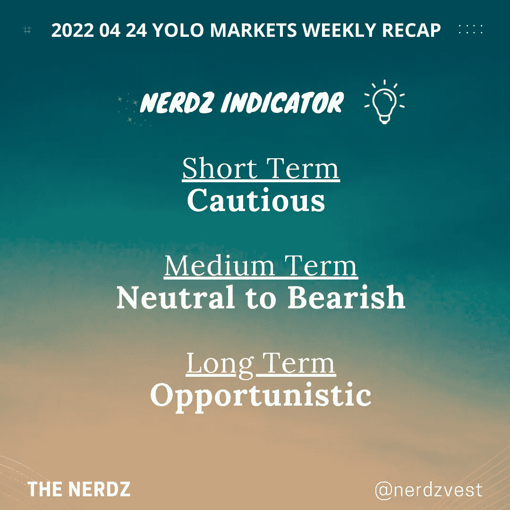

# 市场更新

> **市场下跌，反映了更激进的潜在利率上涨**

本周初，由于市场参与者在当前环境下保持谨慎，大盘相对持平。然而，对中国央行不采取行动的审慎立场的失望，加上美联储鲍威尔对其积极抑制通胀的承诺的评论，导致周四和周五市场的恐慌和恐惧。这导致大多数市场在更高的波动性中以红色收盘。

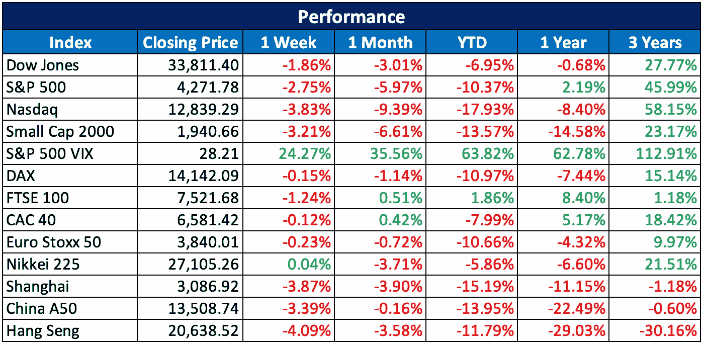

由于鲍威尔肯定了中央银行决心降低通货膨胀率，而且在 5 月份的 FOMC 会议上有可能大幅加息，美国国债收益率上升，特别是短期国债。对 5 月份加息 50 个基点的预期已升至 99.6%，而交易员也已将今年更激进的加息计入价格。

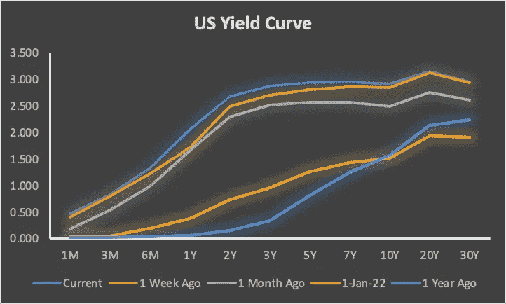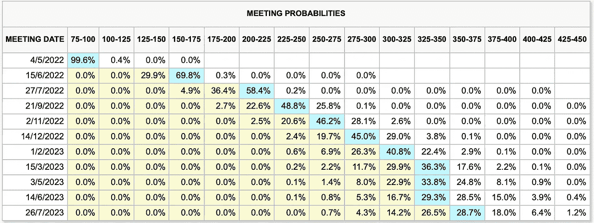

> **美国物价指数和薪酬指数证明了积极姿态的合理性**

要理解为什么鲍威尔在 5 月 FOMC 会议前 1-2 周表达了如此激进的立场，有必要理解通胀数字这一意图背后的潜在原因。与美国通胀率密切相关的指标是 CPI。根据从美国劳工统计局(BLS)收集的数据，观察到 CPI 确实同比上涨了约 8%,其中能源类别的涨幅较大，创下了过去十年的新高。更深入的研究表明，食品和电力等公用事业的价格也有所上涨，这可能会影响到普通美国家庭。

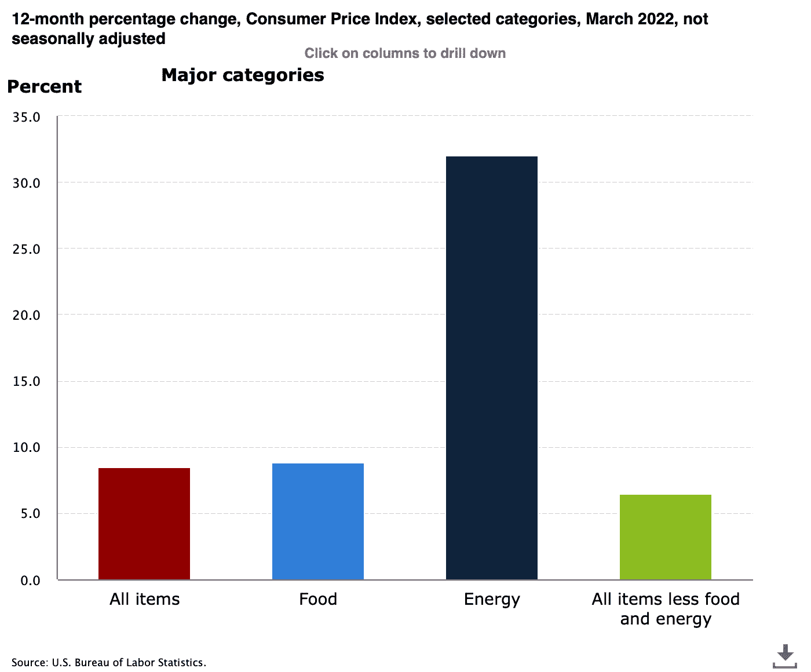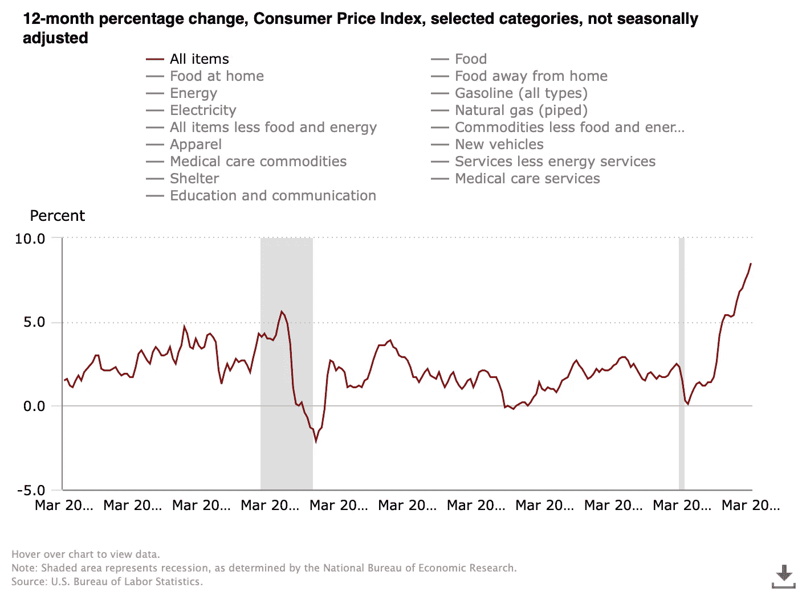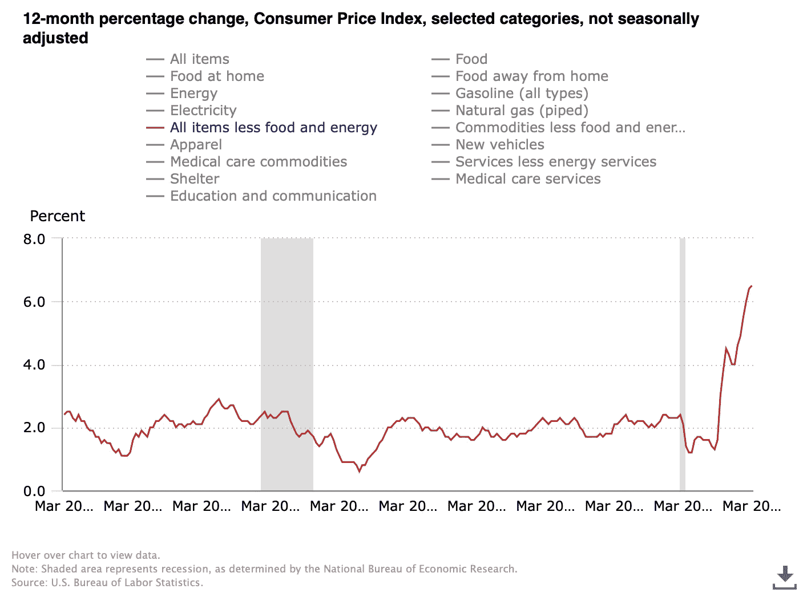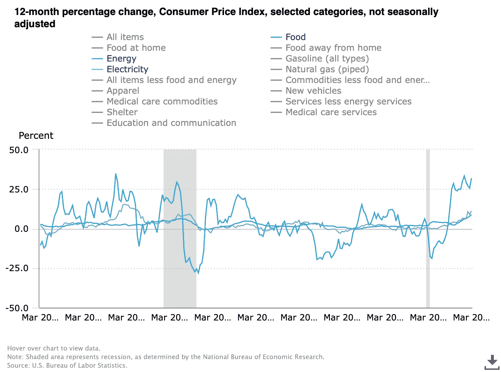

此外，生产者价格指数(PPI)也显示，基础商品的成本环比上升了 1-2%。虽然食品成本上涨了 2%左右，但交通和能源成本上涨了 5%以上，这解释了消费期间观察到的通货膨胀。与此同时，私营部门和政府部门的工资和薪金增幅低于 1%的同等水平。因此，高通胀，尤其是日常必需品的通胀，可能会给美国普通家庭带来压力。

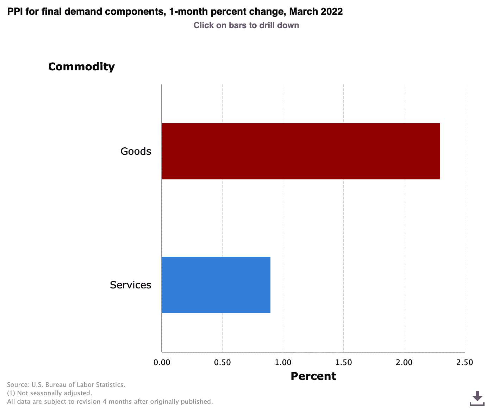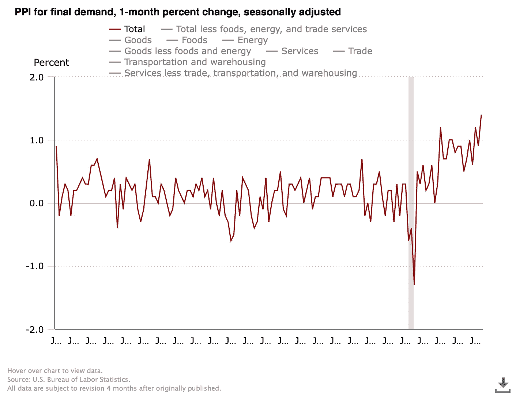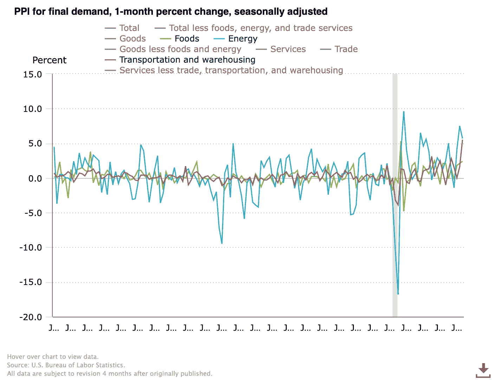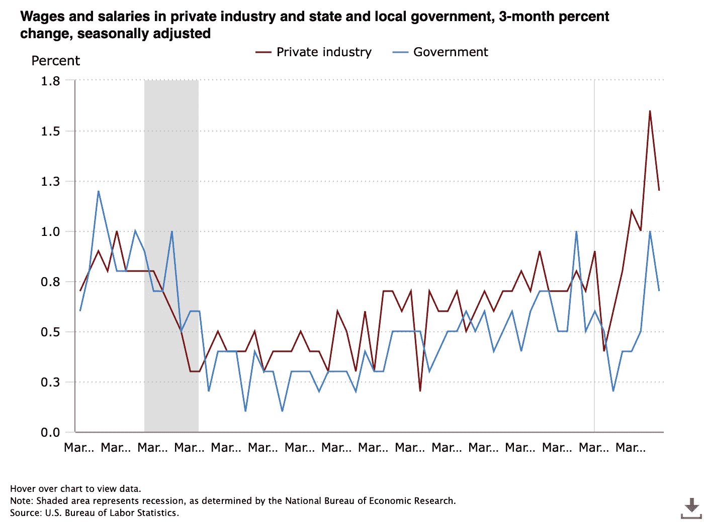

# 关键事件

> **中国封锁继续恶化供应链**

中国东南部大都市上海从 3 月下旬开始大规模停工，这是对日常生活、外国企业和供应链破坏最大的事件之一。尽管芯片、生物制药、汽车和设备制造等行业的主要业务优先复工，但许多公司仍面临劳动力短缺和物流困难的挑战。

[https://www . CNBC . com/2022/04/22/China-covid-lockdown-workers-in-Shanghai-traffic-to-get-back-to-work-。html](https://www.cnbc.com/2022/04/22/china-covid-lockdown-workers-in-shanghai-struggle-to-get-back-to-work-.html)

> **亚马逊启动基金打造供应链和物流技术**

亚马逊正在启动一项 10 亿美元的基金，将支持“所有阶段”的公司建立供应链、履行和物流技术。亚马逊工业创新基金将专注于新技术，这些技术将“提高交付速度，进一步改善仓库和物流员工的体验”。

[https://www . CNBC . com/2022/04/21/Amazon-launchs-10 亿资金投资仓库技术. html](https://www.cnbc.com/2022/04/21/amazon-launches-1-billion-fund-to-invest-in-warehouse-technologies.html)

> **69420 道加入埃隆·马斯克的行列，寻求推翻推特上的审查制度**

69420 DAO 希望筹集 20 亿美元购买 Twitter 15%的股份，并以代理投票身份分配这些股份，以支持 Twitter 平台上的言论自由。69420 DAO 是一个链上治理结构，它将形成一个特拉华州法定信托，以使 Web3 和 Twitter 用户受益。69420 刀背后的人形容自己是“一群来自工业和网络的自由爱好者”

[https://cryptoslate . com/69420-Dao-take-stand-against-Twitter-in-the-fight-for-free-speech/](https://cryptoslate.com/69420-dao-takes-a-stand-against-twitter-in-the-fight-for-free-speech/)

> **密码百万富翁涌向萨尔瓦多投资比特币城市**

密码百万富翁一直在排队参观萨尔瓦多。虽然萨尔瓦多允许其公民使用 BTC 进行日常购物，但游客数量不断增长背后的主要吸引力是投资比特币城市的潜力。据说，来自欧洲和萨尔瓦多的富有投资者已经开始向 Conchagua 周围地区的当地人出价。

[https://cryptoslate . com/report-crypto-millionaires-flock-to-El-Salvador-to-invest-in-the-bit coin-city-project/](https://cryptoslate.com/report-crypto-millionaires-flock-to-el-salvador-to-invest-in-the-bitcoin-city-project/)

> **德国是世界上对加密最友好的国家**

根据 Coincub 的季度报告，德国是世界上对加密最友好的国家，在除 DeFi 验收类别之外的所有类别中，德国获得了 8 分或更高的分数。Gemini 的 2022 年全球加密状况报告指出，53%的德国人承认自己“对加密好奇”，而 43%的高收入德国人拥有加密资产。此外，大约 17%的德国人拥有加密货币。德国 46%的女性加密采用率也是世界上最高的之一。

[https://cryptos late . com/Germany-worlds-most-crypto-friendly-country-but-反感 defi/](https://cryptoslate.com/germany-worlds-most-crypto-friendly-country-but-averse-to-defi/)

> 比特币基地推出了自己的 NFT 市场

比特币基地已经为其新的 NFT 市场推出了测试版。它将类似于 Instagram 和 Tik-Tok 等社交媒体平台，用户可以在他们的个人资料中展示他们的个人信息，关注其他账户，喜欢，不喜欢或评论 NFT。该平台将根据用户行为创建一个发现源，提供个性化的 NFT 和账户建议。

 [## 比特币基地推出具有个性化功能的 NFT 市场| CryptoSlate

### 新的 NFT 市场将类似于 Instagram 和 Tik-Tok 等社交媒体平台。用户将能够…

cryptoslate.com](https://cryptoslate.com/coinbase-launches-nft-marketplace-with-personalization-feature/) 

> 加入 Coinmonks [电报频道](https://t.me/coincodecap)和 [Youtube 频道](https://www.youtube.com/c/coinmonks/videos)了解加密交易和投资

# 另外，阅读

*   [最佳加密交换平台](https://coincodecap.com/best-crypto-swap-platforms) | [最佳加密交易所](https://coincodecap.com/crypto-exchange)
*   [购买比特币印度](/coinmonks/buy-bitcoin-in-india-feb50ddfef94) | [Pionex 评论](/coinmonks/pionex-review-exchange-with-crypto-trading-bot-1e459d0191ea) | [加密交易机器人](/coinmonks/crypto-trading-bot-c2ffce8acb2a)
*   [n rave 零点回顾](/coinmonks/ngrave-zero-review-c465cf8307fc) | [Phemex 回顾](/coinmonks/phemex-review-4cfba0b49e28) | [PrimeXBT 回顾](/coinmonks/primexbt-review-88e0815be858)
*   最佳[区块链分析](https://bitquery.io/blog/best-blockchain-analysis-tools-and-software)工具| [赚比特币](/coinmonks/earn-bitcoin-6e8bd3c592d9)
*   [Cloudbet 赌场评论](https://coincodecap.com/cloudbet-casino-review) | [点火赌场评论](https://coincodecap.com/ignition-casino-review)
*   [加密套利](/coinmonks/crypto-arbitrage-guide-how-to-make-money-as-a-beginner-62bfe5c868f6)指南| [如何做空比特币](/coinmonks/how-to-short-bitcoin-568a2d0b4ae5)