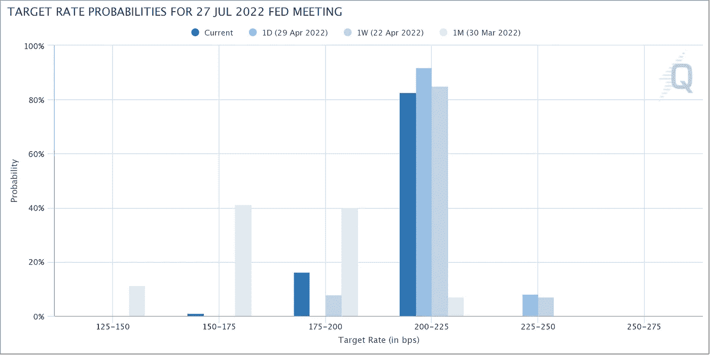

# 2022 05 01 YOLO 市场周刊摘要

> 原文：<https://medium.com/coinmonks/2022-05-01-yolo-markets-weekly-recap-79961bd79267?source=collection_archive---------59----------------------->

在 Medium、Twitter 和 Instagram @nerdzvest 上关注我

# nerdzvest 洞察力

> **预计整个一周会有波动，FOMC 会议后可能会出现反弹**

过去一周，股市和密码市场继续下跌。糟糕的收益结果、中国的持续封锁以及美联储积极货币政策立场的不确定性给投资者带来了阻力。

随着 PMI 显示全球最大供应链生产商之一的工厂活动放缓，中国城市的停工仍在继续。供应链紧缩导致全球通胀加剧，这一问题可能会持续下去，正如一些公司在宣布季度收益时所呼应的那样。这种对成本线和整体业务盈利能力的影响可能会在今年晚些时候打击这些公司。因此，Nerdz 认为大多数公司将继续挣扎，影响他们的中期价格。

与此同时，市场继续谨慎对待美联储的货币政策，我们将于 5 月 4 日在 FOMC 看到这一点。

目前，市场似乎已经消化了美联储期货的大幅加息(5 月份 50 个基点，6 月份 75 个基点，7 月份 50 个基点，剩下的 FOMC 会议 25 个基点)。与一个月前杰罗姆·鲍威尔强调美联储决心通过加息抑制通胀相比，这是一个巨大的增长。

Nerdz 认为，鉴于宏观经济形势，市场定价过于激进，世界仍在从 Covid 局势中走出来，供应链仍处于紧张状态。我们可以看到 FOMC 会议前的小幅下跌，会后会有一个轻松的反弹。总而言之，下周可能会波动，但可能会为市场参与者带来潜在的短期机会。

# 市场更新

> **市场继续下跌，主要是因为大型科技股收益不佳**

面对全球通货膨胀，供应短缺和糟糕的大技术收益和预测，市场继续从上周开始下跌。本周，许多大型科技公司宣布了令市场失望的季度收益结果，导致整个星期的抛售。主要信息是影响业务和成本的全球环境的不确定性。

> **美国经济意外萎缩，而中国工厂活动继续下滑**

中国的工厂活动(PMI)继续收缩，但 4 月份的收缩幅度更大，原因是其封锁措施停止了工业生产，扰乱了供应链。

与此同时，美国政府也报告说，经济收缩了 1.4% (Q1 22 GDP)，低于分析师 1%的增长预期。这引发了潜在衰退的危险信号，尤其是当美联储寻求在今年剩余时间内加息以抑制通胀时。

> **比特币和以太鲸一直在价格下跌中积累**

比特币价格继续下跌，反映了美国股市的下行趋势。然而，鲸鱼(至少有 1000 个 BTC 的地址)持有的比特币数量有所增加。同样，在过去的几个月里，巨头鲸也在下沉。

> **机构投资者将注意力转移到第一层**

最近，机构投资者已经将注意力从以太坊转移到竞争对手的一级区块链，上周 altcoin 投资产品的资本流入增加，而以太产品连续第三周流出。

CoinShares 最新数字资产基金流动报告的数据显示，投资者在 Avalanche，Solana，Terra 和 Algorand 基金中装载了价值 350 万美元的资金，而上周乙醚产品的资本流出总额为 1690 万美元。

# 关键事件

> **北京成为最新一个被奥米克隆袭击的中国城市**

中国继续抗击 Covid 病例的持续飙升，北京一个地区的一家大型奢侈品商场和非必要企业暂时关闭。该国的零 Covid 政策可能会给中国的增长带来阻力。与此同时，上海和中国北方的一些企业已经恢复生产。

[https://www . CNBC . com/2022/04/29/China-sticks-to-covid-controls-Beijing-luxury-mall-closes . html](https://www.cnbc.com/2022/04/29/china-sticks-to-covid-controls-beijing-luxury-mall-closes.html)

> **埃隆·马斯克出售特斯拉股份收购 Twitter**

埃隆·马斯克以 440 亿美元收购 Twitter，并计划将其私有化，他概述了自己对言论自由的信念。此后，他还出售了约 84 亿美元的特斯拉股票，导致特斯拉股价大幅下跌。此外，他甚至开玩笑说可口可乐是另一个潜在的收购目标。

[https://cryptoslate.com/elon-musk-buys-twitter/](https://cryptoslate.com/elon-musk-buys-twitter/)

[https://www . CNBC . com/2022/04/29/elon-musk-sells-Tesla-shares . html](https://www.cnbc.com/2022/04/29/elon-musk-sells-tesla-shares.html)

[https://www . Bloomberg . com/news/articles/2022-04-28/after-Twitter-elon-musk-joins-about-buying-Coca-Cola-to-put-the-Coca-Cola-back？srnd =亚洲高级保险](https://www.bloomberg.com/news/articles/2022-04-28/after-twitter-elon-musk-jokes-about-buying-coca-cola-to-put-the-cocaine-back?srnd=premium-asia)

> **沃伦·巴菲特坚持对比特币持怀疑态度**

沃伦·巴菲特在伯克希尔·哈撒韦年度股东大会上解释说，他将比特币视为非生产性资产，它不会产生任何有形的东西。他还表示，即使有人以 25 美元的价格向他提供所有比特币，他也不会购买。他还提到，资产需要向某人交付某些东西才能有价值，而美国政府只接受一种货币。

[https://www . CNBC . com/2022/04/30/Warren-Buffett-give-his-the-most-expansive-explaint-explain-explain-explain-why-why-he ' t-belief-believe-in-bit coin . html](https://www.cnbc.com/2022/04/30/warren-buffett-gives-his-most-expansive-explanation-for-why-he-doesnt-believe-in-bitcoin.html)

> **高盛和富达将比特币放入他们的产品套件**

高盛(Goldman Sachs)提供了首笔比特币支持的贷款，允许借款人使用比特币作为现金贷款的抵押品。

[https://www . coin desk . com/business/2022/04/28/Goldman-Sachs-makes-its-first-bit coin-backed-loan-report/](https://www.coindesk.com/business/2022/04/28/goldman-sachs-makes-its-first-bitcoin-backed-loan-report/)

Fidelity Investments 计划向其客户提供将高达 20%的退休资金投入比特币的选择。美国劳工部目前还没有禁止养老金计划中的秘密投资。然而，该部门在 3 月份发布的一份合规文件中透露，它不愿意批准数字资产作为退休投资计划。

[https://cryptos late . com/fidelity-investments-to-offer-bit coin-for-pension-funds/](https://cryptoslate.com/fidelity-investments-to-offer-bitcoin-for-pension-funds/)

> **区块链项目有望改造音乐行业**

在音乐行业，少数人拥有行业资产，大公司比用户和艺术家获利更多。一些区块链项目正试图利用区块链技术为古老的音乐市场提供新的解决方案。目的是给音乐家带来公平的报酬(即调音。FM)，允许粉丝共同拥有歌曲(即 Royal)和 power 音乐协作(通过 NFTs 即 Squad of Knights)。

[https://coin telegraph . com/news/turning-up-the-volume-区块链-projects-aim-disrupt-the-music-industry](https://cointelegraph.com/news/turning-up-the-volume-blockchain-projects-aim-to-disrupt-the-music-industry)

> **移动挣钱是 2022 年的最新炒作**

Axie Infinity 是游戏赚钱运动的先驱，该项目激发了新的 Web3 应用程序，这些应用程序希望将赚钱模式应用到各自的生态系统中。加入“移动挣钱”运动的最新项目是 STEPN，这是一个基于 Solana 的 Web3 应用程序，拥有不可伪造的 token (NFT)运动鞋的人可以边走边挣。在过去的一个月里，这种货币已经上涨了 77%。“移动挣钱”现象的有趣之处在于，它本质上是一种 P2E，因为它通过一种数字资产——运动鞋——将健身游戏化了。

[https://coin telegraph . com/news/NFT-traders-stepn-to-a-new-groove-is-move-to-earn-the-future of fitness-or-other-fad](https://cointelegraph.com/news/nft-traders-stepn-to-a-new-groove-is-move-to-earn-the-future-of-fitness-or-another-fad)

> 加入 Coinmonks [电报频道](https://t.me/coincodecap)和 [Youtube 频道](https://www.youtube.com/c/coinmonks/videos)了解加密交易和投资

# 另外，阅读

*   [3 商业评论](/coinmonks/3commas-review-an-excellent-crypto-trading-bot-2020-1313a58bec92) | [Pionex 评论](https://coincodecap.com/pionex-review-exchange-with-crypto-trading-bot) | [Coinrule 评论](/coinmonks/coinrule-review-2021-a-beginner-friendly-crypto-trading-bot-daf0504848ba)
*   [莱杰 vs n rave](/coinmonks/ledger-vs-ngrave-zero-7e40f0c1d694)|[莱杰 nano s vs x](/coinmonks/ledger-nano-s-vs-x-battery-hardware-price-storage-59a6663fe3b0) | [币安评论](/coinmonks/binance-review-ee10d3bf3b6e)
*   [Bybit Exchange 审查](/coinmonks/bybit-exchange-review-dbd570019b71) | [Bityard 审查](https://coincodecap.com/bityard-reivew) | [Jet-Bot 审查](https://coincodecap.com/jet-bot-review)
*   [3 commas vs crypto hopper](/coinmonks/3commas-vs-pionex-vs-cryptohopper-best-crypto-bot-6a98d2baa203)|[赚取秘密利息](/coinmonks/earn-crypto-interest-b10b810fdda3)
*   最好的比特币[硬件钱包](/coinmonks/hardware-wallets-dfa1211730c6) | [BitBox02 回顾](/coinmonks/bitbox02-review-your-swiss-bitcoin-hardware-wallet-c36c88fff29)