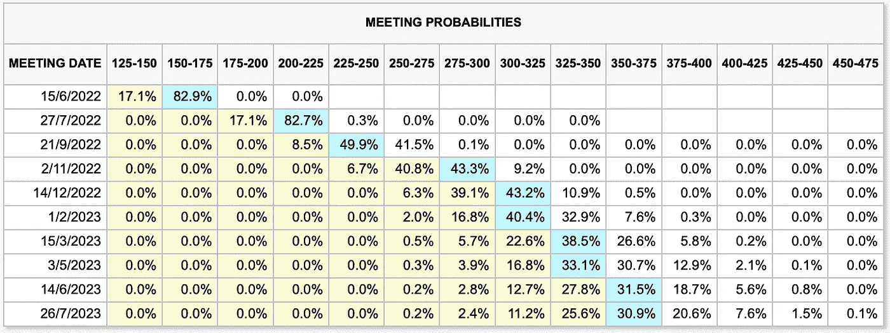
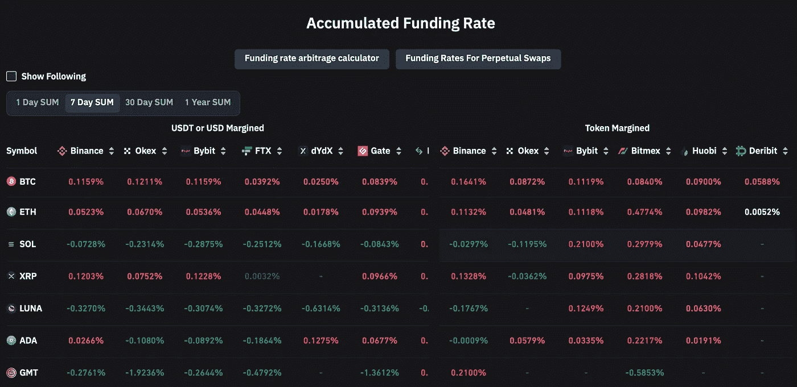
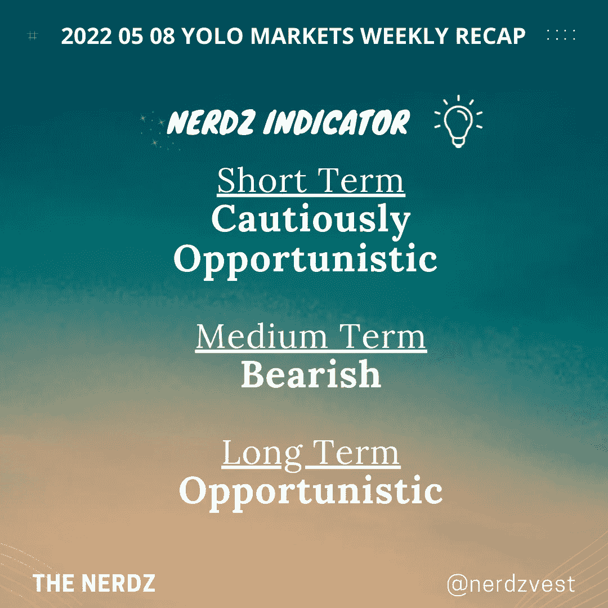
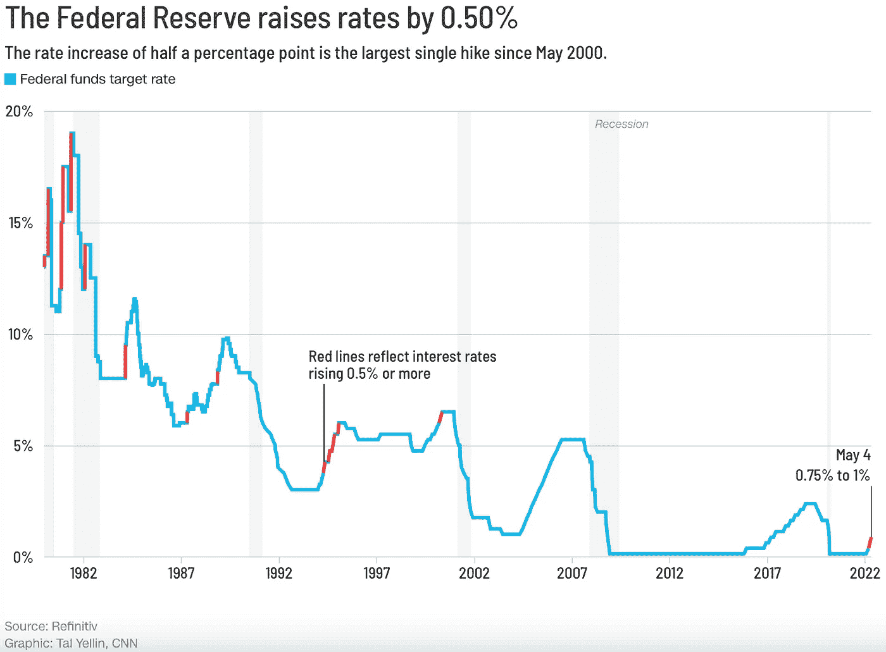
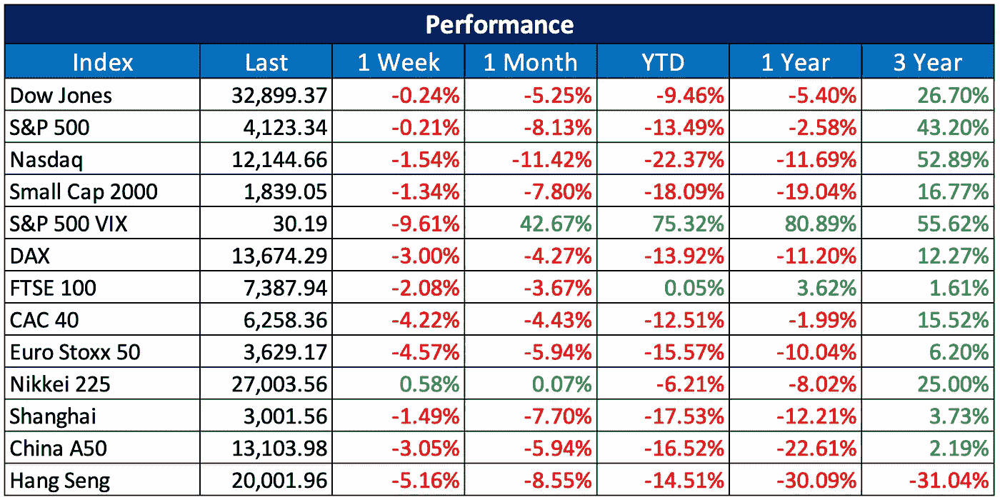
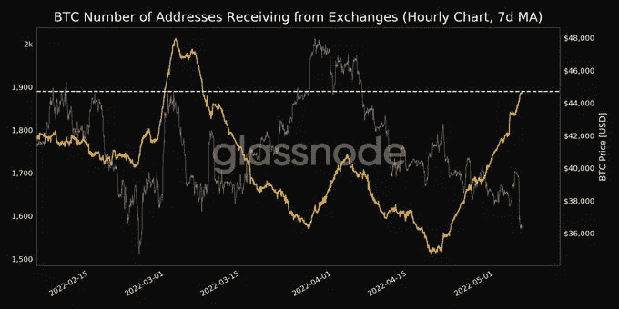
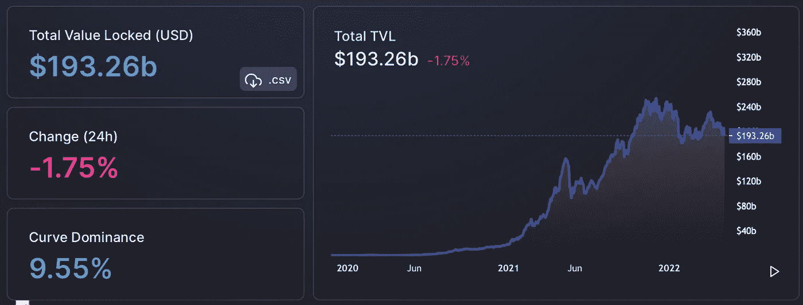

# 2022 05 08 YOLO 市场周刊摘要

> 原文：<https://medium.com/coinmonks/2022-05-08-yolo-markets-weekly-recap-4803385983f0?source=collection_archive---------32----------------------->

在 Medium、Twitter 和 Instagram @nerdzvest 上关注我

# nerdzvest 洞察力

> **预计市场将因关注通胀数据而保持平静**

这是有趣的一周，FOMC 宣布加息 50 个基点后，市场拉锯，这是每个人都在期待的。部分原因是由于鲍威尔的讲话后，宣布解除盖子的几个项目。单次加息 75 个基点的可能性很低，但在未来几次 FOMC 会议上加息 50 个基点是可能的。这导致本周市场以红色收盘。

美联储期货表明，交易者已经将下两次会议的加息 50 个基点和 2022 年底前最终的 3-3.25%的美联储利率计入价格。Nerdz 认为，由于两个原因，这有点激进，并将在市场上寻找有利的短期机会。

首先，供应链问题仍在给公司和个人制造问题，这在一定程度上导致了更高的通胀率(成本推动型通胀)。紧缩的货币政策，即激进的加息不太可能解决这个问题，并可能加剧企业产生的更高成本，最终可能转嫁给消费者。其次，美国国内生产总值在 Q1 22 年收缩，这带来了衰退的恐惧。非常激进的加息以降低需求拉动的通胀，虽然有效，但可能会加速衰退的可能性。考虑到我们即将迎来 2022 年 11 月的美国中期选举，这并不理想。因此，Nerdz 认为机会可能存在于如此动荡的市场中，但投资者应保持谨慎，因为总体趋势可能是下行。

另外，7D 融资利率似乎暗示着 BTC 和瑞士联邦理工学院的看涨趋势。Nerdz 将继续监测这一指标，并在适当的时候进入多头头寸。

# 市场更新

> **FOMC**之后，市场继续下跌，并出现大幅波动

在通货膨胀和经济衰退的恐惧中，市场继续下跌。美联储发布了最大的加息(50 个基点)至 75-100 个基点，而杰罗姆·鲍威尔驳回了加息 75 个基点的想法，这平息了市场对此的恐惧。FOMC 事件后，市场立即做出积极反应，主要股指价格大幅上涨。然而，鲍威尔表示，在接下来的两次 FOMC 会议期间，有可能加息 50 个基点。

然而，这种宽慰的反弹是短暂的，因为市场暴跌，由于对通胀和潜在衰退的不确定性的担忧，周四 FOMC 会议后的所有涨幅都被抵消了。尽管 NFPR 宣布美国劳动力市场状况依然强劲，4 月份新增 42.8 万个就业岗位。

> **Crypto 和 DeFi TVL 也继续下滑**

随着美联储继续其鹰派立场，比特币等风险资产面临越来越大的压力。由于没有通胀得到控制的迹象，投资者正准备迎接更糟糕的情况。

Glassnode 在推特上发布了一张接收比特币的交换地址的 7 天移动平均图表。它显示了一个月以来收到 BTC 的地址达到 1889792 个。持续的资金流入将会引起市场参与者的担忧。下图显示了这一指标从 2022 年 4 月下旬开始的急剧上升趋势。

此外，分散融资协议锁定的资产总价值已降至 2000 亿美元以下，继续表现不佳，自年初以来，该领域的价值已损失 20%以上。从 4 月底到本月初，DeFi 的 TVL 下跌了大约 3%。所有主要的 DeFi 协议，如 Curve Finance、MakerDao、Lido、Convex Finance 和 Aave 在过去 30 天内平均损失了 11%的 TVL。

# 关键事件

> **LGT 向客户提供 BTC 和瑞士联邦理工学院的投资**

LGT 与 SEBA 银行合作，为其客户提供比特币和以太的直接投资，同时提供托管服务。

[https://cryptoslate . com/largest-private-bank-LGT-to-offer-direct-bit coin-and-ether eum-investments/](https://cryptoslate.com/largest-private-bank-lgt-to-offer-direct-bitcoin-and-ethereum-investments/)

> **Ready Games 旨在将 Web 2 游戏引入 Web 3**

Ready Games 正在筹集资金，以开发一个 Web 3 移动游戏部门，专注于激励 Web 2 游戏程序员探索并转向 Web 3，同时通过传统应用商店“照常”分发游戏。

[https://www . coin desk . com/business/2022/05/06/ready-games-raises-3m-to-bring-web-2-gaming-to-the-web-3-world/](https://www.coindesk.com/business/2022/05/06/ready-games-raises-3m-to-bring-web-2-gaming-to-the-web-3-world/)

> **公开上市的加密采矿公司控制了 17%的比特币总杂凑率**

加密采矿行业是一个快速增长和发展的行业，公开上市的加密采矿公司控制着整个比特币网络总散列率的大约 17%。今年 1 月，Core Scientific 通过在特殊目的收购公司的合并上市。Core Scientific 的哈希速率以每秒 8.3 万亿次(Eh/s)领先于所有上市公司，它在 2021 年开采了 5769 个 BTC，产生了约 5.45 亿美元的收入。收入排名第二和第三的是 Riot Blockchain 和 Hive Blockchain Technologies，分别获得 2.15 亿美元和 1.95 亿美元。

[https://coin telegraph . com/news/controlling-17-of-BTC-hash-rate-report-on-public-listed-mining-companies](https://cointelegraph.com/news/controlling-17-of-btc-hash-rate-report-on-publicly-listed-mining-firms)

> **古驰和星巴克最新采用数字资产**

古驰希望从 5 月下旬开始，在美国的一些商店中增加加密作为支付选项，并计划到 2022 年夏天将试点扩展到所有北美商店。

[https://cryptoslate . com/fashion-giant-Gucci-to-start-accepting-crypto-payments/](https://cryptoslate.com/fashion-giant-gucci-to-start-accepting-crypto-payments/)

星巴克暗示了一个成熟的“星巴克数字社区网络 3 平台”的计划，可能与店内移动支付以及一系列 NFT 系列的发布有关。

 [## 星巴克在 NFT 发布公告调侃 Web 3 平台

### 这家咖啡连锁店表示，它的数字收藏品可能是连锁不可知的，并带来与它的…

www.coindesk.com](https://www.coindesk.com/business/2022/05/04/starbucks-teases-web-3-platform-in-nft-announcement/) 

> 加入 Coinmonks [电报频道](https://t.me/coincodecap)和 [Youtube 频道](https://www.youtube.com/c/coinmonks/videos)了解加密交易和投资

# 另外，阅读

*   [八大加密附属计划](https://coincodecap.com/crypto-affiliate-programs) | [eToro vs 比特币基地](https://coincodecap.com/etoro-vs-coinbase)
*   [最佳以太坊钱包](https://coincodecap.com/best-ethereum-wallets) | [电报上的加密货币机器人](https://coincodecap.com/telegram-crypto-bots)
*   [交易杠杆代币的最佳交易所](https://coincodecap.com/leveraged-token-exchanges) | [购买 Floki](https://coincodecap.com/buy-floki-inu-token)
*   [3Commas 诉 Pionex 诉 crypto hopper](https://coincodecap.com/3commas-vs-pionex-vs-cryptohopper)|[Bingbon Review](https://coincodecap.com/bingbon-review)
*   [加密复制交易平台](/coinmonks/top-10-crypto-copy-trading-platforms-for-beginners-d0c37c7d698c) | [如何在 WazirX 上购买比特币](/coinmonks/buy-bitcoin-on-wazirx-2d12b7989af1)