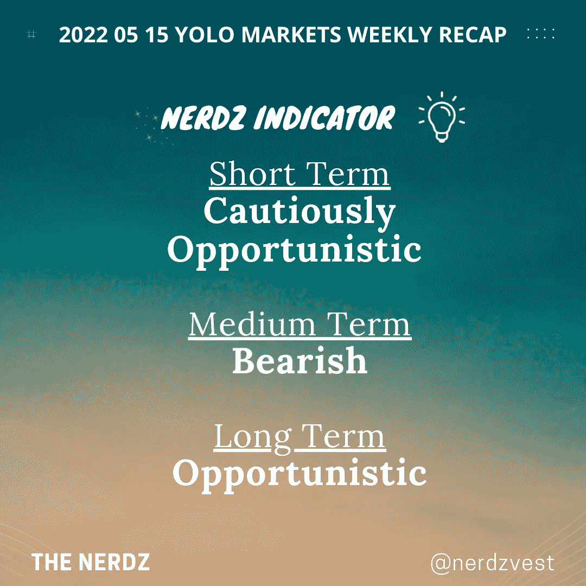
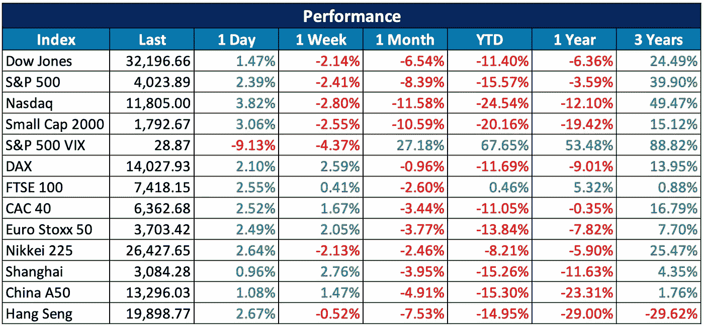
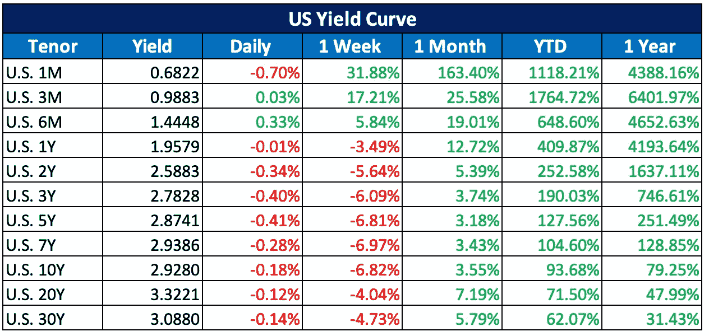
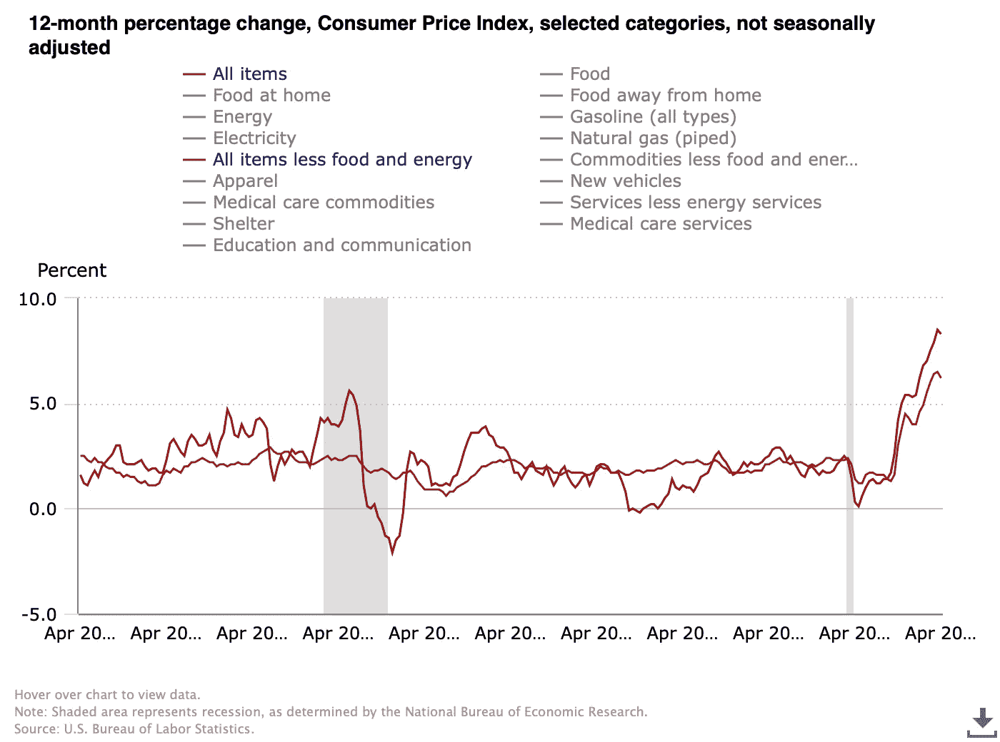
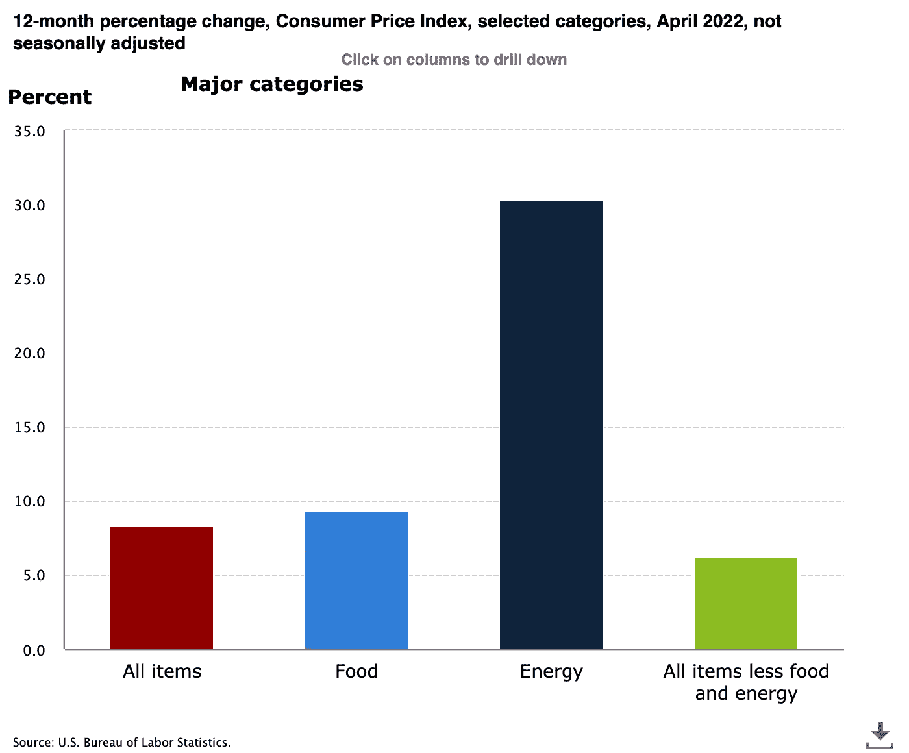

# 2022 05 15 YOLO 市场周刊摘要

> 原文：<https://medium.com/coinmonks/2022-05-15-yolo-markets-weekly-recap-484a0b57a9d6?source=collection_archive---------39----------------------->

在 Medium、Twitter 和 Instagram @nerdzvest 上关注我

# nerdzvest 洞察力

> 在经历了数周的下跌后，预计市场会出现缓解性反弹

本周，秘密空间见证了一次历史性的冲击。卢纳和 UST 的崩溃让加密界大吃一惊，因为没有人预计十大市值令牌会在一天内崩溃。Nerdz 真正同情持有人，并希望利用这个机会提醒大家，所有投资都有风险。因此，识别投资提议的潜在风险，不要被“承诺”的上涨收益所蒙蔽，这一点总是很重要的。希望加密领域的黑暗日子不会破坏信任，也不会给 Web 3.0 社区中许多人的优秀作品蒙上阴影。

与此同时，市场继续下跌，尤其是在 4 月份 CPI 数据公布之后。然而，我们在周五确实看到了一个反转，Nerdz 认为这可能是在数周下跌后下周将出现的一个缓解反弹的迹象。这可能会带来短期机会，但 Nerdz 将警告说，我们可能会面临更多的逆风，并可能在反弹后看到进一步的下行。

# 市场更新

> **市场持续下跌，周五有缓解反弹的迹象**

与前几周类似，市场在通货膨胀和衰退的恐惧中继续下跌。尤其是在 4 月份 CPI 数据仍保持在 8.3%的相对高位时。因此，市场表现出谨慎的迹象，因为股市下跌，而债券价格上涨，这意味着潜在的避险行为。密码市场也下跌，并见证了卢纳和 UST 崩溃的巨大冲击，这给密码持有者带来了巨大的恐惧。本周以略微积极的基调结束，因为在经历了多周的下跌后，周五股市出现了显著反弹。

# 关键事件

> **印度禁止小麦出口可能加剧全球价格上涨的问题**

印度禁止小麦出口，因为炎热的热浪削减了产量，而在强劲的出口需求下，当地价格创下历史新高。今年 2 月底俄罗斯入侵乌克兰后，黑海地区的小麦出口大幅下降，全球买家因此寄希望于这个全球第二大小麦生产国。印度的禁令可能会将全球价格推高至新的峰值，并打击亚洲和非洲的贫困消费者。

[https://www . CNBC . com/2022/05/14/India-blocks-all-wheat-exports-with-immediate-effect . html](https://www.cnbc.com/2022/05/14/india-blocks-all-wheat-exports-with-immediate-effect.html)

> 鲍威尔重申了他抑制通货膨胀的立场，尽管潜在的经济痛苦

美联储主席杰罗姆·鲍威尔表示，控制通货膨胀仍然是他的首要任务，但不能保证经济软着陆。他指出，随着紧张的劳动力市场推高工资，避免经济衰退将是一个挑战，而经济衰退往往伴随着积极的政策紧缩。

[https://www . CNBC . com/2022/05/12/Powell-says-he-cant-guarantee-a-soft landing-as-the-fed-looks-to-control-inflation . html](https://www.cnbc.com/2022/05/12/powell-says-he-cant-guarantee-a-soft-landing-as-the-fed-looks-to-control-inflation.html)

> **UST 和露娜倒地引发关注**

TerraUSD 是一种“算法”稳定的货币，打破了假设的 1-1 美元挂钩，导致数十亿美元的市值以及相关的加密货币 LUNA 突然蒸发。尽管美国财政部长珍妮特·耶伦(Janet Yellen)认为这些资产目前不会对金融稳定构成系统性风险，但由于其快速增长，最终可能会构成系统性风险。因此，她敦促国会在年底前批准联邦对稳定的硬币的监管。

[https://www . CNBC . com/2022/05/13/regulators-anxiety-about-stable coins-like-tether-after-ust-collapse . html](https://www.cnbc.com/2022/05/13/regulators-anxious-about-stablecoins-like-tether-after-ust-collapse.html)

> **野村证券最新推出加密衍生品交易**

野村证券(Nomura)推出了场外加密货币衍生品，为新加坡以外的亚洲客户提供比特币不可交割远期和不可交割期权。

 [## 野村开始交易加密衍生品，加入竞争对手高盛、摩根大通

### 伊恩·艾利森是 CoinDesk 的一名获奖资深记者。他持有 ETH。日本投资银行野村证券开始…

www.coindesk.com](https://www.coindesk.com/business/2022/05/13/nomura-starts-trading-crypto-derivatives-joining-rivals-goldman-jpmorgan/) 

> 加入 Coinmonks [电报频道](https://t.me/coincodecap)和 [Youtube 频道](https://www.youtube.com/c/coinmonks/videos)了解加密交易和投资

# 另外，阅读

*   [CryptoHopper 替代品](/coinmonks/cryptohopper-alternatives-d67287b16d27) | [HitBTC 审查](/coinmonks/hitbtc-review-c5143c5d53c2)
*   [CBET 评论](https://coincodecap.com/cbet-casino-review) | [库科恩 vs 比特币基地](https://coincodecap.com/kucoin-vs-coinbase)
*   [折叠 App 审核](https://coincodecap.com/fold-app-review) | [Kucoin 交易机器人](/coinmonks/kucoin-trading-bot-automate-your-trades-8cf0ca2138e0) | [Probit 审核](https://coincodecap.com/probit-review)
*   [如何匿名购买比特币](https://coincodecap.com/buy-bitcoin-anonymously) | [比特币现金钱包](https://coincodecap.com/bitcoin-cash-wallets)
*   [币安 vs FTX](https://coincodecap.com/binance-vs-ftx) | [最佳(SOL)索拉纳钱包](https://coincodecap.com/solana-wallets)
*   [比诺莫评论](https://coincodecap.com/binomo-review) | [斯多葛派 vs 3Commas vs TradeSanta](https://coincodecap.com/stoic-vs-3commas-vs-tradesanta)