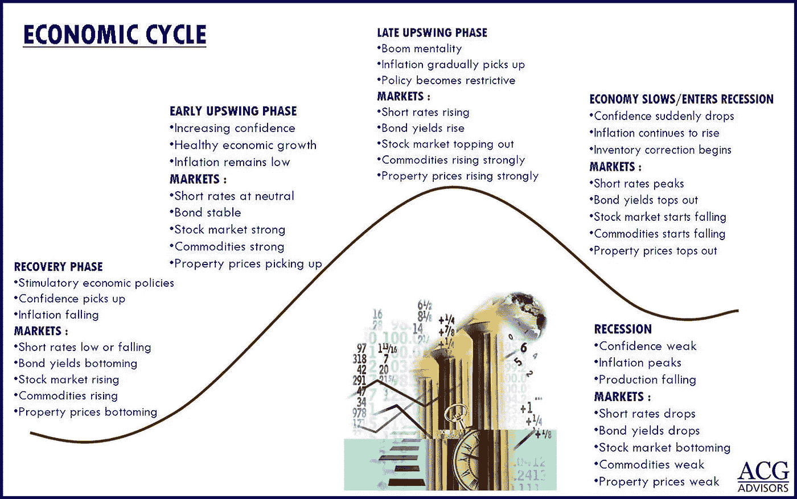
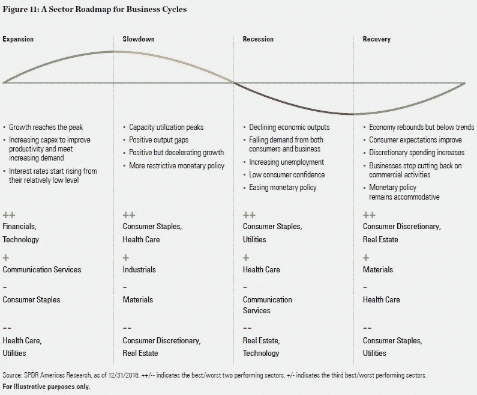

# 2022 年 05 月 22 日 YOLO 市场周刊摘要

> 原文：<https://medium.com/coinmonks/2022-05-22-yolo-markets-weekly-recap-4a25654e969e?source=collection_archive---------27----------------------->

在 Medium、Twitter 和 Instagram @nerdzvest 上关注我

# nerdzvest 洞察力

> **市场可能会在美联储会议纪要和经济数据的关注下保持区间震荡**

美国和欧洲市场在过去一周继续下跌，消费者情绪消极，经济衰退令人担忧。美国股指周五短暂跌入“熊市”区域，打击了对即将到来的衰退的担忧。这是可以理解的，因为我们仍然处于乌克兰-俄罗斯危机和由供应链问题和量化宽松引起的全球高通胀之中。

Nerdz 认为，我们目前正处于经济周期的后期扩张/放缓阶段，因为我们已经看到债券收益率大幅上升，而股市大幅下跌。因此，Nerdz 仍然持有中期看跌观点，因为衰退通常会接踵而至。我们已经观察到整个市场的看跌情绪，但市场仍然缺乏引发衰退的火花，Nerdz 认为美联储积极收紧货币政策后将会出现衰退。

至于短期前景，Nerdz 将保持谨慎，因为随着进一步的逆风到来，市场已大幅下跌。市场目前可能会保持区间波动，但参与者应警惕周三公布的美联储会议纪要、经济数据(如 GDP 和 PCE 通胀数据)以及零售商公布的剩余收益。这些事件可能会在本周晚些时候推高波动性。

# 市场更新

> **美国和欧洲市场继续下跌，而亚洲市场反弹**

尽管美国 4 月份零售额有所上升，但沃尔玛和塔吉特糟糕的季度报告和前景引发了人们对企业应对通胀和潜在消费放缓能力的担忧，引发了对经济放缓的担忧。对衰退的担忧加剧，推动市场下跌(年初至今近 20%)。与此同时，关于中国柯维德病例减少的积极消息在过去一周内给亚洲市场带来了宽慰的反弹。

> **随着 DeFi TVL 显著下降和 BTC 看跌/看涨期权比率上升，加密情绪恶化**

过去一周，DeFi 方案中的总 TVL 在所有链中显著下降(约 50%)。Curve 等主要协议的跌幅高达 50-60%，似乎受到了卢纳-UST 局势的影响，投资者开始失去信心并撤出资金。此外，BTC 看跌/看涨期权比率已升至 12 个月高点，暗示可能进一步下跌。

> **中国 BTC 矿工重新浮出水面！**

China became the second-largest Bitcoin hash rate provider as of January 2022, months after the local government banned all crypto operations in the country, according to the latest update from the Cambridge Bitcoin Electricity Consumption Index (CBECI). Bitcoin miners in China accounted for 21.1% of the total global BTC mining hash rate distribution as of early 2022.

# Key Happenings

> **WHO confirmed monkeypox outbreak in 11 countries**

The World Health Organization has confirmed about 80 cases of monkeypox with recent outbreaks reported in 11 countries (such as European nations, Canada and US). The outbreaks are unusual because they are occurring in countries where the virus is not endemic. Monkeypox is a disease caused by a virus in the same family as smallpox but is not as severe. However, monkeypox can result in death in as many as 1 in 10 people who contract the disease based on observations in Africa.

[https://www.cnbc.com/2022/05/20/world-health-organization-confirms-80-cases-of-monkeypox-with-outbreaks-in-11-countries.html](https://www.cnbc.com/2022/05/20/world-health-organization-confirms-80-cases-of-monkeypox-with-outbreaks-in-11-countries.html)

> **Shanghai achieved zero covid status with lifting of lockdown restrictions likely**

Shanghai has seen no new Covid-19 cases outside quarantine zones over three consecutive days which brought about signs of relief for its residents after the prolonged lockdown. There has been plans to resume outdoor activities in stages. By June, the lockdown should be lifted but residents will still be asked to get tested frequently.

[https://www.cnbc.com/2022/05/17/shanghai-achieves-zero-covid-status-but-normal-life-is-weeks-away.html](https://www.cnbc.com/2022/05/17/shanghai-achieves-zero-covid-status-but-normal-life-is-weeks-away.html)

> **China has been building BSN to facilitate blockchain technologies development**

China has been building a platform, Blockchain-based Service Network (BSN), that aims to facilitate the deployment of blockchain technology for companies since 2019 where Chinese President Xi Jinping mentioned that blockchain was an important breakthrough in independent innovation of core technologies and China needed to seize the opportunities presented by it.

BSN bills itself as a “one-stop shop” to deploy the blockchain applications in the cloud, a process that could otherwise be costly and time consuming as well as to provide interoperability across different blockchains.

[https://www.cnbc.com/2022/05/16/china-blockchain-explainer-what-is-bsn-.html](https://www.cnbc.com/2022/05/16/china-blockchain-explainer-what-is-bsn-.html)

> **Spotify seeks to integrate NFT for musicians’ profiles**

据报道，Spotify 正在美国测试该平台 Android 应用程序的精选用户在音乐家个人资料上的非伪造令牌(NFTs)画廊选项。这些用户可以在艺术家的个人资料上看到 NFT 的预览。

[https://coin telegraph . com/news/Spotify-reported-tests-NFT-galleries-on-musician-profiles](https://cointelegraph.com/news/spotify-reportedly-tests-nft-galleries-on-musician-profiles)

> **比特币基地提供热门钱包和手机浏览器访问 DApps**

比特币基地已经为有限的移动应用用户推出了 Web3 应用功能，包括热门钱包和浏览器。该应用程序将允许选定的用户访问以太坊网络上的分散应用程序(dapp ),如 Uniswap 和 OpenSea。比特币基地热钱包将有一个共同保管设置，这意味着钱包的私钥将由公司存储，也可以由用户个人存储。

[https://coin telegraph . com/news/coin base-unveils-web 3-mobile-dapp-and-defi-wallet-and-browser](https://cointelegraph.com/news/coinbase-unveils-web3-mobile-dapp-and-defi-wallet-and-browser)

> **Vitalik Buterin 推特风波引发以太坊关注**

以太坊联合创始人 Vitalik Buterin 本周发布了一条推特风暴，揭示了他的思想和价值观中的矛盾。布特林列出了十个明显的矛盾，包括减少对人民的依赖与建立持久的制度，以及他对分权和民主的热爱与同意知识精英而不是“人民”的倾向。他谈到了将以太坊变成一个能够承受“极端环境”的健壮协议的愿望。并特别提到这种愿望掩盖了关键的 ETH DApps 易受攻击的事实。

 [## Vitalik Buterin 是不是要从以太坊跳到比特币了？隐板岩

### 以太坊联合创始人 Vitalik Buterin 本周发布了一条推特风暴，揭示了他的思想和价值观中的矛盾…

cryptoslate.com](https://cryptoslate.com/is-vitalik-buterin-about-to-jump-from-ethereum-to-bitcoin/) 

> 加入 Coinmonks [电报频道](https://t.me/coincodecap)和 [Youtube 频道](https://www.youtube.com/c/coinmonks/videos)了解加密交易和投资

# 另外，阅读

*   [3 商业评论](/coinmonks/3commas-review-an-excellent-crypto-trading-bot-2020-1313a58bec92) | [Pionex 评论](https://coincodecap.com/pionex-review-exchange-with-crypto-trading-bot) | [Coinrule 评论](/coinmonks/coinrule-review-2021-a-beginner-friendly-crypto-trading-bot-daf0504848ba)
*   [莱杰 vs Ngrave](/coinmonks/ledger-vs-ngrave-zero-7e40f0c1d694) | [莱杰 nano s vs x](/coinmonks/ledger-nano-s-vs-x-battery-hardware-price-storage-59a6663fe3b0) | [币安评论](/coinmonks/binance-review-ee10d3bf3b6e)
*   [Bybit Exchange 评论](/coinmonks/bybit-exchange-review-dbd570019b71) | [Bityard 评论](https://coincodecap.com/bityard-reivew) | [Jet-Bot 评论](https://coincodecap.com/jet-bot-review)
*   [3 commas vs crypto hopper](/coinmonks/3commas-vs-pionex-vs-cryptohopper-best-crypto-bot-6a98d2baa203)|[赚取加密利息](/coinmonks/earn-crypto-interest-b10b810fdda3)
*   最好的比特币[硬件钱包](/coinmonks/hardware-wallets-dfa1211730c6) | [BitBox02 回顾](/coinmonks/bitbox02-review-your-swiss-bitcoin-hardware-wallet-c36c88fff29)
*   [BlockFi vs 摄氏](/coinmonks/blockfi-vs-celsius-vs-hodlnaut-8a1cc8c26630) | [Hodlnaut 点评](/coinmonks/hodlnaut-review-best-way-to-hodl-is-to-earn-interest-on-your-bitcoin-6658a8c19edf) | [KuCoin 点评](https://coincodecap.com/kucoin-review)