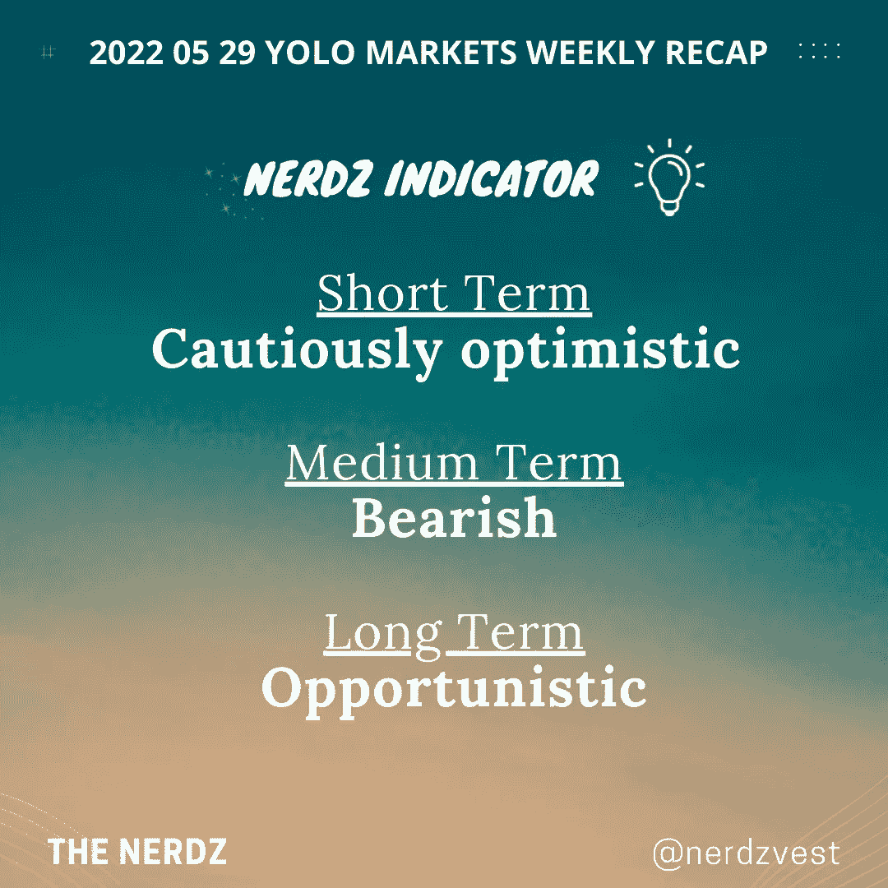

# 2022 05 29 YOLO 市场周刊摘要

> 原文：<https://medium.com/coinmonks/2022-05-29-yolo-markets-weekly-recap-b3b83e6b002?source=collection_archive---------26----------------------->

在 Medium、Twitter 和 Instagram @nerdzvest 上关注我

# nerdzvest 洞察力

> **预计周五救济反弹将继续短暂向 NFPR 推进**

过去一周，大盘出现了反弹，Nerdz 认为这一趋势可能会持续一周，尤其是在经历了数周的下跌之后。人们将关注周五的非农就业报告，以确定劳动力市场是否依然强劲。

Nerdz 维持对市场的中期看跌观点，因为现在判断全球供应链问题导致的通胀是否已经见顶还为时过早。成本推动的通胀可能会持续一段时间，对人们的生活成本和企业的运营成本产生负面影响。因此，这可能导致中期经济增长放缓(潜在衰退)。

# 关键事件

> **诺基亚首席执行官预计 2030 年实现 6G 商用**

诺基亚首席执行官 Pekka Lundmark 预计，随着世界从使用智能手机转向智能眼镜或其他戴在脸上的设备，6G 移动网络将在 2030 年左右进入商业市场。他还认为，将会有一个“万物的数字孪生兄弟”，这将需要“大量的计算资源”。

[https://www . CNBC . com/2022/05/24/Nokia-CEO-says-6g-will-arrive-by-2030 . html](https://www.cnbc.com/2022/05/24/nokia-ceo-says-6g-will-arrive-by-2030.html)

> **沃尔玛扩大其无人机送货服务**

沃尔玛今年将在六个州扩大无人机送货，使更多的客户有可能在 30 分钟或更短的时间内获得一盒尿布或晚餐食材。空运将由总共 37 家商店完成，其中 34 家由 DroneUp 经营。这种新的配送方式是沃尔玛利用其巨大的实体足迹作为竞争优势的战略的延伸。

[https://www . CNBC . com/2022/05/24/Walmart-expands-drone-delivery-service-to-reach-400 万家庭. html](https://www.cnbc.com/2022/05/24/walmart-expands-drone-delivery-service-to-reach-4-million-households.html)

> **由于芯片短缺，电子产品将变得更加昂贵**

随着台湾半导体制造公司(Taiwan Semiconductor Manufacturing Company)、三星(Samsung)和英特尔(Intel)等芯片代工厂准备提高价格，依赖半导体的产品将变得更加昂贵。在过去的两年里，疫情冠状病毒加剧了全球芯片短缺。乌克兰战争进一步加剧了供应问题，而需求仍然很高。

https://www . CNBC . com/2022/05/24/electronics-set-to-rise-as-chip-giants-like-TSMC-Samsung-hike-prices . html

> **暹罗商业银行通过复合国债追逐 DeFi 收益率**

暹罗商业银行(SBC)通过复合国库进入分散金融(DeFi)领域。其数字风险部门 SCB 10X 将把资金存入复合国库，这是一种利用托管公司 Fireblocks 的机构包装。该服务将美元转换为菲亚特支持的 USDC，允许机构获得 4%的固定年收益率。

[https://www . coin desk . com/business/2022/05/27/Siam-commercial-bank-is-chasing-defi-yield-through-compound/](https://www.coindesk.com/business/2022/05/27/siam-commercial-bank-is-chasing-defi-yield-through-compound/)

# 市场更新

> **美国和欧洲市场反弹**

本周，随着美联储会议记录的清晰和经济数据的积极消息，市场从跌势中反弹。美联储会议纪要强调了官员们的承诺，即在加息时，通过越过中性区间进入限制性区间来降低通胀。此外，PCE 核心数据和 PCE 整体数据显示出通胀见顶的迹象，这给市场带来了积极因素。

> 加入 Coinmonks [电报频道](https://t.me/coincodecap)和 [Youtube 频道](https://www.youtube.com/c/coinmonks/videos)了解加密交易和投资

# 另外，阅读

*   [如何获得自己的。XYZ 领域？](https://coincodecap.com/xyz-domain)
*   [最佳加密交换平台](https://coincodecap.com/best-crypto-swap-platforms) | [最佳加密交易所](https://coincodecap.com/crypto-exchange)
*   [购买比特币印度](/coinmonks/buy-bitcoin-in-india-feb50ddfef94) | [Pionex 评论](/coinmonks/pionex-review-exchange-with-crypto-trading-bot-1e459d0191ea) | [加密交易机器人](/coinmonks/crypto-trading-bot-c2ffce8acb2a)
*   [n ave 零点回顾](/coinmonks/ngrave-zero-review-c465cf8307fc) | [Phemex 回顾](/coinmonks/phemex-review-4cfba0b49e28) | [PrimeXBT 回顾](/coinmonks/primexbt-review-88e0815be858)
*   最佳[区块链分析](https://bitquery.io/blog/best-blockchain-analysis-tools-and-software)工具| [赚比特币](/coinmonks/earn-bitcoin-6e8bd3c592d9)
*   [Cloudbet 赌场评论](https://coincodecap.com/cloudbet-casino-review) | [点火赌场评论](https://coincodecap.com/ignition-casino-review)
*   [加密套利](/coinmonks/crypto-arbitrage-guide-how-to-make-money-as-a-beginner-62bfe5c868f6)指南| [如何做空比特币](/coinmonks/how-to-short-bitcoin-568a2d0b4ae5)