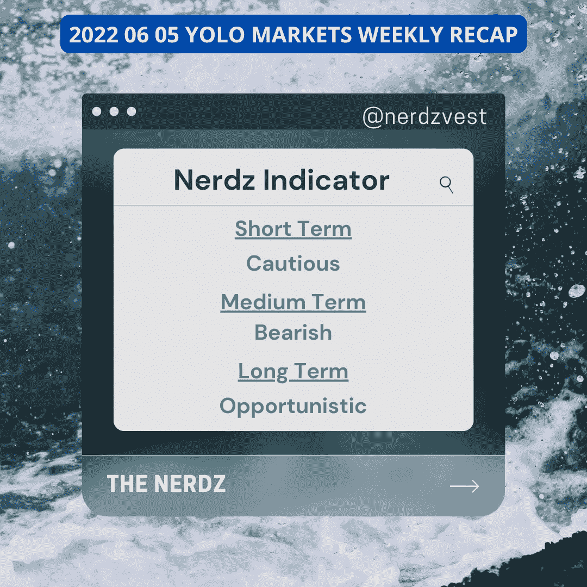
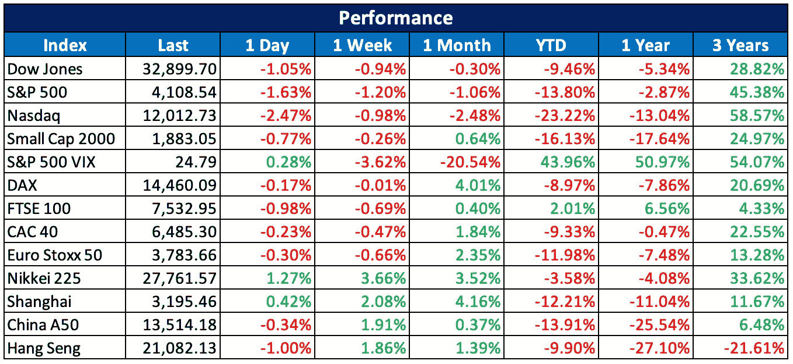

# 2022 06 05 YOLO 市场周刊摘要

> 原文：<https://medium.com/coinmonks/2022-06-05-yolo-markets-weekly-recap-b837197adde9?source=collection_archive---------39----------------------->

在 Medium、Twitter 和 Instagram @nerdzvest 上关注我

# nerdzvest 洞察力

> **预计 FOMC 周前市场会出现波动**

本周市场仍保持区间震荡，但受到好于预期的美国就业数据的影响。这可能意味着美联储有可能继续其加息以抑制通胀的激进立场。Nerdz 认为，市场将在未来几周内波动，接近周末时波动性会有所上升，因为我们距离 6 月 FOMC 还有两周时间。投资者应保持警惕，因为市场已经消化了 6 月份加息 50 个基点的预期。随着我们越来越接近实际公告，任何潜在的偏离都会使市场向两个方向摇摆。

# 市场更新

> **良好的非农就业数据公布后，市场下跌**

本周市场维持区间震荡，直至周五。尽管担心经济放缓和高通胀，美国经济在 5 月份增加了 39 万个就业岗位，但 NFPR 的非农就业人数好于预期。虽然这似乎是一个积极的消息，但市场认为这是一个信号，表明鉴于经济表现良好，美联储可以继续其积极的加息立场，以降低通胀。因此，这种担忧导致指数在 NFPR 后于周五大幅回撤。

> 加入 Coinmonks [电报集团](https://t.me/joinchat/Trz8jaxd6xEsBI4p)，了解加密交易和投资

# 关键事件

> **MoneyGram 寻求成为加密和菲亚特世界之间的桥梁**

速汇金国际正在与恒星区块链合作，创建一个稳定的基于硬币的转账平台。这项新服务将允许 Stellar wallet 用户将 Circle 的美元硬币发送给接收者，接收者将能够通过 MoneyGram 网络将其兑换成法定货币。此外，它正在与在萨尔瓦多提供数字钱包以及政府支持的 Chivo 钱包的第三方公司进行谈判。

[https://coin telegraph . com/news/money gram-to-open-transfer-platform-with-stellar-eyes-wallet-deal-in-Salvador](https://cointelegraph.com/news/moneygram-to-open-transfer-platform-with-stellar-eyes-wallet-deal-in-el-salvador)

> **MAS 与其合作伙伴探索标记化和 DeFi**

新加坡金融管理局(MAS)启动了一项数字资产试点计划(Project Guardian ),以研究资产令牌化和分散金融的潜力。它旨在开发几个行业的资产令牌化用例，试点计划探索在批发融资市场的令牌化债券和存款流动性池中应用 DeFi。

[https://cryptoslate . com/Singapore-to-target-defi-potentials-with-new-jp Morgan-partnership/](https://cryptoslate.com/singapore-to-target-defi-potentials-with-new-jpmorgan-partnership/)

> **比特币基地取消招聘新员工并冻结招聘**

比特币基地宣布，它解除了一些新员工的聘用，并在可预见的未来暂停进一步的工作机会，以更好地应对熊市条件，变得更加强大。它提供了两个月工资的遣散费，并建立了一个人才中心，帮助未被录用者在其他地方寻找新的职位，以弥补不便。

[https://cryptoslate . com/coin base-un-hires-new-新兵-由于市场条件/](https://cryptoslate.com/coinbase-un-hires-new-recruits-due-to-market-conditions/)