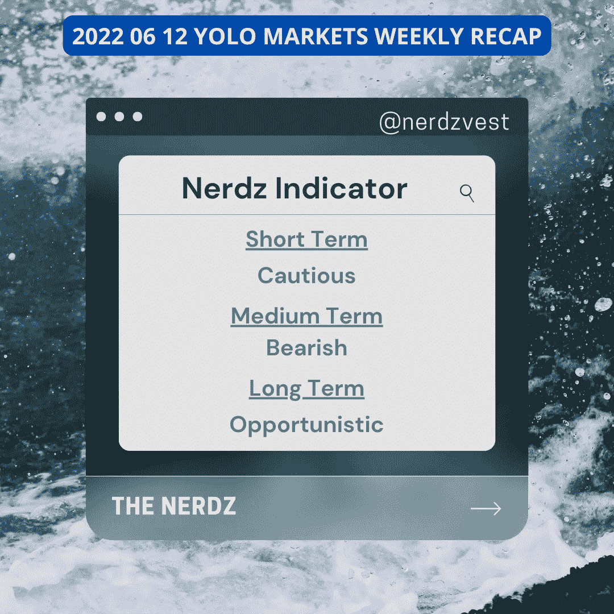

# 2022 06 12 YOLO 市场周刊摘要

> 原文：<https://medium.com/coinmonks/2022-06-12-yolo-markets-weekly-recap-d5707657e09c?source=collection_archive---------43----------------------->

在 Medium、Twitter 和 Instagram @nerdzvest 上关注我

# nerdzvest 洞察力

> **美联储维持其鹰派立场，市场可能下跌**

过去一周，市场继续下跌，因为通胀见顶的希望在通胀数据报告后破灭，对衰退的担忧加剧。随着周二和周三 FOMC 会议的临近，市场可能会继续保持谨慎。预计美联储将加息 50 个基点，因为它坚持其抑制通胀的积极立场。任何偏离这一点的行为都可能使市场向两个方向摇摆。

Nerdz 认为，美联储将保持其激进的立场，并将利率提高 50 个基点。尽管 5 月份通胀持续高企，但对于本次会议而言，75 个基点的历史高点是不可想象的。再加上持续的战争和全球供应链紧缩，Nerdz 在中期内仍倾向于下行。

# 关键事件

> **中国竭力将 Covid 挡在门外**

北京和上海正在再次收紧 Covid 措施，尽管几天前已经有所放松。本月初，上海解除了为期两个月的封锁，本周末将在七个区进行大规模测试，居民需要待在家里，直到测试结束。

[https://www . CNBC . com/2022/06/10/China-zero-covid-drive-Beijing-Shanghai-re impose-some-bans . html](https://www.cnbc.com/2022/06/10/chinas-zero-covid-struggle-beijing-shanghai-reimpose-some-bans.html)

> **Twitter 前 CEO 杰克·多西正在构建由比特币驱动的 Web 5**

Block 子公司 TBD 已经宣布计划建立一个以比特币为中心的新的去中心化网络。Web3 采用了区块链技术和令牌化来分散互联网，而 Web5 则被设想为一个基于身份的系统，只使用一个区块链:比特币。它本质上是一个分散的网络平台，允许开发者创建分散的网络应用，并拥有一个以 BTC 为中心的货币网络。

[https://coin telegraph . com/news/jack-dorsey-is-building-web 5-powered-by-bit coin](https://cointelegraph.com/news/jack-dorsey-is-building-web5-powered-by-bitcoin)

> **速汇金通过 Stellar 推出 USDC 支付渠道**

MoneyGram 于周五正式推出了 stablecoin 支付渠道，用户可以在全球范围内发送美元硬币(USDC)支付，收款人可以提取现金。新的转账服务建立在恒星(XLM)区块链上，旨在弥合数字资产和实物现金货币之间的差距，并展示加密支付的效用。这将帮助世界上没有银行账户的人口首次进入数字经济。

[https://coin telegraph . com/news/money gram-s-usdc-transfer-service-launches-in-number-countries](https://cointelegraph.com/news/moneygram-s-usdc-transfer-service-launches-in-several-countries)

> **卡塔尔航空推出 QVerse**

卡塔尔航空公司周二宣布，该公司推出了首个元宇宙体验项目 QVerse。这个虚拟现实平台允许感兴趣的各方可以虚拟地访问和导航哈马德(HIA)国际机场的优质值机区。据该公司称，它进入元宇宙反映了乘客对沉浸式内容的渴望，这种内容可以在购买机票前授权他们做出决策，并经常渴望发现他们将乘坐的飞机。

[https://coin telegraph . com/news/the-元宇宙-will-empower-human-declare-Qatar-airways](https://cointelegraph.com/news/the-metaverse-will-empower-human-beings-declares-qatar-airways)

# 市场更新

> **市场继续下跌，尤其是在通胀数据公布之后**

随着 6 月 FOMC 会议的临近，市场延续了上周的跌势。周五公布的 5 月份通胀率较高(较去年增长 8.6%)，削弱了通胀可能已经见顶的希望，并加剧了对美国经济衰退的担忧。这也加强了美联储积极加息的立场，因为市场预计短期借款利率将在年底前升至 2.75-3%。声明发布后，美国股票指数大幅下跌。

另一方面，随着上海暂时解禁和中国政府的潜在刺激，中国股市在长期下跌后继续复苏。

> **美国收益率曲线在对衰退的担忧中变平，2Y 收益率突破 3%**

本周美国收益率曲线趋于平缓，因为短期收益率曲线的涨幅大于长期收益率曲线的涨幅。有趣的是，2Y 的收益率已经突破了 3%的关口。

> 加入 Coinmonks [电报频道](https://t.me/coincodecap)和 [Youtube 频道](https://www.youtube.com/c/coinmonks/videos)了解加密交易和投资

# 另外，阅读

*   [火币加密交易信号](https://coincodecap.com/huobi-crypto-trading-signals) | [Swapzone 审查](/coinmonks/swapzone-review-crypto-exchange-data-aggregator-e0ad78e55ed7)
*   最佳[密码交易机器人](https://coincodecap.com/best-crypto-trading-bots) | [购买索拉纳](https://coincodecap.com/buy-solana) | [矩阵导出审查](https://coincodecap.com/matrixport-review)
*   [Coldcard 评论](https://coincodecap.com/coldcard-review) | [BOXtradEX 评论](https://coincodecap.com/boxtradex-review)|[uni swap 指南](https://coincodecap.com/uniswap)
*   [比特币基地评论](/coinmonks/coinbase-review-6ef4e0f56064) | [德里比特评论](/coinmonks/deribit-review-options-fees-apis-and-testnet-2ca16c4bbdb2) | [FTX 评论](/coinmonks/ftx-crypto-exchange-review-53664ac1198f)
*   [Coinmetro 评论](https://coincodecap.com/coinmetro-review) | [VirgoCX 评论](https://coincodecap.com/virgocx-review)