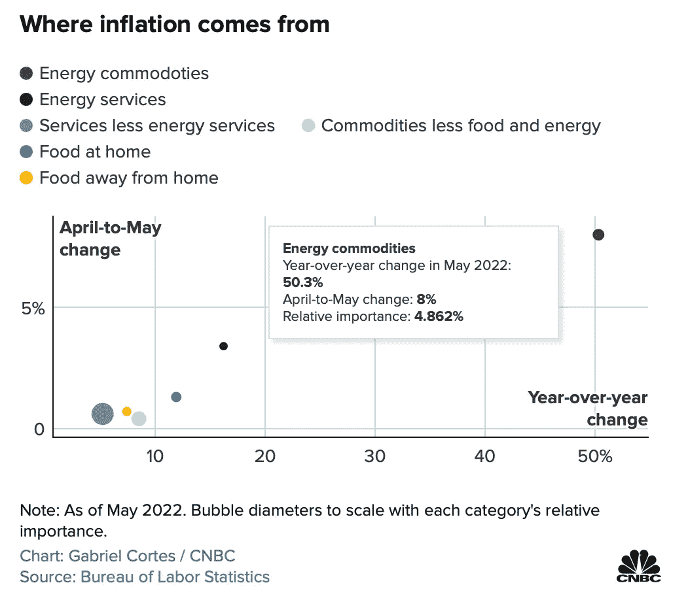
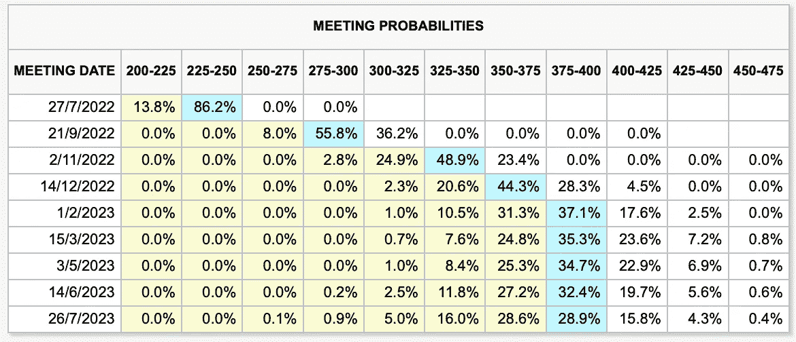
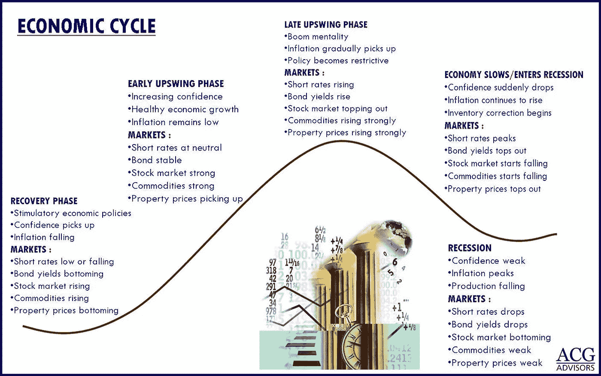
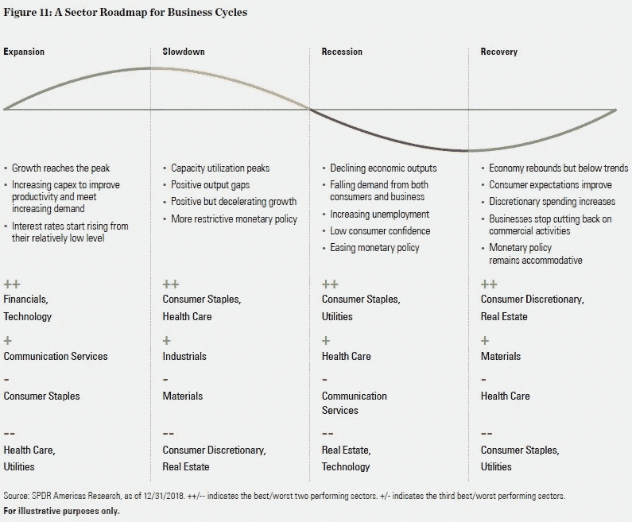
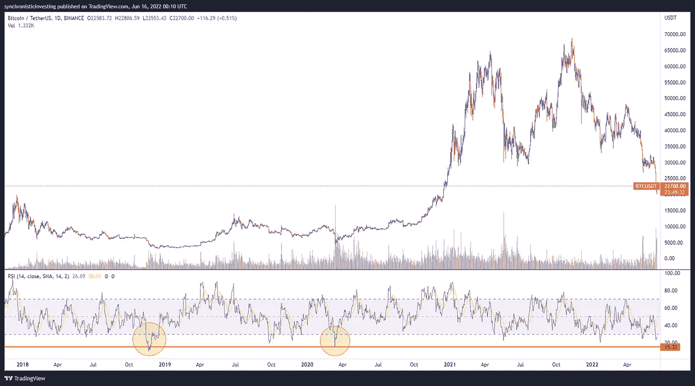
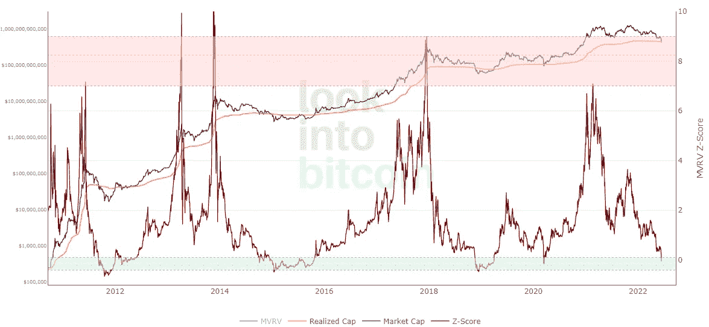
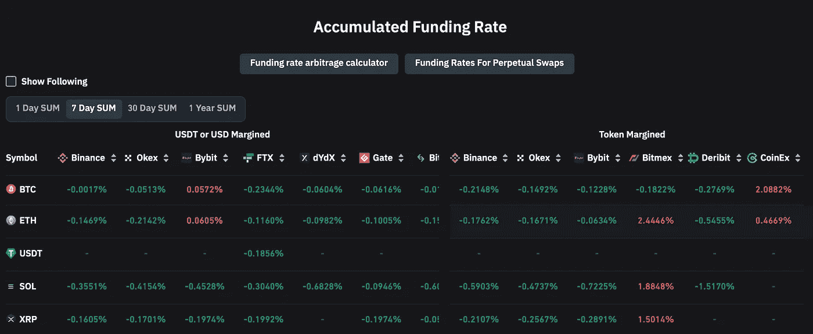
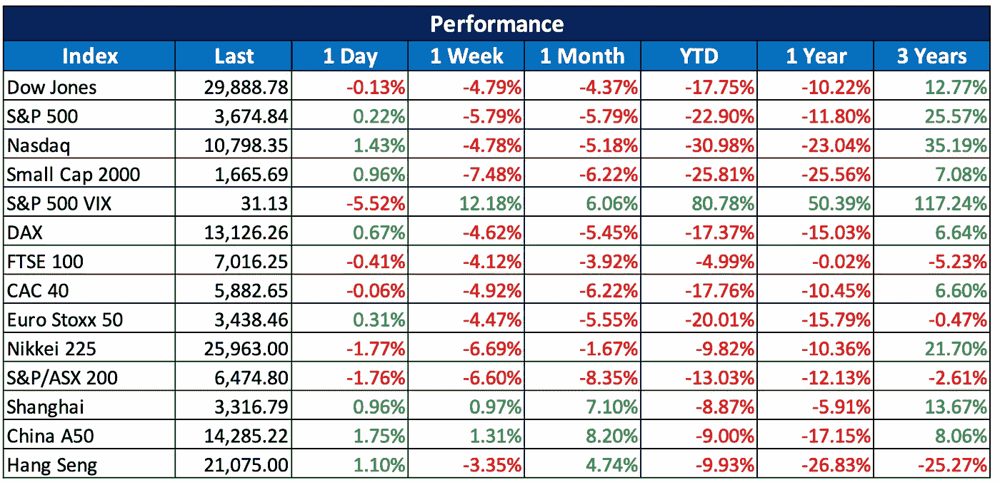
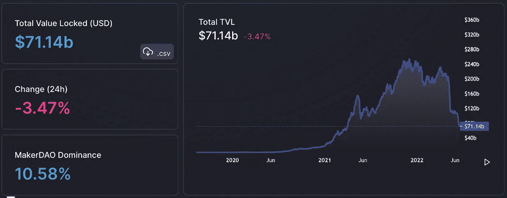

# 2022 06 19 YOLO 市场周刊摘要

> 原文：<https://medium.com/coinmonks/2022-06-19-yolo-markets-weekly-recap-f5d3db50e0af?source=collection_archive---------10----------------------->

在 Medium 和 Twitter @nerdzvest 上关注我

# nerdzvest 洞察力

> **随着市场情绪和经济形势的恶化，预计会有更多的下跌，但目前可能会出现熊市**

本周，美联储宣布大幅加息 75 个基点，以抑制高通胀。在讲话中，鲍威尔表示，这些措施是在美联储密切监控通胀数据的情况下动态采取的，只有在有明显迹象显示数月通胀下降时，才会得出“任务完成”的结论。

虽然这符合市场预期，但声明发布后的缓解是短暂的，因为市场继续下跌，担心经济衰退。Nerdz 认为，随着美联储在遏制通胀的斗争中继续保持积极姿态，市场将会出现更多由美联储或通胀数据引发的波动。

***我们很快就要进入衰退阶段了！:(***

与此同时，公司裁员的消息越来越多，暗示我们正处于经济周期的后期。Nerdz 认为，随着市场下跌并形成底部，衰退新闻将在今年晚些时候或明年初开始出现在主流媒体上。这将与美联储加息接近尾声的时间相吻合，使其有可能在经济陷入低迷时降息。

**许多人希望看到 BTC 在 10K 美元区间和瑞士联邦理工学院在三位数的愿望在周末实现了。随着 3AC 和 Celsius 等受欢迎的公司因股价下跌遭受巨额损失而陷入破产问题，流血事件随处可见。Nerdz 想知道有多少人在去年许下愿望时，实际上坚持了在这些价位买入的计划。更严重的是，如果外部环境允许，BTC 目前可能会触底，可能会短暂缓解。然而，Nerdz 认为，预计会有更多的不利因素，以最大限度地增加痛苦，淘汰该行业的非信徒和作恶者，尤其是在整个世界都进入衰退阶段的时候。技术图表与这种进一步下跌的概念相一致，而期货已经变成负数(即空头越来越贵)。**

************

> ***Nerdz 指示器***

**短期:谨慎**

**中期:看跌**

**长期:机会主义**

# **市场更新**

> ****市场扩大损失，美联储宣布加息 75 个基点****

**市场在过去一周下跌，波动性增加。周三，美联储宣布加息 75 个基点，这符合通胀数据公布后的市场预期。然而，鲍威尔继续他的激进立场，同时强调，在他们寻求抑制高通胀的过程中，有一些外部因素不受他们的控制。由于所有这些不确定性，由于担心即将到来的衰退，市场扩大了损失。与此同时，中国股市继续小幅上涨。**

****

> ****随着 BTC 跌至 18000 美元以下，加密技术也直线下降****

**与股票市场类似，加密市场的价值直线下降，BTC 跌至 18000 美元以下。DeFi TVL 也创下了自 2021 年年中以来的历史新低。这是在 LUNA-TERRA 事件后所有关于破产和 stETH 问题的负面新闻中发生的。**

****

# **关键事件**

> ****中国房地产麻烦不断****

**根据评级机构穆迪(Moody's)的数据，由于自去年底以来中国房地产开发商的评级大幅下调，衡量亚洲债务风险水平的指标已超过 2009 年金融危机时的高点。穆迪表示，在过去 9 个月里，它对高收益中国房地产开发商发出了 91 次降级，这是一个创纪录的速度，因为在截至 2020 年 12 月的 10 年里，它只对这类公司发出了 56 次降级。**

**[https://www . CNBC . com/2022/06/17/moodys-China-real-estate-troubles-sent-debt-indicator-to-record-high . html](https://www.cnbc.com/2022/06/17/moodys-china-real-estate-troubles-sent-debt-indicator-to-record-high.html)**

> ****三箭资本面临潜在资不抵债****

**据报道，风险公司三箭资本(3AC)未能满足其贷款人的保证金要求，在本周加密市场崩溃引发 3AC 意外清算后，引发了破产的恐惧。该公司聘请了法律和金融顾问，为投资者和贷款人想出一个解决方案，比如资产出售或救助。据信，3AC 深受其持有的 LUNA、gray bit coin Trust 和 stETH 的损失的影响。**

**[https://cryptoslate . com/three-arrows-capital-reported-considering-asset-sales-bailout/](https://cryptoslate.com/three-arrows-capital-reportedly-considering-asset-sales-bailout/)**

> ****Celsius 冻结从平台提取数字资产****

**据传，在上周末冻结提款后，Celsius 已经资不抵债。这是基于有关三箭资本破产的传言。由于比特币基地、BlockFi 和 Crypto.com 也宣布裁员，这一周简直糟透了。**

** [## 加密放款摄氏如何过热

### 奥利弗·奈特是 CoinDesk 驻伦敦和里斯本的记者。他没有任何密码。摄氏网络，一个…

www.coindesk.com](https://www.coindesk.com/business/2022/06/16/how-crypto-lender-celsius-overheated/) 

> 加入 Coinmonks [电报频道](https://t.me/coincodecap)和 [Youtube 频道](https://www.youtube.com/c/coinmonks/videos)了解加密交易和投资

# 另外，阅读

*   [用于 Huobi 的加密交易信号](https://coincodecap.com/huobi-crypto-trading-signals) | [Swapzone 审查](/coinmonks/swapzone-review-crypto-exchange-data-aggregator-e0ad78e55ed7)
*   最佳[密码交易机器人](https://coincodecap.com/best-crypto-trading-bots) | [购买索拉纳](https://coincodecap.com/buy-solana) | [矩阵导出评论](https://coincodecap.com/matrixport-review)
*   [Coldcard 评论](https://coincodecap.com/coldcard-review) | [BOXtradEX 评论](https://coincodecap.com/boxtradex-review)|[uni swap 指南](https://coincodecap.com/uniswap)
*   [比特币基地评论](/coinmonks/coinbase-review-6ef4e0f56064) | [德里比特评论](/coinmonks/deribit-review-options-fees-apis-and-testnet-2ca16c4bbdb2) | [FTX 评论](/coinmonks/ftx-crypto-exchange-review-53664ac1198f)
*   [Coinmetro 评论](https://coincodecap.com/coinmetro-review) | [VirgoCX 评论](https://coincodecap.com/virgocx-review)
*   [法国 4 大最佳加密副本交易平台](https://coincodecap.com/copy-trading-platforms-france)**