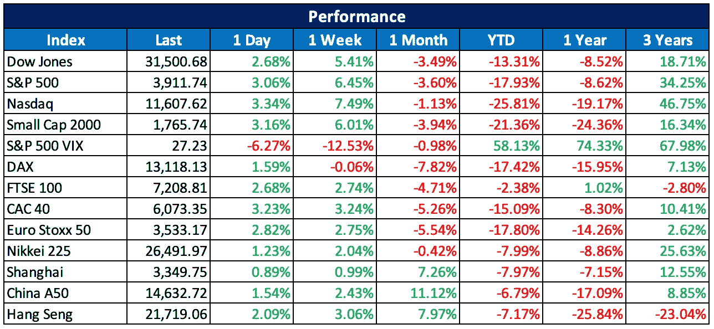

# 2022 06 26 YOLO 市场周刊摘要

> 原文：<https://medium.com/coinmonks/2022-06-26-yolo-markets-weekly-recap-d9e3c78331aa?source=collection_archive---------43----------------------->

在 Medium 和 Twitter @nerdzvest 上关注我

# nerdzvest 洞察力

> 如果不出意外，预计市场将保持横向运行

经过数周的下跌后，市场将无消息的沉默视为好消息，因为它从超卖水平反弹。Nerdz 认为，由于围绕乌克兰战争、全球供应链危机和高通胀水平的不确定性仍然存在，市场可能会保持区间波动。人们应该密切关注即将公布的一些经济数据，如季度 GDP 公告、美联储主席鲍威尔讲话和制造业采购经理人指数，因为这些数据可能会影响本周的市场情绪。对于加密持有者，Nerdz 认为，我们已经看到了暂时的局部底部，但在围绕各种公司破产的不确定性和萨尔瓦多的潜在问题中，人们应该保持谨慎。

> *Nerdz 指示器*

短期:谨慎

中期:看跌

长期:机会主义

# 关键事件

> **俄国挤压欧洲天然气供应**

俄罗斯国家支持的能源供应商 Gazprom 在过去几周减少了约 60%的欧洲天然气流量。与此同时，作为对乌克兰战争的回应，欧洲正试图减少对俄罗斯天然气的依赖。然而，这种减少导致欧洲领导人越来越担心来自俄罗斯的天然气供应完全关闭的可能性。

https://www . CNBC . com/2022/06/24/Putin-is-squeezing-gas-supplies-and-Europe-is-going-journey-a-total-shut down . html

> **Meta 开始在 Instagram 上测试 NFT**

Meta 宣布，将开始使用其增强现实平台 Spark AR 在 Instagram Stories 上测试 NFT。未来，当 Instagram 在脸书推出这一功能时，创作者和收藏家也可以在脸书和 insta gram 上分享他们的数字收藏品。

[https://coin telegraph . com/news/meta-set-to-begin-testing-nfts-on-insta gram-stories-with-sparkar](https://cointelegraph.com/news/meta-set-to-begin-testing-nfts-on-instagram-stories-with-sparkar)

> **Shopify 宣布 tokengate commerce**

Shopify 允许商家通过为令牌持有者创建独家商品来联系粉丝并推动销售。这项被称为“tokengate”的计划是今年开发的一系列新的连接消费者计划的一部分，目前处于早期测试模式。

[https://coin telegraph . com/news/shopify-unveils-token gated-commerce-as-part-of-new-connect-to-consumer-experience](https://cointelegraph.com/news/shopify-unveils-tokengated-commerce-as-part-of-new-connect-to-consumer-experience)

> **丽都赌球的优势引起以太坊社区的关注**

丽都道令牌持有人已经开始投票，以确定 DeFi 平台是否应该减少其赌注池。利多目前持有以太坊区块链 31%的股份。赌注的统治地位在以太坊社区内引起了担忧，因为它可能会威胁以太坊的分散化，对交易验证产生过度影响。另一方面，丽都的控股优势可能有助于防止中央交易所的收购，并确保区块链保持分散化。

[https://cryptos late . com/why-lido-staking-dominance-is-raising-centralization-fears/](https://cryptoslate.com/why-lido-staking-dominance-is-raising-centralization-fears/)

> **萨尔瓦多的比特币赌注加剧了对破产的担忧**

萨尔瓦多的经济增长急剧下降，引发了人们对该国明年可能无法偿还逾 10 亿美元贷款的担忧。与此同时，布克勒总统的比特币赌博没有成功，政府在比特币上的未实现账面损失约为 5000 万美元。由于其加密货币联系，与国际贷款人的谈判也陷入停滞，而评级机构以该国金融未来的不确定性为由，下调了萨尔瓦多的信用评分。随着该国借入现金的成本变得越来越高，这使得形势更加恶化。

[https://www . CNBC . com/2022/06/25/萨尔瓦多-比特币-实验-非储蓄-国家-金融. html](https://www.cnbc.com/2022/06/25/el-salvador-bitcoin-experiment-not-saving-countrys-finances.html)

# 市场更新

> **没有消息就是好消息，因为市场从超卖水平反弹**

随着 6 月加息 75 个基点的预期消失，市场在连续几周下跌后出现大幅反弹。从底部反弹是重要的，尤其是在周五，在所有的不确定性和对衰退的恐惧中，市场触及超卖水平。与此同时，中国股市在数月下跌后继续反弹。

> 加入 Coinmonks [电报频道](https://t.me/coincodecap)和 [Youtube 频道](https://www.youtube.com/c/coinmonks/videos)了解加密交易和投资

# 另外，阅读

*   [红狗赌场评论](https://coincodecap.com/red-dog-casino-review) | [Swyftx 评论](https://coincodecap.com/swyftx-review) | [造币厂评论](https://coincodecap.com/coingate-review)
*   [Bookmap 评论](https://coincodecap.com/bookmap-review-2021-best-trading-software) | [美国 5 大最佳加密交易所](https://coincodecap.com/crypto-exchange-usa)
*   [如何在 FTX 交易所交易期货](https://coincodecap.com/ftx-futures-trading) | [OKEx vs 币安](https://coincodecap.com/okex-vs-binance)
*   [CoinLoan 审查](https://coincodecap.com/coinloan-review) | [YouHodler 审查](/coinmonks/youhodler-4-easy-ways-to-make-money-98969b9689f2) | [BlockFi 审查](https://coincodecap.com/blockfi-review)
*   [XT.COM 评论](https://coincodecap.com/profittradingapp-for-binance)币安评论 |
*   [SmithBot 评论](https://coincodecap.com/smithbot-review) | [4 款最佳免费开源交易机器人](https://coincodecap.com/free-open-source-trading-bots)