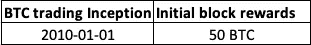
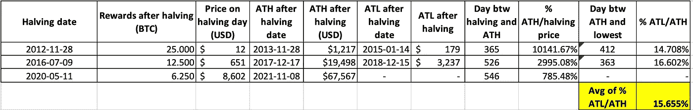
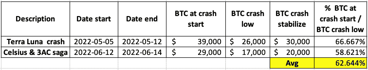
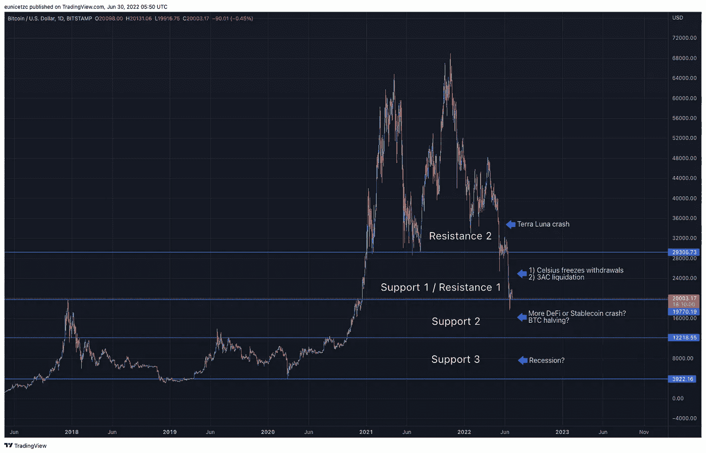
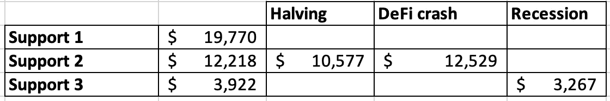

# 2022–2023:比特币到 4k？

> 原文：<https://medium.com/coinmonks/2022-2023-bitcoin-to-4k-885cf856a595?source=collection_archive---------15----------------------->

Image from pixabay.com

4 月 30 日，我发表了一篇文章，[2022 年比特币 20k 价格预测](/coinmonks/20k-price-prediction-for-bitcoin-in-2022-fa7093832c4c)，陈述了我对 2022 年比特币(BTC)价格目标的看涨和看跌论点。好吧，比特币纸牌屋比我预期的跌得更快。

目前，比特币正处于另一个价格巩固期，维持在 20k。然而，这是比特币的绝对底部吗？在本文中，我将通过分析以下数据，尝试使用数据驱动的方法来预测比特币的历史低点:

比特币减半

Terra Luna 涟漪效应

衰退

比特币价格行动

**比特币减半**

比特币的有限供应量为 2100 万，最初的块奖励(支付给矿工)为 50 BTC，每开采 21 万块后，奖励将减半，因此有“减半”一词

Table 1: Bitcoin Inception

每个比特币块应该需要 10 分钟左右的挖掘时间。挖掘算法会根据矿工的挖掘速度自我调整其挖掘难度。例如，如果矿工开采一个区块花费的时间少于 10 分钟，则会增加开采的复杂性；如果矿工开采的时间太长，则会降低开采的复杂性。考虑到自我调整机制，比特币减半应该大约每 4 年发生一次。

理论上，比特币减半强化了其稀缺性，减半期间和之后的比特币价格行为应反映市场对其稀缺性的需求。因此，研究比特币价格减半的影响是值得的。

历史比特币减半对价格的影响见表 2。3 比特币自问世以来已经减半；第一次减半发生在 2012 年 11 月，第二次减半发生在 2016 年 7 月，最后一次减半发生在 2020 年 5 月。

Table 2: **Historical BTC’s halving price trajectory**

从表 2 中，我们知道:

平均而言，ATH 在减半后需要大约 1-1.5 年

平均来说，从 ATH 到谷底需要大约 1 年的时间

平均而言，ATL 约为 ATH 的 15.65%

根据我们目前观察到的情况进行推断，

【2020 年后 BTC 潜在 ATL 减半= 65567 美元* 15.655% = 10577 美元

潜在的底部时间线= 2022 年底至 2023 年初

**地球月神和地球 UST 余震**

5 月，我写了一篇文章， [Stablecoin 不稳定？——Terra 死亡陷阱](/coinmonks/stablecoin-unstable-terra-death-trap-969782654835)，关于 Terra 算法稳定币的崩溃——UST。Terra 1.0 崩溃不仅带来了比特币，还拖累了[摄氏度](https://www.cnbc.com/2022/06/20/celsius-asks-users-for-more-time-to-fix-issues-after-withdrawal-freeze.html)、 [3AC](https://www.cnbc.com/2022/06/27/three-arrows-capital-crypto-hedge-fund-defaults-on-voyager-loan.html) ，或许还有[更多的 DeFi 平台](https://www.coindesk.com/business/2022/06/25/morgan-creek-is-trying-to-counter-ftxs-blockfi-bailout-leaked-call-shows/)来一场**崩盘。**

Table 3: DeFi crashes and their impact on Bitcoin

从表 3 中，我们知道:

平均而言，崩盘不到一周就稳定下来了

平均而言，BTC 崩盘的低点大约是崩盘前 BTC 价格的 62.64%

**DeFi 崩溃中潜在的 BTC 低点**= 20，000 美元* % 62.644 = 12，529 美元

注意:取决于比特币在 DeFi 平台中的地位，即将到来的平台崩溃:

可能不会导致比特币价格暴跌

可能比预期的更深远

> 交易新手？尝试[加密交易机器人](/coinmonks/crypto-trading-bot-c2ffce8acb2a)或[复制交易](/coinmonks/top-10-crypto-copy-trading-platforms-for-beginners-d0c37c7d698c)

**防衰退？**

比特币诞生于 2008 年金融危机之后。到目前为止，比特币经历了几次熊市，但还没有经历过衰退。

美联储最近放弃了“通货膨胀是暂时的”的说法，开始提高利率来对抗通货膨胀。这就是通常所说的“从经济中吸钱”，引发股市抛售。成长型股票和加密市场因此受到重创。所有加密技术的始祖比特币也未能幸免。

最近的市场抛售与本世纪头十年的网络泡沫有许多相似之处。亚马逊经常被用作一个光辉的例子来安抚投资者，因为亚马逊(在 2000 年代)和比特币有着相似的特征，例如:

作为一个新来的孩子

这是一项相对较新的技术

高估值

我将人为地将亚马逊网络崩溃数据插入比特币，以预测它的衰退底部，如果我们曾经遇到过的话。在网络时代，亚马逊:

ATH = 113 美元

暴跌价格= 5.51 美元

价值下降了 95.12%，相当于 ATH 的 4.88%

将亚马逊网络崩溃数据应用于比特币 ATH，我们得到

**BTC 潜在衰退低点**=**= 67K 美元* 4.88% = 3267 美元**

****比特币价格走势****

**在这最后一部分，我们将把所有的分析与价格行为联系起来，使用支撑线作为我们获得进一步洞察力的指南。**

****

**Chart 1: Bitcoin daily price movement**

****

**Table 4: Bitcoin support lines with its other analysis**

**根据表 4:**

**如果 DeFi 平台崩溃，比特币价格走势**支持 2** 符合比特币 ATL 和 BTC 低点可能减半的情况**

**比特币价格行动**支持 3** 如果经济衰退来袭，比特币 ATH 价格将下跌 95%**

****比特币会打到 4k 吗？****

**在典型的比特币减半场景下，有很大概率出现 10k 比特币 ATL。但是，我想争辩的是，这次不一样。我们生活在一个世界被不止一个而是两个黑天鹅事件轰炸的环境中，例如 Covid19，俄罗斯乌克兰战争，高通胀，加息，也许更多。雪上加霜的是，专家们越来越大声地表达了他们对即将到来的衰退可能性增加的担忧。**

**比特币被认为是一种高风险投资，还没有人知道它的内在价值。它在这种不确定的环境中找不到安慰，因为风险和不确定性并不和谐。因此，很难确定其 ATL 的正确价格。然而，如果你考虑到所有的可变性，比特币很有可能跌至 4k，并可能在支持 2 和支持 3 之间保持稳定。**

****免责声明:本文包含的信息不是法律或投资建议。这代表了我的个人观点，一如既往，自己研究吧。****

**如果您有任何问题，或者您希望我写些什么，请告诉我；下面留个 ***评论*** *。感谢阅读，我希望你喜欢这篇文章。***